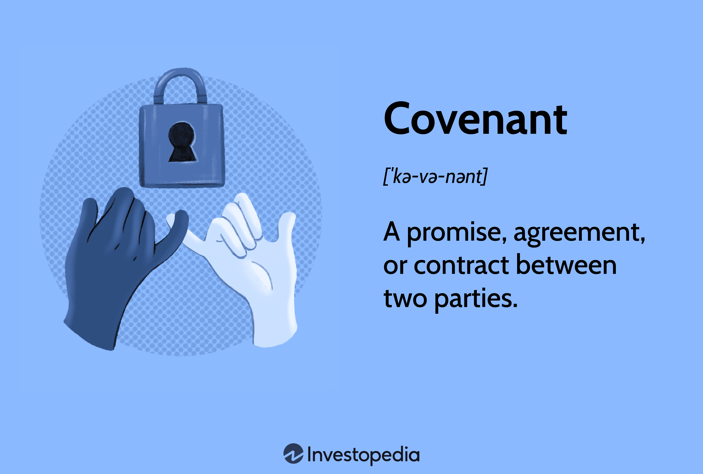

In a rapidly evolving financial environment where technology and data play a pivotal role, understanding the intertwined concepts of legal agreements, contract law, and algorithmic trading is crucial. At the heart of this complex ecosystem lies the affirmative covenant, a legally binding commitment that ensures parties adhere to specific actions agreed upon within a contract. As businesses increasingly rely on algorithmic trading to enhance their market operations through technological advancements, the importance of legal structures capable of governing these activities cannot be overstated. 

Affirmative covenants serve as integral components of such legal agreements, offering a mechanism to uphold operational standards while safeguarding stakeholder interests. This article investigates into how these covenants function within the broader context of contract law and examines their specific relevance to algorithmic trading. By exploring their implications for businesses, we aim to shed light on the critical role affirmative covenants play in mitigating risks and facilitating smoother transactions in an industry characterized by rapid technological evolution. Understanding these legal constructs is essential not only for compliance but also for leveraging their potential to drive growth and stability in financial markets.

## Table of Contents

## Legal Agreements in Contract Law

Legal agreements serve as the cornerstone of commercial transactions, delineating the responsibilities and expectations of the parties involved. These agreements can take various forms, including sales contracts, lease agreements, and partnership agreements, each tailored to address specific obligations and terms of the business relationship. At the core of these legal agreements lies contract law, which provides a systematic framework designed to uphold the promises made by the contracting parties and ensure the enforceability of these obligations.

Contract law operates on several foundational principles, such as mutual consent, consideration, and the intention to create legal relations. These principles ensure that the agreements are voluntary, backed by something of value, and recognized as binding by legal standards. Furthermore, contract law outlines remedies and recourses available to parties in the event of a breach, thereby safeguarding their interests and promoting fair dealings in commercial enterprises.

A vital component of contract law is the inclusion of covenants. Covenants are essentially clauses within a contract that require parties to either perform certain actions or abstain from specific behaviors. These promises can be categorized mainly into two types: affirmative covenants and negative covenants. Affirmative covenants compel a party to take proactive steps or actions, such as maintaining adequate insurance coverage, adhering to environmental regulations, or providing regular financial disclosures. On the other hand, negative covenants restrict parties from engaging in certain activities, such as incurring additional debt without consent or selling certain assets.

The strategic use of covenants within legal agreements serves to protect the interests of all parties involved by clearly outlining permissible and impermissible actions. This not only enhances predictability and security in business dealings but also helps mitigate potential conflicts and litigations. By setting defined operational benchmarks and prohibitions, covenants facilitate smoother collaborations and partnerships, contributing to a stable business environment governed by transparent legal frameworks.

## What is an Affirmative Covenant?

An affirmative covenant is a specific clause within a contract that obligates a party to perform certain actions, providing security for creditors and investors. This protective measure is designed to ensure that the contracting party maintains specific operational practices, thereby contributing to business stability and predictability. For instance, these clauses often require the concerned party to maintain comprehensive insurance or engage in regular financial reporting. Such stipulations help uphold operational benchmarks critical to the financial health of the entity involved, assuring stakeholders of the entity’s continued adherence to agreed standards.

In the broader context of financial contracts, affirmative covenants stand in contrast to negative covenants, which restrict a party from engaging in particular actions. This distinction is critical for comprehending the full range of legal obligations imposed on a party. While an affirmative covenant may demand that a party take proactive steps such as undertaking specific investments or maintaining certain financial ratios, a negative covenant might prohibit the party from exceeding specified debt levels or from undertaking mergers without consent.

Understanding affirmative covenants, therefore, involves recognizing their role in supporting the financial assurances creditors and investors seek, ensuring the party bound by the covenant acts in ways that preserve or enhance the value and operational integrity of the business. The presence of these covenants within contracts is foundational for risk mitigation and operational compliance, thereby fostering a predictable business environment that benefits all parties involved.

## Affirmative Covenants in Algorithmic Trading

Algorithmic trading heavily depends on sophisticated technology and data algorithms to execute trading strategies quickly and efficiently. Within this high-tech environment, affirmative covenants serve as essential legal tools to mitigate risks, particularly those related to intellectual property and data usage. These covenants require a party to fulfill specific actions, establishing a proactive approach to ensure compliance and enhance the security of proprietary technologies.

Affirmative covenants in [algorithmic trading](/wiki/algorithmic-trading) agreements play a critical role by setting clear operational standards and responsibilities. For instance, an affirmative covenant might mandate regular audits of proprietary algorithms to verify compliance with both internal policies and external regulations, thereby minimizing the risk of unintentional breaches. This proactive obligation can include scheduled compliance checks where algorithm performance is measured against agreed benchmarks, ensuring transparency and accountability.

By incorporating affirmative covenants, businesses can reduce the likelihood of legal disputes arising from unclear operational procedures or unauthorized use of proprietary technologies. These covenants specify the obligations of each party, like maintaining certain cybersecurity measures to protect sensitive trading data. Additionally, they might require firms to report any data breaches promptly to designated regulatory bodies, hence fostering a climate of trust and reliability.

Furthermore, affirmative covenants support a stable and legally compliant trading environment by ensuring that all parties involved adhere to predetermined obligations. This is particularly vital in algorithmic trading, where non-compliance can lead to significant financial and reputational risks. As these covenants lay out specific actions required, they enable more predictable corporate behavior, thus facilitating smoother business operations and mitigating the risks of financial losses.

In conclusion, the strategic use of affirmative covenants in algorithmic trading underscores the necessity of such legal constructs in managing complex operational and legal risks. They form a foundation for trust between trading partners by ensuring that all parties adhere to their commitments, thereby fostering innovation and growth within the financial markets.

## Benefits and Limitations of Affirmative Covenants

Affirmative covenants are integral to financial agreements, delivering several benefits that are crucial for maintaining the stability and integrity of business operations. One of the primary advantages of affirmative covenants is their role in reducing the risk of defaults. By mandating specific actions such as maintaining a certain level of insurance, adhering to financial reporting standards, or upholding minimum working capital requirements, these covenants ensure that companies remain on a sound operational footing. This, in turn, reduces the likelihood of financial distress, thus protecting the interests of creditors and investors alike.

Another significant benefit is the enhancement of investor confidence. With predefined operational guidelines in place, investors can gain a clearer understanding of a company's obligations and how these obligations are expected to be met. This transparency fosters trust and can lead to more favorable terms in financing, as lenders and investors are assured of the company's commitment to maintaining specified operational standards.

However, the implementation of affirmative covenants is not without limitations. One of the notable drawbacks is the requirement for constant compliance monitoring. Companies must invest resources in ensuring that all covenant requirements are consistently met, which may involve regular auditing processes and compliance checks. This can be a significant administrative burden, especially for organizations with complex structures or multiple covenants to monitor.

Additionally, affirmative covenants can potentially restrict business flexibility. By imposing specific operational requirements, these covenants may limit a company's ability to swiftly pivot strategies or respond to market changes. For instance, a covenant requiring a company to maintain a particular debt-to-equity ratio could constrain its ability to take on new financing opportunities that might be strategically beneficial.

Understanding these benefits and limitations is essential for businesses aiming to effectively implement affirmative covenants in their contracts. Companies must weigh the protection and confidence provided by such covenants against the administrative and operational constraints they impose. This strategic assessment is key in determining how affirmative covenants can be used to support a company's objectives without hindering its ability to adapt and grow in a dynamic business environment.

## The Role of Algo Trading in Modern Financial Markets

Algorithmic trading, also known as algo trading, has transformed modern financial markets by utilizing advanced algorithms and high-speed data processing capabilities. This revolution is characterized by the shift from manual to automated execution of trading strategies, thereby optimizing efficiency and execution speed. Various complex mathematical models and statistical techniques are employed to analyze market data and make quick decisions, far surpassing human capabilities in terms of speed and accuracy.

In this technologically driven environment, legal agreements, especially covenants, serve a critical role. Covenants within these agreements help protect proprietary trading algorithms, which are valuable intellectual property assets. These algorithms often contain innovative strategies that provide competitive advantages in the market. To safeguard these valuable intellectual properties, firms rely on affirmative covenants that mandate protections such as confidentiality and restricted access. These legal constructs ensure that proprietary algorithms are not misused or disclosed unauthorizedly, thereby preserving competitive leverage.

Additionally, in a domain where financial market dynamics are constantly evolving, compliance with regulatory requirements is crucial. Affirmative covenants can stipulate regular compliance audits and adherence to financial regulations, thereby mitigating risks associated with breaches. These covenants provide a framework for maintaining a rigorous standard of operational practices, ensuring that trading entities operate within legal limits.

Furthermore, the strategic use of covenants in algo trading extends to risk management. By setting terms that mandate risk assessment and mitigation practices, such as stress testing algorithms in different market scenarios, covenants ensure that potential risks are identified and managed proactively. This foresight helps avoid catastrophic losses that can arise from unexpected market events or malfunctioning algorithms.

Incorporating affirmative covenants into algo trading agreements allows firms to manage complex legal and operational risks effectively. These covenants foster an environment that not only encourages innovation and growth by protecting intellectual properties but also ensures regulatory compliance and robust risk management. Through these measures, algo trading remains a driving force behind the continuous evolution and efficiency enhancement of modern financial markets.

## Conclusion

Affirmative covenants are integral to business agreements, serving as critical tools for safeguarding the interests of all parties involved and ensuring that business operations align with legal standards. These covenants enforce positive actions that a party must undertake, such as maintaining certain financial metrics or adhering to operational protocols, thus promoting a stable contractual relationship by clearly defining expectations and responsibilities.

In algorithmic trading, affirmative covenants play a pivotal role by addressing the unique legal and operational risks inherent in this technology-driven field. Algorithmic trading, which relies on sophisticated automated systems for executing trades, introduces potential challenges related to intellectual property, data privacy, and compliance with financial regulations. By incorporating affirmative covenants, parties can establish clear guidelines for operational conduct, thereby reducing the likelihood of disputes and enhancing legal certainty.

For businesses, a thorough understanding and strategic implementation of affirmative covenants are crucial. These covenants not only aid in delineating responsibilities but also in managing risks effectively. In an era where financial markets are rapidly evolving and technology is at the helm of innovation, leveraging affirmative covenants can provide a competitive edge by ensuring that businesses operate within a sound legal framework while remaining agile.

In conclusion, affirmative covenants embody a critical component of contract law, essential for strategic planning and risk mitigation. Their role in algorithmic trading exemplifies how these covenants can facilitate innovation, compliance, and growth, thus enabling businesses to navigate the complexities of modern financial markets with confidence.

## References & Further Reading

[1]: Bergstra, J., Bardenet, R., Bengio, Y., & Kégl, B. (2011). ["Algorithms for Hyper-Parameter Optimization."](https://dl.acm.org/doi/10.5555/2986459.2986743) Advances in Neural Information Processing Systems 24.

[2]: ["Advances in Financial Machine Learning"](https://www.amazon.com/Advances-Financial-Machine-Learning-Marcos/dp/1119482089) by Marcos Lopez de Prado

[3]: ["Evidence-Based Technical Analysis: Applying the Scientific Method and Statistical Inference to Trading Signals"](https://www.amazon.com/Evidence-Based-Technical-Analysis-Scientific-Statistical/dp/0470008741) by David Aronson

[4]: ["Machine Learning for Algorithmic Trading"](https://github.com/stefan-jansen/machine-learning-for-trading) by Stefan Jansen

[5]: ["Quantitative Trading: How to Build Your Own Algorithmic Trading Business"](https://www.amazon.com/Quantitative-Trading-Build-Algorithmic-Business/dp/1119800064) by Ernest P. Chan