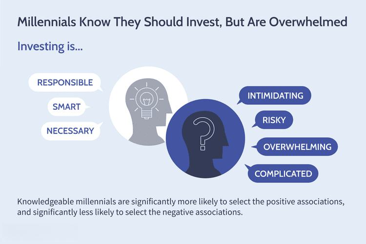

The landscape of investing is rapidly evolving, with affluent millennials at the forefront of this financial transformation. Born between 1981 and 1996, this generation has come of age amidst significant economic upheavals, from the dot-com bubble burst to the 2008 financial crisis and the more recent market volatility triggered by global events. These experiences have shaped a unique perspective toward investing, characterized by a mix of economic optimism and a cautious approach to financial markets. While many millennials display trepidation toward investing, citing risks and a lack of knowledge as deterrents, they also possess an inherent curiosity and openness to technological innovations.

This is where algorithmic trading, a subset of financial technology (FinTech), comes into play. Algorithmic trading involves using computer programs to execute trades at high speed and volume, based on pre-defined criteria. This method's ability to reduce emotional biases and capitalize on short-term market movements makes it an attractive option for investors seeking to optimize their strategies.

For affluent millennials, who grew up alongside rapidly advancing technologies, the appeal of algorithmic trading is especially pronounced. This demographic values tech-driven solutions that offer personalized and efficient financial services, making algorithmic trading a natural fit in their investment toolkit. As such, affluent millennials are not just passive participants in the financial markets; they are actively reshaping investment strategies by incorporating advanced technologies like algorithmic trading.

In this article, we examine the intersection of affluent millennials and algorithmic trading, exploring how this tech-savvy generation is influencing the investment landscape, all while navigating the opportunities and challenges presented by these modern financial tools.

## Table of Contents

## Understanding Affluent Millennials

Affluent millennials, those born between 1981 and 1996, are experiencing a significant phase of financial growth as they enter their prime earning years. This demographic is distinguished by substantial disposable income, placing them in a unique position to influence modern investment strategies. According to various surveys, approximately half of affluent millennials plan to work beyond the traditional retirement age. Despite acknowledging this need, they maintain an optimistic outlook on their financial futures. Much of this cautious optimism is shaped by witnessing economic downturns, such as the 2008 financial crisis, during formative years, leading to a more restrained approach to investing.

Their investment behavior is notably cautious, driven by perceived risks and a hesitation stemming from a lack of adequate financial knowledge. Many affluent millennials express concern over the volatility of financial markets, which influences their decision to either delay investing or adopt more conservative strategies. However, this does not dampen their overall positive financial outlook and willingness to plan for long-term wealth accumulation.

A significant trend within this cohort is an increased emphasis on investments that align with personal values, particularly environmental, social, and governance ([ESG](/wiki/esg-investing)) criteria. As socially conscious investors, affluent millennials prioritize companies and funds that demonstrate sustainability and ethical governance in their operations. This shift towards value-based investing reflects broader generational changes in consumer behavior, where decisions are heavily influenced by social and environmental impacts.

This growing interest in ESG investments demonstrates their broader desire for alignment between personal values and financial growth. Such alignment not only fulfills ethical considerations but also satisfies a preference for investments perceived as sustainable and forward-looking, further motivating affluent millennials to engage with the financial markets in meaningful ways.

## Algorithmic Trading: An Overview

Algorithmic trading involves using computer programs to execute trades at high speeds and large volumes based on predetermined criteria. This innovative method relies heavily on data-driven models and algorithms to determine the best times to buy or sell financial instruments, effectively minimizing the human element and associated emotional biases in trading decisions. By automating the trading process, [algorithmic trading](/wiki/algorithmic-trading) can swiftly capitalize on short-term market movements, often unavailable to human traders due to speed and scale constraints.

One of the primary benefits of algorithmic trading is its ability to reduce emotional biases. Humans often make decisions based on emotions, which can lead to suboptimal trading outcomes, such as panic selling or overconfidence in buying. Algorithms, on the other hand, operate based on mathematical models and [statistics](/wiki/bayesian-statistics), which can efficiently process large volumes of market data to derive insights and execute trades without emotional interference.

Furthermore, algorithmic trading can exploit market inefficiencies and capitalize on fleeting [arbitrage](/wiki/arbitrage) opportunities that exist for mere fractions of a second. This is particularly beneficial in highly liquid markets where rapid price movements are commonplace. Through algorithmic trading, investors can engage in strategies that seek minimal profit margins per trade but succeed through a large number of rapid and successive trades.

However, despite its benefits, algorithmic trading is inherently complex and not without risks. Developing effective trading algorithms requires a robust understanding of both financial markets and programming. Creating strategies that consistently yield favorable results necessitates rigorous back-testing and validation of the algorithms on historical data to ensure their reliability and robustness under various market conditions.

The risks associated with algorithmic trading are manifold. Algorithms can malfunction — often resulting in significant financial losses — if not carefully designed and tested. Additionally, market conditions can evolve rapidly, rendering algorithms less effective or even obsolete if they are not regularly updated to reflect the latest market dynamics. Therefore, deploying algorithmic trading involves thoroughly understanding not only the algorithms themselves but also potential market scenarios that could affect their performance.

In conclusion, while algorithmic trading offers numerous advantages, such as efficiency and emotion-free trading, it demands technical sophistication and rigorous testing. As such, for those intending to engage in algorithmic trading, a balanced approach that includes continual learning and adjustment of strategies is essential to success in the fast-paced financial markets.

## Why Affluent Millennials Embrace Algorithmic Trading

Raised as digital natives, millennials are uniquely positioned to leverage the advantages offered by algorithmic trading. Familiarity with advanced technologies is a hallmark of this generation, providing them with the comfort and capability to engage with sophisticated platforms to manage investments effectively. Unlike previous generations who may have experienced a steeper learning curve or exhibited reluctance towards embracing new technologies, affluent millennials demonstrate an adeptness that aligns with the complexities of algorithmic trading.

The appeal of algorithmic trading to affluent millennials is largely due to the automation of investment strategies. This automation resonates with their preference for tech-driven, personalized financial services. Algorithmic trading platforms can process large volumes of data at speeds beyond human capability, employing algorithms to make informed trades based on pre-defined sets of rules. This process reduces the margin for human error, eliminates emotional biases, and allows for consistent and efficient execution of trades. Millennials are inherently drawn to these efficient processes due to their propensity for seeking out technological solutions that offer customization and control over their financial operations.

Another significant [factor](/wiki/factor-investing) that contributes to millennials' embrace of algorithmic trading is the opportunity it presents for diversification. Algorithmic trading systems can scan multiple markets and securities simultaneously, enabling investors to diversify their portfolios across various asset classes and geographies. This capability is appealing to affluent millennials who are inherently cautious and prefer to hedge against risks. 

Optimized risk management is yet another reason affluent millennials are attracted to algorithmic trading. By using sophisticated algorithms, these platforms can adjust investment strategies in real time in response to market fluctuations, ensuring that risks are managed proactively. The built-in adaptability and responsiveness of algorithmic trading offer peace of mind to millennials who prioritize securing their financial future against potential [volatility](/wiki/volatility-trading-strategies).

Furthermore, algorithmic trading platforms often provide features that facilitate the back-testing of strategies. This functionality allows affluent millennials to experiment with different trading strategies using historical data, assessing their potential effectiveness before deploying any capital. The capability to rigorously test and refine strategies aligns with millennials' data-driven approach to decision-making, offering a scientific methodology to investment that underscores their confidence in deploying algorithmic trading. 

In summary, the adoption of algorithmic trading by affluent millennials can be attributed to their technological proficiency, the automation and personalization these platforms provide, and the enhanced diversification and risk management opportunities available. This tech-savvy generation finds the systematic and tailored approach offered by algorithmic trading an attractive tool in navigating the challenges of modern investing.

## Challenges and Considerations

Algorithmic trading, while promising, presents a series of challenges that affluent millennials must navigate to successfully integrate this technology into their investment strategies. One key challenge is the inherent complexity of algorithmic trading systems, which requires a robust understanding of both the financial markets and the technical aspects of trading algorithms. This complexity can be intimidating, particularly for those without a background in programming or quantitative finance.

Affluent millennials should be aware of the costs associated with algorithmic trading. These costs can include not only the fees for using trading platforms and services but also expenses related to developing and maintaining proprietary algorithms. Moreover, investing in the necessary hardware and software infrastructure to support high-frequency trading operations can be a significant financial commitment.

Market volatility is another critical factor for affluent millennials to consider. Algorithmic trading strategies are often sensitive to rapid market fluctuations, which can lead to substantial losses if not managed properly. For example, algorithms designed to exploit minute market inefficiencies might perform poorly during periods of extreme volatility, where traditional investment strategies might fare better. Understanding and managing this risk is crucial for investors.

Additionally, the potential for technical errors poses a significant risk. Errors in coding or logic can lead to unintended trades, resulting in financial losses. Furthermore, technical glitches, such as connectivity issues or system failures, can disrupt trading operations. Hence, affluent millennials need to implement rigorous testing and adopt fail-safe mechanisms to mitigate these risks.

A balanced approach that combines algorithmic strategies with expert financial advice can help address these challenges. Financial advisors can play a pivotal role by offering personalized insights and strategic guidance, ensuring that algorithmic trading complements broader investment goals. By leveraging their expertise, advisors can help investors optimize their strategies, manage risks, and navigate the complexities of algorithmic trading.

Incorporating algorithmic trading requires due diligence, awareness of associated challenges, and a strategic blend of technology with human insight. For affluent millennials, this balanced approach can provide a pathway to harness the full potential of algorithmic trading while minimizing risks.

## The Role of Financial Advisors

While technology has significantly transformed the investment landscape, the human element continues to play an indispensable role, particularly for affluent millennials making investment decisions. Despite their comfort with advanced technologies, this demographic places a high value on the personalized strategies and accountability that financial advisors offer.

According to recent studies, nearly two-thirds of affluent millennials trust financial advisors to provide guidance and insight beyond what technology alone can offer. This trust is rooted in the belief that financial advisors can better understand the nuances of individual financial situations, tailoring strategies that align with personal goals and risk tolerance.

Financial advisors serve a crucial role in integrating algorithmic trading into broader investment portfolios. They can help affluent millennials navigate the complexities associated with algorithmic strategies, ensuring these technologies complement rather than overshadow their financial objectives. By marrying technology with their expertise, advisors enable a more balanced approach to investment, mitigating some of the inherent risks and enhancing the potential benefits of algorithmic trading.

Through personalized financial planning, advisors can offer insights into the selection and implementation of algorithms that align with the millennials’ broader financial plans. They ensure that these algorithmic strategies are not just technically sound but also cohesive with the client’s risk tolerance, time horizon, and investment goals. Moreover, by providing regular performance reviews and adjustments to strategies, advisors maintain accountability and foster confidence among their clients.

In summary, while technology like algorithmic trading can significantly enhance the investment process, the involvement of a knowledgeable financial advisor is essential for affluent millennials seeking to leverage these tools effectively. By combining technological innovation with personalized financial advice, millennials can optimize their investment potential while achieving greater financial independence.

## Conclusion

The financial landscape is in a state of constant flux, presenting both challenges and opportunities for investors. Affluent millennials stand at the forefront of this transformation, uniquely positioned to harness the benefits of algorithmic trading. By integrating this technology into their investment strategies, they have the potential to enhance returns and manage risks more effectively.

Algorithmic trading, with its ability to execute trades quickly and reduce emotional biases, offers a significant advantage. However, affluent millennials must balance this potential with the inherent complexities and risks of the technology. These include understanding technical intricacies and being mindful of costs and market volatility. A strategic approach to using algorithmic trading involves not only leveraging its strengths but also being aware of its limitations.

To effectively utilize algorithmic trading, affluent millennials should employ it as part of a diversified investment strategy, complementing traditional methods. Integration of technology with robust financial advice is crucial in this context. Financial advisors play an essential role in guiding millennials to make informed decisions, ensuring the technologies they use support and align with their financial goals.

By bridging the gap between technology and expert advice, affluent millennials can navigate investment hesitancies, leading them towards financial independence. Understanding the full spectrum of opportunities and challenges in algorithmic trading is key to unlocking its full potential, driving forward a more secure and prosperous financial future.

## References & Further Reading

[1]: Bergstra, J., Bardenet, R., Bengio, Y., & Kégl, B. (2011). ["Algorithms for Hyper-Parameter Optimization."](https://dl.acm.org/doi/10.5555/2986459.2986743) Advances in Neural Information Processing Systems 24.

[2]: ["Advances in Financial Machine Learning"](https://www.amazon.com/Advances-Financial-Machine-Learning-Marcos/dp/1119482089) by Marcos Lopez de Prado

[3]: ["Evidence-Based Technical Analysis: Applying the Scientific Method and Statistical Inference to Trading Signals"](https://www.amazon.com/Evidence-Based-Technical-Analysis-Scientific-Statistical/dp/0470008741) by David Aronson

[4]: ["Machine Learning for Algorithmic Trading"](https://github.com/stefan-jansen/machine-learning-for-trading) by Stefan Jansen

[5]: ["Quantitative Trading: How to Build Your Own Algorithmic Trading Business"](https://www.amazon.com/Quantitative-Trading-Build-Algorithmic-Business/dp/1119800064) by Ernest P. Chan