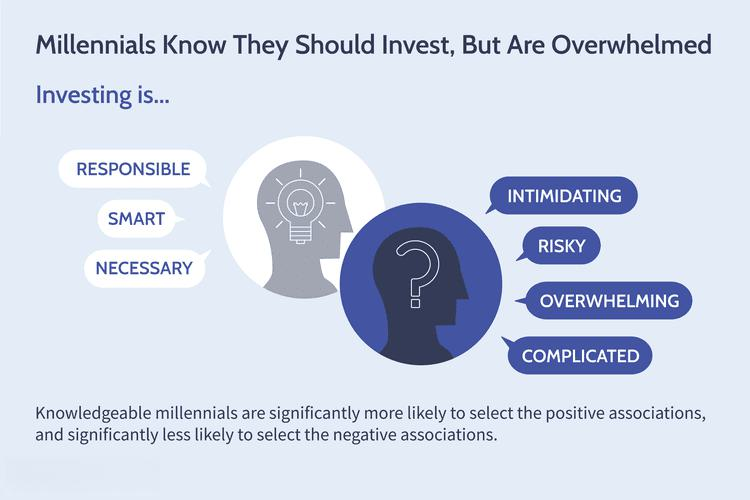

Affluent millennials, a cohort born between 1981 and 1996, exhibit unique investing trends shaped by their formative experiences with economic challenges, such as the Great Recession and fluctuating job markets. Despite these obstacles, many have secured substantial earnings, distinguishing them from their generational peers. This confluence of experiences has fostered distinctive financial behaviors that are crucial for market analysts and financial advisors to comprehend.

Investment surveys serve as vital tools for decoding the financial behaviors of millennials. These surveys provide empirical data about their preferences, risk appetites, and decision-making processes. By aggregating self-reported information on asset allocations, investment horizons, and favored financial instruments, surveys illuminate patterns and trends specific to affluent millennials. For instance, research has shown that this group often prioritizes investments in technology and sustainable ventures, reflecting their values and long-term economic aspirations.

Algorithmic trading has also emerged as a significant factor influencing millennial investing habits. Known for their comfort with technology, millennials find algorithmic trading appealing due to its efficiency and precision. This form of trading utilizes complex algorithms to execute trades at speeds and volumes unattainable by human traders alone. For tech-savvy millennial investors, algorithmic trading offers a way to leverage big data analytics and machine learning to optimize investment strategies. By doing so, they can potentially maximize returns while mitigating risks associated with market volatility.

Collectively, these elements present a nuanced landscape of investment behaviors among affluent millennials. Understanding these trends is vital for those looking to navigate and thrive within the evolving financial ecosystem, as they represent both current market drivers and harbingers of future investment shifts.

## Table of Contents

## Understanding Affluent Millennials

Affluent millennials are a cohort characterized by their considerable economic capability and significant investment potential. This group generally comprises individuals born between 1981 and 1996, who have achieved a specific economic status that sets them apart from their peers. According to demographic studies, affluent millennials are typically defined by an annual household income exceeding $100,000, enabling them to access and engage with diverse investment opportunities. 

This demographic often benefits from a combination of factors, including higher levels of education and employment in high-income industries, such as technology, finance, and healthcare. A significant portion of affluent millennials possess at least a bachelor's degree, with many holding advanced degrees that contribute to their increased [earning](/wiki/earning-announcement) potential. Moreover, this group exhibits a proclivity towards urban living, frequently inhabiting major metropolitan areas where high salaries are more prevalent.

Recent surveys and studies provide valuable insights into the investment behaviors of affluent millennials. For instance, research highlights that this group leverages technology at a higher rate than previous generations, using online platforms and financial apps to manage their investments. A 2021 survey by Charles Schwab revealed that approximately 70% of affluent millennials use a financial app for their investment activities, underscoring their comfort with digital financial tools.

Additionally, studies indicate that affluent millennials are inclined towards investments that reflect their values, such as sustainable and socially responsible investments. This cohort often prioritizes environmental, social, and governance ([ESG](/wiki/esg-investing)) criteria in their investment decisions, aligning their portfolios with broader ethical and social values. The Deloitte Millennial Survey of 2020 found that over 45% of millennials consider corporate social responsibility a critical [factor](/wiki/factor-investing) in investment choices.

Despite their willingness to embrace new investment avenues, affluent millennials are not immune to the financial challenges faced by their generation. They have experienced significant economic events—such as the Great Recession and the COVID-19 pandemic—that have shaped their financial outlook and strategies. Such experiences contribute to their cautious optimism, balancing the pursuit of opportunity with an awareness of risk. Consequently, affluent millennials often display a mix of conservative and innovative investment strategies, seeking growth while managing potential uncertainties.

Understanding the economic and demographic characteristics of affluent millennials, along with their investment preferences, is crucial for financial advisors and market analysts aiming to engage effectively with this significant market segment. As affluent millennials continue to shape the investment landscape, their unique blend of technological adeptness, ethical consideration, and risk management will likely influence broader investment trends.

## Investment Trends Among Affluent Millennials

Affluent millennials, those born between 1981 and 1996 with considerable economic resources, exhibit distinct trends when it comes to investing. Notable preferences among this group include stocks, bonds, exchange-traded funds (ETFs), and cryptocurrencies, reflecting a blend of traditional and modern financial assets.

**Investment Preferences and Inclinations**  
Stocks remain a central component of affluent millennials' portfolios due to their historical reliability and potential for substantial returns. According to a 2020 Charles Schwab survey, millennials are more inclined to invest in individual stocks compared to older generations, driven by the allure of high-profile tech companies.[^1] Bonds, viewed as safer investments, provide stability and are favored by conservative millennial investors seeking to balance risk within their portfolios.

ETFs appeal due to their diversified nature and cost-effectiveness. They allow millennial investors to gain exposure to broad market indices or specific sectors without the complexity of managing individual stock portfolios. The accessibility of ETFs aligns with millennials' preference for convenience and financial prudence.

Cryptocurrency, while volatile, attracts millennials due to its disruptive potential and the narrative of decentralization. A 2021 CNBC survey showed that nearly half of millennial millionaires had at least 25% of their wealth in cryptocurrencies, underscoring their appetite for high-risk, high-reward investments.[^2]

**Conservative vs. Aggressive Investment Strategies**  
The driving factors behind affluent millennials' strategies are varied. Those adopting a conservative approach often cite economic instability experienced during formative years—such as the 2008 financial crisis—as a major influence. Conversely, those with aggressive strategies are motivated by technological advancements and a strong belief in future economic growth.

Risk tolerance among millennials is further molded by financial literacy and access to market information. Affluent millennials, characterized by higher educational attainment, frequently leverage data-driven analyses to guide their investment choices, facilitating a more aggressive strategy underpinned by informed decision-making.

**Barriers and Motivators**  
Key barriers to investing include market [volatility](/wiki/volatility-trading-strategies) and economic uncertainties, which foster a sense of caution. Additionally, regulatory concerns around newer financial products like [cryptocurrency](/wiki/cryptocurrency) can deter participation.

Motivators include a desire for financial independence and technological innovations in fintech, offering novel investment opportunities and platforms. The democratization of trading through apps like Robinhood has removed traditional barriers, enabling easier entry into financial markets. Socially responsible investing is another motivator, as millennials prioritize values-aligned investment opportunities.

In conclusion, affluent millennials demonstrate a diverse range of investment preferences and strategies shaped by a confluence of economic experiences, technological advancements, and personal values. Understanding these trends is crucial for financial advisors aiming to cater to the nuanced needs of this demographic.

[^1]: "Schwab 2020 Modern Wealth Survey." Charles Schwab, 2020.
[^2]: "Millennial Millionaires Shed FOMO Label as Crypto Takes Chunk of Wealth." CNBC, 2021.

## Algorithmic Trading: A Millennial Perspective

Algorithmic trading, often known as algo trading, utilizes computer algorithms to automate trading activities in financial markets. This form of trading applies complex mathematical models and predetermined strategies to execute orders at optimal speeds and frequencies that are beyond human capability. Affluent millennials, characterized by their high levels of technological adeptness, find [algorithmic trading](/wiki/algorithmic-trading) particularly appealing due to its efficiency and the robust technological integration it offers.

### Leverage of Technology in Investment Strategies

Affluent millennials often leverage technology to enhance their investment strategies due to several factors. Firstly, they are digital natives, naturally inclined toward technological solutions that provide speed and flexibility. Algorithmic trading platforms offer user-friendly interfaces and sophisticated algorithms that perform intricate analyses, such as quantifying risks and identifying trends with precision.

The use of mobile applications and online tools further allows these investors to monitor portfolios and manage trades in real-time, aligning with their fast-paced lifestyles. Many platforms provide automated portfolio rebalancing and tax-loss harvesting, ensuring that their investments remain optimized without constant oversight.

### Pros and Cons of Algorithmic Trading

From a millennial perspective, algorithmic trading has several pros:

1. **Speed and Efficiency**: Algorithms can process vast amounts of data and execute trades within milliseconds, which is significantly faster than manual trading.

2. **Reduced Emotional Bias**: By automating trades based on predetermined criteria, algorithmic trading minimizes emotional decision-making, which can often lead to impulsive and suboptimal investment choices.

3. **Backtesting Capabilities**: Investors can test their trading strategies using historical data to predict future performance, enabling data-driven decision-making.

Despite these advantages, there are also several cons associated with algorithmic trading:

1. **Complexity**: Developing and maintaining algorithms requires a deep understanding of both programming and financial markets, which may not be accessible to all investors, even those who are tech-savvy.

2. **Over-Reliance on Technology**: High dependence on algorithms might lead to neglect of fundamental market analysis and create losses if the market behaves unexpectedly.

3. **System Failures**: Technical glitches or failures could lead to incorrect trade executions, causing significant financial losses.

In conclusion, for affluent millennials who are already comfortable navigating digital and technological solutions, algorithmic trading presents an enticing avenue for enhancing their investment strategies. However, it is crucial for them to remain informed about the potential downsides and to ensure a balanced approach that combines both automated and traditional investment insights.

## The Role of Financial Advisors

Affluent millennials demonstrate a nuanced relationship with financial advisors, balancing traditional advisory services with modern technological tools. This demographic, characterized by their early exposure to digital technologies and economic upheavals, places significant importance on financial literacy and early financial education. Understanding these factors is crucial to comprehending their reliance on financial advisors.

Financial literacy among affluent millennials often stems from early exposure to financial concepts, either through formal education or parental guidance. This early education fosters confidence in investment decisions and a comprehension of complex financial instruments. A robust foundation in financial knowledge enables millennials to critically engage with financial advisors, assessing the quality of advice and independently verifying it through personal research. Consequently, millennials who possess higher financial literacy tend to seek advisors for strategic guidance rather than basic information, valuing expertise in areas such as tax optimization, estate planning, and sophisticated investment strategies.

In parallel, there's a notable shift towards a hybrid advisory model that blends the human touch with technological efficiency. Millennials, being tech-savvy, appreciate the transparency, accessibility, and efficiency offered by robo-advisors and financial management apps. These digital tools serve well for executing straightforward transactions and monitoring portfolios in real-time, a feature highly valued by a generation accustomed to instant information and results.

However, the human element remains irreplaceable in certain contexts. Financial advisors offer personalized insights, emotional intelligence, and the ability to consider nuanced life circumstances, which algorithms alone cannot consistently provide. The hybrid model leverages algorithmic precision for routine tasks while reserving complex, personalized financial decisions for human advisors. This symbiotic relationship enhances trust and reliance on financial advice, as millennials benefit from the best of both worlds—the cutting-edge technology and the expertise of seasoned professionals.

As algorithms and [artificial intelligence](/wiki/ai-artificial-intelligence) evolve, the potential of hybrid approaches will likely expand, potentially redefining the millennial investment landscape. Advisors will need to adapt by integrating technological advancements into their services to meet the expectations of affluent millennials, who seek both efficiency and personalized attention in financial advisory services. Understanding this dynamic is essential for financial advisors aiming to build lasting relationships with this influential demographic.

## Conservative Yet Optimistic: The Paradox

Affluent millennials exhibit conservative investing habits, an intriguing paradox given their inherent financial optimism. This duality is shaped by a blend of psychological and historical factors. The conservative nature of their investment strategies is deeply rooted in the economic uncertainties and financial crises that marked their formative years. The 2008 financial crisis, for instance, loomed large over the early careers of many millennials, imprinting a cautious approach to portfolio management. As a result, affluent millennials tend to favor stability and security, often opting for diversified portfolios to mitigate risk.

From a psychological perspective, the concept of loss aversion plays a significant role in influencing their investment behavior. Affluent millennials are inclined to prioritize the preservation of capital, often exhibiting a heightened sensitivity to potential losses rather than focusing solely on potential gains. This cautious approach aligns with behavioral finance theories, such as prospect theory, which suggests that individuals perceive the pain of losses more intensely than the pleasure of equivalent gains.

Historical contexts further compound these cautious tendencies. The economic disruptions experienced during millennials’ early adulthood, including the dot-com bubble and the global financial crisis, have created a legacy of skepticism towards overly aggressive investment strategies. Instead, many affluent millennials allocate funds towards assets perceived as safer, such as government bonds or diversified mutual funds.

Market volatility remains a prominent factor in shaping the investment mindset of affluent millennials. The turbulence observed in stock markets in recent years, including recent downturns and uncertainties caused by global events, has reinforced the cautious stance of millennial investors. They often exhibit a preference for steady, long-term returns over speculative, high-risk opportunities.

Economic experiences, both personal and observational, inform their investment decisions. Witnessing parents or peers struggle with financial setbacks, or experiencing job insecurity firsthand, reinforces the desire for financial stability. Consequently, affluent millennials frequently explore strategies to secure their financial future, opting for investments in tangible assets like real estate or sustainable ventures, which they perceive as more stable.

Nonetheless, while their investment approach may lean towards conservatism, it is tempered by an underlying optimism about the future. Affluent millennials are generally more willing to explore technologies and innovations in financial markets, albeit cautiously, while maintaining a diversified approach to safeguard against unforeseen market shifts. This blend of caution and optimism defines their unique investment paradox, positioning them as a generation navigating the complexities of modern finance with both prudence and hope for future growth.

## The Future of Millennial Investing

As affluent millennials continue to mature financially, the investment landscape they navigate is poised to evolve significantly, driven by technological advancements and shifting attitudes towards investment risk and focus.

Emerging technologies, notably artificial intelligence (AI) and blockchain, are anticipated to revolutionize investment strategies. AI-powered tools are becoming increasingly sophisticated, offering real-time data analysis and predictive analytics. This capability allows investors to make more informed decisions, optimizing portfolios with precision that was previously unattainable. Algorithms assessing historical data trends enable the identification of predictive patterns, thereby streamlining investment choices.

Blockchain technology, on the other hand, is not only broadening the scope of investable assets through cryptocurrencies but also ensuring greater transparency and security. Decentralized finance (DeFi) platforms are expected to gain traction, enabling affluent millennials to engage in peer-to-peer lending and borrowing, bypassing traditional financial institutions. These platforms embody the shift towards an 'open finance' model, appealing to a generation that prizes autonomy and flexibility in managing its wealth.

Generational shifts in investment focus and risk tolerance are also evident. Millennials are increasingly aligning their financial goals with personal values, such as environmental sustainability and social responsibility. This trend is exemplified by the growing popularity of Environmental, Social, and Governance (ESG) investing. As these investors seek to make an impact, demand for sustainable and ethical investment products is likely to rise, shaping the offerings of asset management firms.

Risk tolerance is another area where a discernible shift is observed. Despite being technologically savvy, many affluent millennials exhibit a cautious approach, informed by the economic uncertainties witnessed during formative years, such as the 2008 financial crisis. However, as they gain confidence and market experience, there is potential for increased willingness to explore speculative investments, like cryptocurrencies and tech startups, balancing conservativism with calculated risk-taking.

In summary, the future of millennial investing is characterized by the integration of cutting-edge technologies, greater emphasis on value-based investments, and an evolving risk profile. These factors combined suggest a more dynamic, personalized investment landscape for affluent millennials, where technological fluency and ethical considerations will play pivotal roles in shaping investment strategies. Financial professionals should anticipate these trends to effectively cater to this influential demographic.

## Conclusion and Key Takeaways

The investment behavior of affluent millennials is shaped by a blend of caution and forward-thinking strategies, reflecting their unique experiences and aspirations. As a group that has borne witness to significant economic fluctuations, affluent millennials demonstrate a blend of conservative and optimistic investment habits. Their preferences often balance traditional and modern financial instruments, like stocks, bonds, ETFs, and cryptocurrency, adapting to both technological advancements and financial market evolutions.

It is essential for financial advisors and market analysts to grasp these emerging trends. By understanding the factors influencing millennial investors, such as their inclination towards sustainable and socially responsible investments, professionals can tailor their services to better meet the needs of this demographic. Moreover, leveraging insights from investment surveys can aid firms in developing strategies and tools that empower millennials to invest with greater confidence.

Affluent millennials are encouraged to further their financial literacy and remain open to technological innovations, such as algorithmic trading. This approach not only diversifies their portfolios but also optimizes investment outcomes. Establishing a balance between technology-driven tools and trusted financial advisors can provide a robust framework for informed decision-making.

To enhance their investment journeys, millennials should prioritize continuous learning, seeking insights from a variety of sources and remaining adaptable in an ever-shifting economic landscape. By doing so, they position themselves not only for personal financial growth but also as influential participants in the future of investing.

## References & Further Reading

[1]: Bergstra, J., Bardenet, R., Bengio, Y., & Kégl, B. (2011). ["Algorithms for Hyper-Parameter Optimization."](https://dl.acm.org/doi/10.5555/2986459.2986743) Advances in Neural Information Processing Systems 24.

[2]: ["Millennials and the Future of Investing"](https://www.forbes.com/councils/forbesfinancecouncil/2019/04/02/how-millennials-are-changing-the-future-of-investment/) by Ali Madad, Harvard Business Review, 2019.

[3]: ["Advances in Financial Machine Learning"](https://www.amazon.com/Advances-Financial-Machine-Learning-Marcos/dp/1119482089) by Marcos Lopez de Prado

[4]: Charles Schwab Survey. (2020). ["Schwab 2020 Modern Wealth Survey."](https://content.schwab.com/web/retail/public/about-schwab/charles-schwab-modern-wealth-survey-2020-washington-dc.pdf)

[5]: ["Machine Learning for Algorithmic Trading"](https://github.com/stefan-jansen/machine-learning-for-trading) by Stefan Jansen

[6]: CNBC. (2021). ["Millennial Millionaires Shed FOMO Label as Crypto Takes Chunk of Wealth."](https://www.cnbc.com/2021/06/10/millennial-millionaires-have-large-share-of-wealth-in-crypto-cnbc-survey-.html)

[7]: ["Quantitative Trading: How to Build Your Own Algorithmic Trading Business"](https://github.com/LucindaYa/quant-resources/blob/master/Quantitative%20Trading%20How%20to%20Build%20Your%20Own%20Algorithmic%20Trading%20Business.pdf) by Ernest P. Chan

[8]: Deloitte. (2020). ["The Deloitte Global Millennial Survey 2020."](https://www2.deloitte.com/gr/en/pages/about-deloitte/articles/MillennialSurvey2020.html)

[9]: Oxford Analytica. (2020). ["The impact of millennial investors on capital markets."](https://www.oxan.com/)