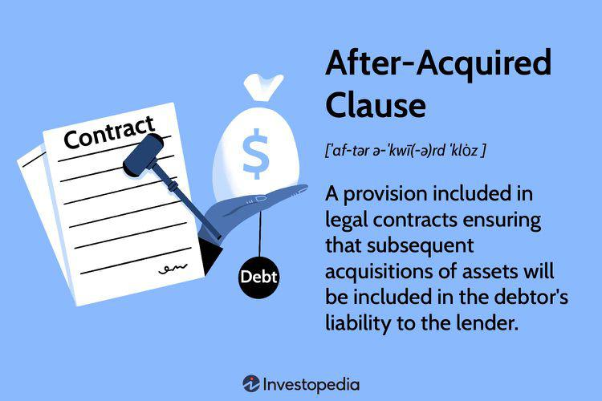

In the complex world of legal contracts, the 'after-acquired clause' is a pivotal provision that addresses assets obtained by a debtor after the initial agreement is signed. This clause is an essential component in many lending and financing arrangements, offering significant implications for both lenders and borrowers. Its primary function is to extend the rights of the lender to include any additional assets a borrower might acquire post-agreement, effectively enhancing the security for the lender by broadening the scope of collateral coverage.

The after-acquired clause is particularly beneficial in scenarios where a borrower might acquire new assets, such as real estate or inventory, subsequent to the original contract. Lenders are provided with a seamless and efficient mechanism to manage these new assets without needing to renegotiate or amend the existing loan terms constantly. This not only streamlines asset management but also simplifies the monitoring process for lenders, ensuring that they have consistent collateral protection throughout the life of the loan.

However, the utilization of an after-acquired clause is not without its challenges, particularly for borrowers. While it may provide borrowers with an opportunity to secure loans more easily, especially if they have suboptimal credit ratings, it simultaneously imposes restrictions. The automatic inclusion of new assets under existing loan agreements can limit a borrower's financial flexibility, potentially hindering their ability to acquire additional credit in the future. 

In addition to its traditional applications, the contemporary relevance of the after-acquired clause extends into the domain of algorithmic trading. Algorithmic trading, characterized by automated, high-frequency transactions, often requires the rapid acquisition and exchange of assets. The presence of an after-acquired clause can significantly influence trading decisions and strategies. It is crucial for algorithmic traders to understand how their assets are leveraged as collateral, as this understanding could either optimize or complicate their trading models.

This article will provide an in-depth exploration of the after-acquired clause, examining its functions and benefits, as well as the challenges it presents to borrowers. Furthermore, it will explore its relevance within the fast-paced environment of algorithmic trading, offering insights that are crucial for both legal professionals and financial traders seeking a comprehensive understanding of this contractual provision.

## Table of Contents

## Understanding the After-Acquired Clause

An after-acquired clause serves as a vital mechanism in contract law, particularly within secured lending arrangements. It operates by automatically incorporating any property acquired by the borrower after the agreement date into the existing collateral pool. This inclusion mitigates risk for lenders, as it extends the scope of collateral, enhancing security for the loan and reducing the need for renegotiation whenever the borrower acquires new assets. 

The clause's broad applicability to all asset types, such as real estate, inventory, and equipment, renders it exceptionally advantageous for lenders. When a borrower purchases new assets, these automatically become subject to the terms of the initial loan agreement. For instance, if a borrower acquires new inventory or property, these are immediately considered part of the collateral, thereby offering a more robust guarantee to the lender without additional formalities. This automatic inclusion streamlines asset management, as lenders are not required to update loan terms incessantly after every acquisition, saving both time and administrative resources.

From the standpoint of financial management, this clause offers significant benefits. It obviates the need for repeated appraisals or renegotiations, which can be both cumbersome and costly. For lenders, it simplifies monitoring processes by maintaining a comprehensive and up-to-date collateral register without manual intervention. This systematization is particularly beneficial in complex financial ecosystems where borrowers might frequently acquire new assets that could otherwise necessitate continual updates to contract terms.

The structural simplicity afforded by the after-acquired clause promotes more efficient financial oversight and provides a stable foundation for lenders to assess their exposure to risk. They gain assurance that should the borrower default, the expanded collateral will provide a buffer, recovering more of the owed sums. This enhancement in risk management is a critical [factor](/wiki/factor-investing) in facilitating smoother lending operations, ultimately making it an attractive feature for both lenders and potentially some borrowers who wish to avoid the complexities of securing loans with fixed asset lists.

## Advantages of the After-Acquired Clause

An after-acquired clause offers notably enhanced security to lenders by automatically applying new assets as collateral under an existing loan agreement. This automatic inclusion expands the collateral base and reduces the lender's risk exposure. It ensures that the lender maintains a secured position, regardless of the debtor's asset acquisition activities post-agreement.

For borrowers, particularly those with less-than-optimal credit ratings, the after-acquired clause can be advantageous in securing financing. By offering lenders additional collateral security, borrowers may find it easier to negotiate loans. This is significant for individuals or businesses that have limited existing assets to offer initially. The assurance of potential future assets being added to the collateral pool acts as a negotiating lever, potentially leading to more favorable lending terms or approval conditions. 

Moreover, the after-acquired clause facilitates a smoother loan process by eliminating the need for repeated negotiations or contractual amendments every time a new asset is acquired. This reduces administrative burden and allows both lenders and borrowers to plan and execute financial operations with a degree of predictability.

## Disadvantages of the After-Acquired Clause

A significant downside of the after-acquired clause for borrowers is the restricted financial flexibility resulting from automatic claims by existing lenders on newly acquired assets. This automatic encumbrance can make it challenging for borrowers to secure further credit, as the assets that could otherwise be leveraged for new loans are pre-committed as collateral. For instance, if a borrower acquires new inventory or equipment, these assets, being tied to pre-existing loan agreements, can reduce the borrower's ability to use them as security for future financing needs. This scenario may particularly impact businesses that rely on continuous borrowing to fuel growth and operations.

Moreover, the clause potentially deters new lenders from engaging with borrowers whose assets are already encumbered. Since future assets are predefined as collateral under existing agreements, new lenders may perceive the risk of potential asset forfeiture as too high, thereby limiting the borrower's opportunities to obtain competitive financing terms. This perception of heightened risk might lead to increased costs of borrowing, as lenders compensate for the added uncertainty.

The implications of asset forfeiture are profound. Borrowers need to carefully evaluate these implications when agreeing to such terms, as they can affect the overall financial health and growth prospects of an enterprise. The strategic importance of maintaining unencumbered assets could outweigh the immediate benefits of the after-acquired clause, particularly for businesses aiming to maintain lending relationships with multiple financial institutions. Therefore, borrowers must weigh the protection the clause affords against its potential to stifle future financial opportunities.

## The Intersection of After-Acquired Clauses and Algo Trading

Algorithmic trading is characterized by the use of automated systems to conduct high-frequency trading operations in financial markets. These systems require rapid and precise asset management, with trades often executed in milliseconds. In this fast-paced environment, the after-acquired clause becomes a key element by affecting how assets are utilized as collateral, with direct implications for trading strategies.

The after-acquired clause ensures that any asset a borrower acquires after the execution of a lending agreement automatically becomes available as collateral to the lender. In [algorithmic trading](/wiki/algorithmic-trading), this clause can enhance the efficiency of capital leverage strategies. For example, when new assets are continuously acquired through trading, they can instantly support additional trading activities without the need for renegotiating collateral arrangements. This seamless integration of assets simplifies [liquidity](/wiki/liquidity-risk-premium) management and enables more dynamic and flexible trading strategies.

However, the automatic inclusion of new assets as collateral can also complicate matters. Traders must be meticulous in tracking these assets and understanding their impact on current and future obligations. For instance, a trader utilizing leverage based on anticipated future asset acquisitions must consider the potential impact of the after-acquired clause on available collateral and possible encumbrances. This complexity is particularly pronounced in strategies involving multiple lenders or layered financial products.

Understanding the nuances of the after-acquired clause is vital for algorithmic traders who aim to optimize their trading models. Effective management of assets subject to these clauses can be instrumental in maintaining both liquidity and compliance with financial covenants. Traders can use algorithms to track asset acquisitions and changes in collateral value, adjusting trading strategies accordingly to capitalize on available opportunities without over-encumbering assets.

In conclusion, the after-acquired clause offers both opportunities for more streamlined capital usage and challenges due to the restrictions it imposes. Algorithmic traders must carefully consider its implications to formulate strategies that maximize positive outcomes while minimizing potential pitfalls. With the right approach, the after-acquired clause can be a powerful tool in the algorithmic trading arsenal.

## Conclusion

In conclusion, the after-acquired clause stands as a cornerstone in securing financial agreements and simplifying asset management for lenders. Its incorporation ensures that newly acquired assets by the debtor are automatically subjected to the existing collateral pool, thereby enhancing the security and predictability of loan agreements. This provision offers lenders an expanded safety net, albeit at the potential cost of the borrower's flexibility in acquiring new credit or negotiating terms for new assets. Borrowers, particularly those with limited credit options, may find themselves constrained as future collateral is preemptively claimed by existing lenders, thereby limiting their strategic financial maneuvers.

In the context of algorithmic trading, the after-acquired clause introduces both challenges and opportunities. Traders utilizing algorithmic methods must recognize how these clauses affect collateral management, impacting both liquidity and leverage strategies. The clause can streamline trading operations by ensuring continuity in asset coverage, but it may also restrict quick asset mobilization, a critical aspect for high-frequency trading activities that rely on flexibility and speed. Therefore, algorithmic traders need to incorporate the implications of such clauses into their models to maximize efficiency and optimize financial outcomes. Balancing these considerations is key to leveraging the benefits of the after-acquired clause while mitigating its constraints, ensuring advantageous outcomes in both legal and trading environments.

## References & Further Reading

[1]: White, James J. & Summers, Robert S. (2010). ["Uniform Commercial Code,"](https://archive.org/details/uniformcommercia0000whit_z2u1) Sixth Edition. West Academic Publishing.

[2]: Gilreath, William (2013). ["Understanding Security Interests,"](https://scholar.google.com/citations?user=GCFMOQcAAAAJ&hl=en) American Bar Association.

[3]: Lopez de Prado, Marcos (2018). ["Advances in Financial Machine Learning,"](https://www.amazon.com/Advances-Financial-Machine-Learning-Marcos/dp/1119482089) Wiley.

[4]: Hull, John C. (2017). ["Options, Futures, and Other Derivatives,"](https://elibrary.pearson.de/book/99.150005/9781292212920) Ninth Edition, Pearson.

[5]: Jansen, Stefan (2018). ["Machine Learning for Algorithmic Trading,"](https://github.com/stefan-jansen/machine-learning-for-trading) Packt Publishing.