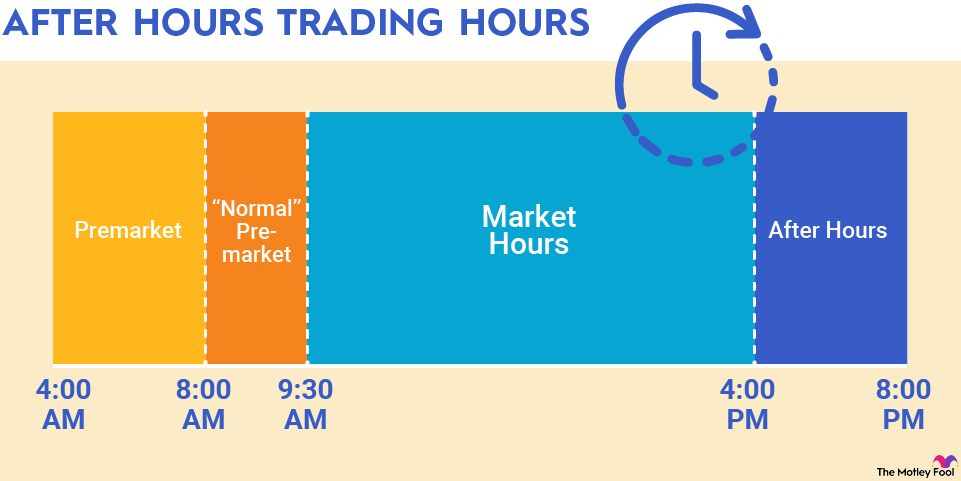

## Table of Contents

## What is after-hours trading?

After-hours trading is when people buy and sell stocks outside of the normal trading times. Normally, the stock market is open from 9:30 AM to 4:00 PM Eastern Time, Monday through Friday. But after-hours trading happens before the market opens in the morning or after it closes in the evening. This allows investors to react to news and events that happen outside of regular trading hours.

Trading after hours can be helpful because it lets people make quick decisions based on new information. For example, if a company announces good news after the market closes, investors can buy the stock right away instead of waiting until the next day. However, after-hours trading can also be riskier. There are usually fewer people trading, so prices can change a lot more than during regular hours. It's important for investors to be careful and understand these risks before they start trading after hours.

## How does after-hours trading work?

After-hours trading lets people buy and sell stocks when the regular market is closed. The normal trading hours are from 9:30 AM to 4:00 PM Eastern Time, but after-hours trading happens before the market opens or after it closes. This means you can trade from about 4:00 PM to 8:00 PM Eastern Time in the evening and from 7:00 AM to 9:30 AM in the morning. To trade after hours, you need to use a broker that offers this service. Not all brokers do, so you need to check with yours.

When you trade after hours, the prices can change a lot more than during regular hours. This is because fewer people are trading, so there's less activity. This can be good if you want to react quickly to news that comes out after the market closes, like a company announcing good earnings. But it can also be risky because the price might move a lot. It's important to know these risks and be careful when you trade after hours. Always make sure you understand how it works before you start.

## What are the typical hours for after-hours trading?

After-hours trading happens when the regular stock market is closed. The normal trading hours are from 9:30 AM to 4:00 PM Eastern Time, but after-hours trading lets you buy and sell stocks outside of these times. You can trade in the evening from about 4:00 PM to 8:00 PM Eastern Time. This is good if you want to react to news that comes out after the market closes.

You can also trade in the morning before the market opens, from about 7:00 AM to 9:30 AM Eastern Time. This gives you a chance to make trades based on news that happened overnight. Remember, not all brokers offer after-hours trading, so you need to check with your broker to see if they do.

## Which platforms or exchanges facilitate after-hours trading?

After-hours trading is available on several major platforms and exchanges. The most common ones are the electronic communication networks (ECNs) like Nasdaq and NYSE Arca. These platforms let you buy and sell stocks before the market opens and after it closes. They are open from about 4:00 PM to 8:00 PM Eastern Time in the evening and from 7:00 AM to 9:30 AM in the morning.

Many popular online brokers also offer after-hours trading. Brokers like Robinhood, E*TRADE, and TD Ameritrade let you trade outside of normal hours. They use the ECNs to match buyers and sellers. It's important to check with your broker to see if they offer this service and what their specific hours are, as they might be a bit different.

## What types of securities can be traded after hours?

After-hours trading lets you buy and sell many types of securities, but not all of them. The most common securities you can trade after hours are stocks. These are shares in companies that are listed on big stock exchanges like the Nasdaq and the New York Stock Exchange. If you want to trade stocks after hours, you can do it through electronic communication networks (ECNs) that are open from about 4:00 PM to 8:00 PM Eastern Time in the evening and from 7:00 AM to 9:30 AM in the morning.

Besides stocks, some brokers also let you trade other types of securities after hours, like exchange-traded funds (ETFs). ETFs are like baskets of stocks that you can buy and sell like a single stock. Not all ETFs can be traded after hours, so you need to check with your broker to see which ones are available. Remember, not all brokers offer after-hours trading for all types of securities, so it's important to know what your broker allows before you start trading.

## What are the benefits of participating in after-hours trading?

One big benefit of after-hours trading is that it lets you react to news right away. If a company announces something important after the market closes, like good earnings or a new product, you don't have to wait until the next day to buy or sell their stock. This can help you take advantage of new information quickly and maybe make more money.

Another benefit is that after-hours trading gives you more flexibility. If you work during the day and can't watch the market, you can still trade in the evening or early morning. This means you don't have to miss out on trading just because you have a job or other commitments during regular market hours. It's like having a chance to trade when it's convenient for you.

## What are the risks associated with after-hours trading?

One big risk of after-hours trading is that prices can change a lot more than during regular hours. This happens because fewer people are trading, so there's less activity. When fewer people are buying and selling, even small trades can make the price go up or down a lot. This can be risky because you might buy or sell at a price that's very different from what you expected.

Another risk is that there's less information available after hours. During the day, you can see lots of news and updates about stocks, but after the market closes, there's less news coming out. This means you might make decisions based on less information, which can lead to mistakes. It's important to be careful and think about the risks before you start trading after hours.

## How does liquidity affect after-hours trading?

Liquidity is how easy it is to buy or sell something without changing its price too much. In after-hours trading, there are usually fewer people buying and selling stocks. This means the market is less liquid. When there are fewer buyers and sellers, even small trades can make the price of a stock go up or down a lot. This can make after-hours trading riskier because you might not get the price you expect.

Because of lower [liquidity](/wiki/liquidity-risk-premium), it can also be harder to find someone to trade with after hours. If you want to sell a stock, you might have to wait longer to find a buyer, or you might have to accept a lower price. This is different from regular trading hours when there are lots of people trading, so it's easier to buy and sell at the price you want. So, when you're thinking about trading after hours, remember that lower liquidity can make things more unpredictable and harder to do.

## What impact does after-hours trading have on stock prices?

After-hours trading can have a big impact on stock prices. When the regular market is closed, fewer people are trading, so even small trades can make the price of a stock go up or down a lot. This happens because there are fewer buyers and sellers, which means the market is less liquid. If a company announces good news after the market closes, like better-than-expected earnings, people might start buying the stock right away. This can push the price up a lot before the next trading day starts.

On the other hand, bad news can make the stock price drop quickly after hours. If a company says something that worries investors, like lower profits or a problem with their business, people might start selling the stock. This can lead to a big drop in the stock's price before the market opens again. Because of these big price changes, after-hours trading can set the stage for what happens when the regular market opens the next day.

## How can one prepare effectively for after-hours trading?

To prepare effectively for after-hours trading, it's important to stay informed about the latest news and events that can affect stock prices. Since after-hours trading lets you react to news that happens after the market closes, you should keep an eye on company announcements, earnings reports, and any other important updates that come out in the evening or early morning. Make sure you have a good understanding of the companies you're interested in trading, and know what might make their stock prices go up or down.

Another key part of preparing for after-hours trading is to understand the risks involved. Because there are fewer people trading after hours, the prices can change a lot more than during regular hours. This means you need to be ready for bigger price swings and think carefully about how much you're willing to risk. It's also a good idea to check with your broker to see what securities you can trade after hours and what their specific trading hours are. By knowing these things, you can make smarter decisions and be better prepared for after-hours trading.

## What are the regulatory considerations for after-hours trading?

After-hours trading has some rules you need to know about. The Securities and Exchange Commission (SEC) is the main group that makes sure trading is fair and safe. They have rules that say what brokers need to do when they let people trade after hours. For example, brokers have to tell you that after-hours trading can be riskier than trading during the day. They also need to make sure they have the right systems in place so that after-hours trading works well and is fair for everyone.

Another important thing to know is that not all stocks can be traded after hours. Some stocks might not be available, and the rules can change depending on the exchange or the broker you use. It's a good idea to check with your broker to see what stocks you can trade and what the rules are. This way, you can make sure you're following all the rules and staying safe while you trade after hours.

## How do advanced trading strategies apply to after-hours markets?

Advanced trading strategies can be used in after-hours markets, but they need to be adjusted because the market is different at this time. One strategy is called "[momentum](/wiki/momentum) trading," where you buy stocks that are going up in price and sell them when the price starts to drop. In after-hours trading, you can use this strategy to take advantage of news that comes out after the market closes. For example, if a company announces good news, you might buy the stock right away and then sell it later when the price goes up. But because there are fewer people trading after hours, the price can change a lot, so you need to be careful and ready for big swings.

Another strategy is "[scalping](/wiki/gamma-scalping)," where you make lots of small trades to make a little bit of money each time. This can work well after hours because the prices can move a lot, and you can take advantage of these small changes. However, scalping needs you to watch the market closely and act quickly, which can be harder after hours when there's less information and fewer people trading. No matter what strategy you use, it's important to understand the risks of after-hours trading and be ready for the market to be less predictable than during the day.

## References & Further Reading

[1]: ["Algorithmic Trading: Winning Strategies and Their Rationale"](https://www.wiley.com/en-us/Algorithmic+Trading%3A+Winning+Strategies+and+Their+Rationale-p-9781118460146) by Ernest P. Chan

[2]: Kirilenko, A. A., Kyle, A. S., Samadi, M., & Tuzun, T. (2017). ["The Flash Crash: The Impact of High-Frequency Trading on an Electronic Market."](https://onlinelibrary.wiley.com/doi/abs/10.1111/jofi.12498) Journal of Finance, 72(1), 201-229.

[3]: SEC.gov. ["Extended Hours Trading: Understanding the Risks."](https://www.sec.gov/about/reports-publications/investorpubsafterhourshtm) U.S. Securities and Exchange Commission

[4]: Investopedia. ["After-Hours Trading: What It Is and the Risks Involved."](https://www.investopedia.com/terms/a/afterhourstrading.asp)

[5]: ["Advances in Financial Machine Learning"](https://www.amazon.com/Advances-Financial-Machine-Learning-Marcos/dp/1119482089) by Marcos Lopez de Prado

[6]: MarketWatch. ["What you need to know about after-hours trading."](https://www.marketwatch.com/tools/screener/after-hours)

[7]: CME Group. ["Algorithmic Trading: The Basics."](https://www.cmegroup.com/education/files/Algo_and_HFT_Trading_0610.pdf)