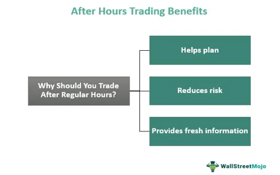

After-hours trading refers to the buying and selling of stocks outside the standard market hours, which typically run from 9:30 AM to 4:00 PM Eastern Time in the United States. In recent years, this practice has gained popularity among investors due to its potential to react promptly to market-moving news released outside traditional trading times. The growing accessibility of trading platforms and technological enhancements, particularly algorithmic trading, have facilitated this expansion.

Algorithmic trading, powered by sophisticated algorithms, plays a pivotal role in after-hours sessions by processing vast amounts of data swiftly. These algorithms allow traders to execute trades based on predefined criteria, leveraging artificial intelligence (AI) and machine learning for more nuanced decision-making. The ability to automate trading strategies extends trading capabilities beyond human limitations, creating opportunities for after-hours market engagement.



However, trading outside regular hours carries inherent risks. Market conditions after-hours differ significantly from those during standard sessions, primarily due to increased volatility and lower liquidity. These factors contribute to wider bid-ask spreads, making pricing more challenging. As investors venture into this domain, understanding these risks becomes crucial to making informed decisions.

This article provides a comprehensive analysis of after-hours trading, focusing on the risks and strategies associated with this trading period. It highlights the advantages of algorithmic interventions while also addressing the potential pitfalls. This introductory discussion sets the stage for exploring effective risk management strategies and assessing algorithmic trading's impacts during after-hours sessions. Investors must balance innovation with caution, ensuring they harness the full potential of after-hours trading while mitigating its associated risks.

## Table of Contents

## What is After-Hours Trading?

After-hours trading refers to the buying and selling of securities outside the traditional trading hours of major stock exchanges. The standard market hours for major U.S. exchanges, like the New York Stock Exchange (NYSE) and the Nasdaq, are 9:30 AM to 4:00 PM Eastern Time (ET). After-hours trading occurs after the market closes, typically from 4:00 PM to 8:00 PM ET, and occasionally before the market opens, in what is known as pre-market trading.

The participants in after-hours trading are typically institutional investors, individual investors with access to electronic communication networks (ECNs), and increasingly, algorithmic trading systems that operate based on pre-programmed instructions. Institutional investors such as mutual funds, pension funds, and hedge funds often engage in after-hours trading to adjust their positions based on after-market news, earnings releases, or geopolitical events that could impact stock prices. Individual investors, empowered by technological advancements, are also joining these sessions, fueled by the growth of online trading platforms offering enhanced access and lower transaction costs.

After-hours trading is growing in popularity due to several factors. Technological advancements have been pivotal, particularly the rise of ECNs which facilitate electronic trading outside traditional hours. ECNs allow buyers and sellers to connect directly, providing a platform for continuous trading beyond the typical confines of stock exchanges. This technology has democratized access, enabling more participants to engage in after-hours trading with relative ease.

Furthermore, after-hours trading is attractive to investors looking to react swiftly to information that becomes available after the standard market closes. This might include earnings reports, which are often released outside regular hours to allow market participants time to absorb the information. As a result, market makers can set new bid and ask prices based on this fresh data.

The increasing popularity of after-hours trading is closely tied to enhanced connectivity and access to real-time information, leading to a more dynamic trading environment. However, the risks associated with lower [liquidity](/wiki/liquidity-risk-premium), increased [volatility](/wiki/volatility-trading-strategies), and potential pricing discrepancies must be carefully managed by participants in these extended trading sessions.

## Understanding Algorithmic Trading

Algorithmic trading, also known as automated trading, is the process of using computer algorithms to execute trading strategies in financial markets. These algorithms are essentially a set of rules or instructions that are programmed to automatically conduct trades based on predetermined criteria, such as timing, price, and mathematical models. This approach allows for efficient execution of large orders, minimizing human intervention and the potential for emotional bias in trading decisions.

One of the primary functions of [algorithmic trading](/wiki/algorithmic-trading) is to facilitate trading outside regular market hours. By leveraging predefined algorithms, traders can capitalize on after-hours market events or announcements that might affect stock prices. Algorithms can scan multiple assets simultaneously, quickly react to news, and execute trades at optimal times, taking advantage of the extended trading windows beyond traditional market hours. This capability ensures that traders do not miss opportunities due to market closures and can respond promptly to global events impacting financial markets.

The incorporation of Artificial Intelligence (AI) and [machine learning](/wiki/machine-learning) enhances the development of trading algorithms, making them more intelligent and adaptive. AI technologies can analyze vast sets of historical and real-time data, identifying patterns and trends that might be imperceptible to human traders. Machine learning models can evolve and refine themselves based on new data inputs, improving their predictive accuracy over time. For instance, using supervised learning techniques, an algorithm can be trained to anticipate market movements based on historical price fluctuations, thereby optimizing trading strategies.

Python is a favored language for developing trading algorithms due to its extensive libraries and ease of use. Here's a basic example of how an algorithm might be structured in Python:

```python
import pandas as pd
import numpy as np

# Load historical price data
data = pd.read_csv('historical_data.csv')

# Simple moving average strategy
data['SMA_50'] = data['close'].rolling(window=50).mean()
data['SMA_200'] = data['close'].rolling(window=200).mean()

# Generate trading signals
data['Signal'] = 0
data['Signal'][50:] = np.where(data['SMA_50'][50:] > data['SMA_200'][50:], 1, 0)

# Example output: signal values
print(data[['close', 'SMA_50', 'SMA_200', 'Signal']])
```

The advantages of using algorithms in trading are manifold. Speed and accuracy are paramount; algorithms can execute trades in fractions of a second after a signal is generated. Additionally, they can process large volumes of data much faster than a human could, enabling the execution of complex strategies with high precision. Furthermore, the use of algorithms reduces transaction costs by minimizing the need for manual order handling and slippage.

In summary, algorithmic trading streamlines the trading process, unlocking opportunities in after-hours markets and enhancing decision-making with AI-driven insights. Innovations in computational technologies continue to enrich the efficacy and robustness of trading algorithms, helping traders achieve competitive edges in fast-paced financial markets.

## Risks Associated with After-Hours Trading

After-hours trading occurs outside of the standard trading hours of major exchanges, typically taking place between 4:00 p.m. and 8:00 p.m. EST. While this provides investors with greater flexibility and the opportunity to react to news events quickly, it is fraught with risks that must be carefully managed to optimize trading outcomes.

One significant risk associated with after-hours trading is increased volatility. During these hours, the stock market is generally less stable compared to regular trading sessions (9:30 a.m. to 4:00 p.m. EST). This heightened volatility is primarily due to a smaller number of market participants, which can lead to more pronounced price movements with even minor trading actions. Investors must therefore be prepared for sudden and unexpected shifts in stock prices.

Lower liquidity is another critical concern in after-hours trading. Liquidity refers to the ease with which assets can be bought or sold in the market without affecting their price. During after-hours sessions, trading volumes are typically lower, leading to reduced liquidity. This scarcity of buyers and sellers can cause delays in executing orders and make it more difficult to enter or [exit](/wiki/exit-strategy) positions at desired price levels.

Wide bid-ask spreads further complicate trading outside of normal hours. The bid-ask spread is the difference between the highest price a buyer is willing to pay for a security (bid) and the lowest price a seller is willing to accept (ask). In after-hours trading, the spreads tend to widen due to fewer participants and reduced competition, which can increase the cost of trading and impact the overall profitability of a trade.

Timing and quick decision-making are crucial in such a volatile environment. With prices prone to rapid changes, traders must have the tools and knowledge necessary to make informed decisions swiftly. Delays in execution or hesitations can lead to missed opportunities or significant financial losses.

Lastly, the potential for higher transaction costs is a recognized risk [factor](/wiki/factor-investing). Due to the lower liquidity and wider bid-ask spreads, transaction costs can escalate during after-hours trading. These increased costs may stem from higher brokerage fees for extended hours services or the need to pay more to match or surpass current offers to execute trades promptly.

In evaluating these risks, traders must weigh the potential benefits of after-hours trading against the inherent challenges. A strategic approach, equipped with risk mitigation measures and informed decision-making processes, is essential for navigating this intricate landscape effectively.

## Algorithmic Trading Risks in After-Hours Sessions

Algorithmic trading during after-hours sessions introduces a unique set of challenges distinct from the regular trading hours. One of the primary difficulties is operating in low-liquidity environments. After-hours trading often experiences significantly lower trading volumes, which can result in sporadic and large price swings. Algorithms, which rely on historical data and market patterns, might not be fully equipped to handle the unusual volatility and infrequent trades that characterize these sessions. This situation can lead to unpredictable trading outcomes and poses a substantial risk to traders relying on automated systems.

Technology failures present another critical risk during after-hours algorithmic trading. The infrastructure supporting trading algorithms, including servers and network connections, can be prone to malfunctions or outages, potentially leading to significant financial losses. Such failures might prevent the execution of trades at desired prices or even result in missed trade opportunities. Ensuring robust, reliable systems with fail-safes and redundancy measures is essential to mitigate these risks.

Mispricing is a notable concern in after-hours trading, often resulting from algorithm errors or rapid market changes. Algorithms might inaccurately interpret market signals or fail to adapt quickly enough to sudden shifts, leading to trades at suboptimal prices. This issue becomes pronounced during after-hours due to lower liquidity and heightened volatility. Traders must frequently evaluate and adjust their algorithms to ensure they reflect current market conditions accurately.

The threat of market manipulation and erroneous trades also looms larger in after-hours sessions. Reduced market participation can make it easier for manipulative activities, like spoofing or layering, to occur unnoticed. Algorithms can inadvertently contribute to this manipulation or fall victim to it, executing trades based on deceptive price movements. Vigilant monitoring and incorporating detection mechanisms in trading systems are crucial strategies to counteract these threats.

Finally, despite the reliance on automation, human oversight remains indispensable in after-hours algorithmic trading. Continuous monitoring by skilled professionals can identify and rectify issues that algorithms might miss. Combining automated systems with human intervention can ensure more comprehensive risk management and enable traders to promptly respond to unexpected market developments, balancing technology with intuitive judgment.

## Mitigating Risks in After-Hours Algorithmic Trading

Mitigating risks in after-hours algorithmic trading involves implementing various strategies to ensure robust and effective trading performance. A key aspect of risk management in this context is [backtesting](/wiki/backtesting) and stress testing algorithms. Backtesting involves simulating an algorithm's performance using historical data to evaluate how it would have fared under different market conditions. This process helps traders identify potential weaknesses or vulnerabilities before deployment. Stress testing, on the other hand, involves examining an algorithm's response to extreme market conditions, such as significant price fluctuations or low liquidity scenarios, ensuring resilience and adaptability during unforeseen events.

Another crucial strategy for risk mitigation is the establishment of fail-safes and stop-loss orders. Fail-safes are predefined mechanisms that safeguard against catastrophic losses by halting trading activity if certain risk thresholds are breached. Stop-loss orders are a more specific type of fail-safe, automatically selling a security when its price drops to a predetermined level, thus limiting potential losses. These tools are essential in protecting capital, especially during volatile after-hours trading sessions.

Leveraging advanced monitoring tools is also vital in tracking algorithm performance in real time. These tools provide insights into market dynamics, trading metrics, and algorithmic behavior, allowing traders to make informed decisions. Continuous monitoring helps detect anomalies or deviations from expected outcomes, facilitating timely interventions to correct [course](/wiki/best-algorithmic-trading-courses) or prevent significant losses. Modern monitoring solutions often integrate machine learning capabilities to predict potential market movements, further enhancing decision-making processes.

Balancing automation with human oversight is paramount for effective risk management in after-hours algorithmic trading. While algorithms can execute trades with speed and precision, human intervention is necessary for assessing broader market trends and making judgment calls during uncertain conditions. Traders must establish protocols for human review, particularly when algorithms encounter ambiguous data or unexpected market scenarios. By combining algorithmic efficiency with human intuition and expertise, traders can harness the benefits of both automation and strategic oversight, minimizing risk exposure and optimizing trading outcomes.

## Case Studies and Real-World Examples

After-hours trading, primarily facilitated by advanced algorithms, has seen both remarkable successes and notable failures over the years. Here, we explore some prominent case studies that highlight the complexities and unforeseen outcomes often encountered in this landscape.

### Analysis of Significant After-Hours Trades and Their Outcomes

One of the landmark events in after-hours trading was the 2012 Facebook Initial Public Offering (IPO). On May 18, 2012, Facebook (FB) went public, and after the regular trading session, its shares continued to be heavily traded. NASDAQ encountered technical glitches that led to significant delays in order confirmations. This incident resulted in substantial losses for traders due to erroneous trade executions in the after-hours environment [1]. The case exemplified how technological failures in trading platforms could magnify risks, particularly after market hours when trading volumes can be considerably volatile.

### Lessons Learned from Notable Algorithmic Trading Failures After Market Hours

Algorithmic trading has faced challenges related to rapid market changes and technological mishaps, particularly in off-hours scenarios. A significant example is the 2010 "Flash Crash" which, while largely occurring during normal hours, saw after-effects influencing after-hours trading. During this event, the Dow Jones Industrial Average plunged nearly 1,000 points within minutes before swiftly recovering. Post-crash analyses revealed that algorithms exacerbated the volatility, responding too rapidly to market signals and cascading into automated sell orders. After-hours, liquidity was impacted as traders hesitated to re-enter the market amidst fears of further instability. This case underscores the importance of algorithms that adapt not just to price changes but also to varying liquidity conditions throughout the trading day [2].

### Success Stories of Effectively Managed After-Hours Trades Using Algorithms

Despite the challenges, algorithmic trading can be successfully deployed after hours. A notable example is Renaissance Technologies, a [hedge fund](/wiki/hedge-fund-trading-strategies) known for its algorithm-driven trading strategies. They have effectively utilized algorithms to exploit small price discrepancies in after-hours markets, capitalizing on mispricings that often occur due to lower liquidity. Their success is attributed to robust risk management strategies, such as backtesting algorithms under various market conditions and integrating machine learning techniques to handle daily fluctuations and after-hours nuances efficiently.

Another success story involves the automated resource allocation in energy trading post-hours, where machine learning algorithms predict energy demand. These algorithms optimally schedule energy dispatches, ensuring efficient trading outcomes even when regular markets are closed. The ability to accurately predict demand and act on it in the after-hours market not only optimizes resource allocation but also mitigates operational risks inherent in after-hours trading.

These case studies illustrate the dual nature of after-hours algorithmic trading, highlighting both the potential for substantial gains and the risks of significant losses. They emphasize the necessity for evolving technological solutions and strategic risk management practices to navigate the complexities of after-hours trading successfully.

### References

1. "Facebook's IPO: What Happened - The New York Times". www.nytimes.com.
2. Kirilenko, A. A., Kyle, A. S., Samadi, M., & Tuzun, T. (2017). "The Flash Crash: The Impact of High-Frequency Trading on an Electronic Market." Journal of Finance, 72(1), 201-229.

## Conclusion

In summary, after-hours trading represents a significant evolution in the financial markets, offering both opportunities and challenges for investors. Throughout this article, we've explored the nature of after-hours trading, highlighting the extended market access it provides beyond standard trading hours. This accessibility is facilitated by advances in algorithmic trading, where algorithms play a crucial role in enabling transactions by processing large volumes of data and executing trades with speed and precision. The use of AI and machine learning has further enhanced the capabilities of these algorithms, providing sophisticated analytics and decision-making tools.

However, trading after-hours isn't without substantial risks. Key concerns include increased volatility, reduced liquidity, and wider bid-ask spreads, which can complicate the trading landscape and elevate transaction costs. In algorithmic trading, specifically, issues such as technology failures, algorithm errors, and market manipulation pose significant threats, underscoring the necessity for robust risk management strategies.

Looking ahead, the future of after-hours trading appears promising, with technology continuing to drive accessibility and efficiency. The evolution of trading algorithms promises to further refine the process, making it potentially more profitable yet requiring even more sophisticated risk mitigation strategies. As such, investors and traders must continually adapt, balancing the benefits of innovation with potential pitfalls. This requires a blend of cutting-edge technological solutions and vigilant human oversight to navigate the complexities and safeguard against losses.

The ongoing challenge will be to harness the power of algorithms while remaining attentive to the dynamic and often unpredictable nature of financial markets. Consequently, as after-hours trading becomes more prevalent, mastering the synergy between automation and human judgment will be essential for success in the ever-evolving stock market landscape.

## References

## References

1. **SEC.gov**. "Extended Hours Trading: Understanding the Risks." U.S. Securities and Exchange Commission, https://www.sec.gov/oiea/investor-alerts-bulletins/ib_extendedhours.html. This resource explains the fundamentals of after-hours trading, the risks associated with reduced liquidity, and the impact on market volatility.

2. **Investopedia**. "After-Hours Trading: What It Is and the Risks Involved." Investopedia, https://www.investopedia.com/articles/stocks/06/afterhourstrading.asp. Detailed coverage on what comprises after-hours trading, including the benefits and pitfalls associated with participating in these sessions.

3. **Algorithmic Trading: Winning Strategies and Their Rationale (Wiley Finance)**. Ernie Chan, 2nd edition. A book that provides insights into algorithmic trading strategies, with practical examples and performance analysis.

4. **Quantitative Finance and Algorithmic Trading Institute**. "Guide to Algorithmic Trading," https://www.qfati.com/guide-to-algorithmic-trading/. This guide elaborates on the development, deployment, and management of trading algorithms, especially in after-hours markets.

5. **Journal of Trading**. Numerous academic articles outline the effects of after-hours trading on price efficiency, including the role of trading technologies that leverage algorithms.

6. **MarketWatch**. "What you need to know about after-hours trading." MarketWatch, https://www.marketwatch.com/story/what-you-need-to-know-about-after-hours-trading-2015-05-25. An overview highlighting the practical aspects and recent trends in after-hours trading for retail investors.

7. **ResearchGate**. "The Use of AI in Financial Markets: Algorithmic Trading." A repository of academic publications discussing machine learning applications in refining algorithmic trading models and their implications for after-hours sessions.

8. **CME Group**. "Algorithmic Trading: The Basics." CME Group Educational Resources, https://www.cmegroup.com/. This resource details the fundamental principles of algorithmic trading, with a focus on futures and the impact on after-hours market activity.

9. **Bloomberg**. "After-Hours Trading Dynamics and the Modern Investor." Analysis on how market dynamics are reshaped by after-hours trading and the growing impact of algorithmic interventions.

10. **Python for Finance: Analyze Big Financial Data (O'Reilly)**. Yves Hilpisch. This book discusses the utilization of Python in algorithmic trading, including strategies and data analysis methods optimized for after-hours trading environments.

## References & Further Reading

[1]: ["Algorithmic Trading: Winning Strategies and Their Rationale"](https://www.wiley.com/en-us/Algorithmic+Trading%3A+Winning+Strategies+and+Their+Rationale-p-9781118460146) by Ernest P. Chan

[2]: Kirilenko, A. A., Kyle, A. S., Samadi, M., & Tuzun, T. (2017). ["The Flash Crash: The Impact of High-Frequency Trading on an Electronic Market."](https://onlinelibrary.wiley.com/doi/abs/10.1111/jofi.12498) Journal of Finance, 72(1), 201-229.

[3]: SEC.gov. ["Extended Hours Trading: Understanding the Risks."](https://www.sec.gov/about/reports-publications/investorpubsafterhourshtm) U.S. Securities and Exchange Commission

[4]: Investopedia. ["After-Hours Trading: What It Is and the Risks Involved."](https://www.investopedia.com/terms/a/afterhourstrading.asp)

[5]: ["Advances in Financial Machine Learning"](https://www.amazon.com/Advances-Financial-Machine-Learning-Marcos/dp/1119482089) by Marcos Lopez de Prado

[6]: MarketWatch. ["What you need to know about after-hours trading."](https://www.marketwatch.com/tools/screener/after-hours)

[7]: CME Group. ["Algorithmic Trading: The Basics."](https://www.cmegroup.com/education/files/Algo_and_HFT_Trading_0610.pdf)