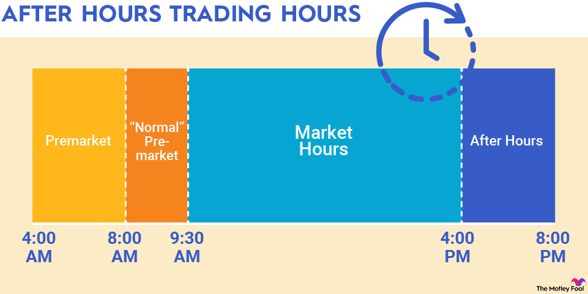

## Table of Contents

## What is after-hours trading?

After-hours trading is when people buy and sell stocks outside of the normal trading hours of the stock market. The normal trading hours are usually from 9:30 AM to 4:00 PM Eastern Time, Monday through Friday. After-hours trading happens before the market opens in the morning or after it closes in the evening.

This type of trading can be useful for people who can't trade during the day because of their jobs or other commitments. It also allows investors to react quickly to news or events that happen outside of regular trading hours. However, after-hours trading can be riskier because there are fewer people trading, which can make prices move more unpredictably.

## Why would someone want to trade after hours?

People might want to trade after hours because they can't trade during the day. Maybe they have a job or other things to do when the stock market is open. Trading after hours lets them buy and sell stocks at a time that works better for them. It's like being able to shop at a store when it's usually closed.

Another reason is that important news or events can happen when the market is closed. If someone hears about a big company announcement or a world event that could affect stock prices, they might want to trade right away. After-hours trading lets them do that without waiting for the next day. But, they need to be careful because trading after hours can be riskier.

## What are the typical hours for after-hours trading?

After-hours trading happens before the stock market opens and after it closes. The normal trading hours for the stock market are from 9:30 AM to 4:00 PM Eastern Time, Monday through Friday. So, after-hours trading can start as early as 4:00 AM Eastern Time and go until the market opens at 9:30 AM. After the market closes, after-hours trading can continue from 4:00 PM to 8:00 PM Eastern Time.

These times can change a bit depending on the stock exchange or the broker you use. Some brokers might let you trade even earlier or later than these times. But most after-hours trading happens in these windows before the market opens and after it closes.

## Which stocks can be traded during after-hours sessions?

Not all stocks can be traded during after-hours sessions. Usually, you can trade stocks of big companies that are listed on major stock exchanges like the New York Stock Exchange (NYSE) or the Nasdaq. These are the stocks that are most popular and have a lot of people interested in them. Some examples are companies like Apple, Microsoft, and Amazon.

However, smaller companies or stocks that are not as popular might not be available for after-hours trading. This is because there might not be enough people wanting to buy or sell these stocks outside of regular trading hours. It's a good idea to check with your broker or the stock exchange to see which stocks you can trade after hours.

## How does the volume of after-hours trading compare to regular trading hours?

The [volume](/wiki/volume-trading-strategy) of after-hours trading is usually a lot smaller than during regular trading hours. During the day, when the stock market is open, there are many more people buying and selling stocks. This means there are more trades happening, which we call higher volume. After hours, fewer people are trading, so the volume goes down. It's like a busy street during the day that becomes quiet at night.

Even though the volume is lower, after-hours trading can still be important. Big news or events can happen when the market is closed, and some people want to trade right away because of this news. So, even if fewer people are trading, the trades that do happen can still affect stock prices. But because there are fewer trades, prices can move more unpredictably during after-hours trading.

## What are the risks associated with after-hours trading?

After-hours trading can be riskier than trading during the day. One big reason is that fewer people are trading after hours, so there's less volume. When there are fewer trades, the prices can move a lot more and in ways that are harder to predict. This means if you buy or sell a stock after hours, you might end up paying more or getting less money than you expected.

Another risk is that the prices you see after hours might not be the same as the prices when the market opens the next day. This is called a price gap. If you buy a stock after hours because you think it's a good deal, it might open at a different price the next day, and you could lose money. It's important to be careful and think about these risks before you decide to trade after the market closes.

## How can one participate in after-hours trading?

To participate in after-hours trading, you need to have a brokerage account that offers this service. Many big brokers like Robinhood, E*TRADE, and TD Ameritrade let you trade after hours. You can set up an account with them online and then use their trading platform to buy or sell stocks before the market opens or after it closes. Just make sure to check what times they let you trade after hours because it can be different for each broker.

Once you have your account set up, you can place orders during the after-hours trading window. You can do this on your computer or through a mobile app. When you want to trade, you'll see the current after-hours prices. Remember, these prices can be different from what you see during the day, so be careful. Also, make sure you understand the risks of trading when fewer people are buying and selling, which can make prices move a lot more.

## What platforms support after-hours trading?

Many big brokers let you trade stocks after the market closes. Some popular ones are Robinhood, E*TRADE, and TD Ameritrade. You can set up an account with them online and use their trading platform to buy or sell stocks before the market opens or after it closes. Each broker might have different times for after-hours trading, so it's good to check what times they offer.

To start trading after hours, you need to have an account with one of these brokers. Once you're set up, you can use their website or mobile app to place orders during the after-hours window. You'll see the current after-hours prices, which can be different from the prices during the day. It's important to be careful because trading after hours can be riskier due to fewer people trading, which can make prices move a lot more.

## How do after-hours trading prices affect the next day's opening price?

After-hours trading prices can give us a hint about what might happen when the market opens the next day. If a lot of people are buying a stock after hours, it might mean the price will be higher when the market opens. On the other hand, if a lot of people are selling, the price might be lower. But, it's not a perfect guess because other things can happen overnight that change what people think about the stock.

The prices from after-hours trading don't set the next day's opening price, but they can affect it. When the market opens, all the orders from after hours and the new orders from the day mix together. This mix decides the opening price. Sometimes, the opening price can be very different from the after-hours price because of new news or because more people are trading during the day. So, while after-hours prices can give us a clue, they don't tell us exactly what will happen.

## What regulatory considerations should be noted for after-hours trading?

When you trade stocks after the market closes, there are some rules you need to know about. The main stock exchanges, like the New York Stock Exchange and Nasdaq, have their own rules for after-hours trading. These rules are there to make sure trading is fair and to protect people who are trading. For example, they might set limits on how much the price can change after hours, or they might require brokers to show the best available prices to everyone.

Also, the Securities and Exchange Commission (SEC) watches over after-hours trading to make sure everything is done right. They have rules that brokers need to follow, like making sure they tell you about the risks of trading after hours. The SEC wants to make sure that everyone has the same chance to trade and that no one is cheating. So, if you're thinking about trading after hours, it's good to know these rules and how they might affect your trades.

## How do market makers function during after-hours trading?

Market makers are important during after-hours trading. They help make sure that people can buy and sell stocks even when the market is closed. A market maker is like a middle person who always has a price to buy and a price to sell a stock. This helps keep the market going even when fewer people are trading. During after-hours trading, market makers might not be as active as during the day, but they still work to make sure there are prices for stocks.

Because fewer people trade after hours, market makers have a bigger effect on the prices. If a market maker decides to change their prices a lot, it can make the stock price move more than it would during the day. This is one reason why after-hours trading can be riskier. But market makers are still important because they help keep the market working, even when it's not the usual trading time.

## What advanced strategies can be employed during after-hours trading?

One advanced strategy for after-hours trading is to react quickly to news or events that happen outside of regular market hours. If a company announces good news after the market closes, you might want to buy their stock right away, hoping the price will go up the next day. On the other hand, if there's bad news, you might want to sell quickly to avoid losing money. This strategy needs you to keep an eye on the news and be ready to make fast decisions. But remember, after-hours prices can be different from the next day's opening price, so there's a risk that things won't go as you expect.

Another strategy is to use limit orders instead of market orders. A limit order lets you set a specific price at which you want to buy or sell a stock. This can help you control how much you pay or get for a stock during after-hours trading when prices can move a lot. For example, if you want to buy a stock but don't want to pay more than a certain price, you can set a limit order at that price. This way, you won't end up paying more if the price jumps up after hours. Using limit orders can help you manage the risks of trading when there are fewer people buying and selling.

## References & Further Reading

[1]: Bergstra, J., Bardenet, R., Bengio, Y., & Kégl, B. (2011). ["Algorithms for Hyper-Parameter Optimization."](https://papers.nips.cc/paper/4443-algorithms-for-hyper-parameter-optimization) Advances in Neural Information Processing Systems 24.

[2]: ["Advances in Financial Machine Learning"](https://www.amazon.com/Advances-Financial-Machine-Learning-Marcos/dp/1119482089) by Marcos Lopez de Prado

[3]: ["Evidence-Based Technical Analysis: Applying the Scientific Method and Statistical Inference to Trading Signals"](https://www.amazon.com/Evidence-Based-Technical-Analysis-Scientific-Statistical/dp/0470008741) by David Aronson

[4]: ["Machine Learning for Algorithmic Trading"](https://github.com/PacktPublishing/Machine-Learning-for-Algorithmic-Trading-Second-Edition) by Stefan Jansen

[5]: ["Quantitative Trading: How to Build Your Own Algorithmic Trading Business"](https://www.amazon.com/Quantitative-Trading-Build-Algorithmic-Business/dp/1119800064) by Ernest P. Chan