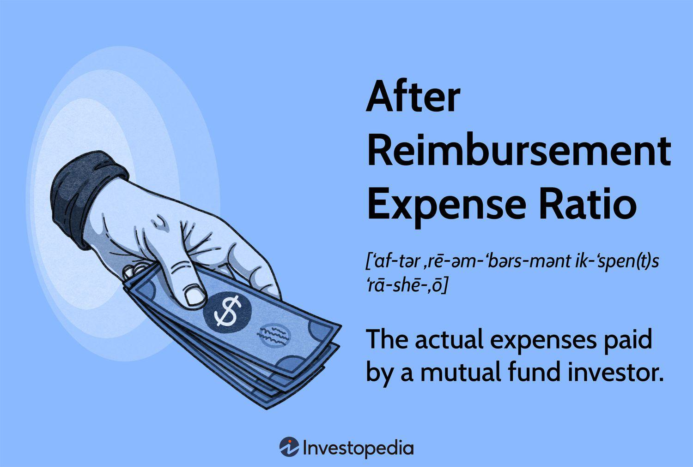

## Table of Contents

## What is an After Reimbursement Expense Ratio?

An After Reimbursement Expense Ratio is a way to show how much it costs to manage a mutual fund or an ETF after any fee reductions or waivers. Sometimes, the people who manage these funds decide to lower their fees to make the fund more attractive to investors. When they do this, the expense ratio that investors see is lower than the original one. This lower number is called the After Reimbursement Expense Ratio.

This ratio is important because it gives a clearer picture of what investors are actually paying. Without it, the costs might look higher than they really are. By looking at the After Reimbursement Expense Ratio, investors can make better decisions about which funds to invest in, based on the real costs they will face. It helps them understand the true impact of fees on their investment returns.

## How is the After Reimbursement Expense Ratio calculated?

The After Reimbursement Expense Ratio is calculated by taking the original expense ratio of a fund and then subtracting any fee waivers or reimbursements that the fund's management has decided to offer. The original expense ratio includes all the costs of running the fund, like management fees, administrative fees, and other operational costs. When the management decides to lower these costs for investors, they do so by waiving part of their fees or reimbursing some expenses, which reduces the total cost to the investor.

For example, if a fund has an original expense ratio of 1%, but the management decides to waive 0.25% of their fees, the After Reimbursement Expense Ratio would be 0.75%. This calculation is important because it shows investors the actual cost they will pay after any reductions. It helps investors compare different funds more accurately, as they can see the real impact of fees on their investment returns.

## Why is the After Reimbursement Expense Ratio important for investors?

The After Reimbursement Expense Ratio is important for investors because it shows them the real cost of investing in a fund after any fee reductions. When fund managers decide to lower their fees, they make the fund cheaper for investors. This lower number helps investors see exactly how much they will have to pay, which is useful when comparing different funds. Without this ratio, the costs might look higher than they actually are, and investors might miss out on good investment opportunities.

Understanding the After Reimbursement Expense Ratio also helps investors make better decisions about where to put their money. Since fees can affect how much money investors make from their investments, knowing the true cost is crucial. By looking at this ratio, investors can choose funds that offer the best value for their money, helping them keep more of their investment returns. This makes the After Reimbursement Expense Ratio a key piece of information for anyone looking to invest wisely.

## What is the difference between Before and After Reimbursement Expense Ratios?

The Before Reimbursement Expense Ratio is the total cost of managing a fund before any fee reductions. It includes all the fees like management fees, administrative costs, and other expenses that the fund charges. This number shows the highest possible cost that investors might have to pay if there were no fee waivers or reimbursements.

The After Reimbursement Expense Ratio is the cost of managing a fund after any fee reductions or waivers. Sometimes, fund managers decide to lower their fees to make the fund more attractive to investors. This lower number gives investors a clearer idea of what they will actually pay, which is helpful when comparing different funds. Knowing this ratio helps investors understand the real impact of fees on their investment returns.

## Can you provide an example of how After Reimbursement Expense Ratio affects investment returns?

Imagine you have $10,000 to invest in a mutual fund. The fund has a Before Reimbursement Expense Ratio of 1.5%, which means it would cost you $150 a year to keep your money in this fund. But the fund's managers decide to lower their fees by 0.5%, so the After Reimbursement Expense Ratio becomes 1%. This means you now only pay $100 a year instead of $150. That's a savings of $50 every year, which might not sound like a lot, but over time, it can make a big difference.

Let's say you keep your money in the fund for 10 years. With the Before Reimbursement Expense Ratio of 1.5%, you would pay a total of $1,500 in fees over those 10 years. But with the After Reimbursement Expense Ratio of 1%, you would only pay $1,000. That's a savings of $500! Plus, the money you save on fees can stay in your investment, earning more money over time. So, knowing the After Reimbursement Expense Ratio helps you see how much more you could keep from your investment returns.

## How do mutual funds and ETFs typically report their After Reimbursement Expense Ratios?

Mutual funds and ETFs usually share their After Reimbursement Expense Ratios in their official documents. These documents are called prospectuses, and they give all the important details about the fund, including the costs. You can find the After Reimbursement Expense Ratio in a section that talks about fees and expenses. This number shows what investors will actually pay after any fee reductions, making it easier to compare different funds.

Sometimes, mutual funds and ETFs also show their After Reimbursement Expense Ratios on their websites or in their marketing materials. This helps investors quickly see the real costs without having to dig through a lot of paperwork. By clearly showing this ratio, funds can attract more investors who are looking for the best value for their money.

## What are the common factors that lead to changes in the After Reimbursement Expense Ratio?

Changes in the After Reimbursement Expense Ratio can happen for a few reasons. One big reason is when the people who manage the fund decide to change how much they charge. They might lower their fees to make the fund more attractive to investors, which would make the After Reimbursement Expense Ratio go down. Or, if the costs of running the fund go up, like if they need to pay more for things like office space or computers, they might not be able to keep the fees as low, and the ratio could go up.

Another reason for changes in the After Reimbursement Expense Ratio is how much money is in the fund. If a lot of people invest in the fund, the costs of running it can be spread out over more money, which might let the managers lower their fees. But if a lot of people take their money out, the costs have to be spread over less money, and the managers might need to raise their fees. This can make the After Reimbursement Expense Ratio go up or down depending on how much money is in the fund.

## How can investors use the After Reimbursement Expense Ratio to compare different funds?

Investors can use the After Reimbursement Expense Ratio to compare different funds by looking at the real cost they will pay after any fee reductions. When a fund's managers decide to lower their fees, the After Reimbursement Expense Ratio shows the new, lower cost. This helps investors see which funds are cheaper to invest in. For example, if one fund has an After Reimbursement Expense Ratio of 0.5% and another has 1%, the first fund is less expensive, and investors might choose it to save money on fees.

By comparing the After Reimbursement Expense Ratios of different funds, investors can make better choices about where to put their money. Since fees can eat into the money they make from their investments, knowing the true cost is important. If two funds have similar returns but different expense ratios, picking the one with the lower After Reimbursement Expense Ratio can help investors keep more of their earnings. This way, they can see the real impact of fees and pick funds that offer the best value.

## What are the regulatory requirements for disclosing the After Reimbursement Expense Ratio?

In the United States, the Securities and Exchange Commission (SEC) has rules about how mutual funds and ETFs must share information with investors. One of these rules says that funds need to show their After Reimbursement Expense Ratio in their prospectus. This is a big document that tells investors everything they need to know about the fund, including the costs. By putting the After Reimbursement Expense Ratio in the prospectus, the SEC makes sure that investors can see the real cost of the fund after any fee reductions, which helps them make better choices.

The SEC also says that funds have to update their After Reimbursement Expense Ratio every year. This means that if the fund's managers decide to change the fees, or if the costs of running the fund go up or down, the new numbers have to be shared with investors. By keeping this information up to date, the SEC helps make sure that investors always know what they will really be paying, so they can keep comparing different funds and make smart investment decisions.

## How does the After Reimbursement Expense Ratio impact long-term investment performance?

The After Reimbursement Expense Ratio can really affect how much money you make from your investments over a long time. When you invest in a fund, you have to pay fees for the fund to be managed. If the After Reimbursement Expense Ratio is low, you pay less in fees, which means more of your money stays in the fund and can grow. Over many years, even a small difference in fees can add up to a big difference in how much money you end up with. So, choosing a fund with a lower After Reimbursement Expense Ratio can help you keep more of your investment returns.

For example, if you invest $10,000 in a fund with an After Reimbursement Expense Ratio of 1% for 20 years, you'll pay less in fees than if you invest in a fund with a 1.5% ratio. The money you save on fees can stay in your investment, earning more money over time. This is why it's important to look at the After Reimbursement Expense Ratio when picking a fund. It helps you see the real cost of investing and can make a big difference in your long-term savings.

## What strategies can fund managers employ to manage the After Reimbursement Expense Ratio effectively?

Fund managers can manage the After Reimbursement Expense Ratio effectively by carefully watching the costs of running the fund. They might decide to lower their fees to make the fund more attractive to investors. This could mean cutting down on things like management fees or other expenses. By doing this, they can keep the After Reimbursement Expense Ratio low, which helps investors save money on fees. Another way is to spread out the costs over a bigger pool of money. If more people invest in the fund, the costs can be divided among more investors, which might let the managers lower the fees even more.

Another strategy is to use technology to make things cheaper. For example, using computers and software to handle tasks that used to need a lot of people can save money. Fund managers can also look for ways to work with other companies to share costs. By keeping an eye on all these things, fund managers can keep the After Reimbursement Expense Ratio as low as possible. This helps the fund stay competitive and attractive to investors who want to keep more of their investment returns.

## How do global variations in financial regulations affect the calculation and reporting of the After Reimbursement Expense Ratio?

Financial regulations can be different in different countries, and this can change how the After Reimbursement Expense Ratio is calculated and reported. In the United States, the SEC says that funds need to show this ratio in their prospectus and update it every year. But in other places, the rules might be different. Some countries might not even require funds to show this number, or they might have different ways of figuring it out. This can make it hard for investors who want to compare funds from different countries because the information might not be the same.

Even though the basic idea of the After Reimbursement Expense Ratio is the same everywhere - showing the real cost to investors after any fee reductions - how it's handled can vary a lot. In Europe, for example, the regulations might be stricter or more detailed than in other places. This means funds there might have to show more information or follow different rules about how they report their fees. Investors need to know about these differences so they can understand what they're really paying and make good choices about where to put their money.

## What is the understanding of expense ratios?

Expense ratios are a critical metric for investors assessing the cost efficiency of mutual funds and exchange-traded funds (ETFs). An expense ratio represents the annual fee that all funds or ETFs charge their shareholders. This fee is expressed as a percentage of the fund's average assets under management (AUM). A lower expense ratio means more of the earnings generated by the fund are retained by the investor rather than being consumed by fees.

The components of expense ratios typically include both management and administrative fees. Management fees cover the compensation for the fund's investment advisors or portfolio managers, who are responsible for making investment decisions and maintaining the portfolio in alignment with its investment objectives. Administrative fees, on the other hand, encompass costs associated with the day-to-day operations of the fund. These might cover expenses like record-keeping, shareholder communication, and other operational necessities.

To understand the impact of expense ratios on investor returns, consider a mutual fund with an annual return of 8% before fees. If this fund has an expense ratio of 1.5%, the net return to investors would be 6.5%. Over the long term, this seemingly small difference can have a significant impact on investment returns due to compounding. For instance, on an initial investment of $10,000, a 6.5% return compounded annually over 20 years will grow to approximately $35,265, whereas an 8% return for the same duration would grow to approximately $46,610. This demonstrates how a seemingly modest difference in expense ratios can lead to substantial differences in final investment outcomes. 

Mathematically, the impact of the expense ratio can be modeled with the formula:

$$
FV = PV \times (1 + r - e)^n
$$

where $FV$ is the future value of the investment, $PV$ is the present value or initial investment, $r$ is the gross annual rate of return, $e$ is the expense ratio, and $n$ is the number of years the investment is held.

While average expense ratios have generally decreased as the investment industry has grown and competition increased, they remain a vital consideration for investors. High expense ratios can significantly erode returns over time, reinforcing the importance for investors to seek funds with lower expense ratios, especially when evaluating funds with similar performance metrics but varying cost structures. This assessment becomes a crucial [factor](/wiki/factor-investing) in minimizing costs and maximizing the potential for better investment outcomes.

## What is Financial Reimbursement in Investment Funds?

Financial reimbursement in investment funds is a mechanism by which fund managers adjust the stated expense ratios of mutual funds through reimbursements or fee waivers. This adjustment is known as the after reimbursement expense ratio and plays a crucial role in determining the actual cost borne by investors. The after reimbursement expense ratio is the expense ratio after deducting any fees waived or reimbursed by the fund management. It is calculated as:

$$
\text{After Reimbursement Expense Ratio} = \text{Stated Expense Ratio} - \text{Reimbursements/ Fee Waivers}
$$

Fund reimbursements and fee waivers can significantly affect mutual fund investors by reducing the costs associated with their investments. These reductions enable investors to potentially enjoy greater returns, as more of their money is being allocated towards investment growth rather than fees. This can be particularly beneficial in cases where the original expense ratio is relatively high compared to the industry average.

Several mutual fund companies employ reimbursements to maintain competitiveness in the market. For instance, when a new fund is introduced, its stated expense ratio might be higher than average due to startup costs. To offset this and attract investors, the fund manager might offer a temporary fee waiver or reimbursement, thereby effectively reducing the expense ratio until the fund achieves a certain scale.

An example of this practice can be seen in the Vanguard Group, which offers some funds with fee waivers, explicitly stating in their prospectus that certain expenses will be limited for a specified period. This allows the funds to appear more attractive compared to peers, potentially drawing more investors.

Similarly, Fidelity has been known to employ expense reimbursement strategies to remain competitive, especially in funds attempting to gain traction in crowded sectors. By doing so, they aim to reach the critical mass required to sustainably lower fees over the long term without needing further reimbursements.

In conclusion, financial reimbursement in investment funds is a strategic tool used by fund managers to manage the costs associated with mutual funds. By understanding the concept of after reimbursement expense ratios, investors can make more informed decisions, potentially enhancing their investment outcomes through lower fees and improved returns.

## References & Further Reading

[1]: Cuthbertson, K., Nitzsche, D., & O'Sullivan, N. (2016). ["Mutual Fund Performance: Measurement and Evidence"](https://onlinelibrary.wiley.com/doi/10.1111/j.1468-0416.2010.00156.x). Springer.

[2]: Easley, D., & O'Hara, M. (2010). ["Market Microstructure, HFT, and Flash Crashes"](https://papers.ssrn.com/sol3/papers.cfm?abstract_id=1695041). The Quarterly Journal of Finance, 1(01).

[3]: Hasbrouck, J. (2007). ["Empirical Market Microstructure: The Institutions, Economics, and Econometrics of Securities Trading"](https://archive.org/details/empiricalmarketm0000hasb). Oxford University Press.

[4]: Investment Company Institute. (2022). ["ICI Fact Book: A Review of Trends and Activities in the Investment Company Industry"](https://www.ici.org/fact-book). Investment Company Institute.

[5]: Narang, R. K. (2013). ["Inside the Black Box: The Simple Truth About Quantitative Trading"](https://www.amazon.com/Inside-Black-Box-Quantitative-Trading/dp/0470432063). Wiley.

[6]: Sharpe, W. F. (1994). ["The Sharpe Ratio"](https://web.stanford.edu/~wfsharpe/art/sr/SR.htm). Journal of Portfolio Management, 21(1).