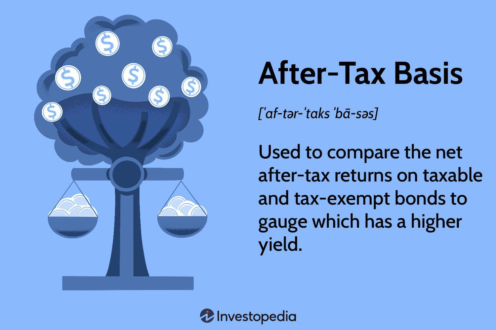

The interplay between tax calculation, investment accounting on an after-tax basis, and algorithmic trading is a complex but crucial element in the decision-making processes of investors and traders. These interconnected components fundamentally shape the outcomes of financial decisions by influencing net returns, portfolio strategies, and risk assessments. Effective management of taxes is critical, as they can substantially erode investment gains. By understanding tax implications, investors can strategically plan to maximize returns through robust tax strategies and sophisticated investment accounting techniques.

Algorithmic trading, a strategy that utilizes computer algorithms to drive trading decisions, inherently incorporates tax considerations to optimize financial outcomes. This form of trading adapts to tax regulations and markets' inherent fluctuations, thereby requiring seamless integration with efficient tax calculation methods and after-tax accounting strategies. Notably, algorithmic systems can be programmed to account for various tax scenarios, ensuring compliance and strategic optimality at speed.



Staying informed on tax policies is vital as they are subject to change and can impact investment strategies in unforeseen ways. Modern financial technology ("fintech") has enabled automated solutions that aid in the accurate and timely application of tax-efficient strategies. Advanced software tools provide the ability to process complex datasets and execute algorithmic trades while simultaneously considering applicable tax regulations, resulting in potential gains for both individual and institutional investors.

In conclusion, understanding the synergies among tax strategies, investment accounting, and algorithmic trading is essential for optimizing financial decisions. Leveraging technology and remaining attuned to evolving tax environments are critical steps in adapting to the modern financial landscape, ensuring that investors and traders can sustain competitive advantages and achieve optimal financial results.

## Table of Contents

## Understanding Tax Calculation in Investments

Tax calculations are a fundamental aspect of investment decisions, affecting both individual and corporate investors. Understanding the tax implications of various investment types is crucial for optimizing net returns and developing effective financial strategies.

### Taxable vs. Tax-Exempt Investments

Investments are generally categorized as either taxable or tax-exempt. **Taxable investments** include stocks, bonds, mutual funds, and real estate, where investors are liable to pay taxes on investment income such as dividends and interest, as well as on capital gains from the sale of investments. **Tax-exempt investments**, on the other hand, include specific municipal bonds and Roth IRA accounts, where income generated is free from federal taxes and sometimes state taxes. The choice between taxable and tax-exempt investments often hinges on the investor’s tax bracket and long-term financial goals.

### Calculating Taxes on Investment Income

Investment income is primarily composed of interest, dividends, and capital gains. The tax treatment of these components can differ:

- **Interest income** from bonds and savings accounts is usually taxed at ordinary income tax rates.
- **Qualified dividends** are taxed at capital gains tax rates, which are typically lower than ordinary income tax rates, depending on the investor’s taxable income.
- **Capital gains** are categorized as short-term (held for less than a year) or long-term (held for more than a year), with distinct tax rates. Long-term capital gains benefit from reduced tax rates compared to short-term gains, which are taxed as ordinary income.

The calculation of taxes on these income types can be represented in Python for automation and accuracy:
```python
def calculate_tax(income, tax_rate):
    return income * tax_rate

dividend_income = 5000
dividend_tax_rate = 0.15  # Assuming 15% qualified dividend tax rate
tax_on_dividends = calculate_tax(dividend_income, dividend_tax_rate)

capital_gain = 20000
capital_gain_tax_rate = 0.20  # Assuming 20% long-term capital gain tax rate
tax_on_capital_gain = calculate_tax(capital_gain, capital_gain_tax_rate)

total_tax = tax_on_dividends + tax_on_capital_gain
```

### Effective Tax Rate Calculations

The effective tax rate provides a clearer picture of an investor’s tax burden by relating the total tax paid to taxable income. For individuals, it is calculated as:

$$
\text{Effective Tax Rate} = \frac{\text{Total Tax Paid}}{\text{Total Taxable Income}}
$$

For corporations, this calculation takes into account various deductions and credits that businesses can claim, often leading to a significantly lower effective rate compared to the statutory corporate tax rate.

### Influence of Tax Policies on Investment Returns and Strategies

Tax policies deeply impact net investment returns, dictating the after-tax yield of investment portfolios. Adjustments in tax laws, such as changes in capital gains tax rates or restructuring of retirement account contributions, necessitate strategic shifts in portfolio management. Investors and corporations must stay informed of policy changes to adjust investment strategies accordingly, maximizing tax efficiency.

Strategically, investors can employ tax-loss harvesting, which involves selling underperforming assets to offset gains and thus reduce taxable income. Additionally, investment vehicles like tax-deferred retirement accounts can be utilized to postpone tax liabilities, allowing capital to grow unhindered in the interim.

In conclusion, discerning the nuances in tax calculations is paramount for investors seeking to optimize their investment decisions and net returns. By aligning investment strategies with current tax laws, both individual and corporate investors can achieve enhanced financial outcomes.

## Investment Accounting on an After-Tax Basis

The concept of the after-tax basis is pivotal in evaluating investment decisions, as it offers a more accurate representation of an investment's true value and performance. It accounts for the taxes that investors need to pay, either at the time of the investment or upon realization of gains. Essentially, it is the value of an investment after all the applicable taxes have been deducted. This approach allows investors to measure the actual return on investments by focusing on the income that ultimately contributes to net worth.

When comparing taxable and tax-exempt investments, after-tax basis calculations are crucial. Taxable investments, such as stocks and bonds, incur taxes on dividends and capital gains. Conversely, tax-exempt investments, like municipal bonds, often provide interest that is not subject to federal taxes. The after-tax return can be calculated by adjusting the nominal return by the tax rate applicable to the investor's income bracket. For example, if an investor has a nominal return of 5% and a tax rate of 30%, the after-tax return would be 3.5%. This provides a more apples-to-apples comparison between investment alternatives, thereby guiding more informed decision-making.

Maximizing portfolio returns through after-tax evaluations requires strategic planning. Investors often utilize asset location strategies, placing tax-inefficient investments in tax-advantaged accounts (like IRAs or 401(k)s), while keeping tax-efficient ones in taxable accounts. Additionally, techniques such as tax-loss harvesting can be employed to offset gains with losses, further enhancing after-tax performance. An example of tax-loss harvesting in Python could be:

```python
def tax_loss_harvest(portfolio, tax_rate):
    gains = sum([asset.gain for asset in portfolio if asset.gain > 0])
    losses = sum([asset.loss for asset in portfolio if asset.loss < 0])

    net_tax_liability = gains * tax_rate
    harvest_amount = min(gains, -losses)

    after_tax_gain = gains - harvest_amount * tax_rate

    return after_tax_gain

portfolio = [{'gain': 1000, 'loss': -500}, {'gain': 500, 'loss': -1000}]
print(tax_loss_harvest(portfolio, 0.3))  # Example with a 30% tax rate
```

Risk assessments and yield comparisons are also informed by after-tax considerations. Evaluating an investment's after-tax yield provides a clearer understanding of its risk-return profile. For instance, two investments with the same pre-tax yield might differ significantly in their after-tax returns, altering their risk-adjusted attractiveness. This evaluation can influence portfolio allocation decisions to align returns with an individual's risk tolerance and tax situation.

Calculating after-tax investment outcomes is a complex process, often necessitating professional assistance. This complexity is due to varying tax treatments, changes in tax laws, and individual-specific factors like different income sources and deductions. Financial advisors and tax professionals can provide critical insights, ensuring investors meet compliance requirements while optimizing tax strategies. These experts can model scenarios, taking into account potential changes in tax policy, to project future after-tax returns more accurately.

The integration of professional advice with technological tools like automated tax software enables better management of the after-tax basis. By continuously adapting to tax code changes and leveraging advanced analytics, investors can enhance return outcomes while maintaining compliance.

## Algorithmic Trading and Tax Efficiency

Algorithmic trading, often referred to as algo-trading, involves the use of computer algorithms to execute trading decisions at high speeds and volumes. These algorithms rely heavily on efficient tax strategies to maximize returns for traders by reducing tax liabilities and increasing the net profit from trading activities.

Transaction taxes, such as the Financial Transaction Tax (FTT), can significantly impact high-frequency trading operations due to their rapid execution of numerous trades. These taxes, often levied on the purchase or sale of securities, increase the cost of trading and require algorithmic traders to adjust their strategies to maintain profitability. High-frequency traders are thus incentivized to develop and implement strategies that minimize the effects of transaction taxes, such as reducing the number of trades or finding jurisdictions with favorable tax rates.

Incorporating tax considerations into trading algorithms enhances tax efficiency. Algorithms can be programmed to optimize trade executions based on tax implications by evaluating the tax cost of potential trades. For example, an algorithm might prioritize selling securities that have been held long enough to qualify for long-term capital gains tax rates, which are typically lower than short-term rates. Algorithms can also employ tax-loss harvesting strategies, automatically identifying and selling underperforming assets to realize losses that offset taxable gains.

Automated trading systems must also adapt to changing tax laws and regulations. These systems require ongoing updates to reflect new tax policies to avoid regulatory penalties and capitalize on opportunities for improved tax efficiency. Machine learning models can predict regulatory changes and adjust trading strategies proactively. For instance, a sentiment analysis model might analyze government announcements and public reactions to forecast upcoming tax legislation, allowing traders to adjust their strategies accordingly.

Examples of trading strategies optimized for tax efficiency include the use of exchange-traded funds (ETFs) that offer tax advantages, such as the ability to defer capital gains taxes. Additionally, algorithms can leverage tax-advantageous securities, like municipal bonds, which are often exempt from federal and, in some cases, state taxes. Another example is utilizing tax-advantaged accounts, such as Individual Retirement Accounts (IRAs), to defer or eliminate taxes on trading gains. 

Python, often used in [algorithmic trading](/wiki/algorithmic-trading) for its robust libraries and ease of use, can implement these strategies. For instance, traders can use Python to code a tax-loss harvesting algorithm as follows:

```python
def tax_loss_harvest(portfolio, threshold):
    for asset in portfolio:
        if asset.loss >= threshold:
            portfolio.sell(asset)
            portfolio.replace_with_similar(asset)

# Example usage
portfolio = Portfolio([...])  # Placeholder for a portfolio of assets
tax_loss_harvest(portfolio, threshold=0.1)  # Set a threshold of 10% loss
```

This code illustrates a simple algorithm that identifies assets with losses above a certain threshold and replaces them with similar but distinct assets, enabling the realization of taxable losses while maintaining portfolio balance.

In conclusion, algorithmic trading relies on efficient tax strategies to enhance profitability. By integrating tax considerations, adapting to regulatory changes, and deploying tax-optimized trading strategies, algorithmic traders can effectively manage tax liabilities and improve their net returns.

## Strategic Tax Optimization for Traders

Tax strategies for minimizing liabilities are critical for traders seeking to optimize their financial outcomes. One such strategy is tax-loss harvesting, which involves selling securities at a loss to offset capital gains and reduce taxable income. This technique not only decreases tax liabilities but also enables reinvestment of the proceeds into potentially higher-yield investments. To effectively implement tax-loss harvesting, traders must be aware of specific regulations such as wash sale rules, which prevent repurchasing identical securities within 30 days to ensure the loss remains deductible.

Investing in tax-deferred accounts, including traditional IRAs and 401(k)s, offers significant advantages for long-term gains. These accounts allow individuals to delay tax payments on contributions and investment earnings until withdrawal, typically at retirement. The compounding growth of investments within these accounts, undiminished by annual taxes, can lead to substantial long-term wealth accumulation.

International tax planning is crucial for traders with global trading activities, as it aids in managing liabilities across multiple jurisdictions. Complexities arise from different tax regimes, and without careful planning, traders may face double taxation. Leveraging tax treaties and credits is an effective way to mitigate these effects. Tax treaties between countries often reduce withholding taxes and provide mechanisms for relief from double taxation, while foreign tax credits allow taxpayers to offset taxes paid to foreign governments against their domestic tax liabilities.

Staying informed on current tax laws and regulations is essential for traders to maintain compliance and optimize their tax positions. Tax laws are subject to frequent changes due to policy updates, and traders must remain vigilant to adapt their strategies accordingly. Utilizing professional tax advisory services or fintech solutions can help traders navigate these complexities. Keeping abreast of developments in tax legislation ensures that traders can make informed decisions and align their trading strategies with the most recent legal frameworks.

In conclusion, strategic tax optimization requires a multifaceted approach, embracing techniques such as tax-loss harvesting, the benefits of tax-deferred accounts, international tax planning, and a keen awareness of evolving tax landscapes. By doing so, traders can effectively minimize tax liabilities and enhance their investment outcomes.

## The Future of Tax Rates in the Digital Era

Digital taxation is rapidly becoming an essential consideration for traders, as it directly impacts their strategies and operations. The rise of digital assets and cross-border transactions presents new challenges and opportunities in taxation. One significant trend is the increasing efforts to refine and implement digital tax policies, with contributions from key international bodies such as the Organization for Economic Co-operation and Development (OECD) and the G20.

### Role of the OECD and G20 in Shaping International Tax Norms

The OECD and G20 have been pivotal in establishing global tax norms, particularly through initiatives such as the Base Erosion and Profit Shifting (BEPS) project. This framework aims to prevent companies from exploiting gaps in tax rules to shift profits to low or no-tax locations. The ongoing development of a global minimum tax rate seeks to create a more equitable tax environment and counteract aggressive tax planning.

### Environmental Taxes: The Case of Carbon Taxes

Environmental taxes, like carbon taxes, are becoming increasingly relevant as governments seek to address climate change. These taxes can significantly affect trading strategies, particularly for companies dealing in carbon credits or industries with high emissions. As countries adopt stricter carbon pricing mechanisms, traders in affected sectors may need to adjust their portfolios to align with new tax liabilities.

### Solutions for Trading Firms Amidst Evolving Tax Policies

To remain agile in this evolving tax landscape, trading firms must adopt strategic solutions. One approach is robust tax planning that incorporates digital tools for real-time tracking and compliance with international tax obligations. Another solution involves diversifying assets and exploring tax-efficient instruments that align with emerging digital and environmental tax rules. Firms should also leverage technology and experts in tax law to swiftly adapt to policy changes and optimize tax efficiency.

### Implications of Digital and Environmental Taxes on Global Trading

The ongoing evolution of digital and environmental taxes has the potential to reshape global trading landscapes significantly. Digital service taxes are emerging in various jurisdictions, affecting multinational corporations and their cross-border operations. Accordingly, trading firms may face increased compliance costs and shifts in profit allocation strategies.

Increasing reliance on digital technology means these tax changes could impact [liquidity](/wiki/liquidity-risk-premium) and profitability. Adaptive strategies, including adopting fintech solutions to streamline tax compliance processes, are vital for firms to maintain competitive advantages.

In conclusion, traders and firms must prioritize understanding and adapting to these dynamic tax environments. By aligning strategies with emerging international norms and embracing technological advancements, they can effectively navigate the challenges posed by evolving digital and environmental taxation.

## Conclusion

In today's intricate financial landscape, an integrated approach to tax calculation, investment accounting, and algorithmic trading is essential for maximizing returns and ensuring compliance. This comprehensive methodology allows investors and traders to navigate complexities efficiently while aligning with regulatory requirements.

Tax-efficient strategies are pivotal in maximizing investor returns. By meticulously planning and implementing tax-saving techniques, such as tax-loss harvesting and strategic asset location, individuals and corporations can significantly enhance their net gains. These strategies are particularly beneficial in reducing taxable income, thus increasing overall investment profitability.

Adaptation to the ever-evolving tax environment is crucial. Tax laws and regulations are subject to frequent changes, influenced by economic policies and international agreements. Continuously updating knowledge and understanding the implications of these changes can help investors stay compliant and capitalize on new tax opportunities.

Technology serves as a cornerstone in managing the intricacies of tax and investment matters. Automated systems and fintech solutions offer valuable assistance in real-time monitoring and adjusting investment strategies according to prevailing tax conditions. They also provide streamlined processes for calculating and reporting taxes, enhancing accuracy and efficiency.

Professional advice remains indispensable despite technological advancements. Investment advisors and tax professionals offer personalized insights and expertise, facilitating strategic decision-making and ensuring adherence to complex tax laws. Their guidance helps in crafting robust financial plans that align with individual or corporate goals.

In conclusion, achieving financial optimization demands strategic planning and compliance. The interplay of tax calculation, investment accounting, and algorithmic trading opens pathways to enhanced returns and sustainable growth. By combining strategic insights, technological tools, and professional expertise, investors can adeptly navigate the financial landscape, ensuring long-term success and resilience.

## References & Further Reading

[1]: Clenow, A. (2019). ["Stocks on the Move: Beating the Market with Hedge Fund Momentum Strategies"](https://www.amazon.com/Stocks-Move-Beating-Momentum-Strategies-ebook/dp/B00YPHZO3W). Wiley.

[2]: Poterba, J. M. (2001). ["Taxation and Portfolio Structure: Issues and Implications"](https://papers.ssrn.com/sol3/papers.cfm?abstract_id=266193). National Bureau of Economic Research Working Paper 8223.

[3]: Zhang, R. (2008). ["Algorithmic Trading with Machine Learning"](https://dl.acm.org/doi/10.1145/3287921.3287963). Journal of Trading.

[4]: Campbell, J. Y., & Shiller, R. J. (1988). ["The Dividend-Price Ratio and Expectations of Future Dividends and Discount Factors"](https://www.nber.org/papers/w2100). The Review of Financial Studies.

[5]: Narang, R. K. (2013). ["Inside the Black Box: A Simple Guide to Quantitative and High-Frequency Trading"](https://onlinelibrary.wiley.com/doi/book/10.1002/9781118662717). Wiley.