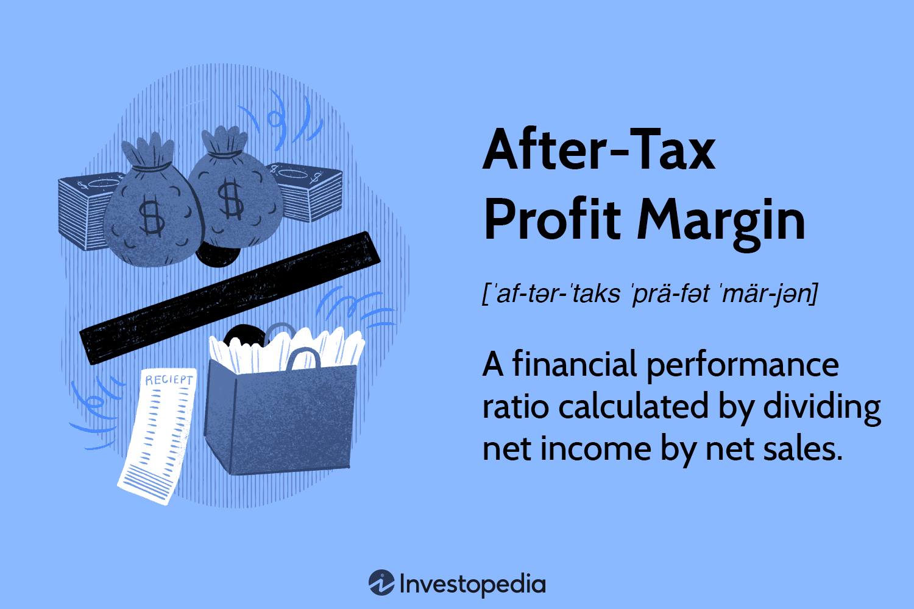

## Table of Contents

## What is the after-tax profit margin?

The after-tax profit margin is the amount of profit a company keeps after paying all its taxes. It shows how much of each dollar earned by the company is profit after taxes. To find it, you take the net income after taxes and divide it by the total revenue, then multiply by 100 to get a percentage.

This number is important because it tells investors and business owners how well a company is doing at making money after paying taxes. A higher after-tax profit margin means the company is good at keeping more of its earnings. This can be compared with other companies to see which ones are more profitable after taxes.

## Why is the after-tax profit margin important for businesses?

The after-tax profit margin is important for businesses because it shows how much money they keep after paying taxes. This number tells business owners and investors how well the company is doing at making money. When a business has a high after-tax profit margin, it means they are good at keeping more of the money they earn. This can make the business more attractive to investors because it shows the company is efficient at managing its profits.

Knowing the after-tax profit margin also helps businesses compare themselves with other companies. If a business sees that its after-tax profit margin is lower than its competitors, it might need to find ways to reduce costs or increase sales to improve its profits. This can lead to better decision-making and strategies to grow the business. In the end, a good after-tax profit margin can help a business stay healthy and successful over time.

## How do you calculate the after-tax profit margin?

To calculate the after-tax profit margin, you first need to know the net income after taxes. This is the money left after a business pays all its expenses and taxes. Then, you take this net income and divide it by the total revenue, which is all the money the business earned. After dividing, you multiply the result by 100 to turn it into a percentage. This percentage is the after-tax profit margin.

For example, if a business has a net income of $50,000 after taxes and its total revenue is $200,000, you would divide $50,000 by $200,000 to get 0.25. Then, you multiply 0.25 by 100 to find that the after-tax profit margin is 25%. This means for every dollar the business earns, it keeps 25 cents as profit after paying taxes.

## What are the key components needed to calculate the after-tax profit margin?

To calculate the after-tax profit margin, you need to know two main things: the net income after taxes and the total revenue. Net income after taxes is the money left over after a business pays all its expenses and taxes. Total revenue is all the money the business makes from selling its products or services.

Once you have these two numbers, you can find the after-tax profit margin. You do this by dividing the net income after taxes by the total revenue. Then, you multiply the result by 100 to turn it into a percentage. This percentage shows how much profit the business keeps after paying taxes, out of every dollar it earns.

## Can you provide a simple example of calculating the after-tax profit margin?

Let's say a small business made $100,000 in total revenue last year. After paying all its expenses and taxes, the business had a net income of $15,000. To find the after-tax profit margin, we divide the net income by the total revenue. So, we take $15,000 and divide it by $100,000, which gives us 0.15.

Next, we turn this number into a percentage by multiplying 0.15 by 100. This gives us an after-tax profit margin of 15%. This means for every dollar the business earned, it kept 15 cents as profit after paying taxes.

## How does the after-tax profit margin differ from the pre-tax profit margin?

The after-tax profit margin and the pre-tax profit margin both show how much profit a business makes, but they look at different points in the process. The pre-tax profit margin is the profit a business makes before it pays any taxes. To find it, you take the earnings before taxes and divide by the total revenue, then multiply by 100 to get a percentage. This tells you how much profit the business makes from its sales before tax is taken out.

The after-tax profit margin, on the other hand, is the profit a business keeps after it has paid all its taxes. To calculate it, you use the net income after taxes, divide it by the total revenue, and then multiply by 100 to get a percentage. This shows how much of each dollar earned by the business is kept as profit after all expenses and taxes are paid. The main difference is that the after-tax profit margin gives a clearer picture of what the business actually keeps, which is important for understanding its real financial health.

## What factors can affect the after-tax profit margin of a company?

Many things can change a company's after-tax profit margin. One big thing is how much the company pays in taxes. If tax rates go up, the after-tax profit margin can go down because the company keeps less money. Another thing is how well the company manages its costs. If a company can lower its costs, like making things cheaper or paying less for supplies, it can keep more money as profit after taxes. Also, if a company can sell more of its products or services, it might make more money and have a higher after-tax profit margin.

Changes in the economy can also affect the after-tax profit margin. If there's a recession, people might buy less, which can lower a company's sales and profits. On the other hand, if the economy is doing well, people might buy more, helping the company's profits. Competition is another [factor](/wiki/factor-investing). If other companies start selling similar products for less, a company might have to lower its prices to keep customers, which can reduce its profit margin. All these things together can make the after-tax profit margin go up or down.

## How can a company improve its after-tax profit margin?

A company can improve its after-tax profit margin by finding ways to cut costs. This could mean making things more cheaply or buying supplies at a lower price. If the company can spend less money on making its products or running its business, it will have more money left over as profit after paying taxes. Another way is to increase sales. If the company can sell more of its products or services, it will make more money, which can lead to a higher after-tax profit margin. This might involve advertising more or finding new customers.

Another important thing a company can do is manage its taxes better. This might mean working with a tax expert to find legal ways to reduce how much the company pays in taxes. If the company can lower its tax bill, it will keep more of its earnings as profit. Finally, looking at the competition can help too. If other companies are selling similar things for less, a company might need to lower its prices to keep customers. But it should be careful not to lower prices so much that it hurts its profit margin. By doing these things, a company can work on improving its after-tax profit margin.

## What are common misconceptions about the after-tax profit margin?

One common misconception about the after-tax profit margin is that it's the same as the pre-tax profit margin. People sometimes mix them up, but they're different. The pre-tax profit margin is what a company makes before paying taxes, while the after-tax profit margin is what's left after all taxes are paid. Knowing the difference is important because the after-tax profit margin shows what the company really keeps, which is key for understanding how well the business is doing.

Another misconception is that a high after-tax profit margin means a company is doing great in every way. But that's not always true. A company might have a high profit margin one year because it cut costs a lot, but that might not be good for the long run. Or, a company might have a low profit margin but still be growing fast and investing in its future. So, the after-tax profit margin is just one part of the picture. It's helpful to look at other things too, like how the company is growing and what it's doing with its money.

## How does the after-tax profit margin vary across different industries?

The after-tax profit margin can be very different from one industry to another. Some industries, like technology or software, often have high after-tax profit margins. This is because once they make a product, like a piece of software, they can sell it to lots of people without spending much more money. On the other hand, industries like retail or restaurants usually have lower after-tax profit margins. They have to spend a lot on things like rent, supplies, and staff, which leaves them with less profit after taxes.

These differences are important for businesses to understand. A company in the tech industry might think its after-tax profit margin is normal, but if it compared itself to a retail company, it might seem very high. Knowing what's normal for their own industry helps businesses set goals and make plans. It also helps investors see which industries are more likely to make good profits after taxes.

## What advanced financial analysis techniques can be used with the after-tax profit margin?

One advanced financial analysis technique that can be used with the after-tax profit margin is trend analysis. This means looking at how the after-tax profit margin changes over time. By doing this, a company can see if its profit margin is going up or down. If it's going up, that's a good sign that the company is getting better at keeping more of its earnings after taxes. If it's going down, the company might need to find ways to cut costs or increase sales. Trend analysis helps businesses understand their financial health over time and make better decisions.

Another technique is benchmarking. This involves comparing a company's after-tax profit margin with other companies in the same industry. By doing this, a business can see if it's doing better or worse than its competitors. If a company's after-tax profit margin is lower than others in its industry, it might need to look at what those other companies are doing differently. Maybe they have lower costs or better ways of selling their products. Benchmarking helps a company see where it stands and what it might need to change to improve its profits after taxes.

## How can the after-tax profit margin be used in strategic decision-making within a company?

The after-tax profit margin is a key number that helps a company make smart choices about its future. When a company knows its after-tax profit margin, it can see how much money it keeps after paying all its bills and taxes. This helps the company decide if it should try to cut costs or find ways to sell more products. For example, if the after-tax profit margin is low, the company might look for cheaper ways to make its products or find new customers to boost sales. This way, the company can work on making more money and keeping more of it after taxes.

Also, the after-tax profit margin can help a company plan for the long term. By looking at how this number changes over time, the company can see if it's getting better at making money. If the after-tax profit margin is going up, the company might decide to invest in new projects or expand its business. But if it's going down, the company might need to be more careful with its spending and focus on improving its profits. Knowing the after-tax profit margin helps the company make choices that will help it grow and stay strong in the future.

## What is Understanding Profit Margin?

Profit margin is a critical financial ratio that evaluates a company’s efficiency in generating net income from its revenue. It serves as a vital indicator of profitability by quantifying how much out of every dollar of sales a company actually retains in its earnings. Profit margins are essential for stakeholders, including business managers, investors, and financial analysts, as they provide key insights into a company's financial health and operational performance.

There are various types of profit margins, each highlighting different aspects of a company’s financial performance. The gross profit margin provides insights into the basic profitability from core operations before deducting operational expenses and taxes. It is calculated as:

$$
\text{Gross Profit Margin} = \left( \frac{\text{Revenue} - \text{Cost of Goods Sold}}{\text{Revenue}} \right) \times 100
$$

The operating profit margin, on the other hand, investigates deeper by considering operational efficiencies, encompassing both cost of goods sold and operating expenses, such as wages and rent. It is expressed as:

$$
\text{Operating Profit Margin} = \left( \frac{\text{Operating Income}}{\text{Revenue}} \right) \times 100
$$

The net profit margin goes further to include all costs, including operating expenses, interest, and taxes, providing a holistic view of overall profitability. The formula is:

$$
\text{Net Profit Margin} = \left( \frac{\text{Net Income}}{\text{Revenue}} \right) \times 100
$$

Each type of profit margin provides distinct insights into the cost structure and pricing strategy of a company. These margins not only reflect the internal cost dynamics but also help assess market conditions and competitive pricing strategies. External factors such as changes in market demand, inflation rates, and fluctuations in raw material prices can significantly impact these margins.

Investors and financial analysts leverage profit margins to compare companies within the same industry, facilitating better investment decisions. A higher profit margin typically indicates a more efficient company with effective cost control and a solid competitive positioning, making it attractive to investors. Conversely, shrinking profit margins could signal issues with cost management or increased market competition.

In summary, understanding the different profit margins is crucial for comprehensive financial analysis. They not only gauge the profitability and efficiency of a company’s operations but also serve as benchmarks for comparing similar businesses across an industry.

## What is the Profit Margin Formula?

Profit margin, a key indicator of a company's financial performance, is calculated using a straightforward formula: 

$$
\text{Profit Margin} = \left(\frac{\text{Net Income}}{\text{Revenue}}\right) \times 100
$$

This formula expresses profit as a percentage of revenue, providing insights into how effectively a company converts revenue into profit. A higher profit margin indicates more profitability relative to revenue, signifying efficient management and operational strategies.

To refine the analysis, especially when assessing post-tax scenarios, the after-tax profit margin is used. This adjusted metric takes into consideration the company's tax obligations, offering a more precise understanding of net profit:

$$
\text{After-tax Profit Margin} = \left(\frac{\text{Net Income} - \text{Taxes}}{\text{Revenue}}\right) \times 100
$$

Incorporating taxes into the profit margin ensures that the evaluation accounts for compulsory liabilities that impact a company's genuine profitability. As such, it becomes essential for an accurate assessment of financial health, particularly useful for both investors and internal financial analysis.

To calculate profit margins accurately, it is crucial to have access to comprehensive financial statements that detail revenue, net income, and total taxes paid. Furthermore, a sound grasp of accounting principles is necessary to ensure the integrity of the financial data being utilized. This thorough approach to calculation helps in identifying underlying operational efficiencies and tax impacts, aiding in more informed financial decision-making.

## How do you calculate the after-tax profit margin?

Consider a hypothetical company with a total revenue of $500,000 and a net income of $100,000. To calculate the after-tax profit margin, we must first account for tax expenses. Assume the total tax paid by the company is $20,000. The calculation for the after-tax profit margin is as follows:

1. **Calculate Net Income After Taxes:**
$$
   \text{Net Income After Taxes} = \text{Net Income} - \text{Taxes} = \$100,000 - \$20,000 = \$80,000

$$

2. **Calculate the After-Tax Profit Margin:**
$$
   \text{After-tax Profit Margin} = \left( \frac{\text{Net Income After Taxes}}{\text{Revenue}} \right) \times 100 = \left( \frac{\$80,000}{\$500,000} \right) \times 100 = 16\%

$$

This percentage indicates that the company retains 16% of its total revenue as profit after deducting expenses and taxes. Such a metric is vital for assessing financial health and efficiency.

**Competitive Analysis:**

By comparing this margin with industry standards and competitors, stakeholders can gauge the company's competitive performance. A higher after-tax profit margin might suggest a more efficient cost structure or superior pricing strategy relative to peers.

Additionally, analyzing changes in the after-tax profit margin over time helps in evaluating management effectiveness. For instance, consistent improvement in the margin can suggest successful operational enhancements or strategic adjustments. Conversely, a declining trend might indicate potential inefficiencies or market challenges that need addressing.

Understanding these dynamics enables businesses and investors to make more informed decisions, aligning operational strategies with broader financial goals.

## References & Further Reading

[1]: Bergstra, J., Bardenet, R., Bengio, Y., & Kégl, B. (2011). ["Algorithms for Hyper-Parameter Optimization."](https://dl.acm.org/doi/10.5555/2986459.2986743) Advances in Neural Information Processing Systems 24.

[2]: ["Advances in Financial Machine Learning"](https://www.amazon.com/Advances-Financial-Machine-Learning-Marcos/dp/1119482089) by Marcos Lopez de Prado

[3]: ["Evidence-Based Technical Analysis: Applying the Scientific Method and Statistical Inference to Trading Signals"](https://www.amazon.com/Evidence-Based-Technical-Analysis-Scientific-Statistical/dp/0470008741) by David Aronson

[4]: ["Machine Learning for Algorithmic Trading"](https://github.com/stefan-jansen/machine-learning-for-trading) by Stefan Jansen

[5]: ["Quantitative Trading: How to Build Your Own Algorithmic Trading Business"](https://www.amazon.com/Quantitative-Trading-Build-Algorithmic-Business/dp/1119800064) by Ernest P. Chan