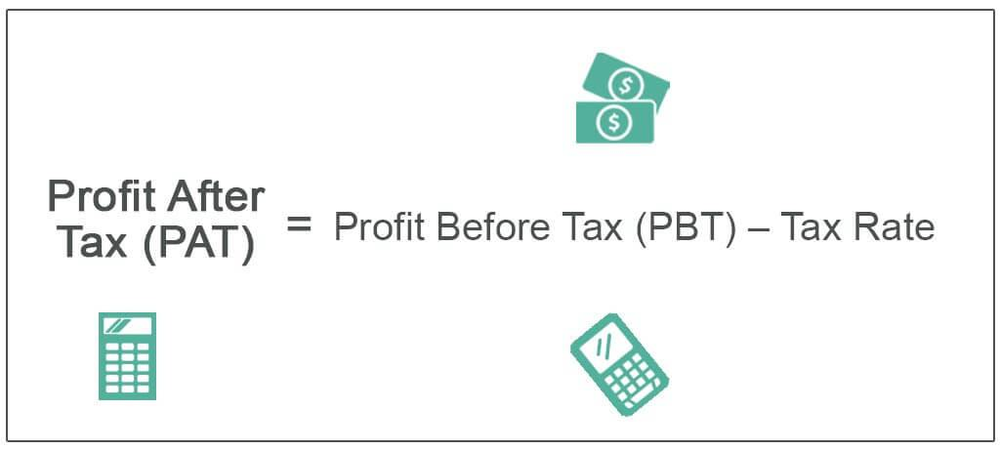

Understanding profit margins is crucial for both businesses and investors, as they provide insights into a company's financial health. Profit margins are critical metrics that reflect a company's profitability and efficiency in generating earnings. These figures, expressed as percentages, offer a straightforward way to assess how much profit a company makes for each dollar of revenue generated. This article focuses on the after-tax profit margin and its significance in algorithmic trading, emphasizing how it can influence decision-making processes and overall trading strategies.

Profit margins reveal whether a company can manage its expenses relative to revenue and maintain profitability under varying market conditions. An efficient company minimizes costs while maximizing revenue, resulting in higher profit margins. Thus, analyzing profit margins is an essential practice for evaluating business performance and investment potential. By focusing on after-tax profit margins, we gain a refined view of a company's profitability, taking into account the impacts of tax obligations, which are crucial for accurate financial assessments.

In the context of algorithmic trading, profit margins serve as key indicators for developing robust trading strategies. Algorithmic trading involves using complex computing techniques and models to execute trades at high speed, often leveraging historical data to predict future market behavior. profit margins, including after-tax figures, become vital inputs in these algorithms, helping to refine forecasts and optimize trading decisions. By incorporating profit margins, algo trading systems can better understand the tax implications of potential returns, enhancing both risk management and return on investment (ROI).

This article aims to explain the profit margin formula, showcase examples in finance, and explore its significance within the scope of algorithmic trading. Understanding and calculating profit margins empower traders and businesses to optimize their operations, manage resources better, and ultimately enhance profit potential. Integrating profit margin analysis with algorithmic trading platforms symbolizes a convergence of financial analysis and technological sophistication, aiming to maximize economic outcomes in today's competitive financial markets.

## Table of Contents

## Understanding Profit Margin

Profit margin is a critical financial ratio that evaluates a company’s efficiency in generating net income from its revenue. It serves as a vital indicator of profitability by quantifying how much out of every dollar of sales a company actually retains in its earnings. Profit margins are essential for stakeholders, including business managers, investors, and financial analysts, as they provide key insights into a company's financial health and operational performance.

There are various types of profit margins, each highlighting different aspects of a company’s financial performance. The gross profit margin provides insights into the basic profitability from core operations before deducting operational expenses and taxes. It is calculated as:

$$
\text{Gross Profit Margin} = \left( \frac{\text{Revenue} - \text{Cost of Goods Sold}}{\text{Revenue}} \right) \times 100
$$

The operating profit margin, on the other hand, investigates deeper by considering operational efficiencies, encompassing both cost of goods sold and operating expenses, such as wages and rent. It is expressed as:

$$
\text{Operating Profit Margin} = \left( \frac{\text{Operating Income}}{\text{Revenue}} \right) \times 100
$$

The net profit margin goes further to include all costs, including operating expenses, interest, and taxes, providing a holistic view of overall profitability. The formula is:

$$
\text{Net Profit Margin} = \left( \frac{\text{Net Income}}{\text{Revenue}} \right) \times 100
$$

Each type of profit margin provides distinct insights into the cost structure and pricing strategy of a company. These margins not only reflect the internal cost dynamics but also help assess market conditions and competitive pricing strategies. External factors such as changes in market demand, inflation rates, and fluctuations in raw material prices can significantly impact these margins.

Investors and financial analysts leverage profit margins to compare companies within the same industry, facilitating better investment decisions. A higher profit margin typically indicates a more efficient company with effective cost control and a solid competitive positioning, making it attractive to investors. Conversely, shrinking profit margins could signal issues with cost management or increased market competition.

In summary, understanding the different profit margins is crucial for comprehensive financial analysis. They not only gauge the profitability and efficiency of a company’s operations but also serve as benchmarks for comparing similar businesses across an industry.

## Profit Margin Formula

Profit margin, a key indicator of a company's financial performance, is calculated using a straightforward formula: 

$$
\text{Profit Margin} = \left(\frac{\text{Net Income}}{\text{Revenue}}\right) \times 100
$$

This formula expresses profit as a percentage of revenue, providing insights into how effectively a company converts revenue into profit. A higher profit margin indicates more profitability relative to revenue, signifying efficient management and operational strategies.

To refine the analysis, especially when assessing post-tax scenarios, the after-tax profit margin is used. This adjusted metric takes into consideration the company's tax obligations, offering a more precise understanding of net profit:

$$
\text{After-tax Profit Margin} = \left(\frac{\text{Net Income} - \text{Taxes}}{\text{Revenue}}\right) \times 100
$$

Incorporating taxes into the profit margin ensures that the evaluation accounts for compulsory liabilities that impact a company's genuine profitability. As such, it becomes essential for an accurate assessment of financial health, particularly useful for both investors and internal financial analysis.

To calculate profit margins accurately, it is crucial to have access to comprehensive financial statements that detail revenue, net income, and total taxes paid. Furthermore, a sound grasp of accounting principles is necessary to ensure the integrity of the financial data being utilized. This thorough approach to calculation helps in identifying underlying operational efficiencies and tax impacts, aiding in more informed financial decision-making.

## Example: Calculating After-Tax Profit Margin

Consider a hypothetical company with a total revenue of $500,000 and a net income of $100,000. To calculate the after-tax profit margin, we must first account for tax expenses. Assume the total tax paid by the company is $20,000. The calculation for the after-tax profit margin is as follows:

1. **Calculate Net Income After Taxes:**
$$
   \text{Net Income After Taxes} = \text{Net Income} - \text{Taxes} = \$100,000 - \$20,000 = \$80,000

$$

2. **Calculate the After-Tax Profit Margin:**
$$
   \text{After-tax Profit Margin} = \left( \frac{\text{Net Income After Taxes}}{\text{Revenue}} \right) \times 100 = \left( \frac{\$80,000}{\$500,000} \right) \times 100 = 16\%

$$

This percentage indicates that the company retains 16% of its total revenue as profit after deducting expenses and taxes. Such a metric is vital for assessing financial health and efficiency.

**Competitive Analysis:**

By comparing this margin with industry standards and competitors, stakeholders can gauge the company's competitive performance. A higher after-tax profit margin might suggest a more efficient cost structure or superior pricing strategy relative to peers.

Additionally, analyzing changes in the after-tax profit margin over time helps in evaluating management effectiveness. For instance, consistent improvement in the margin can suggest successful operational enhancements or strategic adjustments. Conversely, a declining trend might indicate potential inefficiencies or market challenges that need addressing.

Understanding these dynamics enables businesses and investors to make more informed decisions, aligning operational strategies with broader financial goals.

## Significance of After-Tax Profit Margin in Algo Trading

Algorithmic trading has revolutionized financial markets through the use of advanced algorithms and mathematical models to make swift trading decisions. Within these systems, after-tax profit margins are significant metrics that can influence trading strategies and enhance decision-making processes. 

Profit margins, including after-tax margins, are utilized as critical inputs in algorithmic models. By analyzing these margins, algorithms can optimize trading strategies and portfolios, ensuring that trades are executed in the most efficient and profitable manner. For instance, higher after-tax margins may indicate stronger profitability, leading algorithms to favor investment in such companies. Conversely, lower margins might trigger a reallocation of assets to more lucrative opportunities.

Furthermore, algorithms equipped with historical profit margin data can forecast future performance trends, enabling traders to identify potential profitable opportunities. By analyzing past data, algorithms can discern patterns and apply them to predict future market behaviors. This predictive ability is crucial for identifying entry and [exit](/wiki/exit-strategy) points in trading, ultimately maximizing returns.

Incorporating after-tax profit margins also ensures that trading strategies account for the tax implications of investment returns. Taxes can significantly impact net profits, and considering after-tax margins allows algorithms to [factor](/wiki/factor-investing) in these liabilities when evaluating investment opportunities. This holistic approach ensures that decisions are not solely based on gross profit figures but reflect the actual profitability after tax deductions.

Successful [algorithmic trading](/wiki/algorithmic-trading) platforms use profit margin analysis to bolster risk management strategies. By understanding the financial health indicated by profit margins, these platforms can better assess risk and adjust their trading practices accordingly. This can involve diversifying investments to mitigate potential losses or concentrating on high-margin sectors for better returns. 

In essence, after-tax profit margins serve as vital analytics in algorithmic trading, helping to refine strategies, manage risks, and enhance return on investment (ROI). By effectively integrating these metrics, traders and automated platforms can make more informed, strategic decisions that lead to greater financial success.

## Conclusion

Understanding and calculating profit margins, particularly the after-tax profit margin, is crucial for informed financial decision-making. These metrics play a significant role in algorithmic trading by providing vital insights that contribute to the development of effective trading strategies. By performing precise analyses of profit margins, both traders and businesses have the opportunity to fine-tune their operations and achieve heightened profitability.

Staying informed with current financial metrics and trends is essential for efficient management of investments and resources. This proactive approach ensures that financial decisions are based on the most current and relevant data available, thus minimizing risk and maximizing returns. Algorithmic trading platforms that incorporate profit margin analysis represent a blend of financial acumen and technological innovation, offering advanced tools to manage portfolios and enhance decision-making processes.

The ability to integrate these financial insights through sophisticated algorithms empowers traders and businesses to not only foresee potential market movements, but also to plan their market entry and exit strategies effectively. This integration showcases how modern technology can leverage traditional financial metrics to push the boundaries of trading efficiency and profitability. Ultimately, this fusion drives innovation in trading practices, ensuring that market participants remain competitive and well-informed in a rapidly evolving financial landscape.

## References & Further Reading

[1]: Bergstra, J., Bardenet, R., Bengio, Y., & Kégl, B. (2011). ["Algorithms for Hyper-Parameter Optimization."](https://dl.acm.org/doi/10.5555/2986459.2986743) Advances in Neural Information Processing Systems 24.

[2]: ["Advances in Financial Machine Learning"](https://www.amazon.com/Advances-Financial-Machine-Learning-Marcos/dp/1119482089) by Marcos Lopez de Prado

[3]: ["Evidence-Based Technical Analysis: Applying the Scientific Method and Statistical Inference to Trading Signals"](https://www.amazon.com/Evidence-Based-Technical-Analysis-Scientific-Statistical/dp/0470008741) by David Aronson

[4]: ["Machine Learning for Algorithmic Trading"](https://github.com/stefan-jansen/machine-learning-for-trading) by Stefan Jansen

[5]: ["Quantitative Trading: How to Build Your Own Algorithmic Trading Business"](https://www.amazon.com/Quantitative-Trading-Build-Algorithmic-Business/dp/1119800064) by Ernest P. Chan