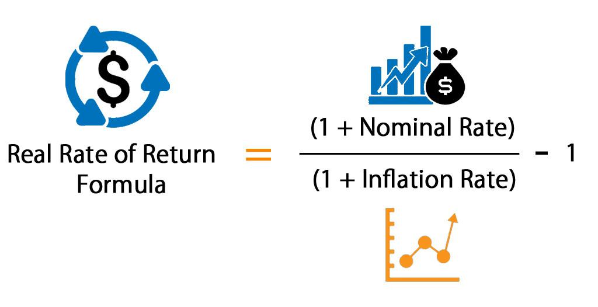

## Table of Contents

## What is the After-Tax Real Rate of Return?

The After-Tax Real Rate of Return is the amount of money you earn on an investment after paying taxes and after accounting for inflation. It's important because it shows the actual increase in your purchasing power from an investment. If you earn 5% on an investment but inflation is 3%, and you pay 1% in taxes, your real rate of return after taxes would be 1%. This helps you understand how much your money is really growing.

Calculating the After-Tax Real Rate of Return involves a few steps. First, you find the nominal rate of return, which is the percentage increase in your investment before taxes and inflation. Then, you subtract the tax rate from this nominal return to get the after-tax return. Finally, you subtract the inflation rate from the after-tax return to find the After-Tax Real Rate of Return. This final number tells you the true growth of your investment in terms of what you can actually spend.

## Why is the After-Tax Real Rate of Return important for investors?

The After-Tax Real Rate of Return is really important for investors because it shows them how much their money is actually growing. When you invest, you want to make sure your money is increasing in a way that you can feel. This rate tells you the real increase after you pay taxes and after prices go up due to inflation. So, if you just look at the interest rate a bank gives you, you might think you're doing great, but after taxes and inflation, your money might not be growing as much as you thought.

Knowing this rate helps investors make better choices about where to put their money. If one investment has a high [interest rate](/wiki/interest-rate-trading-strategies) but also high taxes, it might not be as good as another investment with a lower rate but lower taxes. By looking at the After-Tax Real Rate of Return, investors can pick the investments that will really help their money grow over time. This way, they can keep more of their earnings and see their savings increase in a way that matters in the real world.

## How does inflation affect the After-Tax Real Rate of Return?

Inflation can make the After-Tax Real Rate of Return smaller. Imagine you earn money from an investment, but then you have to pay taxes on that money. After paying taxes, you have less money left. Now, if prices for things you want to buy are going up because of inflation, the money you have left doesn't go as far as it used to. So, even though you earned money, inflation can eat away at what you can actually spend.

To see how much your investment is really growing, you need to take away the inflation rate from your after-tax earnings. If inflation is high, it can make your After-Tax Real Rate of Return very small or even negative. This means your money isn't growing as much as you might have thought. It's important to think about inflation when you're looking at investments, so you can pick ones that will still help your money grow even when prices are going up.

## What are the basic components needed to calculate the After-Tax Real Rate of Return?

To figure out the After-Tax Real Rate of Return, you need to know three main things: the nominal rate of return, the tax rate, and the inflation rate. The nominal rate of return is how much your investment grows before you pay taxes or think about inflation. It's the percentage increase in your investment. The tax rate is how much of your earnings you have to give to the government. And the inflation rate is how much prices for things are going up.

Once you have these three pieces of information, you can calculate the After-Tax Real Rate of Return. First, you take the nominal rate of return and subtract the tax rate to find out what you keep after taxes. This gives you the after-tax return. Then, you subtract the inflation rate from this after-tax return. The number you get at the end is the After-Tax Real Rate of Return, which tells you how much your money is really growing after you pay taxes and prices go up.

## Can you explain the formula used to calculate the After-Tax Real Rate of Return?

The formula to calculate the After-Tax Real Rate of Return is pretty straightforward. You start with the nominal rate of return, which is how much your investment grows before taxes and inflation. From this, you subtract the tax rate to find out what you keep after paying taxes. This gives you the after-tax return. Then, you take this after-tax return and subtract the inflation rate. The result is the After-Tax Real Rate of Return. It looks like this: After-Tax Real Rate of Return = Nominal Rate of Return - Tax Rate - Inflation Rate.

This formula helps you see the real growth of your investment. If your nominal rate of return is 6%, your tax rate is 1%, and inflation is 2%, you would calculate it like this: 6% - 1% - 2% = 3%. So, your After-Tax Real Rate of Return is 3%. This means your money is growing by 3% after you pay taxes and after prices go up. It's a useful number because it shows you how much your money is really increasing in a way that you can feel in your everyday life.

## How do taxes impact the calculation of the After-Tax Real Rate of Return?

Taxes take a piece of the money you earn from your investments. When you calculate the After-Tax Real Rate of Return, you start with the total growth of your investment, which is called the nominal rate of return. Then, you subtract the tax rate from this number. This means the more taxes you pay, the less money you have left after taxes. So, a higher tax rate will make your After-Tax Real Rate of Return smaller because you're keeping less of your earnings.

After you figure out how much you keep after taxes, you also need to think about inflation. Inflation is when prices for things go up, and it can eat away at the value of your money. To find the After-Tax Real Rate of Return, you subtract the inflation rate from the money you have left after taxes. If taxes are high, you start with less money, and then inflation takes a bite out of what's left. This makes it really important to think about taxes when you're looking at investments, because they can change how much your money is really growing.

## What is the difference between nominal and real rates of return?

The nominal rate of return is how much your investment grows before you think about taxes or inflation. It's the percentage increase in your money that you see right away. For example, if you put $100 into an investment and it grows to $105, your nominal rate of return is 5%. This rate is important, but it doesn't tell you the whole story because it doesn't account for the money you lose to taxes or the fact that prices might be going up.

The real rate of return, on the other hand, shows you how much your money is really growing after you pay taxes and after prices go up due to inflation. It's what's left after you take away the tax rate and the inflation rate from the nominal rate of return. So, if your nominal rate of return is 5%, but you pay 1% in taxes and inflation is 2%, your real rate of return would be 2%. This number is crucial because it tells you how much more you can actually spend or save, showing the true growth of your investment in terms of what it can buy.

## How can one adjust the nominal rate of return to find the real rate of return?

To find the real rate of return, you start with the nominal rate of return, which is how much your investment grows before you pay taxes or think about inflation. Then, you need to take away the tax rate from the nominal rate. This gives you the after-tax return, which is how much you keep after paying taxes. For example, if your nominal rate of return is 6% and you pay 1% in taxes, your after-tax return would be 5%.

Next, you need to think about inflation, which is when prices go up. You take the after-tax return and subtract the inflation rate from it. This gives you the real rate of return, which shows how much your money is really growing after you pay taxes and after prices go up. If the after-tax return is 5% and inflation is 2%, your real rate of return would be 3%. This number tells you how much more you can actually spend or save, showing the true growth of your investment.

## What are some common mistakes people make when calculating the After-Tax Real Rate of Return?

One common mistake people make when calculating the After-Tax Real Rate of Return is forgetting to include taxes. They might look at the nominal rate of return and think that's how much their money is growing, but they forget that they have to pay taxes on that growth. This can make them think their investment is doing better than it really is. For example, if they earn 5% but pay 1% in taxes, they should be looking at a 4% after-tax return, not 5%.

Another mistake is not accounting for inflation. People might focus on the after-tax return and forget that prices for things they want to buy are going up. If inflation is 2%, and they have an after-tax return of 4%, their real rate of return is only 2%. Ignoring inflation can make them think their money is growing more than it actually is in terms of what they can spend.

Sometimes, people also mix up the order of subtracting taxes and inflation. They might subtract inflation first and then taxes, which can give them the wrong number. The right way is to subtract taxes from the nominal rate first to get the after-tax return, and then subtract inflation from that to find the real rate of return.

## How does the After-Tax Real Rate of Return vary across different investment types?

The After-Tax Real Rate of Return can be different for different types of investments because each one has its own way of growing money and its own tax rules. For example, if you put money in a savings account, the interest you earn is usually taxed as regular income. This means you might pay a higher tax rate on that money. But if you invest in stocks and they go up in value, you might not pay taxes until you sell the stocks, and then you might pay a lower tax rate called capital gains tax. So, the type of investment you choose can change how much you keep after taxes, which affects your After-Tax Real Rate of Return.

Also, different investments can be affected by inflation in different ways. For example, if you invest in bonds, the interest you get might not keep up with inflation, so your money might not grow as much in real terms. But if you invest in real estate, the value of the property might go up faster than inflation, which can help your After-Tax Real Rate of Return be higher. It's important to think about both taxes and inflation when you're [picking](/wiki/asset-class-picking) investments, so you can choose ones that will help your money grow the most in the long run.

## Can you provide an example of calculating the After-Tax Real Rate of Return for a specific investment?

Let's say you invest $1,000 in a bond that gives you a 5% nominal rate of return. At the end of the year, your investment grows to $1,050. But, you have to pay taxes on the $50 you earned. If your tax rate is 20%, you'll pay $10 in taxes (20% of $50). So, after taxes, you keep $40, which means your after-tax return is 4% ($40 divided by $1,000).

Now, you need to think about inflation. Let's say inflation is 3% for the year. This means the prices for things you want to buy have gone up by 3%. To find out how much your money is really growing, you take your after-tax return of 4% and subtract the inflation rate of 3%. This gives you a real rate of return of 1% after taxes. So, even though your investment grew by 5% before taxes, after you pay taxes and account for inflation, your money is only growing by 1% in terms of what you can actually spend.

## What advanced strategies can investors use to maximize their After-Tax Real Rate of Return?

One way investors can boost their After-Tax Real Rate of Return is by using tax-advantaged accounts like 401(k)s or IRAs. These accounts let your money grow without having to pay taxes on the earnings right away. This means your investments can grow faster because you're not losing money to taxes every year. When you take money out later, you might pay taxes, but by then, your money has had more time to grow. Also, some of these accounts let you take money out without paying taxes if you use it for things like buying a first home or paying for college.

Another strategy is to invest in assets that grow faster than inflation. Things like stocks or real estate can sometimes go up in value more than the rate of inflation. If you pick the right investments, your money can grow enough to beat inflation and still leave you with a good return after taxes. You can also use tax-efficient investments, like index funds or ETFs, which often have lower tax rates on the money they make. By carefully choosing where to put your money and using accounts that help you save on taxes, you can make your After-Tax Real Rate of Return as high as possible.

## What is the difference between Nominal and Real Rate of Return?

The nominal rate of return is a fundamental metric representing the percentage increase in the value of an investment, unadjusted for factors like taxes and inflation. It is often used as an initial measure to assess an asset's performance. For instance, if an investment grows from $1,000 to $1,100 over a year, the nominal rate of return is 10% [(($1,100 - $1,000) / $1,000) × 100].

However, the real rate of return offers a more accurate picture by accounting for the erosion of purchasing power due to inflation. This adjustment is crucial as it reflects the actual growth in value an investor achieves in terms of what the returns can actually purchase over time. For example, if the inflation rate is 3%, the nominal rate of 10% must be adjusted to determine the real rate of return. Using the formula:

$$
\text{Real Rate of Return} = \frac{1 + \text{Nominal Return}}{1 + \text{Inflation Rate}} - 1
$$

Applying the figures: 

$$
\text{Real Rate of Return} = \frac{1 + 0.10}{1 + 0.03} - 1 \approx 0.067 \text{ or } 6.7\%
$$

This calculation indicates that the investment's purchasing power increased by 6.7%, not the full 10% suggested by the nominal return.

Adjusting for inflation helps prevent the overestimation of investment gains. Without this adjustment, investors might misconstrue their actual financial progress, leading to misguided expectations and financial planning.

Taxes further complicate the perception of investment returns. Nominal gains are subject to taxation, which reduces the amount of profit an investor retains. For example, if the nominal return is 10% and the applicable tax rate is 20%, the after-tax nominal return is calculated as:

$$
\text{After-Tax Nominal Return} = \text{Nominal Return} \times (1 - \text{Tax Rate})
$$
$$
\text{After-Tax Nominal Return} = 0.10 \times (1 - 0.20) = 0.08 \text{ or } 8\%
$$

This after-tax nominal return is still subject to inflation adjustments to determine the real after-tax return, maintaining the integrity of financial planning and investment evaluation. Thus, recognizing both inflation and taxation effects is essential for investors to accurately assess and strategize their financial growth.

## How do you calculate the after-tax real rate of return?

To determine the real profitability of an investment, investors must calculate the after-tax real rate of return, which accounts for both taxes and inflation adjustments. Here's a step-by-step guide:

### Calculating After-Tax Return

To begin, you need to compute the after-tax return from the nominal return. The formula to use is:

$$
\text{After-Tax Return} = \text{Nominal Return} \times (1 - \text{Tax Rate})
$$

**Example:**

Suppose you have made an investment with a nominal return of 8%, and your tax rate is 25%. The calculation for the after-tax return would be:

$$
\text{After-Tax Return} = 0.08 \times (1 - 0.25) = 0.06 \, \text{or} \, 6\%
$$

### Adjusting for Inflation

Once you have the after-tax return, you must adjust for inflation to find the real rate of return. Using the formula:

$$
\text{Real Rate of Return} = \left(\frac{1 + \text{After-Tax Return}}{1 + \text{Inflation Rate}}\right) - 1
$$

**Example Continued:**

Assume the inflation rate is 3%. The real rate of return would be calculated as follows:

$$
\text{Real Rate of Return} = \left(\frac{1 + 0.06}{1 + 0.03}\right) - 1 = \frac{1.06}{1.03} - 1 \approx 0.0291 \, \text{or} \, 2.91\%
$$

### Nuanced Scenarios

#### Tax-Advantaged Investments

Investments in tax-advantaged accounts—such as Roth IRAs or 401(k) plans—can significantly alter the after-tax real rate of return calculation. In the case of a Roth IRA, where investments grow tax-free and withdrawals are tax-free in retirement, the nominal return could effectively be the after-tax return for those who qualify.

**Example:**

If the same 8% nominal return is in a Roth IRA where you pay no taxes later, the after-tax return is 8%. Therefore, using the previous inflation rate:

$$
\text{Real Rate of Return} = \left(\frac{1 + 0.08}{1 + 0.03}\right) - 1 \approx 0.0485 \, \text{or} \, 4.85\%
$$

This highlights the advantage of tax-advantaged accounts in preserving more of the nominal return when adjusted for inflation.

### Conclusion

Understanding and calculating the after-tax real rate of return enables investors to discern the true value of their investment growth by factoring in taxes and inflation. Employing strategic financial planning, such as the utilization of tax-advantaged accounts, can further enhance investment outcomes, allowing for more robust financial decision-making.

## References & Further Reading

[1]: Damodaran, A. (1999). ["The Dark Side of Valuation: Firms with No Earnings, No History, and No Comparables."](https://people.stern.nyu.edu/adamodar/pdfiles/papers/HighGrow.pdf) Stern School of Business.

[2]: ["A Random Walk Down Wall Street: The Time-Tested Strategy for Successful Investing"](https://www.amazon.com/Random-Walk-Down-Wall-Street/dp/0393358380) by Burton G. Malkiel.

[3]: ["Principles of Taxation for Business and Investment Planning"](https://www.mheducation.com/highered/product/Principles-of-Taxation-for-Business-and-Investment-Planning-Jones.html) by Sally M. Jones, Shelley C. Rhoades-Catanach.

[4]: ["Assessment of algorithmic trading and its implications on real returns"](https://www.semanticscholar.org/paper/ALGORITHMIC-TRADING%3A-A-COMPREHENSIVE-REVIEW-OF-AND-Garg/94ead853e1835e7caae78d080e8b0e2f5f504607) by Aldridge, I. (2013). Algorithmic trading: Winning strategies and their rationale. 

[5]: ["I. "Quantitative Investment Analysis"](https://www.investopedia.com/quantitative-analysis-5272131) by Richard A. DeFusco, Dennis W. McLeavey, Jerald E. Pinto.