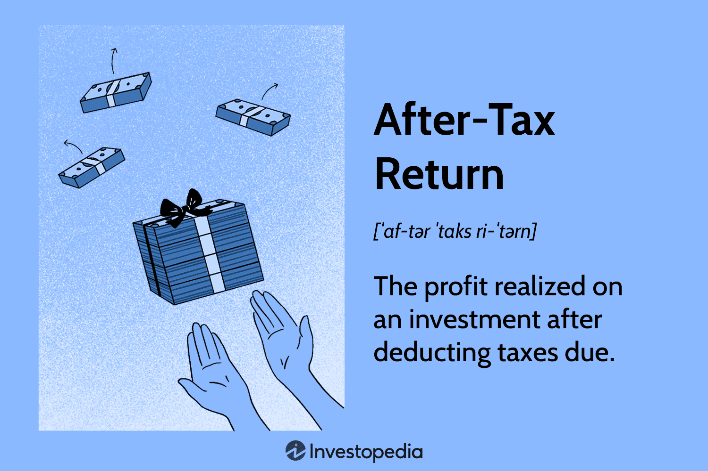

## Table of Contents

## What is an after-tax return?

An after-tax return is the amount of money you earn from an investment after you have paid taxes on it. When you invest, you might have to pay taxes on the money you make, like from interest, dividends, or when you sell the investment for a profit. The after-tax return shows you how much money you actually keep after these taxes are taken out.

Understanding your after-tax return is important because it gives you a clearer picture of your investment's performance. It helps you see how much money you are really making, which can be different from the before-tax return. This is especially useful when comparing different investment options, as some might have tax advantages that affect your final earnings.

## How do you calculate the after-tax return on an investment?

To calculate the after-tax return on an investment, you start with the total return you made before taxes. This could be from interest, dividends, or selling the investment for more than you paid. Then, you figure out how much tax you owe on that return. Different types of income might be taxed at different rates, so you need to know the tax rules for your investment. Once you know the tax amount, you subtract it from your total return. What's left is your after-tax return.

For example, if you earned $100 from an investment and you owe $25 in taxes on that income, your after-tax return would be $75. This number is important because it shows you how much money you actually get to keep. It helps you understand the real benefit of your investment after taxes are taken out. When comparing different investments, looking at the after-tax return can help you see which one is better for you, considering your tax situation.

## Why is understanding after-tax return important for investors?

Understanding after-tax return is important for investors because it shows how much money they really keep after paying taxes. When you invest, you might have to pay taxes on the money you earn. This could be from interest, dividends, or selling the investment for a profit. The after-tax return tells you what's left after you pay those taxes. It's like looking at your take-home pay after taxes are taken out of your paycheck. Knowing this helps you see the true value of your investment.

This is especially helpful when you're trying to decide between different investments. Some investments might look good because they have high returns before taxes, but after you pay taxes, they might not be as good as they seemed. By looking at the after-tax return, you can compare investments more accurately. It helps you make smarter choices about where to put your money, so you can keep more of your earnings in the end.

## What are the common types of taxes that affect investment returns?

When you invest, you might have to pay different kinds of taxes that can affect how much money you keep. One common tax is the capital gains tax, which you pay when you sell an investment for more than you paid for it. If you hold the investment for a year or less, it's called a short-term capital gain and is usually taxed at your regular income tax rate. If you hold it for more than a year, it's a long-term capital gain and often taxed at a lower rate. Another tax you might see is on dividends, which are payments you get from owning certain investments like stocks. These can be taxed at different rates depending on whether they are qualified or ordinary dividends.

Another type of tax that can impact your investment returns is the interest income tax. This is the tax you pay on the interest you earn from investments like bonds or savings accounts. The tax rate on this income can be the same as your regular income tax rate. If you invest in a retirement account like an IRA or 401(k), you might also have to think about taxes. With traditional IRAs and 401(k)s, you don't pay taxes on the money you put in or the earnings while it's in the account, but you pay taxes when you take the money out. With Roth IRAs and 401(k)s, you pay taxes on the money you put in, but the earnings and withdrawals can be tax-free if you follow the rules.

Understanding these different taxes is important because they can change how much money you actually get to keep from your investments. It's like knowing how much of your paycheck you take home after taxes. By knowing about these taxes, you can make better choices about where to invest your money and how to plan for your future.

## How do different investment vehicles impact after-tax returns?

Different investment vehicles can affect your after-tax returns in different ways. For example, if you invest in stocks, you might get dividends, which are taxed at different rates depending on if they are qualified or ordinary dividends. When you sell stocks, you might have to pay capital gains tax. If you hold the stocks for more than a year, you'll pay a lower tax rate on the profit than if you held them for less than a year. On the other hand, if you invest in bonds, you'll earn interest, which is taxed at your regular income tax rate. This means that the tax you pay on bond interest might be higher than what you'd pay on long-term capital gains from stocks.

Another way investment vehicles impact after-tax returns is through tax-advantaged accounts like IRAs and 401(k)s. With a traditional IRA or 401(k), you don't pay taxes on the money you put in or the earnings while it's in the account, but you do pay taxes when you take the money out in retirement. This can be good if you think you'll be in a lower tax bracket when you retire. With a Roth IRA or 401(k), you pay taxes on the money you put in, but the earnings and withdrawals can be tax-free if you follow the rules. This can be a good choice if you think taxes might be higher in the future or if you want tax-free income in retirement. By choosing the right investment vehicle, you can keep more of your money after taxes.

## What strategies can investors use to maximize their after-tax returns?

Investors can maximize their after-tax returns by choosing investments that fit well with their tax situation. For example, if you're in a high tax bracket, you might want to put more money into tax-advantaged accounts like a Roth IRA or 401(k). With these accounts, you pay taxes on the money you put in, but the earnings and withdrawals can be tax-free if you follow the rules. This can be a good way to keep more of your investment earnings. Another strategy is to invest in stocks that pay qualified dividends, which are taxed at a lower rate than ordinary income. By focusing on these types of investments, you can keep more of your money after taxes.

Another way to boost after-tax returns is to think about how long you plan to hold your investments. If you hold stocks for more than a year before selling them, you'll pay a lower tax rate on the profit than if you sold them sooner. This is called long-term capital gains tax, and it can save you a lot of money. You can also look for tax-efficient investments like index funds or ETFs, which often have lower turnover and therefore generate fewer taxable events. By being smart about when you buy and sell investments, and choosing the right types of investments, you can keep more of your earnings and grow your wealth over time.

## How do tax laws influence after-tax returns, and how often do they change?

Tax laws have a big impact on after-tax returns because they decide how much tax you have to pay on your investment earnings. Different types of income, like interest, dividends, and capital gains, can be taxed at different rates. For example, if you earn money from selling a stock you held for more than a year, you'll pay a lower tax rate on that profit than if you sold it sooner. Also, some investments, like those in retirement accounts, have special tax rules that can help you keep more of your money. Understanding these tax laws is important because they can change how much money you actually get to keep from your investments.

Tax laws can change pretty often, sometimes every year. When new laws are passed, they can change the tax rates or rules for different types of income. For example, the tax rates for capital gains or dividends might go up or down, or there might be new rules about how much you can put into retirement accounts. It's a good idea to keep an eye on these changes because they can affect your investment strategy. By staying informed, you can make better choices about where to put your money and how to plan for your future, so you can keep more of your earnings after taxes.

## Can you explain the concept of tax-efficient investing in relation to after-tax returns?

Tax-efficient investing is about choosing investments that help you keep more of your money after paying taxes. When you invest, you might have to pay taxes on the money you earn, like from interest, dividends, or selling an investment for a profit. Some investments are better at reducing the amount of taxes you have to pay. For example, if you invest in stocks that pay qualified dividends, you'll pay a lower tax rate on those dividends than on regular income. Also, if you hold onto your investments for more than a year before selling them, you'll pay a lower tax rate on the profit. By [picking](/wiki/asset-class-picking) the right investments, you can keep more of your earnings and grow your wealth over time.

Another way to be tax-efficient is by using tax-advantaged accounts like IRAs and 401(k)s. With a traditional IRA or 401(k), you don't pay taxes on the money you put in or the earnings while it's in the account, but you do pay taxes when you take the money out in retirement. This can be good if you think you'll be in a lower tax bracket when you retire. With a Roth IRA or 401(k), you pay taxes on the money you put in, but the earnings and withdrawals can be tax-free if you follow the rules. This can be a good choice if you think taxes might be higher in the future or if you want tax-free income in retirement. By choosing the right investment vehicles and understanding how taxes work, you can make smarter choices and keep more of your money after taxes.

## How do capital gains taxes affect after-tax returns, and what are the differences between short-term and long-term gains?

Capital gains taxes can make a big difference in how much money you actually keep from your investments. When you sell an investment for more than you paid for it, you have to pay taxes on the profit. This tax is called capital gains tax. The amount of tax you pay depends on how long you held the investment before selling it. If you held it for a year or less, it's called a short-term capital gain, and you'll pay taxes on it at your regular income tax rate. If you held it for more than a year, it's called a long-term capital gain, and you'll pay a lower tax rate on that profit. Knowing this can help you plan when to buy and sell investments to keep more of your money.

Short-term and long-term capital gains are taxed differently, and this can affect how much money you get to keep. Short-term capital gains are taxed at your regular income tax rate, which can be as high as 37% depending on your income. This means if you sell an investment you've held for less than a year, you might lose a big chunk of your profit to taxes. On the other hand, long-term capital gains are taxed at a lower rate, usually 0%, 15%, or 20%, depending on your income. So, if you can wait more than a year to sell an investment, you'll pay less in taxes and keep more of your earnings. By understanding these differences, you can make smarter choices about when to sell your investments and how to grow your wealth over time.

## What role does the investor's tax bracket play in determining after-tax returns?

An investor's tax bracket is really important when figuring out after-tax returns. Your tax bracket is the rate you pay on your highest dollar of income. If you're in a high tax bracket, you pay more taxes on things like interest, dividends, and short-term capital gains. These are taxed at your regular income tax rate, which can be pretty high. So, if you're in a high tax bracket, a bigger part of your investment earnings goes to taxes, and you get to keep less of your money.

But if you're in a lower tax bracket, you pay less in taxes on your investment earnings. This means you get to keep more of the money you make from your investments. It's like getting a better deal on your investments because you don't lose as much to taxes. Knowing your tax bracket can help you pick the right investments and make smart choices about when to sell them, so you can keep more of your earnings and grow your wealth over time.

## How can one use tax-loss harvesting to improve after-tax returns?

Tax-loss harvesting is a smart way to make your investments work better for you by reducing the taxes you have to pay. It means selling an investment that has lost value and using that loss to lower the taxes you owe on your other investments that made money. For example, if you sold a stock at a loss, you can use that loss to reduce the taxes on the profits you made from selling another stock at a gain. This way, you don't have to pay as much in taxes, and you get to keep more of your money.

To do tax-loss harvesting, you need to keep an eye on your investments and know when it makes sense to sell them at a loss. It's important to follow the rules, like the "wash-sale" rule, which says you can't buy back the same or a very similar investment within 30 days before or after you sell it at a loss. If you do it right, tax-loss harvesting can help you lower your taxes and improve your after-tax returns, making your investments more profitable in the end.

## What advanced strategies can high-net-worth individuals use to optimize their after-tax investment returns?

High-net-worth individuals can use advanced strategies like setting up trusts to optimize their after-tax investment returns. A trust can help them pass on their wealth to their family or others while reducing the taxes they have to pay. For example, they can use a grantor retained annuity trust (GRAT) to transfer assets to their heirs with little to no gift tax. By putting assets into the trust and getting payments back over time, they can move the growth of those assets out of their taxable estate. This can save them a lot of money in taxes and help them keep more of their wealth for their family.

Another strategy is to invest in tax-efficient vehicles like municipal bonds. These bonds are issued by local governments and the interest they pay is often free from federal income tax, and sometimes from state and local taxes too. This can be a big help for high-net-worth individuals who are in high tax brackets, because they can earn income without having to pay as much in taxes. By choosing the right investments and using smart tax planning, high-net-worth individuals can keep more of their money and grow their wealth over time.

## What are After-Tax Returns and How Can They Be Understood?

An after-tax return represents the net profit from an investment after accounting for tax liabilities. It provides a more accurate depiction of an investor's true earnings, and is particularly vital for high-income individuals, where tax implications can significantly alter investment outcomes. 

To calculate after-tax returns, investors need to consider capital gains and ordinary income taxes. Capital gains arise when an asset is sold at a higher price than its purchase cost, whereas ordinary income can include dividends and interest. Typically, investments can be subject to different tax rates depending on the type and holding period of the asset. For example, long-term capital gains are often taxed at a lower rate compared to short-term gains, which are usually taxed at the investor's ordinary income tax rate.

The formula for calculating after-tax returns can be expressed as:

$$
\text{After-Tax Return} = \left( \text{Pre-Tax Return} \times (1 - \text{Tax Rate}) \right)
$$

Where:
- **Pre-Tax Return** is the gross return on the investment.
- **Tax Rate** is the applicable tax rate based on the nature of the income.

Consider an investment with a pre-tax return of 10% and a tax rate of 30%. The after-tax return would be calculated as:

$$
10\% \times (1 - 0.30) = 7\%
$$

This calculation underscores the significance of knowing the tax rates applicable to various income types. For instance, an individual in a higher tax bracket might face a substantial reduction in net returns, thus influencing investment choices and portfolio management.

Factoring in taxes is crucial for an accurate profitability assessment. A comprehensive understanding of taxes enables investors to make informed decisions, optimize their investment strategies, and mitigate the impact on their returns. This becomes particularly pertinent for investors in high tax brackets, where effective tax planning and strategy are essential to maintaining and enhancing net profitability.

## How do you calculate after-tax returns?

Calculating after-tax returns is a fundamental aspect of evaluating the profitability of investments, particularly for investors in higher tax brackets. An accurate comprehension of this calculation requires integrating various income types and taxable events into the assessment. The following outlines the process of calculating after-tax returns, emphasizing the importance of precise calculations.

### Basic Formula for After-Tax Returns

The after-tax return of an investment can be generally calculated using the formula:

$$
\text{After-Tax Return} = \text{Pre-Tax Return} \times (1 - \text{Tax Rate})
$$

This formula reflects the simplest case where a single uniform tax rate is applied to the entire investment income. However, investment income is usually subject to different types of taxes, requiring a more nuanced formula.

### Integration of Appreciation and Taxable Events

Different types of income are subject to varying tax treatments. These can include:

1. **Capital Gains Tax**: Long-term capital gains are typically taxed at a lower rate compared to short-term gains. Long-term capital gains apply to assets held for more than one year, thus influencing the timing of sales.

2. **Ordinary Income Tax**: Income from dividends, interest, or short-term capital gains is generally taxed as ordinary income, often at a higher rate than long-term capital gains.

3. **Dividends**: Qualified dividends may receive preferential tax treatment compared to ordinary dividends or interest income.

The integration of these tax treatments requires segmenting investment returns:

$$
\text{After-Tax Return} = (\text{Capital Gains} \times (1 - \text{Capital Gains Tax Rate})) + (\text{Ordinary Income} \times (1 - \text{Ordinary Income Tax Rate})) + (\text{Dividends} \times (1 - \text{Dividend Tax Rate}))
$$

### Impact of Tax Rates on Investment Returns

An investor's taxable events and corresponding tax rates significantly affect their final returns. For example, consider an investor with a pre-tax return of $10,000, consisting of $4,000 from long-term capital gains, $3,000 from short-term gains, and $3,000 from qualified dividends. If the tax rates are 15% for long-term capital gains, 35% for short-term gains, and 20% for dividends, the after-tax return calculation would be:

$$

\text{After-Tax Return} = \\
(4000 \times (1 - 0.15)) + (3000 \times (1 - 0.35)) + (3000 \times (1 - 0.20)) = \\
3400 + 1950 + 2400 = 7750
$$

Hence, the investor retains $7,750 after taxes from an initial $10,000 pre-tax return.

### Importance of Precise Tax Calculations

The precision in tax calculations highlights not just the immediate tax liabilities but also the strategic value of tax-efficient investment planning. Investors can optimize their portfolios by deferring realized gains or advancing losses to reduce taxable income in high taxation years. Additionally, understanding these principles aids in diversifying income types to minimize tax burdens.

In summary, accurate after-tax return calculations serve as a pivotal component in assessing investment strategies, allowing investors to gauge genuine profitability and make informed decisions.

## References & Further Reading

[1]: Poterba, J. M. (2001). ["Taxation and Portfolio Structure: Issues and Implications."](https://papers.ssrn.com/sol3/papers.cfm?abstract_id=266193) National Bureau of Economic Research.

[2]: Damodaran, A. (1999). ["Tax Policy and Investments: Analyzing tax-augmented valuations."](https://www.sciencedirect.com/science/article/pii/S1573442002800246) Financial Analysts Journal.

[3]: Chai, J., & Head, A. C. (2014). ["Implementing tax-efficient investment strategies."](https://arxiv.org/pdf/2403.08058) Financial Analysts Journal.

[4]: U.S. Internal Revenue Service. ["Tax Topics - Capital Gains and Losses."](https://www.irs.gov/taxtopics/tc409)

[5]: Berkin, A. L., & Luck, C. J. (2010). ["Tax-Efficient Investment Strategies."](https://papers.ssrn.com/sol3/papers.cfm?abstract_id=1656949) Journal of Portfolio Management.