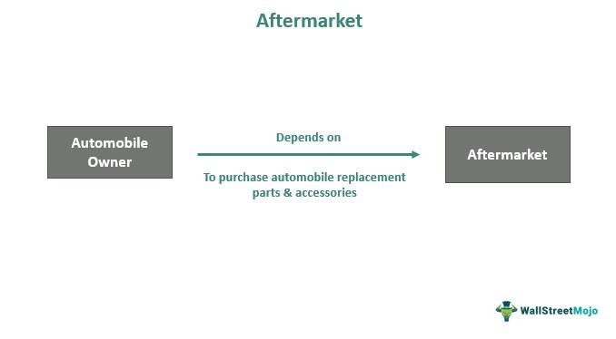

Algorithmic trading, often referred to as algo trading, involves the use of computer programs to execute trading activities based on pre-established criteria. These algorithms enable the automation of the trading process, eliminating human intervention except in the development and monitoring phases. This automation is primarily designed to enhance trading efficiency and optimize execution by facilitating faster and more precise trade orders. The integration of artificial intelligence (AI) and machine learning (ML) within these systems has considerably transformed trading strategies utilized by both individual traders and large institutional investors. These advancements have introduced sophisticated methods of analyzing vast datasets, recognizing patterns, and making informed trading decisions with minimal latency.

The recent developments in algorithmic trading have fostered a profound evolution in the way financial markets operate. As we navigate through this article, we will focus on several key aspects: current market trends, a comprehensive financial analysis, and the aftermarket implications of deploying algorithmic trading strategies. Our goal is to offer insights into how these technological advancements are contributing to the improvement of trade execution in terms of speed and accuracy. This discussion will shed light on how AI and ML are propelling the trading industry forward, providing both opportunities for growth and challenges that need to be addressed.



## Table of Contents

## Current Market Trends in Algorithmic Trading

Algorithmic trading, a rapidly evolving segment of the financial sector, is poised for significant growth driven by technological advancements and changing market demands. One of the key trends influencing this growth is the adoption of cloud-based solutions, which offer scalable and flexible infrastructures that traditional on-premise systems cannot match. Cloud technology enables traders to access real-time data, execute faster trades, and utilize computational resources on demand, thus optimizing trading operations and reducing latency.

High-frequency trading (HFT) remains a critical driver of algorithmic trading's market expansion. The need for speed and efficiency in executing multiple trades within fractions of a second is paramount in today's competitive markets. HFT employs sophisticated algorithms that leverage market volatility, making high-speed trades to capitalize on minimal price fluctuations. The reduction of transaction costs further augments trading efficiency, as algorithms can execute trades more rapidly and in larger volumes than human traders, often resulting in better pricing and reduced fees.

Artificial intelligence (AI) is fundamentally enhancing the capabilities of trading algorithms, allowing them to learn and adapt dynamically to market changes. Through machine learning, trading systems can analyze vast datasets to identify patterns, optimize strategies, and mitigate risks. These adaptive algorithms can modify parameters in real-time, ensuring robust performance even in volatile market conditions. AI-driven adjustments are integral in developing resilient strategies that can predict and respond to market movements with greater accuracy.

The continuous integration of AI with algorithmic trading systems facilitates the creation of more intelligent and autonomous trading strategies. As the market becomes increasingly complex, such advancements are crucial in maintaining trading efficiency and achieving superior outcomes. This evolution of algorithmic trading—bolstered by the adoption of cloud-based technologies, the dominance of [HFT](/wiki/high-frequency-trading-strategies), and the integration of AI—demonstrates a clear trajectory towards a more sophisticated and efficient trading landscape.

## Financial Analysis of Algo Trading

The global [algorithmic trading](/wiki/algorithmic-trading) market was valued at approximately $2.19 billion in 2023 and is anticipated to reach $4.06 billion by 2032, reflecting a compound annual growth rate (CAGR) of 7%. This growth is primarily driven by increased demand for automated trading solutions that enhance efficiency and performance in financial markets.

Several key players are shaping the competitive landscape of the algorithmic trading market. Among these are Tradetron, Wyden, and the FXCM Group. These companies are recognized for their innovative solutions and have established robust platforms that cater to the evolving needs of traders and financial institutions. Their offerings include a range of algorithmic strategies and tools designed to simplify the trading process and improve execution speed and accuracy.

The upward trajectory of the algorithmic trading market is significantly influenced by the demand from financial institutions seeking to optimize trading performance and reduce reliance on manual processes. By automating trading strategies, institutions can minimize human error and capitalize on market opportunities with greater precision. This optimization not only enhances operational efficiency but also reduces transaction costs, making algorithmic solutions particularly attractive to institutional investors aiming for high-frequency trading.

As the market continues to evolve, algorithmic trading is expected to become more adaptive, with dynamic algorithms that can adjust to changing market conditions. The integration of [artificial intelligence](/wiki/ai-artificial-intelligence) and [machine learning](/wiki/machine-learning) within these systems is crucial, allowing traders to continuously refine and enhance their strategies based on historical performance and emerging trends.

Overall, the financial analysis of the algorithmic trading market underscores a promising future, characterized by technological advancements and increased adoption across various sectors. As these trends continue, the market is poised to expand, offering new opportunities for innovation and growth.

## Aftermarket Implications and Forecasts

Aftermarket reports indicate sustained growth in the algorithmic trading sector, largely driven by the increasing acceptance and implementation of these systems in emerging markets. As financial landscapes evolve globally, the adoption of algorithmic trading is no longer limited to developed countries. Emerging markets, recognizing the efficiency and profitability offered by algorithmic strategies, are progressively integrating these technologies into their trading practices.

Companies are channeling significant resources into technological advancements to bolster trading infrastructure and enhance analytics capabilities. This investment is crucial for maintaining competitive advantage and supporting the sophisticated demands of modern trading environments. Improved infrastructure facilitates faster data processing and decision-making, crucial for high-frequency trading operations where fractions of a second can make a substantial difference in outcomes.

Moreover, there is a pronounced focus on the development of tailored solutions that cater to specific market niches. These bespoke systems are designed to maximize returns by addressing unique market dynamics and minimizing inefficiencies. By customizing algorithmic strategies to suit particular requirements, trading entities can achieve more precise and effective market engagement.

Python, among other programming languages, is often employed in the development of these customized solutions due to its robust libraries and ease of use for data analysis and machine learning integration. Here is a simple Python snippet that initializes a basic framework for a trading algorithm, showcasing the language's applicability:

```python
import numpy as np

# Hypothetical historical price data
prices = np.array([100, 102, 101, 105, 110, 107, 111])

# Simple Moving Average (SMA) function
def simple_moving_average(prices, window_size):
    return np.convolve(prices, np.ones(window_size), 'valid') / window_size

# Calculate a 3-day moving average
sma_3 = simple_moving_average(prices, 3)
print("3-day SMA:", sma_3)
```

This basic example calculates a simple moving average, a common component in many trading algorithms that helps smooth out price data to identify trends more clearly.

The ongoing investment in technological enhancement and the drive for specialized solutions underscore a promising outlook for algorithmic trading. As the industry continues to mature, businesses that adapt swiftly and effectively to changing market demands are likely to reap substantial benefits in algorithmic trading's growing market.

## Challenges and Restraints

Algorithmic trading presents various challenges and constraints that necessitate thorough consideration by traders and financial institutions. A significant challenge is the susceptibility of trading algorithms to market [volatility](/wiki/volatility-trading-strategies), which can lead to unforeseen financial losses. Volatility, characterized by rapid and unpredictable price changes, can disrupt the predictive efficiency of algorithms, causing them to execute trades at inopportune times. This unpredictability demands sophisticated volatility management strategies to mitigate risks associated with such fluctuations.

Another critical concern is the inadequacy of risk valuation capabilities embedded within some trading systems. Effective risk management is crucial to ensuring that trading strategies are not only profitable but also sustainable over the long term. Inadequate risk assessment tools may fail to accurately quantify potential losses or adapt to market changes, thereby exposing traders to amplified financial risks. This challenge underscores the need for continuous advancement in risk assessment technologies to enhance the robustness of algorithmic trading systems.

Regulatory changes also present constraints for algorithmic trading. Financial markets are subject to dynamic regulatory environments that require trading systems to comply with new rules aiming to enhance market transparency and accountability. For instance, regulations such as the Markets in Financial Instruments Directive II (MiFID II) in Europe mandate greater scrutiny and reporting of algorithmic trading activities. These regulations can impose additional operational burdens on trading firms, necessitating adjustments to algorithms and compliance processes to align with legal standards. While these changes aim to safeguard the integrity of financial markets, they can also limit the flexibility and innovation potential of trading systems.

As a response to these challenges, the industry is focusing on developing robust systems capable of adapting to regulatory demands while maintaining strategic efficiency. This includes integrating comprehensive risk management frameworks and leveraging advanced technologies to better predict and respond to market volatility. The continuous evolution in this sector seeks to balance the rapid pace of technological advancement with the necessary oversight to protect market participants.

## The Role of AI and Machine Learning

AI and machine learning have transformed algorithmic trading by enabling traders to identify and capitalize on trading patterns with unprecedented precision and adaptability. These technologies leverage vast amounts of data, employing sophisticated algorithms to discern subtle market trends and shifts. Unlike traditional trading systems, which rely on static rule-based strategies, AI-enhanced platforms continuously evolve by learning from historical market data and adapting to new inputs.

One of the primary advantages of AI and machine learning in algorithmic trading is their ability to develop adaptive algorithms. These algorithms dynamically adjust their strategies based on real-time market conditions, improving over time. For instance, machine learning models such as neural networks and decision trees can be trained on historical trading data to predict future price movements. The use of [reinforcement learning](/wiki/reinforcement-learning)—a type of machine learning wherein an algorithm learns optimal behaviors based on feedback from its actions in a trading environment—allows for continuous improvement and strategy refinement.

The process of algorithmic adaptation can be mathematically described using models such as supervised learning, where an algorithm is trained on labeled data. Formally, let $X$ be a set of input features representing market conditions, and $Y$ be target variables, like asset prices. The goal is to learn a function $f: X \rightarrow Y$ that best predicts $Y$ from $X$.

In practice, a Python implementation leveraging machine learning might look as follows:

```python
from sklearn.model_selection import train_test_split
from sklearn.ensemble import RandomForestRegressor
from sklearn.metrics import mean_squared_error

# Example dataset (X: market features, Y: target variable)
X, Y = some_financial_data()

# Split dataset into training and test
X_train, X_test, Y_train, Y_test = train_test_split(X, Y, test_size=0.2, random_state=42)

# Random forest model for predicting outcomes
model = RandomForestRegressor(n_estimators=100, random_state=42)
model.fit(X_train, Y_train)

# Evaluate the model
predictions = model.predict(X_test)
mse = mean_squared_error(Y_test, predictions)
print(f'Mean Squared Error: {mse}')
```

Such advancements are crucial in creating personalized and efficient trading strategies by enabling systems to not only react to current market conditions but also to anticipate and prepare for future trends. This personalization is particularly valuable in crafting strategies tailored to specific trading styles or risk tolerances, thus maximizing returns while managing risk more effectively.

## Conclusion

Algorithmic trading has become an indispensable component of contemporary financial markets, as it continues to develop and adapt to new technological advancements. The integration of artificial intelligence (AI) and other advanced technologies into algorithmic trading systems not only enhances the effectiveness of trading operations but also opens up new avenues for improving market [liquidity](/wiki/liquidity-risk-premium) and price discovery mechanisms. These technological innovations allow for the design of highly sophisticated trading strategies that leverage data-driven insights to make informed decisions, thus offering substantial opportunities for increased efficiency and profitability.

The deployment of AI-powered algorithms enables traders to execute large volumes of trades at unparalleled speeds, minimizing the impact of market fluctuations and reducing transaction costs. As AI continues to learn from historical data and evolve, its predictive capabilities improve, providing traders with a competitive edge. This continuous evolution is crucial in highly volatile markets, where swift adaptation can spell the difference between profit and loss.

However, along with opportunities, several challenges persist. Market volatility remains a significant concern, as algorithms must be designed to handle unforeseen market shifts effectively. Furthermore, systemic risks associated with high-frequency trading and the requirement for robust risk management protocols necessitate ongoing refinement and oversight. Regulatory frameworks also play a critical role, mandating a balance between innovation and accountability in trading practices.

Despite these challenges, the rapid growth and innovation within the algorithmic trading sector promise a solid and expansive future. Continued investment in technology and infrastructure is expected to drive further advancements, leading to more customizable and efficient trading solutions. As financial institutions increasingly adopt AI-driven trading systems, the role of algorithmic trading in global markets is likely to expand, fundamentally transforming how trades are executed. Overall, the trajectory of algorithmic trading indicates a robust and dynamic future, underscoring its pivotal influence on the evolution of modern financial markets.

## References & Further Reading

[1]: Bergstra, J., Bardenet, R., Bengio, Y., & Kégl, B. (2011). ["Algorithms for Hyper-Parameter Optimization."](https://dl.acm.org/doi/10.5555/2986459.2986743) Advances in Neural Information Processing Systems 24.

[2]: ["Advances in Financial Machine Learning"](https://www.amazon.com/Advances-Financial-Machine-Learning-Marcos/dp/1119482089) by Marcos Lopez de Prado

[3]: ["Evidence-Based Technical Analysis: Applying the Scientific Method and Statistical Inference to Trading Signals"](https://www.amazon.com/Evidence-Based-Technical-Analysis-Scientific-Statistical/dp/0470008741) by David Aronson

[4]: ["Machine Learning for Algorithmic Trading"](https://github.com/stefan-jansen/machine-learning-for-trading) by Stefan Jansen

[5]: ["Quantitative Trading: How to Build Your Own Algorithmic Trading Business"](https://www.amazon.com/Quantitative-Trading-Build-Algorithmic-Business/dp/1119800064) by Ernest P. Chan