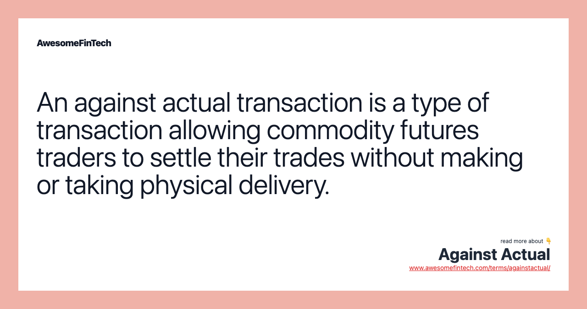

## Table of Contents

## What is a commodity future?

A commodity future is a contract that lets people buy or sell a specific amount of a commodity at a set price on a future date. Commodities are things like oil, gold, or wheat. People use these futures to protect themselves from big price changes. For example, a farmer might use a future to lock in a price for their wheat, so they know how much money they will get even if the market price goes down.

People who trade commodity futures don't always want the actual commodity. They might just want to make money from the price going up or down. This is called speculation. For instance, if someone thinks the price of oil will go up, they can buy an oil future. If the price does go up, they can sell the future for more than they paid for it and make a profit. But if the price goes down, they could lose money.

## What does 'Against Actual' mean in the context of commodity futures?

In the world of commodity futures, "Against Actual" (AA) is a way for people to trade futures and the actual commodity at the same time. It's like a special deal where someone can buy or sell the real thing and the future contract together. This can be useful if someone wants to make sure they get the commodity they need, and also want to use the futures market to protect themselves from price changes.

For example, imagine a company needs to buy oil. They can use an "Against Actual" trade to buy the oil they need right now and also buy a future contract. This way, they get the oil they need today and also protect themselves if the price of oil goes up in the future. It's a way to make sure they have the commodity and also manage the risk of price changes.

## How does trading 'Against Actual' differ from regular futures trading?

Trading "Against Actual" (AA) is different from regular futures trading because it combines buying or selling the actual commodity with trading a futures contract at the same time. In regular futures trading, people usually trade only the futures contract without dealing with the physical commodity. They might be speculating on price changes or hedging against future price risks, but they don't plan on taking delivery of the actual commodity. With "Against Actual," the trader gets the real commodity right away and also gets a futures contract to manage price risk.

The main difference is that "Against Actual" gives traders more flexibility and security. If a company needs the commodity right now, they can get it and still use the futures market to protect themselves from future price changes. In regular futures trading, traders might have to wait until the futures contract expires to get the commodity, which can be a problem if they need it sooner. "Against Actual" helps traders manage their needs for the commodity and their risks at the same time.

## What are the benefits of using the 'Against Actual' method in commodity futures?

Using the 'Against Actual' method in commodity futures can help companies a lot. It lets them get the actual commodity they need right away. This is really helpful for businesses that can't wait for the future contract to end before they get their goods. For example, if a company needs oil to keep their machines running, they can use 'Against Actual' to get the oil now and not have to worry about waiting.

Another big benefit is that 'Against Actual' also helps companies manage the risk of price changes. When they get the commodity and a futures contract at the same time, they can protect themselves from big swings in the market. If the price of the commodity goes up, the company is safe because they already have the futures contract. This way, they can focus on their business without worrying too much about what the market will do next.

## What are the potential risks associated with 'Against Actual' trading?

Using 'Against Actual' trading can be risky because it involves dealing with the actual commodity and a futures contract at the same time. One big risk is that the price of the commodity might change a lot between the time you buy it and the time you settle the futures contract. If the price goes down, you might end up paying more for the commodity than what it's worth in the market. This can hurt your business if you're not careful.

Another risk is that 'Against Actual' trading can be complicated. You need to understand both the physical market for the commodity and the futures market. If you make a mistake, it can cost you a lot of money. For example, if you don't manage the timing right, you might end up with the commodity but lose money on the futures contract. It's important to know what you're doing and maybe even get help from experts to make sure you're not taking on too much risk.

## Can you explain the process of executing an 'Against Actual' trade?

When you want to do an 'Against Actual' trade, you need to find someone who wants to buy or sell the actual commodity and a futures contract at the same time. Let's say you are a company that needs oil right now. You would talk to a seller who has oil and is willing to do an 'Against Actual' trade. You agree on the price for the oil and also on the details of the futures contract, like the price and the date it will end. Once you both agree, you get the oil right away and also the futures contract to protect yourself from future price changes.

The next step is to make sure everything goes smoothly. You need to keep an eye on the market to see if the price of oil changes. If the price goes up, the futures contract helps you because you locked in a lower price earlier. But if the price goes down, you might end up paying more for the oil than what it's worth now. You also need to make sure you handle the futures contract correctly. When the contract ends, you will settle it based on the market price at that time. If you do everything right, 'Against Actual' trading can help you get the commodity you need and manage the risk of price changes at the same time.

## What types of commodities are typically traded using the 'Against Actual' method?

The 'Against Actual' method is often used for commodities that are important for businesses and industries. These commodities include things like oil, natural gas, and other energy products. Companies in these industries need these commodities to keep their machines running and their businesses going. So, using 'Against Actual' helps them get the energy they need right away and also protect themselves from big changes in the price of these commodities.

Another group of commodities that are often traded using 'Against Actual' are agricultural products like wheat, corn, and soybeans. Farmers and food companies use this method to make sure they have the crops they need for their business. They can get the actual crops right away and also use a futures contract to lock in a good price for the future. This way, they don't have to worry too much about what the market will do next.

## How does the pricing mechanism work in 'Against Actual' transactions?

In 'Against Actual' transactions, the pricing mechanism involves setting two prices: one for the actual commodity and another for the futures contract. When you do an 'Against Actual' trade, you agree on the price of the commodity you need right away. This price is based on what the commodity is worth in the market at that time. You also agree on the price of the futures contract, which is usually set at the current market price for the future delivery of the commodity. The futures contract helps you lock in a price for the commodity for a later date, which can protect you if the market price goes up.

The tricky part is that the price of the commodity can change between when you buy it and when you settle the futures contract. If the price goes up, the futures contract can help you because you locked in a lower price earlier. But if the price goes down, you might end up paying more for the commodity than what it's worth in the market at the time you settle the contract. So, you need to be careful and keep an eye on the market to make sure you're not losing money.

## What regulatory considerations should be taken into account when trading 'Against Actual'?

When trading 'Against Actual,' there are some important rules and regulations you need to think about. Different countries have their own rules about how commodity futures can be traded. For example, in the United States, the Commodity Futures Trading Commission (CFTC) is in charge of making sure that futures trading is done fairly and honestly. They have rules about who can trade, how trades can be made, and what information needs to be shared. It's important to know these rules to make sure you're not breaking any laws when you do an 'Against Actual' trade.

Another thing to consider is that some commodities might have extra rules or need special permits. For example, trading energy products like oil and natural gas might need more paperwork and checks to make sure everything is safe and legal. It's a good idea to talk to a lawyer or a trading expert to make sure you understand all the rules and regulations that apply to the commodity you're trading. This can help you avoid problems and make sure your 'Against Actual' trades go smoothly.

## How do market conditions affect the decision to use 'Against Actual' trading strategies?

Market conditions play a big role in deciding whether to use 'Against Actual' trading strategies. If the market is very unpredictable and prices are changing a lot, companies might choose 'Against Actual' to protect themselves. They can get the commodity they need right away and also lock in a price for the future. This way, they don't have to worry about big price swings hurting their business. For example, if the price of oil is going up and down a lot, an oil company might use 'Against Actual' to make sure they have enough oil and can still make money even if the price changes.

On the other hand, if the market is stable and prices are not changing much, companies might not see as much need for 'Against Actual' trading. They might feel safe enough just buying the commodity they need without worrying about future price changes. But even in a stable market, some companies might still use 'Against Actual' if they want extra protection or if they need the commodity right away. It's all about balancing the need for the commodity with the need to manage risk based on what the market is doing.

## What advanced strategies can be employed with 'Against Actual' to optimize trading outcomes?

One advanced strategy to optimize 'Against Actual' trading is to use it along with other types of trades. For example, a company might use 'Against Actual' to get the commodity they need right away and then use options trading to add more protection against price changes. Options give you the right, but not the obligation, to buy or sell a commodity at a certain price. By combining 'Against Actual' with options, you can make sure you have the commodity and also have more ways to manage the risk of price changes.

Another strategy is to carefully watch the market and use 'Against Actual' when you see a good chance to lock in a good price. If you think the price of a commodity is going to go up soon, you can use 'Against Actual' to get it at the current price and also get a futures contract. This way, if the price does go up, you can sell the futures contract for more than you paid for it and make a profit. But you need to be careful and make sure you understand the market well, so you don't lose money if the price goes down instead.

## How does the 'Against Actual' approach impact the overall commodity market dynamics?

The 'Against Actual' approach can change how the commodity market works by giving companies a way to get the things they need right away and also protect themselves from price changes. When companies use 'Against Actual,' they are more sure about their costs and can plan better. This can make the market more stable because companies are not as worried about big price swings. They know they have the commodity they need and a price locked in for the future, so they might not rush to buy or sell as much when prices change a little.

But 'Against Actual' can also make the market more complicated. When lots of companies use this method, it can change how much people want to buy or sell the actual commodity and the futures contracts. If many companies are using 'Against Actual' to get commodities and lock in prices, it might make the market less flexible. This means that prices might not move as much as they would without 'Against Actual' trading. So, while it helps companies, it can also make the market behave differently and sometimes in ways that are hard to predict.

## References & Further Reading

[1]: Bergstra, J., Bardenet, R., Bengio, Y., & Kégl, B. (2011). ["Algorithms for Hyper-Parameter Optimization."](https://dl.acm.org/doi/10.5555/2986459.2986743) Advances in Neural Information Processing Systems 24.

[2]: ["Advances in Financial Machine Learning"](https://www.amazon.com/Advances-Financial-Machine-Learning-Marcos/dp/1119482089) by Marcos Lopez de Prado

[3]: ["Evidence-Based Technical Analysis: Applying the Scientific Method and Statistical Inference to Trading Signals"](https://onlinelibrary.wiley.com/doi/book/10.1002/9781118268315) by David Aronson

[4]: ["Machine Learning for Algorithmic Trading"](https://github.com/stefan-jansen/machine-learning-for-trading) by Stefan Jansen

[5]: ["Quantitative Trading: How to Build Your Own Algorithmic Trading Business"](https://github.com/LucindaYa/quant-resources/blob/master/Quantitative%20Trading%20How%20to%20Build%20Your%20Own%20Algorithmic%20Trading%20Business.pdf) by Ernest P. Chan