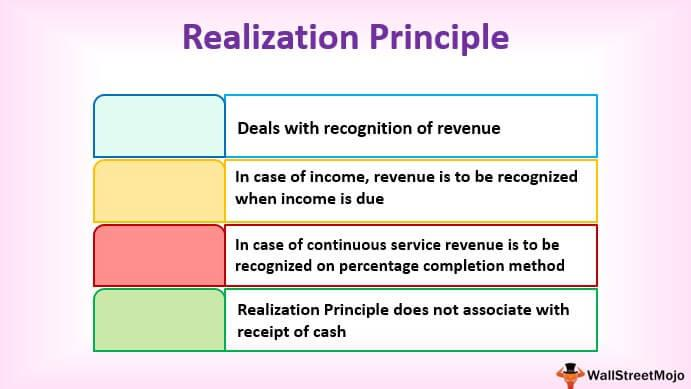

The world of trading has dramatically evolved with the advent of technology, bringing algorithmic trading or 'algo trading' to the forefront. At its core, algorithmic trading uses complex algorithms to make trading decisions and execute orders at speeds and volumes that are impossible for humans to match. This artificial intelligence-driven approach has revolutionized financial markets by increasing efficiency and potentially improving market liquidity.

This article aims to explain the fundamental concepts of algorithmic trading, offering practical comparisons and theoretical insights. By understanding these concepts, traders and investors can appreciate how algorithms function in trading environments, ranging from simple rule-based strategies to highly intricate systems involving machine learning and predictive analytics.



The integration of algorithms into financial markets represents a significant leap in trading technology. These systems allow for precise and high-speed trades, executing and managing a vast number of orders simultaneously and without human intervention. The implications are profound, not only for how trades are executed but also for the strategic development of trading systems. This exploration is crucial for anyone looking to grasp how precise and high-speed trades are implemented in modern markets.

Join us as we navigate the intriguing world of algorithmic trading, dissecting the components that make it not just possible but highly effective. By enhancing your understanding of these systems, you will gain valuable insights into both their operational simplicity and complexity. The knowledge gained can equip you for better decision-making in a market environment increasingly driven by technology and automated processes.

## Table of Contents

## Understanding Algorithmic Trading: Definition and Core Functionality

Algorithmic trading, often referred to as algo trading, leverages the power of computer algorithms to execute trades in financial markets based on pre-defined criteria. These algorithms operate on mathematical models and statistical analysis, acquiring the capability to make trading decisions at a speed and efficiency beyond human reach. Algo trading's design allows for automatic execution of trades with minimal human intervention, often triggered by factors such as timing, price, [volume](/wiki/volume-trading-strategy), or other quantitative parameters. 

At its core, algorithmic trading functions by following a structured set of instructions to initiate trades. For instance, an algorithm may be programmed to buy a stock when its 50-day moving average surpasses its 200-day moving average, a popular trend-following strategy. This kind of automated system is advantageous as it eliminates emotional decision-making and reduces the time lag in manual trading processes, ensuring swift execution orders in rapidly fluctuating markets.

The advantages of [algorithmic trading](/wiki/algorithmic-trading) are particularly notable in terms of efficiency and accuracy. By utilizing algorithms, traders can backtest their strategies using historical data to analyze performance and fine-tune parameters for optimal results without the bias inherent in human analysis. The capacity to conduct [backtesting](/wiki/backtesting) is essential for validating strategies before their deployment in live trading conditions.

Algorithmic trading finds extensive applications across various asset classes, including equities, foreign exchange ([forex](/wiki/forex-system)), commodities, and derivatives. Each market has unique characteristics and dynamics that can influence the development of specific algorithms tailored for each asset type. For example, the highly liquid forex market suits high-frequency trading ([HFT](/wiki/high-frequency-trading-strategies)) strategies, while equity markets may see the deployment of statistical [arbitrage](/wiki/arbitrage) strategies.

The basic mechanisms of algorithmic trading involve several key components: data collection, signal generation, risk management, and execution. Data collection is pivotal as it provides the foundation upon which algorithms generate trading signals. Once a signal is generated, the algorithm determines the optimal execution strategy, taking into account factors like order size, market impact, and transaction costs. Robust risk management protocols are integral to limit exposure and mitigate potential losses.

By understanding and employing these fundamental concepts, traders and financial institutions can effectively navigate the complexities and harness the advantages of algorithmic trading systems. As the field continues to evolve, driven by advances in [artificial intelligence](/wiki/ai-artificial-intelligence) and [machine learning](/wiki/machine-learning), the sophistication and potential of algorithmic strategies are set to expand, broadening the horizons of automated financial trading.

## Function Example vs Actual Concept: Unraveling Algorithmic Trading

An example of a simple algorithmic strategy is the moving average crossover, a fundamental approach in technical analysis. Here, the system buys when the short-term moving average crosses above the long-term moving average, signaling a potential upward trend. Mathematically, if $MA_{\text{short}}(t) = \frac{1}{n}\sum_{i=0}^{n-1}P(t-i)$ and $MA_{\text{long}}(t) = \frac{1}{m}\sum_{i=0}^{m-1}P(t-i)$ with $n < m$, then a buy signal is generated when $MA_{\text{short}}(t) > MA_{\text{long}}(t)$.

In actual trading systems, this seemingly straightforward example becomes complex. The simplicity of crossing averages is enhanced with additional conditions, such as filtering trades based on market [volatility](/wiki/volatility-trading-strategies) or incorporating other indicators like the Relative Strength Index (RSI) to confirm signals. Here's how algorithmic trading strategies such as these are typically refined from their simple form:

### Examples to Practice:

#### 1. Data Collection and Cleaning
To ensure reliability, any strategy is preceded by collecting historical data, which then undergoes rigorous cleaning to eliminate errors or inconsistencies. This ensures that subsequent analysis is robust and grounded on quality data.

```python
import pandas as pd

# Load and clean historical data
data = pd.read_csv('historical_data.csv')
data.dropna(inplace=True)
```

#### 2. Backtesting
Backtesting is crucial in assessing the viability of a strategy. By applying the strategy to historical data, traders can evaluate its success rate and risk—critical components in understanding its potential performance in live markets.

```python
def moving_average_crossover(data, short_window=40, long_window=100):
    data['MA_short'] = data['Price'].rolling(window=short_window).mean()
    data['MA_long'] = data['Price'].rolling(window=long_window).mean()

    data['Signal'] = 0
    data['Signal'][short_window:] = np.where(data['MA_short'][short_window:] > data['MA_long'][short_window:], 1, 0)
    data['Position'] = data['Signal'].diff()

    return data

# Backtest the strategy
results = moving_average_crossover(data)
```

#### 3. Risk Management
While backtesting provides insight into potential returns, incorporating risk management algorithms is imperative. This could include setting stop-loss orders or diversifying the portfolio to mitigate potential losses.

#### 4. Data Feed and Execution
To transition from theory to practice, traders need integration with live data feeds and execution systems that translate theoretical models into actionable trades efficiently and without latency.

#### 5. Continuous Monitoring and Adjustment
Even post-deployment, these systems require continuous optimization and monitoring to adapt to changing market conditions and avoid unexpected losses due to outdated models.

Through these processes, an elementary concept like moving average becomes a sophisticated algorithm capable of navigating the complexities of financial markets, illustrating the transformation from theoretical strategy to practical application. Successful implementation not only demands proficiency in technical analysis but also deep understanding of programming and financial dynamics.

## Mechanics of Algorithmic Trading: How it Operates

Algorithmic trading functions based on established protocols and mathematical models that dictate the trading process. When market conditions satisfy specified criteria, these systems automatically execute trades without direct human intervention. The mechanics of algorithmic trading can be dissected into several stages: algorithm development, data collection, signal generation, order placement, and post-trade analysis.

1. **Algorithm Development**: This initial step involves designing the strategy that the algorithm will follow. The strategy typically relies on a series of mathematical models and rules that determine trading signals. These models can range from simple moving averages to complex statistical arbitrage strategies.

2. **Data Collection**: Accurate, real-time market data is crucial for successful algorithmic trading. Data vendors provide price feeds and historical data necessary for calibrating the algorithm's sensitivity to various market stimuli. The ability to process large volumes of data quickly and accurately is a vital requirement at this stage.

3. **Signal Generation**: Based on the collected data, the algorithm identifies potential trading opportunities by analyzing market indicators in line with its predefined models. When certain conditions are met, such as a price threshold being breached, the algorithm generates a buy or sell signal.

4. **Order Placement**: The signals generated are translated into executable orders. This step involves interfacing with trading platforms or exchanges to place orders. The efficacy of order placement is heightened by ensuring minimal latency and slippage to capture the best prices.

5. **Post-Trade Analysis**: After the execution of trades, it is important to assess the performance of the algorithm. Post-trade analysis includes evaluating transaction costs, execution quality, and overall profitability. Feedback from this analysis is often used to refine and optimize the trading strategy.

High-frequency trading (HFT) is a specialized form of algorithmic trading characterized by the ultra-fast execution of trades, often taking place in microseconds. HFT requires finely tuned technology infrastructures, including high-performance algorithms, low-latency networks, and co-location services at exchanges, allowing traders to capitalize on marginal price discrepancies rapidly.

The entire process from data input to trade execution relies on sophisticated technological ecosystems. Each component must work seamlessly to ensure the algorithm executes trades with precision and speed. By comprehending these mechanics, traders gain insight into how algorithms autonomously make trading decisions at exceptionally high speeds, shaping modern financial markets.

## Algorithmic Trading Strategies: From Theory to Practice

Several algorithmic trading strategies serve as essential tools for traders aiming to harness the potential of automated trading systems. Each strategy is tailored to exploit specific patterns or inefficiencies within financial markets and is designed to function under varying market conditions and risk profiles.

### Trend Following
Trend following strategies capitalize on the [momentum](/wiki/momentum) of market prices. They operate on the principle that securities that have been trending in a particular direction will continue to do so. The core idea is to identify key trends early on and ride these trends until signs of reversal emerge. Typically, these strategies use moving averages, channel breakouts, or similar techniques to detect trends. 

**Example of Moving Average Crossover in Python:**

```python
# Example of a simple moving average crossover strategy
import pandas as pd

# Assuming 'data' is a DataFrame containing the historical price data with a 'Close' column.
short_window = 40
long_window = 100

data['Short_MA'] = data['Close'].rolling(window=short_window, min_periods=1).mean()
data['Long_MA'] = data['Close'].rolling(window=long_window, min_periods=1).mean()

data['Signal'] = 0
data.loc[data['Short_MA'] > data['Long_MA'], 'Signal'] = 1  # Buy
data.loc[data['Short_MA'] < data['Long_MA'], 'Signal'] = -1  # Sell
```

### Arbitrage
Arbitrage exploits price differentials across different markets or instruments. It involves simultaneously buying and selling an asset in different markets to profit from the temporary price discrepancies. A common form is [statistical arbitrage](/wiki/statistical-arbitrage), which uses quantitative models to identify mispricings.

### Mean Reversion
Mean reversion strategies rely on the assumption that asset prices will revert to their historical mean over time. This approach involves identifying securities that have deviated significantly from their average value, suggesting an eventual correction.

### Market Making
Market makers provide [liquidity](/wiki/liquidity-risk-premium) by continuously buying and selling securities, profiting from the bid-ask spread. This strategy entails placing simultaneous buy and sell orders for the same asset and is vital in maintaining market efficiency and stability.

### Statistical Arbitrage
Statistical arbitrage is a refined version of [pair trading](/wiki/pair-trading), leveraging mathematical models and statistical methods to detect pricing inefficiencies. This approach often involves trading baskets of securities to mitigate risk.

The effectiveness of each strategy is contingent upon its compatibility with market conditions. Strategies like [trend following](/wiki/trend-following) fare well in volatile markets, while mean reversion performs optimally in stable, oscillating markets. Traders must continuously adapt and refine these strategies, employing backtesting and real-world data analysis to ensure performance and mitigate risk. 

In practice, the success of algorithmic strategies is determined by the robustness of the underlying algorithms and their seamless integration with current market data. With technological advancements, these strategies continue to evolve, enhancing their complexity and precision.

## Technological and Legal Considerations in Algorithmic Trading

Algorithmic trading relies heavily on a robust technological infrastructure to ensure accuracy, speed, and efficiency in executing trades. High-performance computing systems form the core of this technological framework, enabling rapid processing of complex algorithms and large datasets. Without such computational power, the swift execution that characterizes algorithmic trading would not be feasible.

A reliable and fast internet connection is essential for maintaining a continuous flow of market data. Traders need this real-time data to make informed decisions based on current market conditions. Disruptions or delays in data transmission can lead to incorrect trading signals and substantial financial losses. As such, ensuring uninterrupted access to high-quality market data feeds is critical.

Market data feeds deliver the necessary inputs for algorithmic models. These feeds typically include price quotes, trade volumes, and other essential market indicators. The precision of the data is paramount, as even minor inaccuracies can affect the performance of trading algorithms. Vendors offering market data feeds need to uphold rigorous data integrity standards to support algorithmic trading operations.

Compliance with financial regulations and market standards is another crucial aspect. Regulations vary by region and asset class, requiring a thorough understanding of the legal landscape. For instance, the European Securities and Markets Authority (ESMA) enforces the Markets in Financial Instruments Directive (MiFID II), which sets guidelines for transparency and investor protection in automated trading systems. Similarly, the U.S. Securities and Exchange Commission (SEC) and the Commodity Futures Trading Commission (CFTC) have specific rules governing algorithmic trading practices. Adhering to these regulations ensures that trading systems operate within legal boundaries and avoid penalties.

The infrastructure supporting algorithmic trading needs continuous monitoring to identify and rectify potential system failures swiftly. Such failures can cause unintended trade executions, leading to significant financial losses and legal repercussions. Therefore, robust monitoring systems should be in place to detect anomalies in real-time and initiate corrective actions promptly.

Ethical considerations also play a role in algorithmic trading. Traders must be aware of the potential market impact of their algorithms, especially those capable of high-frequency trading (HFT). These systems can exacerbate market volatility and create unfair advantages over slower, traditional trading methods. Ethical trading practices necessitate the development of algorithms that contribute positively to market liquidity without inducing unnecessary volatility.

Lastly, understanding the technological and legal considerations in algorithmic trading enables traders to operate with integrity and sustainability. Mastery of these aspects not only safeguards against legal and financial pitfalls but also enhances the credibility and reliability of algorithmic trading strategies in the financial markets.

## Conclusion: Navigating the Future of Algorithmic Trading

Algorithmic trading is transforming financial markets through enhanced efficiency and automation. This method of trading employs sophisticated algorithms to execute trades far faster than human capabilities permit, capitalizing on price discrepancies and market opportunities instantaneously. The journey of understanding algorithmic trading involves dissecting both the practical implementations and the theoretical underpinnings, enabling traders to make informed strategic decisions.

As technology advances, the landscape of algorithmic trading is poised to evolve further. The integration of artificial intelligence (AI) and machine learning (ML) is expected to significantly enhance the capabilities of trading algorithms. AI can analyze vast datasets at unprecedented speeds, identifying patterns and insights that human traders may overlook. Machine learning, with its ability to adapt and learn from new data, can make algorithmic systems more robust, adaptive, and accurate. This synergy of technologies extends beyond traditional trading strategies, paving the way for innovative approaches tailored to rapidly changing market conditions.

Moreover, the future promises further expansion in the diversity and complexity of algorithmic trading strategies. This evolution will require traders to continuously update their knowledge and skills to remain competitive. The ability to integrate machine learning techniques, such as [reinforcement learning](/wiki/reinforcement-learning) for adaptive algorithm development, will be essential. For instance, reinforcement learning can optimize strategies by rewarding algorithms for profitable trades, refining their decision-making process without explicit programming for every scenario.

To prepare for these advancements, a foundational understanding of algorithmic trading is crucial. This article has aimed to provide insights into the mechanisms and strategies that define modern algorithmic trading. As traders explore this dynamic field, they can exploit new technologies, ensuring their strategies remain at the forefront. The fusion of advanced computational methods with trading practices will inevitably lead to more sophisticated, efficient, and profitable trading systems.

In summary, algorithmic trading is not only reshaping the current landscape of financial markets but is also poised to continue evolving with technological advancements. The integration of AI and machine learning stands to further enhance algorithmic strategies, offering promising avenues for innovation and adaptability. As these changes unfold, traders who understand both the functionalities and concepts inherent in algorithmic trading will be well-positioned to capitalize on emerging opportunities, ensuring their relevance and success in future markets.

## References & Further Reading

[1]: Bergstra, J., Bardenet, R., Bengio, Y., & Kégl, B. (2011). ["Algorithms for Hyper-Parameter Optimization."](https://dl.acm.org/doi/10.5555/2986459.2986743) Advances in Neural Information Processing Systems 24.

[2]: ["Advances in Financial Machine Learning"](https://www.amazon.com/Advances-Financial-Machine-Learning-Marcos/dp/1119482089) by Marcos Lopez de Prado

[3]: ["Evidence-Based Technical Analysis: Applying the Scientific Method and Statistical Inference to Trading Signals"](https://onlinelibrary.wiley.com/doi/book/10.1002/9781118268315) by David Aronson

[4]: ["Machine Learning for Algorithmic Trading"](https://github.com/stefan-jansen/machine-learning-for-trading) by Stefan Jansen

[5]: ["Quantitative Trading: How to Build Your Own Algorithmic Trading Business"](https://github.com/LucindaYa/quant-resources/blob/master/Quantitative%20Trading%20How%20to%20Build%20Your%20Own%20Algorithmic%20Trading%20Business.pdf) by Ernest P. Chan