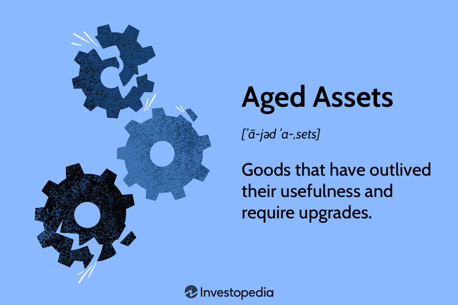

In the ever-evolving world of finance, asset management plays a fundamental role in optimizing value and minimizing risks. At its core, asset management involves strategizing the purchase, maintenance, and disposal of valuable resources to ensure efficient utilization and cost-effectiveness. Two significant aspects of this field are managing aged assets and the rise of algorithmic trading. While aged assets often present unique challenges and opportunities due to their declining efficiency and the potential need for replacement, algorithmic trading represents a technological leap that dramatically impacts financial markets through speed, precision, and data-driven decision-making.

This article explores the intertwining of these two areas by highlighting their respective advantages and disadvantages. Aged assets, which refer to goods that have surpassed their peak functionality, often require strategic management decisions about their maintenance, refurbishment, or replacement. These decisions not only affect operational costs but can also influence safety and efficiency in industries such as manufacturing and transport.



On the other hand, algorithmic trading employs sophisticated computer algorithms to execute trades with remarkable speed and accuracy, effectively eliminating human error and biases. This method leverages both real-time and historical data to optimize trade executions based on pre-determined criteria, thereby revolutionizing the way trades are conducted in financial markets.

By examining how these two concepts can potentially complement or challenge each other within the broader scope of asset management, we gain insightful perspectives that are critical for modern financial professionals. Understanding the dynamics of aged asset management and the innovative role of algorithmic trading can lead to more informed decisions, maximizing asset value while navigating the complexities of today's financial landscape.

## Table of Contents

## Understanding Aged Assets

Aged assets represent items or equipment that have reached or exceeded their optimal period of usability, necessitating careful consideration for replacement or enhancement. As these assets continue to age, maintenance becomes increasingly complex and costly, presenting a significant challenge for industries such as manufacturing and transportation, where operational continuity is critical. Effective management of aged assets requires companies to make strategic determinations about whether the maintenance of an asset is economically viable or if it should be refurbished for extended use.

When deciding on the fate of an aged asset, companies must evaluate several factors. Cost-effectiveness is a primary concern; maintaining an aged asset may incur significant expenses over time. Companies must weigh these costs against the potential benefits of extended use. Furthermore, the decision impacts safety standards and operational efficiency. Assets that are not upgraded or replaced on time may lead to safety hazards or operational inefficiencies, potentially escalating the risk of unplanned downtime or accidents.

Effective aged asset management involves implementing a structured approach to such evaluations. Techniques like cost-benefit analyses and life-cycle assessments can provide insights into the asset's future viability. Companies might employ predictive maintenance strategies, utilizing data analytics to forecast asset performance and remaining lifespan, ultimately guiding decisions on whether to invest in refurbishment or initiate replacement.

In summary, the management of aged assets holds significant consequences for a company's financial health and operational reliability. By developing a robust strategy for assessing and addressing the needs of aging assets, organizations can enhance their long-term performance and competitiveness in sectors demanding high levels of operational resilience.

## Pros and Cons of Managing Aged Assets

In financial and operational contexts, managing aged assets presents a mixed bag of potential benefits and risks. The primary advantage is the cost savings obtained by avoiding the immediate purchase of new assets. Extending the life of an asset often requires less investment compared to the cost of acquiring new equipment. This strategic preservation can free up resources for other investments or operational needs, thereby enhancing the overall financial position of an organization.

Despite these cost savings, aged assets can incur high maintenance expenses. As equipment and technological assets age, they typically require more frequent and costly repairs to remain operational. This can lead to escalating maintenance budgets that may offset the initial savings from deferring new purchases. Furthermore, older assets are more prone to unexpected breakdowns, which can disrupt operations and reduce productivity. The operational risks associated with aged assets often necessitate regular assessments to ensure safety and compliance with industry regulations.

Another consideration is the potential costs associated with the disposal of aged assets. If these assets cannot be sold or traded, companies might incur fees for environmentally responsible disposal or recycling. The lack of resale value can pose additional financial burdens, especially for high-cost technologies or machinery that depreciate rapidly once they reach a certain age.

When managed effectively, however, aged assets can still provide considerable value. Implementing a strategic plan for refurbishing and maintaining these assets can extend their useful life. Additionally, if they can be sold profitably or exchanged for newer models, aged assets can contribute positively to the cash flow. Companies must weigh these potential benefits against the associated risks and costs to determine their optimal asset management strategy. Effective management strategies often involve not only routine maintenance and updates but also a thorough analysis of cost-benefit factors over time, ensuring that resources are allocated efficiently and effectively.

## Algorithmic Trading: An Overview

Algorithmic trading, commonly referred to as algo trading, represents a technological evolution in financial markets where computer algorithms execute trades with a level of speed and frequency that surpasses human capabilities. These algorithms are crafted to analyze vast datasets, both real-time and historical, identifying patterns that can signal lucrative trading opportunities. By leveraging algorithmic systems, traders can execute orders automatically when certain criteria—such as price thresholds or technical indicators—are met.

The transformative impact of [algorithmic trading](/wiki/algorithmic-trading) is evident in its capacity to deliver enhanced speed and precision. Traditional trading methods, which rely heavily on human intervention, are typically slower and susceptible to errors brought on by emotional decision-making or miscalculations. In contrast, algorithmic trading eliminates these human limitations, processing trades in milliseconds and adhering strictly to data-driven strategies.

Algorithms in trading usually employ complex mathematical models and statistical techniques to forecast price movements. These may involve regression analysis, the Sharpe ratio for risk assessment, or [machine learning](/wiki/machine-learning) methods to improve predictive accuracy. For instance, using Python, a simple moving average crossover strategy can be implemented as follows:

```python
import pandas as pd

# Sample stock price data
data = {'price': [110, 112, 115, 114, 116, 117, 119, 118, 120, 121]}
df = pd.DataFrame(data)
df['SMA50'] = df['price'].rolling(window=50).mean()
df['SMA200'] = df['price'].rolling(window=200).mean()

# Generate signals
df['signal'] = 0
df.loc[df['SMA50'] > df['SMA200'], 'signal'] = 1  # Buy signal
df.loc[df['SMA50'] < df['SMA200'], 'signal'] = -1  # Sell signal
```

This example illustrates a simplified version of how algorithms can analyze price data to produce buy or sell signals based on predefined logic.

The scope of algorithmic trading also includes high-frequency trading ([HFT](/wiki/high-frequency-trading-strategies)), a subset that executes a large number of orders on ultra-short-term positions in various financial markets. HFT firms employ sophisticated algorithms to gain a competitive advantage through speed, exploiting even marginal price discrepancies across different trading platforms.

Despite the exceptional speed and precision it offers, algorithmic trading is not without challenges. The sophisticated nature of algorithms entails high initial costs, and the need for constant refinement and adaptation to evolving market conditions is paramount. Reliability on historical data can also be a drawback if market conditions diverge significantly from historical trends.

Algorithmic trading continues to redefine the trading landscape by minimizing human errors and making the execution of complex strategies feasible. As technology progresses, the role of algorithmic trading is likely to expand, offering even more opportunities for efficiency and profitability in financial markets.

## Benefits of Algorithmic Trading

Algorithmic trading, often simply referred to as algo trading, offers substantial benefits that have revolutionized the financial markets. One of the primary advantages is its speed. Trades executed through algorithmic platforms can be completed in milliseconds or even microseconds, far surpassing the capacity of manual trading. This speed allows traders to capitalize on brief price fluctuations that would otherwise be impossible to exploit through human-operated trading methods.

Furthermore, algorithmic trading eliminates human biases and emotional decision-making. By relying on pre-defined criteria and historical data patterns, algorithms ensure that trading decisions are consistent, objective, and immune to emotional fluctuations such as fear or greed. This data-driven approach enhances the accuracy and reliability of trading activities.

Another significant benefit is the ability of algorithms to process enormous volumes of data. In today's data-rich financial environment, having the capability to quickly analyze vast datasets provides a competitive advantage. Algorithms can identify subtle patterns or indicators, allowing traders to make informed decisions with a higher degree of confidence and efficiency. This capacity to analyze data at scale not only increases the effectiveness of trade execution but also informs better strategic planning and risk management in financial operations.

Overall, the integration of algorithmic systems into trading processes streamlines operations, minimizes risks of human error, and enhances market strategy through precise and high-speed data analysis.

## Challenges of Algorithmic Trading

Algorithmic trading, while offering distinct advantages, presents notable challenges that traders and financial institutions must navigate. One primary challenge is the significant upfront investment required in technology and infrastructure. These systems necessitate state-of-the-art hardware and advanced software solutions capable of executing high-frequency trades. Furthermore, algorithmic systems require regular updates and maintenance to stay competitive, as market dynamics and trading strategies continuously evolve.

Another complexity in algorithmic trading arises from the diverse and stringent regulatory environment. Different jurisdictions enforce varying regulatory standards, often requiring financial entities to adapt their algorithms and trading practices to remain compliant. For instance, the European Markets in Financial Instruments Directive II (MiFID II) imposes specific reporting and transparency obligations on algorithmic traders. Adhering to these regulations is crucial not only for compliance but also for maintaining market integrity and avoiding potential legal penalties.

Despite the automation of decision-making processes, continuous human oversight is essential. Traders must monitor automated systems to identify anomalies or malfunctions, as unpredictable market conditions can deform trading algorithms' optimal performance. For example, during instances of market [volatility](/wiki/volatility-trading-strategies), algorithms may react in unintended ways, leading to unforeseen losses. Therefore, mechanisms for real-time monitoring and quick intervention are critical to prevent adverse outcomes.

Algorithmic trading also involves handling large volumes of data, demanding robust data processing capabilities. Systems must efficiently process and analyze vast sets of real-time and historical data to discern meaningful trading signals. This requires sophisticated algorithms capable of identifying subtle patterns amid market noise.

In summary, the challenges of algorithmic trading encompass high initial and ongoing costs, multifaceted regulatory compliance, constant system monitoring, and the need for advanced data processing. These factors require a strategic approach to harness the full potential of algorithmic trading while mitigating its inherent risks.

## Integrating Aged Asset Management and Algorithmic Trading in Asset Management

Combining aged asset management with algorithmic trading insights offers a compelling approach to enhancing asset lifecycle management. Algorithmic insights in particular can serve as a foundation for strategic planning in asset upgrades or replacements. By utilizing data-driven predictions, organizations can identify performance shifts that signal when an aged asset may no longer be cost-effective or efficient. For instance, through predictive analytics, algorithms can forecast potential failures or the decline in performance of machinery, thereby enabling timely decisions on refurbishments or retirements.

This integration seeks to transcend the limitations of traditional asset management by incorporating advanced computational techniques to maximize asset utility. Algorithmic systems can analyze historical performance data and external market conditions, creating nuanced models that predict future asset performance. These predictions are vital for long-term planning, ensuring that organizations are prepared for a transition, thereby minimizing operational disruptions.

Integrating these systems, however, demands meticulous calibration. Traditional asset management practices must be harmonized with modern computational capabilities to ensure improved decision-making. This involves not only the technical alignment of software systems but also organizational alignment where teams are trained to interpret and act on algorithmic outputs. Effective integration requires sophisticated data infrastructure to manage and process large datasets—a [factor](/wiki/factor-investing) critical in deriving accurate insights from algorithmic analyses.

Careful attention must also be paid to ensure that these algorithms evolve with changing market dynamics and asset performance criteria. Regular updates and validation of the models are necessary to maintain their relevance and effectiveness, necessitating periodic audits and adjustments to the algorithmic models used.

In conclusion, the synergy between aged asset management and algorithmic trading insights offers the potential for more informed and precise asset management strategies. It creates a proactive environment where decisions are data-driven, providing organizations with a competitive edge in asset lifecycle management.

## Conclusion

In the dynamic financial landscape, aged assets and algorithmic trading both hold substantial significance within asset management. These two facets embody different approaches yet converge on the common objective of optimizing value and minimizing risk.

Aged assets, though past their prime usability, possess potential for extended usefulness through strategic management. This involves comprehensive evaluation of lifecycle costs, safety considerations, and operational efficiency. Decisions regarding upgrade or replacement hinge on factors such as maintenance expenses and residual value. By proficiently handling these assets, organizations can unlock hidden value and sustain operational continuity, minimizing the need for frequent asset turnover.

Conversely, algorithmic trading represents the cutting edge of financial decision-making, enabling rapid trade execution with unparalleled speed and accuracy. Eliminating human error and bias, algorithms leverage vast datasets to identify lucrative trading opportunities, responding to market fluctuations in milliseconds. This precision allows for exploitation of minor price discrepancies, maximizing profit potential while curtailing emotional trading decisions.

Integrating the management of aged assets with the advanced analytics of algorithmic trading can yield unprecedented insights. Algorithmic models can forecast asset performance and suggest optimal timing for upgrades or sales, enhancing decision-making processes. This synergy promises a holistic approach to asset lifecycles, blending traditional management with modern technological capabilities.

By comprehending and utilizing both aged asset management and algorithmic trading, professionals are equipped to adeptly navigate the intricate corridors of contemporary finance, ensuring robust asset optimization and strategic advancement in asset management.

## References & Further Reading

[1]: Bergstra, J., Bardenet, R., Bengio, Y., & Kégl, B. (2011). ["Algorithms for Hyper-Parameter Optimization."](https://dl.acm.org/doi/10.5555/2986459.2986743) Advances in Neural Information Processing Systems 24.

[2]: ["Advances in Financial Machine Learning"](https://www.amazon.com/Advances-Financial-Machine-Learning-Marcos/dp/1119482089) by Marcos Lopez de Prado

[3]: ["Evidence-Based Technical Analysis: Applying the Scientific Method and Statistical Inference to Trading Signals"](https://www.amazon.com/Evidence-Based-Technical-Analysis-Scientific-Statistical/dp/0470008741) by David Aronson

[4]: ["Machine Learning for Algorithmic Trading"](https://github.com/stefan-jansen/machine-learning-for-trading) by Stefan Jansen

[5]: ["Quantitative Trading: How to Build Your Own Algorithmic Trading Business"](https://www.amazon.com/Quantitative-Trading-Build-Algorithmic-Business/dp/1119800064) by Ernest P. Chan