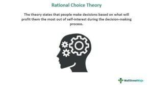

Algorithmic trading, often referred to as algo trading, has fundamentally changed financial markets by deploying computer programs to automate the process of trading orders at speeds and frequencies that are impossible for a human trader to achieve. This technological leap has enabled traders to execute complex strategies swiftly and efficiently, reshaping the dynamics of stock exchanges globally.

One critical aspect often overlooked in the rapid transaction environment is the occurrence of "aged fails." An aged fail represents a situation where a trade fails to settle within the standard time frame, typically extending beyond 30 days past the expected settlement date. Understanding these failures is essential as they can have significant implications on trading operations and the broader financial market environment. In particular, aged fails can lead to disruptions in liquidity, increased counterparty risk, and can signal underlying issues in the trading or settlement processes.



This article examines the concept of aged fail within algo trading, shedding light on its implications and providing examples to enhance comprehension. While the technology of algorithmic trading promises precision and efficiency, the complexity of modern trading systems inevitably introduces scenarios where trades do not settle as planned. Such failures in settlement can arise from technical glitches, liquidity constraints, or errors in executing trades, underscoring the importance of effective risk management and mitigation strategies.

Addressing aged fails is vital for traders as these failures impact the settlement process and, ultimately, the financial positions of all involved parties. By identifying the causes and implementing strategies to manage these risks, traders can significantly improve their operational efficiency and reduce potential financial liabilities. This exploration is not just about identifying problems but also about understanding how strategic approaches and rigorous risk management practices can prevent aged fails from adversely affecting trading success. Through enhanced understanding and vigilance, traders can secure more stable and transparent trading operations.

## Table of Contents

## Understanding Algorithmic Trading

Algorithmic trading employs computer algorithms to execute trade orders based on predefined parameters, leveraging vast datasets to pinpoint optimal trading opportunities. This form of trading relies heavily on the ability of algorithms to quickly analyze data and execute trades much faster than human traders.

The evolution of algorithmic trading has been marked by a significant shift from basic strategies, such as simple moving average models, to highly sophisticated, AI-driven approaches. Early algorithmic strategies often involved linear models, like moving averages or mean reversion strategies, where the algorithm would make trades based on historical price trends or deviations from a moving average line. As technology advanced, so did the complexity of the algorithms. Modern algorithms can incorporate elements of machine learning and artificial intelligence to adapt to market conditions in real time, further enhancing their effectiveness and flexibility.

One of the key advantages of [algorithmic trading](/wiki/algorithmic-trading) is speed. Computers can execute trades in fractions of a second, far quicker than a human can blink. This rapid execution reduces slippage, which is the difference between the expected transaction price and the actual price, allowing traders to enter and [exit](/wiki/exit-strategy) positions at optimal prices. Another significant benefit is precision. Algorithms can manage complex calculations and execute trades with a high degree of accuracy, based on pre-defined rules, without being influenced by emotions or fatigue.

Algorithmic trading also allows for extensive back-testing, enabling traders to evaluate strategies against historical data before deploying them in live trading scenarios. This feature reduces the risk as traders can assess how a strategy might perform in different market conditions, optimizing it before any capital is actually invested.

Here's a basic example of a moving average crossover strategy implemented in Python:

```python
import pandas as pd

def moving_average_strategy(data, short_window=40, long_window=100):
    signals = pd.DataFrame(index=data.index)
    signals['signal'] = 0.0

    # Compute the short simple moving average
    signals['short_mavg'] = data['close'].rolling(window=short_window, min_periods=1, center=False).mean()

    # Compute the long simple moving average
    signals['long_mavg'] = data['close'].rolling(window=long_window, min_periods=1, center=False).mean()

    # Create signals
    signals['signal'][short_window:] = np.where(signals['short_mavg'][short_window:] 
                                                > signals['long_mavg'][short_window:], 1.0, 0.0)   

    # Generate trading orders
    signals['positions'] = signals['signal'].diff()

    return signals
```

This example uses a simple moving average crossover strategy where a short-term moving average exceeds a long-term moving average as a buy signal, and vice-versa.

In summary, algorithmic trading's contributions to modern financial markets are vast, offering unprecedented speeds, precision, and the ability to rigorously back-test strategies. Its continuous evolution toward more complex strategies, particularly those involving AI, indicates its growing importance and adaptability in the dynamic landscape of trading.

## What Is an Aged Fail in Trading?

An aged fail in trading refers to a situation where a financial transaction does not settle within the expected timeframe, typically extending beyond 30 days past the standard settlement date. This problem can arise due to various factors, each presenting potential financial risks to the involved parties.

Technical issues often contribute to aged fails. These can include problems with the systems used for executing trades, such as software glitches or failures in communication between trading platforms and clearing houses. Such issues can delay the transfer of securities or payments, hindering the completion of transactions.

Lack of [liquidity](/wiki/liquidity-risk-premium) is another common cause of aged fails. Liquidity in financial markets refers to the ease with which an asset can be bought or sold without causing significant price changes. When markets experience low liquidity, it may be challenging for parties to find counterparties willing to settle the transaction, leading to delays.

Errors in trade execution also play a significant role in aged fails. These errors can be human errors, such as incorrect data entry or mismatches in trade details, or automated process errors, where trading algorithms may execute trades under conditions not conducive to timely settlement. Such discrepancies can cause significant delays, leading to aged fails if not promptly rectified.

Understanding the triggers of aged fails is crucial for effective risk mitigation. Failure to deliver assets or payments on time is a primary trigger, which can occur due to the aforementioned factors. By identifying and addressing these triggers, traders and financial institutions can improve their settlement processes, reduce financial exposure, and maintain the integrity and efficiency of trading operations.

To this end, enhancing automated systems to detect potential fails early and implementing robust monitoring mechanisms can be beneficial. These efforts ensure timely settlement and compliance with financial regulations, safeguarding the interests of all trading parties involved.

## Examples of Aged Fail in Algo Trading

An aged fail in algorithmic trading can manifest when a financial transaction does not settle within the stipulated time frame, typically extending beyond 30 days past the intended settlement date. A common instance of such a fail is a settlement failure in a stock transaction. This occurs when the buyer is unable to transfer the requisite funds on time, resulting in a disruption in the settlement process. Such delays can be attributed to various technical or operational challenges that hinder the timely execution of trades.

In the context of leveraged positions, aged fails can occur when a trader employs borrowed capital to amplify their trading position, yet the broker or exchange fails to facilitate the settlement. This situation may arise due to inadequate margin maintenance, discrepancies in margin calculations, or systemic issues within the broker or exchange infrastructure. These elements can collectively contribute to settlement delays, leading to aged fails.

Identifying and addressing patterns leading to aged fails necessitates a thorough review of historical data and settlement records. By analyzing past transactions, traders and analysts can pinpoint recurring issues or systemic inadequacies that may precipitate such failures. This involves examining trade execution logs, margin requirements, and cash flow records to detect inconsistencies or bottlenecks in the trading process.

To facilitate this analysis, Python can be employed to automate the review process and highlight potential problem areas. A simple Python code snippet for such an analysis could look like the following:

```python
import pandas as pd

# Load historical trading data
data = pd.read_csv('trade_data.csv')

# Filter instances where settlement delay is over 30 days
aged_fails = data[data['settlement_delay'] > 30]

# Analyze patterns
pattern_analysis = aged_fails.groupby(['reason', 'instrument']).size()

# Display results
print(pattern_analysis)
```

This Python script reads historical trading data, isolates cases where the settlement delay surpasses 30 days, and categorizes these instances by reason and financial instrument. The resulting analysis provides insights into which factors and securities are most frequently associated with aged fails, thereby helping to formulate targeted intervention strategies. Such proactive measures can mitigate the financial risks posed by aged fails, safeguarding both traders and their counterparties.

## Risk Management and Prevention Strategies

To address potential issues leading to aged fails, implementing strict compliance protocols and continuously monitoring trade settlements is crucial. Compliance ensures that all trading activities adhere to industry regulations and guidelines, reducing the risk of errors and delays in settlement. Continuous monitoring allows traders to identify discrepancies and rectify them swiftly, thus minimizing the chances of aged fails.

Liquidity and hedging strategies are essential tools in managing risks associated with market [volatility](/wiki/volatility-trading-strategies), which can increase the likelihood of aged fails. Liquidity management involves maintaining sufficient capital reserves or access to funding to meet settlement obligations promptly. Hedging strategies, on the other hand, enable traders to offset potential losses by taking positions that compensate for adverse price movements. For example, a trader might use derivative contracts like options or futures to hedge against price fluctuations in the underlying assets.

Automated risk management systems play a pivotal role in enhancing the efficiency of monitoring and mitigating risks related to aged fails. These systems use algorithms and [machine learning](/wiki/machine-learning) models to analyze trading data in real-time, detecting anomalies or patterns that might indicate potential settlement failures. Upon detecting an issue, the system can trigger alerts, allowing traders to take corrective action promptly.

Additionally, automated systems can facilitate the allocation of additional capital to cover anticipated fails by adjusting margin requirements or executing contingency trades. Here's a basic Python example demonstrating how a simple alert system might work:

```python
def check_settlement_risk(trade_data, threshold):
    """
    Monitor trade data to detect potential aged fails and trigger alerts.

    :param trade_data: list of trade dictionaries with 'settlement_status' and 'risk_score'.
    :param threshold: risk score threshold to trigger an alert.
    :return: list of alerts for trades exceeding the risk threshold.
    """
    alerts = []
    for trade in trade_data:
        if trade['settlement_status'] == 'unsettled' and trade['risk_score'] > threshold:
            alerts.append({
                'trade_id': trade['trade_id'],
                'message': 'High risk of aged fail detected'
            })
    return alerts

# Example trade data
trades = [
    {'trade_id': 1, 'settlement_status': 'settled', 'risk_score': 50},
    {'trade_id': 2, 'settlement_status': 'unsettled', 'risk_score': 80},
    {'trade_id': 3, 'settlement_status': 'unsettled', 'risk_score': 90}
]

# Set risk threshold
risk_threshold = 75

# Check for risk alerts
risk_alerts = check_settlement_risk(trades, risk_threshold)
print(risk_alerts)
```

In this hypothetical example, a function `check_settlement_risk` evaluates a list of trades, issuing alerts for those deemed to have a high risk of becoming aged fails. Risk scores exceeding a predefined threshold trigger these alerts, facilitating proactive risk management.

By combining strict compliance measures, strategic liquidity management, hedging, and automated risk monitoring systems, traders can significantly reduce the occurrence of aged fails and maintain the efficiency and reliability of their trading operations.

## Benefits of Understanding Aged Fails for Traders

Understanding aged fails in algorithmic trading provides significant advantages by promoting transparency and trust within the trading process. This transparency allows for a clearer inspection of financial operations, an element critical for both institutions and individual traders to grasp the full landscape of their investment risks and returns. As aged fails often arise from delays or errors in the settlement process, comprehending these occurrences can greatly reduce uncertainties that may affect market confidence.

Moreover, incorporating an understanding of aged fails into trading strategies helps in refining these strategies by anticipating and addressing potential discrepancies in trade settlements. This knowledge encourages traders to anticipate settlement issues and incorporate safeguards within their strategies. For example, algorithms can be adjusted to account for potential cash flow mismatches or to integrate contingency measures that trigger specific actions when a fail is detected. By considering the likelihood of aged fails, traders can optimize their models to minimize disruptions and enhance the efficiency of their operations.

Due diligence in understanding aged fails also involves a commitment to protecting stakeholders from financial losses. By identifying trends and patterns that typically precede aged fails, traders can take proactive measures to prevent these issues from impacting their portfolios. This involves regular review and analysis of settlement data, applying statistical models to forecast potential fails, and consistently updating trading algorithms to reflect changing market conditions.

Achieving this level of awareness and analytical precision ultimately contributes to enhanced market efficiency. Enhanced efficiency is derived from fewer transaction bottlenecks, leading to more consistent and timely settlements. As the settlement process becomes more reliable through the mitigation of aged fails, both liquidity in the market and investor confidence tend to increase, resulting in a healthier trading environment.

Implementing algorithms that analyze historical settlement data could be beneficial. Here is an example using Python:

```python
import pandas as pd

# Assume 'settlements_data.csv' is a dataset with columns: 'transaction_id', 'settlement_date', 'actual_settlement_date'
data = pd.read_csv('settlements_data.csv')

# Calculate the delays in settlement days
data['delay_days'] = (pd.to_datetime(data['actual_settlement_date']) - pd.to_datetime(data['settlement_date'])).dt.days

# Identify aged fails as settlements delayed by more than 30 days
aged_fails = data[data['delay_days'] > 30]

# Output the percentage of aged fails
percent_aged_fails = (len(aged_fails) / len(data)) * 100
print(f"Percentage of aged fails: {percent_aged_fails:.2f}%")
```

By actively employing such preventive measures and analytical tools, traders can greatly mitigate the adverse effects of aged fails, thereby safeguarding their investments and contributing to a more robust and transparent trading environment.

## Conclusion

Properly addressing aged fails is crucial for ensuring smoother operations in algorithmic trading. Aged fails, which arise from delays in the settlement of transactions, can introduce significant risks and inefficiencies in financial markets. By understanding and mitigating these issues, traders can enhance the reliability and effectiveness of their trading processes.

Traders should actively leverage advanced technologies and frameworks to remain vigilant about potential aged fails. For instance, real-time monitoring systems can detect anomalies in settlement processes, allowing for prompt resolution of issues before they escalate. Implementing automated solutions can also facilitate quick detection and management of trading discrepancies, ensuring that transactions are completed within the agreed time frame.

Moreover, consistent strategy optimization plays a significant role in mitigating aged fails. By regularly reviewing and adjusting trading strategies based on historical data and market conditions, traders can anticipate potential disruptions in settlement processes. This proactive approach not only minimizes the likelihood of aged fails but also enhances overall strategy performance, contributing to long-term trading success.

In conclusion, understanding and addressing aged fails is essential for maintaining the integrity and efficiency of algorithmic trading systems. By utilizing robust technologies and optimizing strategies, traders can minimize risks, ensuring that their operations remain sustainable and successful in the dynamic financial markets.

## References & Further Reading

[1]: Bergstra, J., Bardenet, R., Bengio, Y., & Kégl, B. (2011). ["Algorithms for Hyper-Parameter Optimization."](https://proceedings.neurips.cc/paper/2011/file/86e8f7ab32cfd12577bc2619bc635690-Paper.pdf) Advances in Neural Information Processing Systems 24.

[2]: ["Advances in Financial Machine Learning"](https://www.amazon.com/Advances-Financial-Machine-Learning-Marcos/dp/1119482089) by Marcos Lopez de Prado

[3]: ["Evidence-Based Technical Analysis: Applying the Scientific Method and Statistical Inference to Trading Signals"](https://www.semanticscholar.org/paper/Evidence-Based-Technical-Analysis%3A-Applying-the-and-Aronson/3b33df8737f1772e9e14d66a08c9696f140a2ee1) by David Aronson

[4]: ["Machine Learning for Algorithmic Trading"](https://github.com/PacktPublishing/Machine-Learning-for-Algorithmic-Trading-Second-Edition) by Stefan Jansen

[5]: ["Quantitative Trading: How to Build Your Own Algorithmic Trading Business"](https://books.google.com/books/about/Quantitative_Trading.html?id=j70yEAAAQBAJ) by Ernest P. Chan