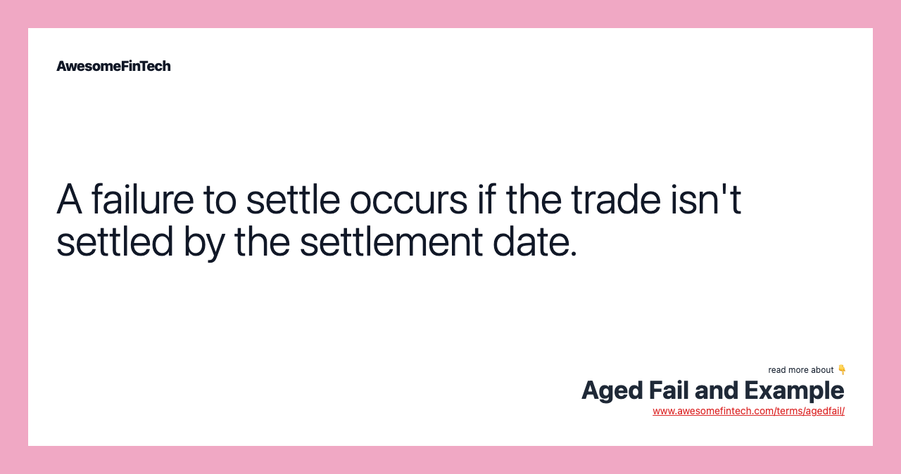

## Table of Contents

## What is the basic concept of Aged Fail?

Aged Fail is a term used in the world of trading and finance. It refers to a situation where a transaction, usually the delivery of securities, does not happen on time. When this happens, the transaction is considered "failed." If this failure continues for a long time, it becomes an "aged fail." This can happen for many reasons, like problems with paperwork or issues with the systems used for trading.

Aged fails can cause problems for both the buyer and the seller. For the buyer, it means they don't get the securities they bought, which can mess up their plans. For the seller, it can mean they don't get paid on time, which can cause money problems. To fix aged fails, people in the finance world work hard to solve the issues causing the delays. This helps make sure that trading can keep going smoothly and that everyone gets what they are supposed to get.

## How does Aged Fail differ from other failure analysis methods?

Aged Fail is different from other failure analysis methods because it focuses specifically on the time aspect of a failed transaction in trading. While other methods might look at why a failure happened or how to fix it right away, Aged Fail is about what happens when a failure goes on for a long time. It's not just about the immediate problem but about the ongoing effects of that problem. This makes Aged Fail unique because it helps people understand the long-term impact of delays in transactions.

Other failure analysis methods might be more about finding the root cause of a failure or figuring out how to prevent it from happening again. For example, root cause analysis tries to dig deep into why something went wrong, while Aged Fail is more about managing the consequences of a failure that keeps happening. This difference means that Aged Fail is more about dealing with the ongoing situation and less about fixing the initial issue. It helps traders and financial institutions manage their risks and keep their operations running smoothly even when things don't go as planned.

## What are the primary applications of Aged Fail in industry?

Aged Fail is mostly used in the finance and trading world. It helps people in these industries keep track of transactions that don't happen on time. When a transaction fails and keeps failing for a long time, it becomes an Aged Fail. This helps traders and financial institutions see which deals are causing problems and need attention. By knowing about Aged Fails, they can work on fixing the issues causing the delays and make sure they don't affect their business too much.

In the stock market, Aged Fail is very important. It helps stock brokers and investors understand when they won't get the stocks they bought on time. This can be a big deal because it might mess up their plans to buy or sell other stocks. By keeping an eye on Aged Fails, they can make better decisions and manage their money better. It also helps them talk to their clients about any delays and keep everyone in the loop.

Aged Fail can also be used in other parts of finance, like bond trading or commodities. In these areas, it helps traders see when deliveries are late and figure out what to do next. Knowing about Aged Fails can help them plan better and avoid big problems. This way, they can keep their business running smoothly even when things don't go as planned.

## Can you explain the steps involved in conducting an Aged Fail analysis?

To conduct an Aged Fail analysis, you first need to find out which transactions have failed and how long they've been failing. This means looking at all the trades that were supposed to happen but didn't. You need to check the records to see when each transaction was supposed to be done and compare that with when it actually happened. If a transaction is still not done after a long time, it becomes an Aged Fail. This step is important because it helps you know which transactions need attention.

Once you've found the Aged Fails, the next step is to figure out why they're happening. This might mean looking at things like paperwork problems, system errors, or other issues that are causing the delays. After you know why the transactions are failing, you can start working on fixing the problems. This might involve talking to the people involved in the trade, fixing any technical issues, or finding other ways to get the transaction done. The goal is to solve the Aged Fails as quickly as possible so that everyone can get what they're supposed to get and the business can keep running smoothly.

## What tools and technologies are commonly used in Aged Fail assessments?

In Aged Fail assessments, people often use special computer programs to help them keep track of trades that are late. These programs can look at lots of data quickly and find out which trades are not happening on time. They can also show how long each trade has been failing, which helps people know if it's an Aged Fail. Some common tools include trading platforms that have built-in features for tracking failed trades, and software that can send alerts when a trade has been failing for too long.

Besides computer programs, people also use databases to store all the information about trades. These databases help them keep everything organized and make it easy to look up details about each trade. They can also use reporting tools to make reports that show which trades are Aged Fails and how they're affecting the business. By using these tools and technologies, people in the finance world can manage Aged Fails better and keep their business running smoothly.

## How does the aging process affect material failure, and how is this accounted for in Aged Fail?

The aging process can make materials weaker over time. When materials get old, they might start to crack, rust, or wear out. This can lead to failures, like when a part of a machine breaks because it's old and weak. In trading, the aging process isn't about materials getting old, but about transactions that keep failing for a long time. Just like how old materials can cause problems, old failed transactions can also cause issues if they're not fixed.

In Aged Fail, the focus is on how long a transaction has been failing, not on the physical aging of materials. When a trade doesn't happen on time and keeps failing, it becomes an Aged Fail. This is important because it helps people in the finance world see which trades are causing problems and need to be fixed. By keeping track of Aged Fails, they can work on solving the issues causing the delays and make sure their business keeps running smoothly, even when things don't go as planned.

## What are the common challenges faced when implementing Aged Fail techniques?

When people try to use Aged Fail techniques, they often run into some problems. One big challenge is getting all the right data. To know which trades are Aged Fails, you need to keep track of a lot of information about each trade. This can be hard because the data might be spread out in different places or not easy to get. If the data is not complete or correct, it can be tough to figure out which trades are really Aged Fails.

Another challenge is that fixing Aged Fails can take a lot of time and work. Once you find out which trades are Aged Fails, you need to figure out why they're not happening and then fix the problems. This might mean talking to different people, fixing technical issues, or finding new ways to get the trade done. All of this can be a lot of work, and if it takes too long, the Aged Fails can keep causing problems for the business.

Lastly, keeping everyone on the same page can be tricky. When trades fail and keep failing, it can affect a lot of people, like buyers, sellers, and the people who work at the trading company. Making sure everyone knows what's going on and what's being done to fix the Aged Fails can be hard. If people don't understand what's happening, it can lead to more confusion and problems.

## How can Aged Fail be integrated into existing maintenance and safety protocols?

Aged Fail can be added to the way companies already handle maintenance and safety by keeping a close eye on trades that don't happen on time. When a trade fails and keeps failing for a long time, it becomes an Aged Fail. By checking these trades often, companies can find out which ones are causing problems and need to be fixed. This can be done by using special computer programs that track trades and send alerts when a trade has been failing for too long. By doing this, companies can make sure they know about Aged Fails quickly and can work on solving them before they cause bigger problems.

To make sure Aged Fail fits well with existing safety rules, companies need to make sure everyone knows about Aged Fails and what to do about them. This means training people to understand what Aged Fails are and how to report them. It also means setting up clear rules for how to fix Aged Fails and making sure everyone follows these rules. By doing this, companies can keep their trading safe and smooth, even when trades don't happen on time. This helps them avoid big problems and keep everyone happy and safe.

## What are some case studies that demonstrate the successful application of Aged Fail?

One case study that shows how Aged Fail can be used well is from a big stock trading company. They started using a special computer program to keep track of trades that were late. When a trade didn't happen on time and kept failing, the program would send an alert to the people in charge. They could then look into why the trade was failing and work on fixing it. By doing this, they were able to solve Aged Fails faster and make sure their clients got what they were supposed to get. This helped them keep their business running smoothly and made their clients happy.

Another example comes from a bond trading firm. They had a lot of trades that were not happening on time, and it was causing problems. They decided to use a database to keep all the information about these trades in one place. This made it easier for them to see which trades were Aged Fails and how long they had been failing. By keeping a close eye on these trades, they could find the issues causing the delays and fix them quickly. This helped them manage their trades better and avoid big problems that could have hurt their business.

## How do regulatory standards impact the use of Aged Fail in different sectors?

Regulatory standards can change how Aged Fail is used in different sectors. In the finance world, rules set by groups like the Securities and Exchange Commission (SEC) make sure that trades happen on time. If a trade fails and keeps failing, it can cause problems that might break these rules. Companies have to follow these rules, so they use Aged Fail to keep track of late trades and fix them quickly. This helps them avoid getting in trouble with the regulators and keeps their business running smoothly.

In other sectors, like manufacturing, Aged Fail might not be about trades but about how long it takes to fix broken machines. Here, rules from groups like the Occupational Safety and Health Administration (OSHA) can affect how companies handle Aged Fails. They need to make sure that machines are fixed quickly to keep workers safe and avoid breaking safety rules. By using Aged Fail, companies can see which machines have been broken for a long time and work on fixing them before they cause bigger problems. This helps them follow the rules and keep their workplace safe.

## What advanced techniques can be applied to enhance the accuracy of Aged Fail predictions?

To make Aged Fail predictions more accurate, people can use something called [machine learning](/wiki/machine-learning). This is a kind of computer program that can learn from past data to guess what will happen in the future. By looking at old trades that failed and became Aged Fails, the program can find patterns and use them to predict when new trades might fail and for how long. This helps companies fix problems faster and avoid big issues that could hurt their business.

Another way to improve Aged Fail predictions is by using real-time data. This means keeping track of trades as they happen and updating the information all the time. With real-time data, companies can see when a trade starts to fail and act quickly to fix it before it becomes an Aged Fail. This can help them make better decisions and keep their trading smooth and safe.

## What future developments are expected in the field of Aged Fail analysis?

In the future, Aged Fail analysis is expected to get even better with new technology. One big change might be using [artificial intelligence](/wiki/ai-artificial-intelligence) (AI) to predict Aged Fails even more accurately. AI can learn from lots of data about past trades and find patterns that people might miss. This could help companies know when a trade might fail and become an Aged Fail before it even happens. By using AI, they can fix problems faster and keep their business running smoothly.

Another expected development is better ways to share information about Aged Fails. Right now, companies might keep track of Aged Fails on their own, but in the future, they might use something called blockchain to share this information with others. Blockchain is a way to keep records that everyone can see and trust. By using blockchain, companies can work together to fix Aged Fails and make sure trades happen on time. This could help make the whole trading world safer and more reliable.

## References & Further Reading

[1]: Bergstra, J., Bardenet, R., Bengio, Y., & Kégl, B. (2011). ["Algorithms for Hyper-Parameter Optimization."](https://proceedings.neurips.cc/paper/2011/file/86e8f7ab32cfd12577bc2619bc635690-Paper.pdf) Advances in Neural Information Processing Systems 24.

[2]: ["Advances in Financial Machine Learning"](https://www.amazon.com/Advances-Financial-Machine-Learning-Marcos/dp/1119482089) by Marcos Lopez de Prado

[3]: ["Evidence-Based Technical Analysis: Applying the Scientific Method and Statistical Inference to Trading Signals"](https://www.semanticscholar.org/paper/Evidence-Based-Technical-Analysis%3A-Applying-the-and-Aronson/3b33df8737f1772e9e14d66a08c9696f140a2ee1) by David Aronson

[4]: ["Machine Learning for Algorithmic Trading"](https://github.com/PacktPublishing/Machine-Learning-for-Algorithmic-Trading-Second-Edition) by Stefan Jansen

[5]: ["Quantitative Trading: How to Build Your Own Algorithmic Trading Business"](https://books.google.com/books/about/Quantitative_Trading.html?id=j70yEAAAQBAJ) by Ernest P. Chan