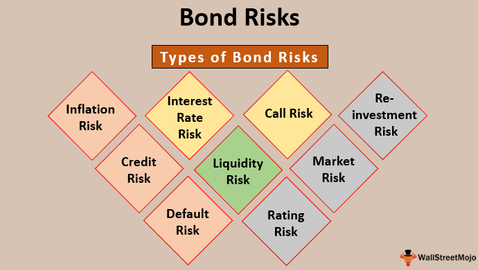

Investing in bonds, algorithmic trading, and understanding financial returns involves navigating a landscape filled with variables and risks. Each of these components plays a pivotal role in the broader context of financial markets, which provide a platform for investors to allocate resources efficiently while managing potential downsides. This article aims to simplify the complex interplay between investment risk, financial returns, agency bonds, and algorithmic trading to foster informed decision-making among investors.

Investment risk stands as a fundamental concern, as it encompasses the possibility of incurring financial loss. Different financial instruments, from stocks and bonds to derivatives, each present unique risk and return profiles. Mastering the art of risk assessment and management is vital for anyone pursuing successful investment strategies, enabling them to safeguard their capital while seeking gains.



Financial returns, on the other hand, represent the earnings generated from investments over specific timelines. They are influenced by several elements, including interest rates, inflation rates, and various economic indices. Recognizing the correlation between risk and return is crucial for assembling a balanced investment portfolio that aligns with one's financial objectives.

Agency bonds, often issued by government agencies or government-sponsored entities (GSEs) in the United States, are traditionally regarded as low-risk investment opportunities. Their relative safety and liquidity make them comparable to Treasury bonds, though nuances exist that affect their risk-return dynamics. Understanding these distinctions can aid investors in making more nuanced investment decisions.

Algorithmic trading introduces a different dimension to investing by leveraging automated systems based on pre-set criteria to execute trades rapidly. This method enables investors to exploit market inefficiencies and trends, but also warrants consideration of its benefits and potential pitfalls within today's complex financial markets.

The integration of these elements presents investors with a wide array of instruments and strategies for managing investment risk while pursuing favorable returns. A comprehensive understanding of these components is indispensable for investors aiming to optimize their portfolios, especially in an environment where economic indicators and market conditions are ever-evolving.

## Table of Contents

## Understanding Investment Risks

Investment risk is fundamentally the potential for an investor to experience a decrease in their invested capital, leading to partial or complete loss. It is an inherent part of investing and varies across different financial instruments such as stocks, bonds, and derivatives. Recognizing and evaluating these risks is critical to formulating successful investment strategies. 

Risk in financial investments can be categorized into several types, including market risk, credit risk, [liquidity](/wiki/liquidity-risk-premium) risk, and operational risk. Market risk, also known as systematic risk, reflects the possibility of an investor incurring losses due to factors that affect the overall performance of the financial markets. This is typically unmitigable by diversification. Conversely, unsystematic risk, specific to a particular company or industry, can be reduced through proper diversification across various sectors or industries.

Credit risk arises when there is a possibility that a bond issuer or borrowing party might default on their financial obligations. This type of risk is particularly prevalent in bond investments, where the repayment of both interest and principal is pivotal. Liquidity risk is the risk of being unable to sell an investment quickly enough in the market without affecting its price adversely. It is generally higher for assets that do not trade frequently.

Effectively managing investment risk relies on understanding the risk-return tradeoff - the principle that potential return rises with an increase in risk. Investors need to assess their risk tolerance levels and employ strategies to manage these risks properly. For instance, the capital asset pricing model (CAPM) aids investors in evaluating the expected return of an asset based on its beta (β), the measure of an asset's sensitivity to the overall market movements. The formula is:

$$
E(R_i) = R_f + \beta_i \times (E(R_m) - R_f)
$$

where:
- $E(R_i)$ is the expected return of the investment.
- $R_f$ is the risk-free rate.
- $\beta_i$ is the beta of the investment.
- $E(R_m)$ is the expected return of the market.

Furthermore, modern portfolio theory (MPT) suggests that it is possible to construct an 'efficient frontier' of optimal portfolios offering the maximum possible expected return for a given level of risk, aiding in systematic risk management.

Also, employing algorithmic solutions and financial models can facilitate thorough risk assessment. Python, for example, can be used to simulate different market conditions or to calculate various risk measures, enhancing decision-making. Here’s an example of a Python code snippet that calculates the VaR (Value at Risk) for a portfolio:

```python
import numpy as np

def calculate_var(portfolio_returns, confidence_level=0.95):
    """
    Calculate the Value at Risk (VaR) of a portfolio.
    """
    sorted_returns = np.sort(portfolio_returns)
    index = int((1 - confidence_level) * len(sorted_returns))
    var = sorted_returns[index]
    return var

# Example usage
portfolio_returns = np.random.normal(0.001, 0.02, 1000)  # Simulated portfolio returns
var = calculate_var(portfolio_returns)
print(f"Value at Risk (VaR) at 95% confidence level: {var:.2f}")
```

By understanding the nuances of investment risk and employing different risk management techniques, investors can make informed decisions that align with their risk tolerance and return expectations, fostering the potential for more resilient investment portfolios.

## Financial Returns: Basics and Beyond

Financial returns represent the financial gains or losses that an investor experiences from an investment over a designated period. These returns are a crucial metric for evaluating the effectiveness and performance of different investment strategies. The fundamental components influencing financial returns include interest rates, inflation, and various economic indicators. 

Interest rates play a pivotal role in determining financial returns. When interest rates rise, the cost of borrowing increases, which can dampen economic growth and lower investment returns. Conversely, lower interest rates tend to boost economic activity by making borrowing cheaper, potentially elevating returns on investments. Bonds, for example, are directly impacted by changes in interest rates due to their fixed income nature; when rates fall, existing bonds with higher coupon rates become more attractive, increasing their market value.

Inflation is another critical [factor](/wiki/factor-investing), representing the rate at which the general level of prices for goods and services rises, eroding purchasing power. Inflation affects the real rate of return on investments. The real return is calculated as:

$$
\text{Real Return} = \frac{1 + \text{Nominal Return}}{1 + \text{Inflation Rate}} - 1
$$

Nominal returns may appear positive, but if inflation is higher, the real returns might be negative, impacting the true profitability of an investment. 

Economic indicators such as Gross Domestic Product (GDP) growth rates, employment figures, and consumer confidence indices offer insights into the broader economic conditions that can affect investment performance. A strong economy tends to boost corporate profits, which can lead to higher stock prices and improved investment returns.

Understanding the interplay between risk and return is vital for developing a balanced investment portfolio. The risk-return tradeoff principle holds that potential return rises with an increase in risk. Low-risk investments, like government bonds, typically yield lower returns, whereas high-risk investments, such as stocks or derivatives, may offer higher potential returns. Balancing these elements is key to achieving an optimal portfolio that aligns with an investor’s risk tolerance and financial goals.

Investors employ various strategies to manage this balance, such as diversification, which involves spreading investments across different asset classes to reduce risk. Modern Portfolio Theory (MPT) provides a mathematical framework for diversifying portfolios effectively. It suggests that by combining assets with varying returns, it's possible to construct a portfolio that maximizes returns for a given level of risk. The efficient frontier is a concept within MPT that represents the set of optimal portfolios offering the highest expected return for a defined level of risk.

In summary, understanding the elements affecting financial returns—interest rates, inflation, and economic indicators—and the inherent risk-return relationship is essential for investors. These insights enable informed decision-making in building portfolios that strive for a harmonious balance between risk and reward.

## What Are Agency Bonds?

Agency bonds are debt securities issued by government agencies or government-sponsored entities (GSEs) in the United States. Unlike Treasury bonds, which are directly issued by the U.S. Department of the Treasury, agency bonds originate from separate bodies responsible for supporting specific sectors of the economy, such as housing or agriculture. The most notable GSEs include the Federal National Mortgage Association (Fannie Mae), the Federal Home Loan Mortgage Corporation (Freddie Mac), and the Government National Mortgage Association (Ginnie Mae).

These bonds are considered low-risk investments because they possess an implicit government backing, meaning they are generally perceived as a safe bet in terms of credit risk. However, it is important to distinguish that not all agency bonds come with the same level of government backing. For instance, bonds issued by Ginnie Mae have the explicit guarantee of the U.S. government, much like Treasury securities. Conversely, bonds issued by Fannie Mae and Freddie Mac do not [carry](/wiki/carry-trading) the same explicit guarantee, although they enjoy an implied backing due to their close relationship with the government.

The lower risk associated with agency bonds often means they offer lower yields compared to corporate bonds. However, they still typically provide better returns than Treasury bonds due to the slightly higher risk. Investors regard this trade-off as acceptable, especially considering the relatively high liquidity of agency bonds. Liquidity, which denotes the ease with which an asset can be bought or sold in the market without affecting its price, is crucial for investors seeking predictable cash flows.

Investors must carefully consider the nuances between various agency bonds and GSEs to make informed decisions. The critical elements impacting investment choices include credit risk, [interest rate](/wiki/interest-rate-trading-strategies) risk, and prepayment risk, the latter being particularly significant for mortgage-backed securities. Prepayment risk arises when borrowers pay off their mortgages ahead of schedule, potentially leading to lower-than-expected returns for investors.

Overall, agency bonds are a staple in many portfolios, especially those focused on fixed-income investments seeking stability and reliability. They offer a balanced mix of safety and return potential that appeals to risk-averse investors.

## Algo Trading in Modern Markets

Algorithmic trading, commonly known as algo trading, refers to the use of automated systems to execute trades based on pre-defined criteria. This approach leverages computer algorithms to monitor market data and execute orders at speeds and frequencies that exceed human capability. By doing so, investors can quickly exploit market inefficiencies and trends, providing a significant advantage in modern financial markets.

A key benefit of [algorithmic trading](/wiki/algorithmic-trading) is its ability to enhance efficiency and precision. Algorithms can analyze vast amounts of data in real-time, executing trades at optimal prices while minimizing transaction costs. This reduces the human error associated with manual trading and allows for more disciplined, emotion-free investment decisions. For instance, strategies such as statistical [arbitrage](/wiki/arbitrage) utilize quantitative models to identify price discrepancies among securities, executing trades to capitalize on these short-term anomalies.

Python, a popular programming language in finance due to its simplicity and extensive libraries, can be used to demonstrate a basic algorithmic trading strategy. Below is a simplified example using the popular `pandas` library to implement a moving average crossover strategy:

```python
import pandas as pd

# Load historical stock data
data = pd.read_csv('stock_data.csv', parse_dates=True, index_col='Date')

# Calculate moving averages
data['SMA50'] = data['Close'].rolling(window=50).mean()
data['SMA200'] = data['Close'].rolling(window=200).mean()

# Generate trade signals
data['Signal'] = 0
data.loc[data['SMA50'] > data['SMA200'], 'Signal'] = 1
data.loc[data['SMA50'] < data['SMA200'], 'Signal'] = -1

# Extract trade signals
trade_signals = data[data['Signal'] != 0]
```

While algorithmic trading offers numerous advantages, it is not without its challenges. High-frequency trading ([HFT](/wiki/high-frequency-trading-strategies)), a subset of algorithmic trading, has been criticized for contributing to market [volatility](/wiki/volatility-trading-strategies) and has raised concerns about fairness in financial markets. The flash crash of 2010 is often cited as an example where algorithmic trading exacerbated market instability.

In addition, the complexity of developing and maintaining these systems requires significant technological infrastructure and expertise. Regulatory scrutiny has also increased, with authorities worldwide implementing measures to monitor and manage the impact of high-speed trading on market integrity.

In summary, algorithmic trading plays a crucial role in modern financial markets, offering opportunities to enhance trading efficiency and capitalize on market movements swiftly. However, the reliance on technology and the associated risks necessitate careful consideration and robust risk management practices. As with any investment strategy, understanding both the advantages and potential pitfalls of algo trading is vital for investors seeking to optimize their portfolios in today's dynamic financial landscape.

## Balancing Agency Bonds and Algo Trading

Incorporating agency bonds into an algorithmic trading strategy can provide investors with a strategic hedge against market volatility, offering a balanced approach to managing investment risks and optimizing returns. Agency bonds, known for their low-risk profile, can act as a stable component within an automated trading framework that primarily oscillates around high-frequency trading (HFT) strategies.

When considering diversification, blending agency bonds with a high-frequency trading strategy leverages the stability of bonds and the agility of automated systems. Diversification is a risk management strategy that mixes a wide variety of investments within a portfolio, with the rationale that a diversified portfolio will, on average, yield higher returns and pose a lower risk than any individual investment found within the portfolio. The formula for diversification can be expressed through the modern portfolio theory developed by Harry Markowitz, where:

$$
\text{Portfolio Variance} = \sum_{i=1}^{n}\sum_{j=1}^{n} w_i w_j \sigma_i \sigma_j \rho_{ij}
$$

Here, $w_i$ and $w_j$ are the weights of the assets within the portfolio, $\sigma_i$ and $\sigma_j$ are the standard deviations of the returns on the investments, and $\rho_{ij}$ is the correlation coefficient between the returns on the asset pairs. By including agency bonds, which generally have a low correlation with equity markets, the overall portfolio variance can be reduced, leading to a more stable investment outcome.

Algorithmic trading can be described using Python, where algorithms are coded to identify market opportunities rapidly. Below is a basic illustration of how an investor might begin to implement an automated trading strategy that involves agency bonds:

```python
import yfinance as yf  # For more datasets, visit: https://paperswithbacktest.com/datasets

# Fetch historical bond prices
agency_bond_data = yf.download('bond_symbol', start='2020-01-01', end='2023-01-01')

# Example algorithm: Identify basic moving averages for potential buy/sell signals
short_window = 40
long_window = 100

# Create signals
agency_bond_data['Short_MA'] = agency_bond_data['Close'].rolling(window=short_window, min_periods=1).mean()
agency_bond_data['Long_MA'] = agency_bond_data['Close'].rolling(window=long_window, min_periods=1).mean()
agency_bond_data['Signal'] = 0.0
agency_bond_data['Signal'][short_window:] = np.where(
    agency_bond_data['Short_MA'][short_window:] > agency_bond_data['Long_MA'][short_window:], 1.0, 0.0)

# Execute trades based on signals
agency_bond_data['Positions'] = agency_bond_data['Signal'].diff()

# Print signals
print(agency_bond_data[['Close', 'Short_MA', 'Long_MA', 'Signal', 'Positions']].tail())
```

In blending agency bonds with high-frequency trading strategies, investors can achieve resilient portfolios that effectively manage market risks. For example, during periods of high volatility, such as economic downturns or geopolitical tensions, the low-risk agency bonds can stabilize returns, while the algorithmic trading component seeks to exploit short-term market inefficiencies for profit.

Overall, such an integrative approach allows informed investors to structure a balanced strategy that leverages the best of both worlds—security through agency bonds and agility through algo trading—for a robust investment portfolio.

## Conclusion

Successfully navigating investment risks and optimizing financial returns hinges on a comprehensive understanding of the diverse financial instruments available. The interplay between low-risk avenues such as agency bonds and dynamic strategies like algorithmic trading can provide a balanced approach to maximizing returns while managing risks. 

Agency bonds, issued by government agencies or government-sponsored entities, serve as a reliable component in an investment portfolio due to their low-risk nature and high liquidity. They offer a stable and secure means to achieve returns, especially appealing to risk-averse investors. These bonds can act as a financial cushion during economic downturns, ensuring a steady income stream.

On the other hand, algorithmic trading leverages technology to exploit market inefficiencies and trends, enabling rapid and precise trade executions. This automated strategy is particularly effective in volatile markets, where quick decision-making is essential. Algorithmic trading can enhance portfolio performance through higher frequency trading, which capitalizes on short-term opportunities.

Investors seeking to optimize their portfolios ought to carefully assess their risk tolerance, market conditions, and investment goals. A balanced strategy might integrate agency bonds for stability and algorithmic trading for growth potential. Diversification across these instruments can mitigate risks and adapt to shifting economic landscapes.

Ultimately, the key lies in aligning financial strategies with individual investment profiles. By understanding and judiciously applying these tools, investors can effectively manage risks while pursuing optimal financial returns.

## References & Further Reading

[1]: Bergstra, J., Bardenet, R., Bengio, Y., & Kégl, B. (2011). ["Algorithms for Hyper-Parameter Optimization."](https://papers.nips.cc/paper/4443-algorithms-for-hyper-parameter-optimization) Advances in Neural Information Processing Systems 24.

[2]: ["Advances in Financial Machine Learning"](https://www.amazon.com/Advances-Financial-Machine-Learning-Marcos/dp/1119482089) by Marcos Lopez de Prado

[3]: ["Evidence-Based Technical Analysis: Applying the Scientific Method and Statistical Inference to Trading Signals"](https://www.amazon.com/Evidence-Based-Technical-Analysis-Scientific-Statistical/dp/0470008741) by David Aronson

[4]: ["Machine Learning for Algorithmic Trading"](https://github.com/stefan-jansen/machine-learning-for-trading) by Stefan Jansen

[5]: ["Quantitative Trading: How to Build Your Own Algorithmic Trading Business"](https://www.amazon.com/Quantitative-Trading-Build-Algorithmic-Business/dp/1119800064) by Ernest P. Chan