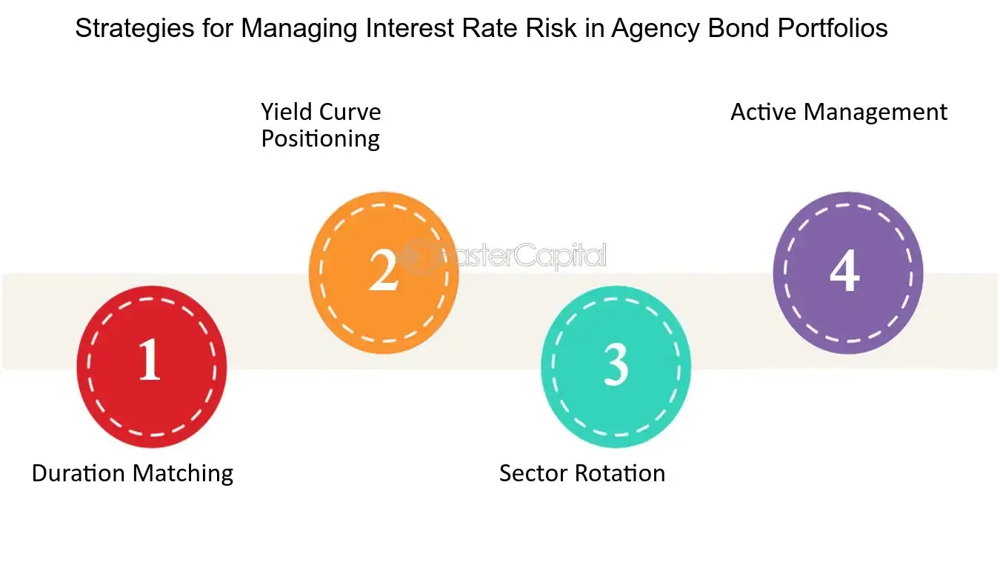

## Table of Contents

## What are agency bonds?

Agency bonds are debt securities issued by government-sponsored enterprises (GSEs) or federal government agencies. These bonds are used to fund various public projects and initiatives, such as housing and farming. Unlike Treasury bonds, which are directly issued by the U.S. Department of the Treasury, agency bonds are issued by separate entities, but they still carry a certain level of government backing, which makes them generally considered safer than corporate bonds.

There are two main types of agency bonds: those issued by GSEs, like Fannie Mae and Freddie Mac, and those issued by federal government agencies, such as the Government National Mortgage Association (Ginnie Mae). GSE bonds are not fully guaranteed by the federal government, but they are still seen as having a high level of security due to the implicit government support. On the other hand, bonds issued by federal agencies, like Ginnie Mae, are fully backed by the U.S. government, making them virtually risk-free. Investors often choose agency bonds for their higher yields compared to Treasury bonds, while still maintaining a relatively low risk profile.

## Who issues agency bonds?

Agency bonds are issued by two types of organizations: government-sponsored enterprises (GSEs) and federal government agencies. GSEs are companies created by the government to help fund certain public projects, like housing and farming. Examples of GSEs that issue agency bonds include Fannie Mae and Freddie Mac. These bonds help these organizations raise money to support their missions.

Federal government agencies also issue agency bonds. These agencies are part of the U.S. government and their bonds are fully backed by the government. An example of a federal agency that issues bonds is the Government National Mortgage Association, also known as Ginnie Mae. These bonds are used to fund programs that help people buy homes. Both types of agency bonds are seen as safe investments, but those from federal agencies are considered the safest because they have the full backing of the U.S. government.

## How do agency bonds differ from Treasury bonds?

Agency bonds and Treasury bonds are both types of government-related debt securities, but they come from different sources. Treasury bonds are issued directly by the U.S. Department of the Treasury. They are used to fund the operations and projects of the federal government. Because they are backed by the full faith and credit of the U.S. government, they are considered very safe investments. On the other hand, agency bonds are issued by government-sponsored enterprises (GSEs) like Fannie Mae and Freddie Mac, or by federal agencies like Ginnie Mae. These bonds help fund specific public initiatives, such as housing and farming.

The main difference between the two is the level of government backing. Treasury bonds have the explicit guarantee of the U.S. government, making them virtually risk-free. Agency bonds from GSEs, like those from Fannie Mae and Freddie Mac, have an implicit government guarantee, which means they are considered less safe than Treasury bonds but still quite secure. Bonds from federal agencies, like Ginnie Mae, do have the full backing of the U.S. government, similar to Treasury bonds. Another difference is that agency bonds often offer slightly higher yields than Treasury bonds to attract investors, reflecting their slightly higher risk.

## What are the typical yields offered by agency bonds?

Agency bonds usually offer higher yields than Treasury bonds but lower yields than corporate bonds. This is because they are seen as safer than corporate bonds but a bit riskier than Treasury bonds. The exact yield of an agency bond depends on things like how long it will take to get your money back, the current interest rates, and how the market feels about the bond issuer's stability.

For example, if a Treasury bond offers a yield of about 2%, an agency bond from a government-sponsored enterprise like Fannie Mae might offer a yield around 2.5% to 3%. Bonds from federal agencies like Ginnie Mae, which have the full backing of the U.S. government, might offer yields slightly above Treasury bonds, maybe around 2.2% to 2.5%. These numbers can change based on what's happening in the economy and with interest rates.

## What are the risks associated with investing in agency bonds?

Investing in agency bonds comes with some risks, but they are usually less risky than other types of bonds. One risk is that interest rates might go up. If that happens, the value of your bond could go down because new bonds would be paying more interest. This is called [interest rate](/wiki/interest-rate-trading-strategies) risk. Another risk is that the bond issuer might not be able to pay you back. This is called credit risk. For bonds from government-sponsored enterprises like Fannie Mae, this risk is low because the government might step in to help, but it's not guaranteed.

There's also something called prepayment risk, especially with bonds tied to mortgages. If interest rates fall, people might pay off their mortgages early, which means you get your money back sooner than expected. You would then have to find a new place to invest that money, maybe at a lower interest rate. But bonds from federal agencies like Ginnie Mae have less of this risk because they are fully backed by the U.S. government. So, while agency bonds are safer than many other investments, it's good to know about these risks before you decide to buy them.

## How can investors mitigate the risks of agency bonds?

Investors can lower the risks of agency bonds by spreading out their money across different types of bonds. This is called diversification. Instead of putting all your money into one kind of bond, you can buy some Treasury bonds, some agency bonds, and maybe even some corporate bonds. This way, if something goes wrong with one type of bond, you won't lose all your money. Another way to reduce risk is to pay attention to how long it will take to get your money back. Shorter-term bonds are less affected by changes in interest rates, so they might be a safer choice if you're worried about that.

Another thing investors can do is keep an eye on the overall economy and interest rates. If you think interest rates might go up, you might want to buy bonds that will pay you back sooner rather than later. Also, you can look at the credit ratings of the bond issuers. Agencies like Fannie Mae and Freddie Mac are generally seen as safe, but it's good to check their ratings to make sure. Finally, if you're worried about prepayment risk, you might want to stick to bonds from federal agencies like Ginnie Mae, which are fully backed by the U.S. government and have less of that risk.

## What role do agency bonds play in a diversified investment portfolio?

Agency bonds can be a helpful part of a diversified investment portfolio because they offer a balance between safety and return. They are generally safer than corporate bonds but can offer better yields than Treasury bonds. This makes them a good choice for investors who want to keep their money safe but also want to earn a bit more interest. By including agency bonds in a portfolio, an investor can spread their risk across different types of investments, which helps protect against big losses if one type of investment does poorly.

For example, if an investor has money in stocks, they might want to add agency bonds to balance out the risk. Stocks can go up and down a lot, but agency bonds are more stable. This mix can help smooth out the ups and downs in the value of the portfolio. Plus, agency bonds can provide regular income through interest payments, which is good for people who need a steady cash flow. Overall, agency bonds help make a portfolio more stable and can increase the overall return without taking on too much extra risk.

## How do credit ratings affect the pricing and returns of agency bonds?

Credit ratings play a big role in how much agency bonds cost and how much money they can make for investors. A credit rating is like a score that tells how likely it is for the bond issuer to pay back the money they borrowed. If an agency bond has a high credit rating, it means the bond is seen as safe, and people will be willing to pay more for it. This makes the price of the bond go up, but it also means the bond might offer a lower return because it's less risky. On the other hand, if a bond has a lower credit rating, it's seen as riskier, so people might not want to pay as much for it. This makes the price go down, but the bond might offer a higher return to attract investors who are willing to take on more risk.

For example, if Fannie Mae has a high credit rating, their bonds might be priced higher than bonds from a company with a lower rating. Investors might be happy to buy these bonds at a higher price because they feel safe that Fannie Mae will pay them back. But if interest rates go up or something else changes, and Fannie Mae's credit rating goes down, the price of their bonds might drop. Investors would then want a higher return to make up for the increased risk. So, credit ratings help investors decide if the price and return of an agency bond are worth it, based on how safe they think the bond is.

## What are the tax implications of investing in agency bonds?

The tax implications of investing in agency bonds can be a bit different depending on the type of bond you buy. If you invest in bonds from government-sponsored enterprises like Fannie Mae or Freddie Mac, the interest you earn is usually taxable at both the federal and state levels. This means you'll have to pay taxes on the money you make from these bonds to both the federal government and your state government.

On the other hand, if you invest in bonds from federal agencies like Ginnie Mae, the interest you earn is only taxable at the federal level. This means you won't have to pay state taxes on the interest from these bonds, which can be a big advantage if you live in a state with high taxes. So, when you're thinking about buying agency bonds, it's important to consider how the taxes might affect your overall return.

## How does interest rate risk impact agency bond investments?

Interest rate risk is a big deal when you're thinking about investing in agency bonds. It means that if interest rates go up, the value of your bond might go down. This happens because new bonds will be paying more interest, so people won't want to buy your old bond as much. They'd rather get the new bond that pays more. So, if you want to sell your bond before it matures, you might have to sell it for less money than you paid for it.

The longer it takes for your bond to pay you back, the more it can be affected by interest rate changes. If you have a bond that will take a long time to mature, like 10 or 20 years, it's going to be more sensitive to interest rate changes than a bond that will pay you back in just a year or two. So, if you're worried about interest rates going up, you might want to stick to shorter-term agency bonds. They won't be affected as much by interest rate changes, which can help keep your investment safer.

## What strategies can be used to optimize returns from agency bonds?

One way to get the most out of agency bonds is to pay attention to how long it takes for the bond to pay you back. If you think interest rates might go up, it's a good idea to buy bonds that will pay you back sooner rather than later. Shorter-term bonds won't lose as much value if interest rates go up. On the other hand, if you think interest rates will stay the same or go down, you might want to buy longer-term bonds because they usually offer higher interest rates. This can help you earn more money over time.

Another strategy is to spread your money across different types of agency bonds. You can buy some from government-sponsored enterprises like Fannie Mae and some from federal agencies like Ginnie Mae. This way, you can balance the risks and rewards. Bonds from GSEs might offer higher returns but come with a bit more risk, while bonds from federal agencies are safer but might pay a bit less. By mixing them up, you can find a good balance that fits your comfort with risk and your goals for [earning](/wiki/earning-announcement) money.

## How do macroeconomic factors influence the performance of agency bonds?

Macroeconomic factors like interest rates, inflation, and economic growth can really affect how well agency bonds do. When interest rates go up, the value of existing agency bonds usually goes down. This is because new bonds will be paying more interest, so people won't want to buy the old bonds as much. They'd rather get the new ones that pay more. Also, if inflation goes up, the money you get from your bond might not be worth as much as you thought it would be. Economic growth can also play a part. If the economy is doing well, people might feel safer investing in riskier things like stocks, so they might not want to buy agency bonds as much. But if the economy is doing badly, agency bonds can seem like a safer place to put your money.

Another thing to think about is how government policies can change things. If the government decides to help out the agencies that issue these bonds, like Fannie Mae or Freddie Mac, it can make the bonds seem safer and more attractive to investors. But if the government pulls back its support, it can make the bonds seem riskier. Also, big events like a financial crisis can shake up the whole market. During a crisis, people might rush to buy agency bonds because they seem safer than other investments. But after the crisis, when things calm down, people might move their money to other investments that could offer higher returns. So, keeping an eye on these big economic factors can help you understand how agency bonds might do in the future.

## What are the key aspects of understanding investment risks?

Investment risk is fundamentally the potential for an investor to experience a decrease in their invested capital, leading to partial or complete loss. It is an inherent part of investing and varies across different financial instruments such as stocks, bonds, and derivatives. Recognizing and evaluating these risks is critical to formulating successful investment strategies. 

Risk in financial investments can be categorized into several types, including market risk, credit risk, [liquidity](/wiki/liquidity-risk-premium) risk, and operational risk. Market risk, also known as systematic risk, reflects the possibility of an investor incurring losses due to factors that affect the overall performance of the financial markets. This is typically unmitigable by diversification. Conversely, unsystematic risk, specific to a particular company or industry, can be reduced through proper diversification across various sectors or industries.

Credit risk arises when there is a possibility that a bond issuer or borrowing party might default on their financial obligations. This type of risk is particularly prevalent in bond investments, where the repayment of both interest and principal is pivotal. Liquidity risk is the risk of being unable to sell an investment quickly enough in the market without affecting its price adversely. It is generally higher for assets that do not trade frequently.

Effectively managing investment risk relies on understanding the risk-return tradeoff - the principle that potential return rises with an increase in risk. Investors need to assess their risk tolerance levels and employ strategies to manage these risks properly. For instance, the capital asset pricing model (CAPM) aids investors in evaluating the expected return of an asset based on its beta (β), the measure of an asset's sensitivity to the overall market movements. The formula is:

$$
E(R_i) = R_f + \beta_i \times (E(R_m) - R_f)
$$

where:
- $E(R_i)$ is the expected return of the investment.
- $R_f$ is the risk-free rate.
- $\beta_i$ is the beta of the investment.
- $E(R_m)$ is the expected return of the market.

Furthermore, modern portfolio theory (MPT) suggests that it is possible to construct an 'efficient frontier' of optimal portfolios offering the maximum possible expected return for a given level of risk, aiding in systematic risk management.

Also, employing algorithmic solutions and financial models can facilitate thorough risk assessment. Python, for example, can be used to simulate different market conditions or to calculate various risk measures, enhancing decision-making. Here’s an example of a Python code snippet that calculates the VaR (Value at Risk) for a portfolio:

```python
import numpy as np

def calculate_var(portfolio_returns, confidence_level=0.95):
    """
    Calculate the Value at Risk (VaR) of a portfolio.
    """
    sorted_returns = np.sort(portfolio_returns)
    index = int((1 - confidence_level) * len(sorted_returns))
    var = sorted_returns[index]
    return var

# Example usage
portfolio_returns = np.random.normal(0.001, 0.02, 1000)  # Simulated portfolio returns
var = calculate_var(portfolio_returns)
print(f"Value at Risk (VaR) at 95% confidence level: {var:.2f}")
```

By understanding the nuances of investment risk and employing different risk management techniques, investors can make informed decisions that align with their risk tolerance and return expectations, fostering the potential for more resilient investment portfolios.

## What are the basics and beyond of financial returns?

Financial returns represent the financial gains or losses that an investor experiences from an investment over a designated period. These returns are a crucial metric for evaluating the effectiveness and performance of different investment strategies. The fundamental components influencing financial returns include interest rates, inflation, and various economic indicators. 

Interest rates play a pivotal role in determining financial returns. When interest rates rise, the cost of borrowing increases, which can dampen economic growth and lower investment returns. Conversely, lower interest rates tend to boost economic activity by making borrowing cheaper, potentially elevating returns on investments. Bonds, for example, are directly impacted by changes in interest rates due to their fixed income nature; when rates fall, existing bonds with higher coupon rates become more attractive, increasing their market value.

Inflation is another critical [factor](/wiki/factor-investing), representing the rate at which the general level of prices for goods and services rises, eroding purchasing power. Inflation affects the real rate of return on investments. The real return is calculated as:

$$
\text{Real Return} = \frac{1 + \text{Nominal Return}}{1 + \text{Inflation Rate}} - 1
$$

Nominal returns may appear positive, but if inflation is higher, the real returns might be negative, impacting the true profitability of an investment. 

Economic indicators such as Gross Domestic Product (GDP) growth rates, employment figures, and consumer confidence indices offer insights into the broader economic conditions that can affect investment performance. A strong economy tends to boost corporate profits, which can lead to higher stock prices and improved investment returns.

Understanding the interplay between risk and return is vital for developing a balanced investment portfolio. The risk-return tradeoff principle holds that potential return rises with an increase in risk. Low-risk investments, like government bonds, typically yield lower returns, whereas high-risk investments, such as stocks or derivatives, may offer higher potential returns. Balancing these elements is key to achieving an optimal portfolio that aligns with an investor’s risk tolerance and financial goals.

Investors employ various strategies to manage this balance, such as diversification, which involves spreading investments across different asset classes to reduce risk. Modern Portfolio Theory (MPT) provides a mathematical framework for diversifying portfolios effectively. It suggests that by combining assets with varying returns, it's possible to construct a portfolio that maximizes returns for a given level of risk. The efficient frontier is a concept within MPT that represents the set of optimal portfolios offering the highest expected return for a defined level of risk.

In summary, understanding the elements affecting financial returns—interest rates, inflation, and economic indicators—and the inherent risk-return relationship is essential for investors. These insights enable informed decision-making in building portfolios that strive for a harmonious balance between risk and reward.

## How can one balance agency bonds and algo trading?

Incorporating agency bonds into an [algorithmic trading](/wiki/algorithmic-trading) strategy can provide investors with a strategic hedge against market [volatility](/wiki/volatility-trading-strategies), offering a balanced approach to managing investment risks and optimizing returns. Agency bonds, known for their low-risk profile, can act as a stable component within an automated trading framework that primarily oscillates around high-frequency trading ([HFT](/wiki/high-frequency-trading-strategies)) strategies.

When considering diversification, blending agency bonds with a high-frequency trading strategy leverages the stability of bonds and the agility of automated systems. Diversification is a risk management strategy that mixes a wide variety of investments within a portfolio, with the rationale that a diversified portfolio will, on average, yield higher returns and pose a lower risk than any individual investment found within the portfolio. The formula for diversification can be expressed through the modern portfolio theory developed by Harry Markowitz, where:

$$
\text{Portfolio Variance} = \sum_{i=1}^{n}\sum_{j=1}^{n} w_i w_j \sigma_i \sigma_j \rho_{ij}
$$

Here, $w_i$ and $w_j$ are the weights of the assets within the portfolio, $\sigma_i$ and $\sigma_j$ are the standard deviations of the returns on the investments, and $\rho_{ij}$ is the correlation coefficient between the returns on the asset pairs. By including agency bonds, which generally have a low correlation with equity markets, the overall portfolio variance can be reduced, leading to a more stable investment outcome.

Algorithmic trading can be described using Python, where algorithms are coded to identify market opportunities rapidly. Below is a basic illustration of how an investor might begin to implement an automated trading strategy that involves agency bonds:

```python
import yfinance as yf  # For more datasets, visit: https://paperswithbacktest.com/datasets

# Fetch historical bond prices
agency_bond_data = yf.download('bond_symbol', start='2020-01-01', end='2023-01-01')

# Example algorithm: Identify basic moving averages for potential buy/sell signals
short_window = 40
long_window = 100

# Create signals
agency_bond_data['Short_MA'] = agency_bond_data['Close'].rolling(window=short_window, min_periods=1).mean()
agency_bond_data['Long_MA'] = agency_bond_data['Close'].rolling(window=long_window, min_periods=1).mean()
agency_bond_data['Signal'] = 0.0
agency_bond_data['Signal'][short_window:] = np.where(
    agency_bond_data['Short_MA'][short_window:] > agency_bond_data['Long_MA'][short_window:], 1.0, 0.0)

# Execute trades based on signals
agency_bond_data['Positions'] = agency_bond_data['Signal'].diff()

# Print signals
print(agency_bond_data[['Close', 'Short_MA', 'Long_MA', 'Signal', 'Positions']].tail())
```

In blending agency bonds with high-frequency trading strategies, investors can achieve resilient portfolios that effectively manage market risks. For example, during periods of high volatility, such as economic downturns or geopolitical tensions, the low-risk agency bonds can stabilize returns, while the algorithmic trading component seeks to exploit short-term market inefficiencies for profit.

Overall, such an integrative approach allows informed investors to structure a balanced strategy that leverages the best of both worlds—security through agency bonds and agility through algo trading—for a robust investment portfolio.

## References & Further Reading

[1]: Bergstra, J., Bardenet, R., Bengio, Y., & Kégl, B. (2011). ["Algorithms for Hyper-Parameter Optimization."](https://papers.nips.cc/paper/4443-algorithms-for-hyper-parameter-optimization) Advances in Neural Information Processing Systems 24.

[2]: ["Advances in Financial Machine Learning"](https://www.amazon.com/Advances-Financial-Machine-Learning-Marcos/dp/1119482089) by Marcos Lopez de Prado

[3]: ["Evidence-Based Technical Analysis: Applying the Scientific Method and Statistical Inference to Trading Signals"](https://www.amazon.com/Evidence-Based-Technical-Analysis-Scientific-Statistical/dp/0470008741) by David Aronson

[4]: ["Machine Learning for Algorithmic Trading"](https://github.com/stefan-jansen/machine-learning-for-trading) by Stefan Jansen

[5]: ["Quantitative Trading: How to Build Your Own Algorithmic Trading Business"](https://www.amazon.com/Quantitative-Trading-Build-Algorithmic-Business/dp/1119800064) by Ernest P. Chan