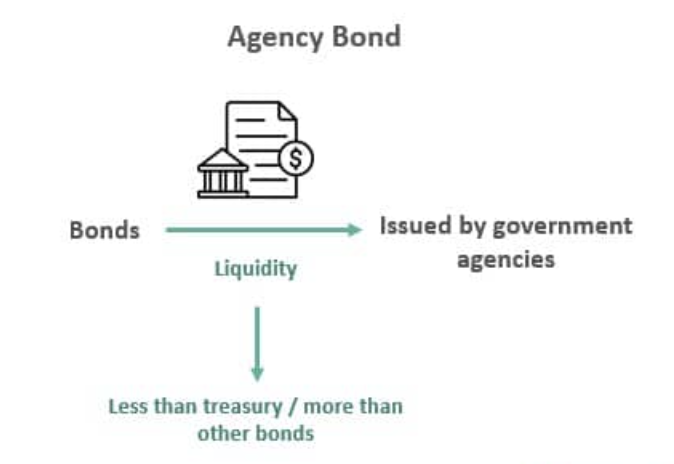

## Table of Contents

## What are agency bonds?

Agency bonds are debt securities issued by government-affiliated organizations, but not directly by the government itself. These organizations, known as government-sponsored enterprises (GSEs), are created to support specific sectors of the economy, like housing or agriculture. Examples of agencies that issue these bonds include Fannie Mae, Freddie Mac, and the Federal Home Loan Banks. Investors buy agency bonds to earn interest, and the bonds are generally considered to be safer than corporate bonds because of the government connection, although they are not backed by the full faith and credit of the U.S. government.

The interest rates on agency bonds are usually higher than those on Treasury securities, which are direct obligations of the U.S. government, but lower than those on corporate bonds. This makes them an attractive option for investors looking for a balance between safety and yield. Agency bonds can be traded in the secondary market, which means investors can buy and sell them before they mature. This liquidity adds to their appeal, as it allows investors to adjust their portfolios as needed. Overall, agency bonds serve as an important tool for both the issuing agencies and investors, helping to fund public initiatives while offering a relatively secure investment opportunity.

## Who issues agency bonds?

Agency bonds are issued by government-sponsored enterprises (GSEs). These are organizations that the government has created to help certain parts of the economy, like housing or farming. Some examples of these organizations are Fannie Mae, Freddie Mac, and the Federal Home Loan Banks. They issue bonds to raise money for their activities.

People and organizations buy these bonds to earn interest. Agency bonds are seen as safer than bonds from regular companies because of their connection to the government. However, they are not as safe as Treasury securities, which are directly backed by the U.S. government. Agency bonds usually offer higher interest rates than Treasury securities but lower rates than corporate bonds. This makes them a good choice for investors who want a bit more safety but still want to earn more interest.

## What are the different types of agency bonds?

Agency bonds come in a few different types, mainly based on who issues them and what they're used for. There are bonds issued by federal agencies, like the Government National Mortgage Association (Ginnie Mae), which are backed by the full faith and credit of the U.S. government. These are very safe because the government promises to pay them back. Then, there are bonds from government-sponsored enterprises (GSEs) like Fannie Mae and Freddie Mac. These are not directly backed by the government but are still seen as pretty safe because of their government connection.

Another type of agency bond is issued by federal farm credit banks and the Federal Home Loan Banks. These bonds help support farming and housing, respectively. They are also considered safe investments, but they don't have the same level of government backing as Ginnie Mae bonds. Each type of agency bond has its own purpose and level of risk, so investors can choose the one that fits their needs best.

## How do agency bonds differ from Treasury bonds?

Agency bonds and Treasury bonds are both types of government-related securities, but they have some key differences. Treasury bonds are issued directly by the U.S. Department of the Treasury and are backed by the full faith and credit of the U.S. government. This means that the government promises to pay back the money you lend them, no matter what. Because of this strong backing, Treasury bonds are seen as very safe investments. They usually offer lower interest rates because they are so safe.

On the other hand, agency bonds are issued by government-sponsored enterprises (GSEs) like Fannie Mae and Freddie Mac, or by federal agencies like Ginnie Mae. These bonds are not directly backed by the U.S. government, except for those issued by Ginnie Mae. This means they [carry](/wiki/carry-trading) a bit more risk than Treasury bonds. To make up for this extra risk, agency bonds usually offer higher interest rates than Treasury bonds. So, while agency bonds can be a good choice if you want a bit more return on your investment, they are not as safe as Treasury bonds.

## What are the benefits of investing in agency bonds?

Investing in agency bonds can offer you a good balance between safety and [earning](/wiki/earning-announcement) more interest. These bonds are issued by government-sponsored enterprises like Fannie Mae and Freddie Mac, which means they are seen as safer than regular company bonds. This is because they have a connection to the government, even though they are not directly backed by it. Because of this safety, agency bonds usually give you higher interest rates than Treasury bonds, which are directly backed by the U.S. government.

Another benefit of agency bonds is that they can be bought and sold in the secondary market. This means if you need your money back before the bond matures, you can sell it to someone else. This makes agency bonds more flexible than some other types of investments. Plus, because they support important parts of the economy like housing and farming, you can feel good knowing your money is helping these areas while also earning you interest.

## What are the risks associated with agency bonds?

Agency bonds come with some risks that you should know about. Even though they are issued by government-sponsored enterprises like Fannie Mae and Freddie Mac, they are not directly backed by the U.S. government. This means if the agency that issued the bond gets into financial trouble, there's a chance you might not get all your money back. This risk is higher than with Treasury bonds, which the government promises to pay back no matter what.

Another risk with agency bonds is [interest rate](/wiki/interest-rate-trading-strategies) risk. If interest rates go up after you buy a bond, the value of your bond can go down. This is because new bonds will be issued with higher interest rates, making your older bond less attractive to other investors. If you need to sell your bond before it matures, you might have to sell it for less than what you paid for it. So, it's important to think about how long you plan to hold onto the bond and what might happen with interest rates during that time.

## How are agency bonds rated?

Agency bonds are rated by credit rating agencies like Moody's, Standard & Poor's, and Fitch. These agencies look at the financial health of the organization that issues the bond, like Fannie Mae or Freddie Mac, to decide how likely it is that the bond will be paid back on time. The ratings are usually given as letters, with AAA being the highest and safest rating, and lower ratings like BB or B showing more risk.

Even though agency bonds are not directly backed by the U.S. government, they often get pretty high ratings. This is because they are seen as safer than bonds from regular companies due to their government connection. However, the ratings can change if the financial situation of the issuing agency changes, so it's a good idea to keep an eye on the ratings and any news about the agency.

## What is the tax treatment of interest income from agency bonds?

The interest income you earn from agency bonds is usually taxable at the federal level. This means you have to pay federal income tax on the interest you receive. The tax rate depends on your total income and how much interest you earn from the bonds. Unlike some other investments, like certain municipal bonds, agency bond interest does not get special tax treatment that could make it tax-free.

However, there's a bit of good news. The interest from agency bonds is often exempt from state and local taxes. This can be a big help if you live in a state with high income taxes. So, while you'll still have to pay federal taxes on the interest, you won't have to worry about adding it to your state or local tax bill. This can make agency bonds a bit more attractive if you're looking to reduce your overall tax burden.

## Are there any specific tax exemptions for certain types of agency bonds?

Most agency bonds do not have special tax exemptions at the federal level. This means you have to pay federal income tax on the interest you earn from them. The tax rate depends on your total income and how much interest you get from the bonds. Unlike some municipal bonds, which can be tax-free, agency bonds do not usually get this special treatment.

However, there's a bit of good news. Interest from agency bonds is often exempt from state and local taxes. This can be helpful if you live in a state with high income taxes. So, while you still have to pay federal taxes on the interest, you won't have to worry about adding it to your state or local tax bill. This can make agency bonds a bit more attractive if you're looking to reduce your overall tax burden.

## How do state and local taxes apply to agency bond income?

Interest you earn from agency bonds is usually not taxed by state and local governments. This means if you live in a place with high state or local taxes, you won't have to pay those taxes on the interest you get from agency bonds. This can be a big help because it means more money stays in your pocket.

However, you still have to pay federal taxes on the interest from agency bonds. The amount you pay depends on your total income and how much interest you earn. So, while agency bonds can save you from state and local taxes, you'll still need to report the interest on your federal tax return.

## What are the considerations for investing in agency bonds in a taxable vs. tax-deferred account?

When you invest in agency bonds in a taxable account, you have to pay federal taxes on the interest you earn. This means that the interest rate you get might not seem as good after you pay taxes. But there's some good news: you don't have to pay state or local taxes on this interest. So, if you live in a place with high state taxes, putting agency bonds in a taxable account could still be a good idea because you save on those taxes.

On the other hand, if you put agency bonds in a tax-deferred account like an IRA, you won't have to pay taxes on the interest until you take the money out. This can be really helpful because it lets your investment grow without being reduced by taxes every year. But remember, when you do take the money out, you'll have to pay taxes on it then. So, choosing between a taxable and a tax-deferred account depends on your tax situation now and what you think it will be when you take the money out.

## How do changes in tax laws potentially impact the attractiveness of agency bonds?

Changes in tax laws can make agency bonds more or less attractive to investors. If tax laws change to make the interest from agency bonds taxable at the state and local level, they might not seem as good of a deal anymore. This is because one of the big benefits of agency bonds is that you don't have to pay state and local taxes on the interest. If that benefit goes away, people might look for other investments that still offer tax breaks.

On the other hand, if tax laws change to give more tax benefits to agency bond interest, they could become more popular. For example, if the federal government decides to lower the tax rate on this interest, more people might want to buy them because they would keep more of their earnings. So, keeping an eye on tax law changes is important if you're thinking about investing in agency bonds.

## References & Further Reading

[1]: Dvorak, T. (2009). ["The Tax Advantage of U.S. Treasury Bonds."](https://www.brookings.edu/wp-content/uploads/2018/11/WP49.pdf) The Journal of Wealth Management, 12(2), 74-83.

[2]: Fabozzi, F. J. (2007). ["The Handbook of Fixed Income Securities."](https://www.amazon.com/Handbook-Fixed-Income-Securities-Ninth/dp/1260473899) McGraw-Hill Education.

[3]: Vickery, J., & Wright, J. (2013). ["TBA Trading and Liquidity in the Agency MBS Market."](https://www.newyorkfed.org/medialibrary/media/research/epr/2013/1212vick.pdf) Federal Reserve Bank of New York Staff Reports, no. 468.

[4]: Yellen, J. L. (2009). ["Systemic Risk and the Financial Crisis: A Primer."](https://www.researchgate.net/publication/46566615_Systemic_Risk_and_the_Financial_Crisis_A_Primer) Federal Reserve Bank of San Francisco Economic Letter.

[5]: Lopez de Prado, M. (2018). ["Advances in Financial Machine Learning."](https://www.amazon.com/Advances-Financial-Machine-Learning-Marcos/dp/1119482089) Wiley.

[6]: Chan, E. P. (2009). ["Quantitative Trading: How to Build Your Own Algorithmic Trading Business."](https://github.com/ftvision/quant_trading_echan_book) Wiley.

[7]: Fabozzi, F. J., & Mann, S. V. (2012). ["Introduction to Fixed Income Analytics: Relative Value Analysis, Risk Measures and Valuation."](https://onlinelibrary.wiley.com/doi/book/10.1002/9781118266649) Wiley.