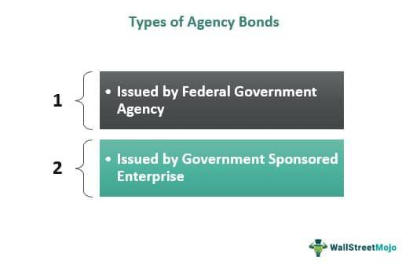

In the dynamic landscape of financial markets, the understanding of various bond types plays a crucial role in successful portfolio management and informed investment decisions. Among these, agency bonds stand out as significant instruments. These bonds, distinct from U.S. Treasury securities, are issued by government-sponsored enterprises (GSEs) or federal government agencies. Their unique characteristics, including the potential for higher yields and specific tax advantages, make them an attractive option for a broad range of investors.

The exploration of agency bonds encompasses several vital aspects: the differentiation of their types, their varied tax implications, and their evolving role in the modern era of algorithmic trading. Grasping these facets is essential for investors aiming to refine their strategies and enhance their portfolio's performance. Agency bonds can offer a viable pathway to achieving stable income, provided there is a comprehensive understanding of their strategic applications and inherent risks, such as those associated with interest rate fluctuations and market volatility.

This article endeavors to offer a thorough examination of agency bonds' potential, serving as a valuable resource for both novice and seasoned investors. By illuminating the intricacies associated with these securities, investors will be better equipped to navigate the complexities of today's financial markets and optimize their investment outcomes.

## Table of Contents

## Understanding Agency Bonds

Agency bonds are a specific category of debt securities, primarily issued by government-sponsored enterprises (GSEs) and federal government agencies within the United States, distinguished from the U.S. Treasury. These bonds serve to raise capital to support particular sectors, such as housing, agriculture, and education, by providing funds generated from bond sales to support backing loans, guarantees, or insurance.

One of the defining features of agency bonds is their yield structure. Typically, agency bonds offer higher yields compared to U.S. Treasury securities. This yield premium is a reflection of the varied risk profiles associated with different issuers and the absence of direct federal backing in some cases. While U.S. Treasury securities are fully backed by the government's taxing power, agency bonds issued by GSEs often carry credit risk depending on the issuer's financial health and regulatory environment. 

Several common issuers of agency bonds include major GSEs, such as the Federal National Mortgage Association (Fannie Mae) and the Government National Mortgage Association (GNMA or Ginnie Mae). Fannie Mae, along with the Federal Home Loan Mortgage Corporation (Freddie Mac), primarily supports the residential mortgage market by purchasing and securitizing mortgages, thus providing liquidity to the housing finance system. These organizations are chartered by Congress and, although they present a perception of government support, their bonds do not have the explicit full-faith-and-credit guarantee of U.S. Treasury securities, thus introducing credit risk.

Conversely, bonds issued by federal agencies such as Ginnie Mae [carry](/wiki/carry-trading) an explicit government guarantee, as this agency is a part of the Department of Housing and Urban Development (HUD). Ginnie Mae securitizes mortgages it guarantees, providing an added layer of government assurance on the payments of interest and principal, which translates to a lower risk for investors.

The varying degree of tax considerations associated with agency bonds also plays a significant role in their investment appeal. While the interest earned on many agency bonds is exempt from state and local taxes, this benefit does not uniformly apply to all issuers, notably not extending to those from Fannie Mae and Freddie Mac, which affects overall yield and return evaluations.

Understanding the intricate nature of agency bonds, including their yield benefits, issuer risk profiles, and tax implications, is essential for investors considering fixed-income securities as part of a diversified investment strategy.

## Types of Agency Bonds

Agency bonds constitute a significant segment of the fixed-income securities market. Understanding the variations within these bonds is key for investors to accurately assess both risks and potential returns. Two primary types of agency bonds include Federal Government Agency Bonds and Government-Sponsored Enterprise (GSE) Bonds, each with distinct characteristics and levels of government backing.

Federal Government Agency Bonds are issued by government bodies such as the Federal Housing Administration (FHA) and the Small Business Administration (SBA). These bonds are unique because they are backed by the full faith and credit of the U.S. government, making them a relatively low-risk investment. The safety of these bonds stems from the government's commitment to meet its financial obligations, reducing the likelihood of default. This assurance allows investors to benefit from a more secure income stream, albeit typically at a lower yield compared to other bonds with higher risk profiles.

On the other hand, Government-Sponsored Enterprise Bonds are issued by organizations chartered by Congress, such as Fannie Mae (Federal National Mortgage Association) and Freddie Mac (Federal Home Loan Mortgage Corporation). Although these organizations have strong ties to the federal government, their bonds are not explicitly backed by the government’s full faith and credit. Instead, they possess an implicit guarantee based on historical precedent, leading to differing risk perceptions among investors. This means that while these bonds generally offer higher yields than Federal Government Agency Bonds, they come with increased risk due to their lesser degree of government backing.

The distinction between Federal Government Agency Bonds and Government-Sponsored Enterprise Bonds is crucial when evaluating their investment potential. Factors like risk tolerance, yield preferences, and economic conditions should be considered. An investor prioritizing safety may prefer Federal Government Agency Bonds, whereas one seeking higher returns may opt for the GSE Bonds, accepting the additional risk involved.

In summary, agency bonds offer varying levels of security and return on investment, largely determined by the nature of their backing and the issuing body. Understanding the nuances between Federal Government Agency Bonds and Government-Sponsored Enterprise Bonds enables investors to make more informed decisions aligned with their financial goals.

## Tax Rules and Considerations

Agency bonds, issued by entities such as government-sponsored enterprises (GSEs) and federal agencies, involve specific tax considerations vital for investors. A significant tax advantage of most agency bonds is the exemption of their interest income from state and local taxes, enhancing their appeal compared to other taxable bonds. However, it's crucial to note the exceptions to this benefit. Bonds issued by organizations like the Federal National Mortgage Association (Fannie Mae) do not always qualify for state and local tax exemptions, requiring investors to assess the tax status of each bond individually.

Beyond interest income, another consideration is the treatment of capital gains. Agency bonds purchased at a discount, which is below their face value, may provide capital gains if sold at a higher price. This scenario often warrants capital gains taxes, similar to stocks. The capital gain is calculated as the difference between the sale price and the purchase price of the bond. Investors should be mindful of the holding period since long-term capital gains (for bonds held over one year) are typically taxed at a lower rate than short-term gains (for bonds held one year or less).

Understanding these tax rules is essential for optimizing net returns. Strategic tax planning can significantly influence investment outcomes. For instance, an investor in a high-tax state might prioritize agency bonds with state and local tax exemptions, maximizing after-tax returns. Alternatively, those intending to hold agency bonds to maturity might focus less on capital gains tax implications.

Investors are encouraged to consult tax professionals to tailor strategies based on their individual circumstances and stay updated with evolving tax laws that may impact the potential benefits of agency bond investments. Comprehensive tax planning ensures that the favorability of agency bonds' tax status aligns with broader investment goals, facilitating informed and efficient portfolio management.

## Algorithmic Trading and Agency Bonds

Algorithmic trading has significantly transformed the trading environment for bonds, including agency bonds, by leveraging technological advancements to facilitate high-speed transactions and analytical decision-making. This approach utilizes complex algorithms to execute orders based on predefined criteria, analyzing vast datasets to identify market trends and opportunities with precision and speed unattainable by human traders.

The adoption of [algorithmic trading](/wiki/algorithmic-trading) in bond markets has notably enhanced [liquidity](/wiki/liquidity-risk-premium). By enabling a higher frequency of trades and narrowing the bid-ask spreads, algo trading contributes to a more dynamic and fluid trading environment. This increased liquidity allows for easier buying and selling of agency bonds, providing investors with more opportunities to enter or [exit](/wiki/exit-strategy) positions swiftly and with reduced transactional costs.

Efficiency in bond trading is another significant benefit offered by algorithmic strategies. Automation of trade execution reduces human error and operational costs, leading to optimized execution times. Algorithms can process market information and execute trades within milliseconds, exploiting opportunities often lost in conventional trading setups.

However, the reliance on algorithmic trading also introduces potential risks. Market [volatility](/wiki/volatility-trading-strategies) can be exacerbated by the speed at which large volumes of trades are executed, leading to rapid price fluctuations. In addition, algorithms, if incorrectly programmed or triggered by erroneous data, can result in significant financial losses. Hence, while algorithmic trading improves market function, it also requires robust risk management practices and monitoring systems to safeguard against unintended market disruptions.

For investors interested in agency bonds, understanding the implications of algorithmic trading is crucial. It is advisable to consider how these technological strategies impact market dynamics, particularly liquidity and volatility, before making investment decisions. Being aware of the potential benefits and risks of algorithmic trading can aid investors in optimizing their strategies and better achieving their financial objectives.

## The Pros and Cons of Investing in Agency Bonds

Agency bonds, known for offering relatively high yields compared to U.S. Treasury securities, come with several advantages that can benefit income-focused investors. One of the primary benefits is their favorable tax treatment. Interest earned from these bonds is often exempt from state and local taxes, which can increase an investor's net income. This tax benefit can be particularly appealing for individuals in higher tax brackets, as it may lead to significant tax savings.

Furthermore, agency bonds issued by government-sponsored enterprises (GSEs) such as Fannie Mae and Freddie Mac often provide liquidity and regulatory advantages. These bonds are actively traded in the secondary market, enabling investors to purchase or sell them readily. This liquidity, combined with the government-sponsored backing, often results in relatively stable pricing and lower credit risk compared to corporate bonds.

However, investing in agency bonds also involves several risks that must be considered. One significant risk is [interest rate](/wiki/interest-rate-trading-strategies) risk. The value of agency bonds, like most fixed-income securities, is inversely related to interest rate changes. As interest rates rise, the market value of existing bonds typically falls, potentially resulting in capital losses if the bonds are sold before maturity.

Another risk associated with agency bonds is call risk. Many agency bonds come with callable features, allowing the issuer to redeem the bond before its maturity date if interest rates decline. If a bond is called, investors may be forced to reinvest the principal at a lower interest rate, which could reduce overall returns.

Balancing these pros and cons is crucial for aligning agency bonds within a broader investment strategy, especially in volatile economic conditions. Investors need to assess their risk tolerance and financial goals to determine the appropriate allocation of agency bonds in their portfolios. Diversification across different bond types, maturities, and issuers can help mitigate risks.

Overall, while agency bonds offer attractive yields and tax benefits, their associated risks necessitate a comprehensive understanding and strategic approach to optimize investment outcomes.

## Conclusion

Agency bonds present a compelling opportunity for investors aiming for consistent income through fixed-income securities. These bonds, issued by government-sponsored enterprises or federal agencies, provide a reliable stream of returns with the potential for higher yields compared to U.S. Treasury securities. However, effectively navigating the agency bond market requires a comprehensive understanding of their various types, associated risks, and tax considerations.

One key aspect to consider with agency bonds is their diversity. They vary significantly in terms of risk and backing; some offer the security of the full faith and credit of the U.S. government, while others do not. Knowledge of these distinctions is essential for tailoring investment strategies to match individual risk appetites and financial goals.

Tax implications also play an important role when investing in agency bonds. While many agency bonds are exempt from state and local taxes, specific issuers like Fannie Mae do not provide this benefit. Investors need to understand these nuances to optimize their after-tax returns and integrate tax planning into their broader investment considerations.

Moreover, the impact of algorithmic trading on agency bonds cannot be overlooked. This modern trading approach enhances market liquidity and efficiency, offering both opportunities and challenges to investors. While it facilitates quick, data-driven decision-making, the high-speed nature of algorithmic trading also introduces potential risks that must be managed effectively.

In summary, agency bonds can be a valuable component of a diversified investment portfolio for those seeking stable income. By carefully evaluating the types of agency bonds available, understanding their tax implications, and incorporating insights from modern trading strategies, investors can better position themselves to navigate market fluctuations and achieve their financial objectives.

## References & Further Reading

[1]: Dvorak, T. (2009). ["The Tax Advantage of U.S. Treasury Bonds."](https://www.brookings.edu/wp-content/uploads/2018/11/WP49.pdf) The Journal of Wealth Management, 12(2), 74-83.

[2]: Fabozzi, F. J. (2007). ["The Handbook of Fixed Income Securities."](https://www.amazon.com/Handbook-Fixed-Income-Securities-Ninth/dp/1260473899) McGraw-Hill Education.

[3]: Vickery, J., & Wright, J. (2013). ["TBA Trading and Liquidity in the Agency MBS Market."](https://www.newyorkfed.org/medialibrary/media/research/epr/2013/1212vick.pdf) Federal Reserve Bank of New York Staff Reports, no. 468.

[4]: Yellen, J. L. (2009). ["Systemic Risk and the Financial Crisis: A Primer."](https://www.researchgate.net/publication/46566615_Systemic_Risk_and_the_Financial_Crisis_A_Primer) Federal Reserve Bank of San Francisco Economic Letter.

[5]: Lopez de Prado, M. (2018). ["Advances in Financial Machine Learning."](https://www.amazon.com/Advances-Financial-Machine-Learning-Marcos/dp/1119482089) Wiley.

[6]: Chan, E. P. (2009). ["Quantitative Trading: How to Build Your Own Algorithmic Trading Business."](https://github.com/ftvision/quant_trading_echan_book) Wiley.

[7]: Fabozzi, F. J., & Mann, S. V. (2012). ["Introduction to Fixed Income Analytics: Relative Value Analysis, Risk Measures and Valuation."](https://onlinelibrary.wiley.com/doi/book/10.1002/9781118266649) Wiley.