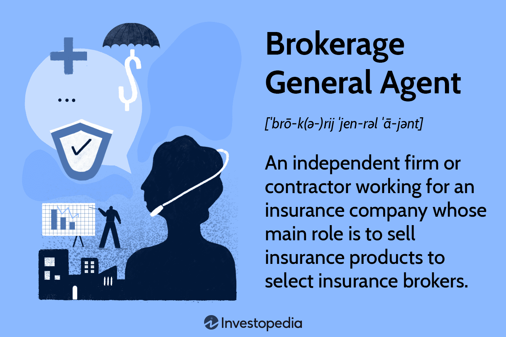

Financial services have undergone profound changes over the years, largely driven by technological advancements that have transformed the landscape of trading and investments. Among these services, agency broker financial services stand out as a pivotal element within the trading ecosystem. These agencies serve as essential intermediaries, bridging the gap between investors, both institutional and individual, and the intricate mechanisms of financial markets. By providing specialized brokerage services, they enable clients to execute trades efficiently without maintaining ownership of the securities being traded.

Concurrent with the evolution of agency broker services, algorithmic trading, often referred to as algo trading, has seen a remarkable rise in popularity. This technological innovation has fundamentally altered how financial transactions are executed by leveraging complex algorithms to automate trading processes. Unlike traditional methods that heavily rely on human intervention, algorithmic trading optimizes speed and precision in trade execution, minimizing errors and emotional bias.



The interaction between agency brokers, financial services brokerage, and algorithmic trading is critical to contemporary financial markets. This article will explore the significant roles played by agency brokers, the advantages of engaging in financial services brokerage, and the transformative impact of algorithmic trading. By understanding these components, investors can better navigate the dynamic and complex world of financial markets, ensuring strategic alignment with technological and operational advancements.

## Table of Contents

## Understanding Agency Brokers

An agency broker functions as an intermediary in financial markets, executing trades on behalf of clients while not maintaining an inventory of securities. This specific role distinguishes agency brokers from broker-dealers, who might buy or sell securities from their own accounts and could potentially face conflicts of interest regarding inventory management. Agency brokers are fundamentally driven by the principle of working exclusively for clients' best interests, which helps ensure neutrality and objectivity in trade execution.

The typical clientele of agency brokers includes large institutional investors and other entities that require precise and expert trade execution services. Such investors benefit from the extensive expertise that agency brokers provide, crucial for managing large-scale transactions where precision in timing and execution can significantly impact investment outcomes. Given the large volume and complexity of trades managed by institutional clients, meticulous execution becomes paramount, a capability well-handled by agency brokers due to their professional expertise and understanding of market dynamics.

Agency brokers, despite often commanding higher fees compared to other brokerage services, provide unmatched expertise and execution capabilities. These attributes make them indispensable for large-scale investors and institutional entities, who are willing to bear higher costs in exchange for superior service and the bespoke execution of trades.

Overall, agency brokers play a vital role in the financial services ecosystem by offering services that prioritize clients' interests, enhanced by their ability to handle sophisticated trade executions effectively. This balance of skills and ethical obligations represents a unique and essential service within global financial markets.

## The Role of Financial Services Brokerage

Financial services brokerage encompasses activities intended to ease the process of investment transactions and foster productive client relationships. At its core, brokerage services are pivotal in navigating the complexities of modern financial markets by providing investors with essential tools and insights. Brokers serve a critical role by offering market insights, developing investment strategies, and providing tailored financial advice, facilitating informed decision-making.

Brokers are equipped to interpret intricate market data, turning it into actionable intelligence that can guide purchasing or selling decisions. This process often involves analyzing historical price movements, [volume](/wiki/volume-trading-strategy) trends, and external economic indicators that might impact asset prices. By offering such insights, brokers enable investors to make informed decisions and respond swiftly to changing market conditions.

Additionally, brokerage services often include formulating investment strategies tailored to the unique financial goals and risk tolerance of the investor. These strategies may encompass asset allocation planning, risk management techniques, and diversification endeavors, all aimed at optimizing the investor's portfolio performance. This personalized approach is crucial for both individual and institutional investors as it helps align investment choices with long-term financial objectives, thereby enhancing potential returns.

For institutional investors, brokerage firms often facilitate large-scale transactions that require precision and efficiency. Whether executing block trades or managing foreign exchange transactions, brokerage firms leverage their market access and technological infrastructure to ensure that these trades are executed at the best possible prices with minimal market impact.

Moreover, financial services brokerage is not only about executing trades but also about building and maintaining lasting client relationships. Through regular communication, performance reviews, and updates on emerging market trends, brokers ensure that clients are well-informed and confident in their investment activities. This relationship-building aspect often leads to increased client loyalty and long-term collaboration, which are beneficial for both the broker and the investor.

In today's rapidly evolving financial landscape, an in-depth understanding and strategic leveraging of brokerage services are indispensable. As markets grow increasingly complex, the expertise offered by brokers enables investors to navigate challenges effectively and enhance their investment outcomes.

## Rise of Algorithmic Trading in Financial Markets

Algorithmic trading has revolutionized financial markets by enhancing the efficiency and precision of trading processes. By leveraging intricate algorithms, traders automate buying and selling activities, reducing the likelihood of human errors and emotional decision-making. This method relies heavily on high-frequency data inputs and advanced computing capabilities, enabling the execution of electronic trades at velocities unattainable by human operators.

The core advantage of [algorithmic trading](/wiki/algorithmic-trading) lies in its ability to process vast volumes of market data almost instantaneously. Traders design specific algorithms to identify profitable opportunities based on predefined criteria such as price, timing, and volume. These algorithms can operate in various capacities, such as [arbitrage](/wiki/arbitrage), trend-following, and market-making strategies, each tailored to exploit specific market conditions.

One pivotal component of algorithmic trading is its reliance on high-frequency trading ([HFT](/wiki/high-frequency-trading-strategies)), which utilizes powerful computer systems to transact a large number of orders at exceptionally high speeds. This rapid execution is advantageous in capturing price discrepancies within fractions of a second. With HFT, traders aim to capitalize on short-lived opportunities in the markets, thereby increasing their potential for profit.

Beyond speed, algorithmic trading facilitates the rigorous [backtesting](/wiki/backtesting) of strategies before they are deployed in live market environments. Backtesting involves running algorithms against historical data to assess performance and improve strategy robustness. This process is critical for refining algorithms and ensuring they can withstand varying market conditions.

However, the implementation of algorithmic trading requires comprehensive expertise in both financial markets and software development. Traders often code their strategies in programming languages such as Python or C++, incorporating sophisticated mathematical models to inform their trades. Here's a simple Python example demonstrating a moving average crossover strategy, a basic form of algorithmic trading:

```python
import pandas as pd

# Load historical price data
data = pd.read_csv('market_data.csv')
data['Short_MA'] = data['Close'].rolling(window=40).mean()
data['Long_MA'] = data['Close'].rolling(window=100).mean()

# Buy when the short-term moving average crosses above the long-term moving average
data['Signal'] = 0
data['Signal'][40:] = np.where(data['Short_MA'][40:] > data['Long_MA'][40:], 1, 0)

# Calculate returns
data['Returns'] = data['Close'].pct_change()
data['Strategy_Returns'] = data['Returns'] * data['Signal'].shift(1)
```

This script employs moving averages to generate buy/sell signals, a common tactic that aims to capture emerging trends. Despite its simplicity, such approaches underline the potential of algorithmic strategies to execute complex operations systematically.

In conclusion, by integrating advanced technology with strategic financial insights, algorithmic trading continues to reshape market dynamics. It empowers traders to implement precise, rule-based strategies that enhance market [liquidity](/wiki/liquidity-risk-premium) and efficiency. While it requires substantial computational resources and technical expertise, the benefits of algorithmic trading remain compelling for those looking to maintain a competitive edge in modern financial markets.

## Choosing the Right Brokerage for Algorithmic Trading

Selecting a reliable brokerage for algorithmic trading is a critical decision that can greatly influence trading success. The complexity and speed inherent in algorithmic trading necessitate a careful evaluation of brokerage services to ensure they meet specific needs.

One of the foremost considerations when choosing a brokerage is regulatory compliance. Ensuring that a broker is fully licensed and adheres to financial regulations is essential for safeguarding investments. Regulatory bodies such as the U.S. Securities and Exchange Commission (SEC) and the Financial Industry Regulatory Authority (FINRA) in the United States, or the Financial Conduct Authority (FCA) in the United Kingdom, provide oversight and ensure brokers operate ethically and transparently. Verifying a brokerage's regulatory standing can prevent potential legal conflicts and ensure a level of trust and security.

The sophistication of a brokerage's trading platforms is another crucial [factor](/wiki/factor-investing). A top-tier platform should offer advanced tools for algorithmic trading, such as real-time data analytics, backtesting capabilities, and customizable interfaces. These tools enable traders to develop, test, and deploy trading algorithms effectively. High-performance platforms are vital for executing trades at optimal speeds, minimizing latency, which is particularly important in high-frequency trading scenarios. For example, low-latency execution engines can be evaluated using metrics like round-trip time or time to first byte, which measure how quickly an order can be executed and confirmed.

Customer support reliability is also a key factor, as robust support services can address technical issues promptly, reducing downtime. Effective customer service can be a differentiator when issues arise with trading platforms or execution of trades. Brokers offering 24/7 support with knowledgeable staff are preferable, ensuring that help is available whenever needed.

Cost structures, including commissions and fees, play a significant role in the profitability of algorithmic trading. Brokerages may charge various fees, such as per-trade commissions, subscription fees for using their platforms, or data feed charges. Analyzing these costs is crucial, as they can significantly impact net returns. For instance, lower commission rates lead to greater cost efficiency, particularly for high-frequency trading, where numerous transactions are executed in a short period.

Lastly, for algorithmic traders, online platforms that provide low-latency execution and reliable data feeds are indispensable. Latency, the delay before data begins to transfer following an instruction for its transfer, can be the difference between profit and loss in high-speed trading environments. Reliable data feeds ensure that the information used to trigger trades is accurate and up-to-date, which is essential for executing strategies based on real-time market conditions. Employing platforms with advanced data analytics capabilities can further enhance the precision of trading algorithms.

In summary, choosing the right brokerage for algorithmic trading involves assessing regulatory compliance, platform sophistication, customer support, cost structures, and the technical requirements for low-latency execution and data reliability. Making informed decisions in these areas can significantly enhance an algorithmic trader's performance and profitability.

## Challenges and Considerations

Algorithmic trading is a powerful tool that significantly enhances trading efficiency, yet it inherently comes with several challenges and considerations. One primary concern is market risk. Algorithmic trading can exacerbate [volatility](/wiki/volatility-trading-strategies) due to the speed and volume at which trades are executed. This high-speed environment can lead to increased market fluctuations, potentially resulting in significant losses if not properly managed. 

Another challenge is the risk of overfitting strategies. Overfitting occurs when a trading algorithm is too closely tailored to past data, making it less adaptable to future market conditions. This can result in suboptimal performance when the algorithm encounters new data that deviates from the historical patterns it was trained on. Developing robust algorithms that generalize well across different market scenarios is essential to address this issue.

Agency brokers, on the other hand, face the task of navigating intricate regulatory environments. With the rise of algorithmic trading, regulatory bodies have intensified their scrutiny to prevent market manipulation and ensure fair trading practices. Brokers must maintain compliance with these evolving regulations while ensuring that their trading systems and practices are transparent. Moreover, data security is a critical concern. Agency brokers handle massive amounts of sensitive financial data and must implement stringent security measures to protect against breaches and unauthorized access.

Investors engaged in algorithmic trading must recognize the potential for technology failures. Trading systems might experience outages, network delays, or hardware malfunctions, which could lead to missed trading opportunities or unintended trade executions. Therefore, implementing robust risk management frameworks is crucial. These frameworks should involve redundancy planning and regular testing of trading systems to ensure reliability under various conditions.

Moreover, balancing automated technology with human oversight is crucial to mitigate risks in trading strategies. While algorithms can process and analyze data with incredible speed, human traders bring essential judgment and intuition to the table. Integrating human oversight can help identify discrepancies or abnormalities that algorithms may miss and implement real-time corrections. By combining the efficiency of technology with the nuanced understanding of human expertise, traders can better navigate the complexities of the financial markets.

In conclusion, while algorithmic trading offers undeniable advantages, understanding and addressing these challenges is vital for maximizing its benefits and ensuring strategy robustness in the dynamic trading landscape.

## Conclusion

Agency broker financial services and algorithmic trading have become indispensable elements of today's financial markets due to their pivotal role in facilitating efficient and precise transaction processes. Partnering strategically with knowledgeable brokers offers investors the opportunity to significantly enhance their trading outcomes. These brokers bring specialized expertise and insights that are critical in navigating the complex financial environment, thereby helping clients optimize their strategies for maximum returns.

The future of trading is poised for significant transformation through the seamless integration of cutting-edge technology and expert human oversight. This synergy ensures that the agility and precision of algorithmic trading are complemented by the nuanced understanding and strategic acumen of experienced professionals. Such integration is essential for traders and institutions to maintain a competitive edge and capitalize on market opportunities.

To sustain success in the financial landscape, staying informed about market trends and technological advancements is crucial. Rapid developments in fintech, data analytics, and [machine learning](/wiki/machine-learning) necessitate ongoing education and adaptation. Investors and brokers alike must prioritize continuous learning to harness these tools effectively and anticipate changes that influence trading strategies.

Embracing innovation while grounded in human insight will ensure that participants remain agile and adept in addressing challenges, thereby promoting sustained success in the dynamic world of finance.

## References & Further Reading

[1]: Bergstra, J., Bardenet, R., Bengio, Y., & Kégl, B. (2011). ["Algorithms for Hyper-Parameter Optimization."](https://proceedings.neurips.cc/paper/2011/file/86e8f7ab32cfd12577bc2619bc635690-Paper.pdf) Advances in Neural Information Processing Systems 24.

[2]: ["Advances in Financial Machine Learning"](https://www.amazon.com/Advances-Financial-Machine-Learning-Marcos/dp/1119482089) by Marcos Lopez de Prado

[3]: ["Evidence-Based Technical Analysis: Applying the Scientific Method and Statistical Inference to Trading Signals"](https://www.amazon.com/Evidence-Based-Technical-Analysis-Scientific-Statistical/dp/0470008741) by David Aronson

[4]: ["Machine Learning for Algorithmic Trading"](https://github.com/PacktPublishing/Machine-Learning-for-Algorithmic-Trading-Second-Edition) by Stefan Jansen

[5]: ["Quantitative Trading: How to Build Your Own Algorithmic Trading Business"](https://www.amazon.com/Quantitative-Trading-Build-Algorithmic-Business/dp/1119800064) by Ernest P. Chan