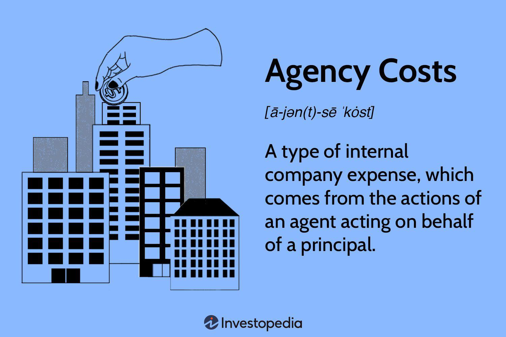

Understanding the concept of agency costs in financial settings is crucial, especially in sectors like algorithmic trading. Agency costs emerge from the intricate relationships between principals, such as shareholders, and agents, like company executives or managers, ultimately shaping the effectiveness of corporate governance and financial performance. In sectors where technology and human decisions intersect—like algorithmic trading—the complexity of these relationships increases significantly, leading to higher potential agency costs and financial implications.

Algorithmic trading, where trades are executed by computer algorithms reacting to market signals rather than human discretion, offers a compelling arena to examine agency costs. The algorithms are designed and managed by traders and developers (agents) whose interests may not always align with those of the investors or shareholders (principals). Consequently, understanding how these agency costs arise, their impact on trading efficacy, and strategies for their mitigation becomes vital.

Agency costs represent the expense of employing mechanisms to ensure that the agents' actions align with the principals' interests. These costs are encapsulated in a principal-agent relationship, often resulting from conflicts of interest or information asymmetry. This article aims to explore agency costs' multifaceted nature, the financial implications of such costs, and exemplify their manifestation within algorithmic trading environments. We will also examine how these costs can be effectively managed to enhance strategic alignment and operational efficiency. By unpacking the complexities of agency costs and their interactions within the financial landscape, this exploration seeks to provide valuable insights into more effective governance and financial management practices.

## Table of Contents

## What Are Agency Costs?

Agency costs arise within the principal-agent relationship, a critical concept in financial and corporate management. This relationship forms when one party, the principal, delegates work to another party, the agent, who then performs duties on the principal's behalf. Principals are often the shareholders or owners of a company, while agents typically comprise the company's executive management. The divergence of interests between these two parties can lead to a range of inefficiencies termed "agency costs."

One of the primary reasons agency costs occur is due to the need to monitor and scrutinize the agent's activities to ensure they align with the principal's objectives. This often necessitates implementing comprehensive control systems, such as performance appraisals and audits, to assess management actions. Additionally, performance-based incentives are frequently designed to align the agent's interests with those of the principals, prompting executives to aim for outcomes that benefit shareholders.

However, implementing these monitoring mechanisms and incentive structures can entail considerable costs. Monitoring costs are incurred during the execution of activities that check agents' the commitment to company goals. Similarly, bonding costs arise when agents invest resources and efforts to demonstrate their adherence to principals' objectives. Despite these efforts, some residual loss may still emerge, reflecting the financial drawbacks that occur when management decisions do not perfectly align with shareholder interests.

Conflicts of interest further complicate the principal-agent dynamic. These may arise when [agents](/wiki/agents) prioritize personal benefit over shareholder gains, potentially leading to suboptimal decision-making from the shareholder's perspective. Consequently, it becomes imperative for companies to invest in establishing and maintaining robust governance frameworks designed to align managerial incentives with shareholder expectations effectively. Thus, agency costs are the expenses associated with these efforts and are essential considerations for achieving sound corporate governance and financial efficiency.

## Understanding the Principal-Agent Relationship

The principal-agent relationship is a foundational concept in the study of economics, finance, and corporate governance. It emerges when one party, the principal, delegates work to another party, the agent. This delegation aims to achieve specific objectives that ideally benefit the principal. In financial contexts, this relationship often manifests between shareholders, who are the principals, and company executives, who act as agents. These executives are entrusted with the task of managing the company on behalf of the shareholders, making decisions and taking actions that are expected to enhance shareholder value.

This relationship is fundamental to aligning corporate governance structures, ensuring that management actions are consistent with the long-term goals of the shareholders. However, a core challenge lies in the potential for conflicting goals between the principal and the agent. Executives, motivated by personal gains such as bonuses or career advancements, might make decisions that prioritize short-term benefits over long-term shareholder value. This misalignment in objectives can lead to agency costs, which are expenses incurred to monitor, incentivize, and align the executive’s actions with shareholder interests.

To address these discrepancies, companies rely on various control mechanisms, such as performance-based incentives and contracts that aim to motivate agents to act in the best interests of the principals. Additionally, governance structures like boards of directors play a critical role in supervising and guiding executive decisions, establishing checks and balances that help minimize agency costs.

Efficient governance structures are essential in reducing these costs. They require a systematic approach to crafting policies and practices that align interests across all levels of the organization. This includes setting up transparent communication channels, establishing clear performance metrics, and ensuring that executives are accountable for their actions.

Overall, understanding and effectively managing the principal-agent relationship is crucial in fostering a corporate environment where management decisions are aligned with shareholder objectives, thus minimizing agency costs and promoting financial health and stability.

## Types of Agency Costs

Agency costs are categorized primarily into three types: Monitoring Costs, Bonding Costs, and Residual Loss. These costs are essential financial investments meant to align the interests of principals and agents, ensuring corporate governance structures function effectively.

**Monitoring Costs** refer to expenses incurred by a principal to assess the performance of agents and ensure compliance with their interests. A critical component of these costs involves employing auditing and performance evaluation mechanisms. Companies might invest in external audits, implement employee performance reviews, and utilize other monitoring tools to guarantee that their management's actions are in harmony with shareholder objectives. The overall intent is to minimize inefficiencies by ensuring diligent oversight.

**Bonding Costs** represent the investments agents make to demonstrate their commitment to the principal's goals. These expenses assure the principal of the agent's dedication to fulfilling their interests. For example, management might voluntarily tie a portion of their compensation to company performance to prove their alignment with shareholder expectations. By establishing such financial or contractual obligations, agents effectively signal their allegiance to the company's success while minimizing suspicion and distrust from the principals.

**Residual Loss** is a financial loss that occurs despite the monitoring and bonding efforts implemented. It highlights the inability to perfectly align agents' actions with those of the principals' desired outcomes. This cost remains as a result of the inherent divergence of interests and the challenges in perfectly policing or incentivizing desired behaviors. Overall, it represents the disparity between the optimal agency cost-free scenario and the achieved outcomes despite existing safeguards.

Together, these costs encapsulate the financial strategies employed to promote corporate goal congruence, such as conducting audits, setting performance incentives, and ensuring risk alignments are not overlooked. Each type signifies a distinct aspect of the expenditure needed to maintain effective corporate governance and sustain aligned interests within a company.

## Agency Costs in Algorithmic Trading

Algorithmic trading, characterized by the use of complex computer algorithms to execute trades, intensifies the focus on agency costs due to the intricate dynamics between stakeholders. In this setting, developers who design and maintain trading algorithms and traders who utilize these systems often have differing objectives. Developers may prioritize algorithmic sophistication and innovation, whereas traders focus on optimized trade execution and profitability. This divergence in goals can lead to incentive misalignments, where the objectives of one group may not adequately reflect those of the other.

A significant aspect of managing agency costs in [algorithmic trading](/wiki/algorithmic-trading) involves the monitoring of sophisticated algorithms. These algorithms, while designed for optimal trading, can sometimes behave unpredictably or deviate from their intended function if not regularly evaluated. To illustrate, an oversight in algorithm design could lead to excessive trading activity, known as "churning," which can inflate transaction costs without delivering corresponding benefits to investors. Therefore, consistent monitoring and refinement of these algorithms are essential to ensure their actions align with shareholders' interests.

To mitigate these conflicts, one effective strategy is to link compensation to performance metrics that represent long-term company success. This alignment encourages both developers and traders to work towards a unified goal – enhancing the firm's financial health. By incentivizing agents based on metrics such as the accuracy of predictive models or the efficiency of trade execution, companies can foster a collaborative effort towards achieving common objectives.

The costs associated with aligning trading operations reflect the need for robust strategic oversight. Such oversight ensures that the activities of developers and traders are consistently evaluated against established benchmarks and aligned with the company's broader financial goals. This often involves implementing checks and balances such as risk assessment protocols and performance audits, which serve as preventive measures against unintended trading behaviors and potential financial discrepancies. 

In summary, agency costs in algorithmic trading are both crucial and complex, demanding stringent oversight and structured alignment strategies to maintain the equilibrium between innovation and operational efficiency.

## Real-World Examples of Agency Costs

The Enron scandal is a prime example of the devastating impact of agency costs when misalignments occur between management and shareholders. Enron's management engaged in fraudulent activities that inflated the company's financial statements, creating an illusion of profitability and financial health. This deceptive practice primarily resulted from poorly aligned interests between executives seeking personal gain and shareholders expecting genuine company growth. The executives' compensation structure, heavily reliant on short-term stock performance, incentivized manipulative behavior that ultimately led to Enron's bankruptcy and significant financial loss for its shareholders.

In the context of algorithmic trading, similar risks of misalignment exist. The rapid evolution and complexity of trading algorithms necessitate careful oversight and alignment of objectives among developers, traders, and stakeholders. Without robust checks and balances, there's a potential for algorithms to behave contrary to stakeholders’ interests, leading to financial losses. For instance, high-frequency trading algorithms might prioritize speed over strategic value, potentially resulting in undesirable trading patterns or market manipulations.

Such scenarios underscore the importance of implementing effective governance structures to manage agency costs. Rigorous monitoring systems, performance-based incentives, and independent oversight are crucial strategies to ensure that the interests of all stakeholders are aligned, thereby preventing financial misalignments. These measures help create a protective framework that mitigates the risks associated with agency costs, ensuring sustainable financial operations in both traditional and algorithmic trading environments.

## Mitigating Agency Costs

Mitigating agency costs involves several strategic approaches aimed at aligning the interests of principals and agents within a company. One of the primary methods is incentive alignment, which focuses on linking compensation packages to long-term company performance. This practice ensures that executives and management are motivated to prioritize the company’s sustained success rather than pursuing short-term gains that might not align with shareholder interests. For example, offering stock options or performance bonuses that vest over several years can encourage executives to focus on the firm’s long-term health.

Another crucial strategy is the implementation of independent boards. Independent board members are essential in providing unbiased oversight over management decisions, helping to align managerial actions with shareholders' interests. Their presence is vital in decision-making processes, as they can objectively assess and challenge management proposals and strategies, reducing the risk of conflicts of interest. The independence of these board members ensures that they are more likely to act in the best interest of shareholders, thereby reducing potential agency costs.

Regulatory compliance is also a key [factor](/wiki/factor-investing) in mitigating agency costs. Adhering to industry standards and legal regulations can help prevent conflicts of interest and foster an environment of accountability and transparency. Companies must comply with safety, environmental, and financial regulations to minimize the risk of penalties and reputational damage, which in turn helps align corporate actions with stakeholder expectations.

Transparency and enhanced communications play a significant role in diminishing misunderstandings and aligning strategies between principals and agents. Open communication channels and transparent reporting practices allow for better monitoring of management actions and enable principals to hold agents accountable for their decisions. By fostering a culture of openness, companies can ensure that all stakeholders are well-informed and aligned in their objectives.

Lastly, establishing proper governance frameworks is essential for navigating and mitigating agency costs successfully. This involves setting up clear roles and responsibilities, implementing robust internal controls, and ensuring regular audits and assessments to monitor compliance and performance. An effective governance structure acts as a safeguard against potential misalignments and ensures that all parties are working towards the common goal of the company’s success. 

In conclusion, incentivizing long-term performance, maintaining independent oversight, upholding stringent regulatory standards, enhancing transparency, and strengthening governance frameworks are critical steps in mitigating agency costs. These measures collectively foster an environment where the interests of principals and agents are consistently aligned, thereby promoting sustainable corporate performance and reducing financial inefficiencies.

## Conclusion

Agency costs are an inherent part of the financial landscape, particularly in the context of algorithmic trading. Their presence necessitates a profound understanding and the development of effective mitigation strategies to ensure robust financial health. As highlighted throughout the various sections of this article, the principal-agent dynamic creates potential for misalignment, where shareholder interests may diverge from those of company management or developers in algorithmic environments. This misalignment can manifest as inefficiencies and financial losses if not properly addressed.

To counteract these issues, companies must continuously adapt their practices and frameworks to maintain strategic alignment across all operational layers. This involves creating comprehensive governance structures, refining incentive schemes, and ensuring transparency and regulatory compliance. Such actions can prevent or reduce the financial burdens associated with agency costs.

With the expansion of algorithmic trading, the intricacies of managing these costs have become more pronounced. The complexity of modern trading algorithms amplifies the need for sophisticated oversight mechanisms to prevent unintended behaviors and align the goals of developers, traders, and stakeholders. These mechanisms often include performance-based compensations linked to long-term outcomes and the implementation of independent boards to supervise and guide management decisions.

As algorithmic trading continues to grow and evolve, the importance of refined agency cost management strategies increases. Focusing on adapting to and anticipating changes in the financial landscape will ensure that operational efficiency is maintained. By continuously reviewing and improving these strategies, companies can safeguard against potential financial setbacks, thereby securing a competitive edge in a dynamic and rapidly changing financial environment.

## References & Further Reading

[1]: Jensen, M. C., & Meckling, W. H. (1976). ["Theory of the Firm: Managerial Behavior, Agency Costs and Ownership Structure."](https://www.sciencedirect.com/science/article/pii/0304405X7690026X) Journal of Financial Economics.

[2]: Lopez de Prado, M. (2018). ["Advances in Financial Machine Learning."](https://www.amazon.com/Advances-Financial-Machine-Learning-Marcos/dp/1119482089) Wiley.

[3]: Aronson, D. R. (2006). ["Evidence-Based Technical Analysis: Applying the Scientific Method and Statistical Inference to Trading Signals."](https://www.amazon.com/Evidence-Based-Technical-Analysis-Scientific-Statistical/dp/0470008741) Wiley Trading.

[4]: Jansen, S. (2020). ["Machine Learning for Algorithmic Trading."](https://github.com/stefan-jansen/machine-learning-for-trading) Packt Publishing.

[5]: Chan, E. P. (2008). ["Quantitative Trading: How to Build Your Own Algorithmic Trading Business."](https://github.com/ftvision/quant_trading_echan_book) Wiley Trading.