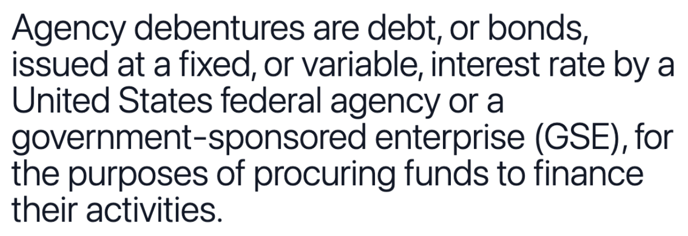

## Table of Contents

## What is an agency debenture?

An agency debenture is a type of bond that is issued by a government agency. Unlike regular bonds, agency debentures are not backed by the full faith and credit of the government. This means that if the agency cannot pay back the money, the government does not have to help. However, these bonds are still considered safe because the agencies that issue them are usually very stable and reliable.

People often buy agency debentures because they offer a good balance between safety and return. They usually give a higher interest rate than regular government bonds but are still less risky than bonds from private companies. This makes them a popular choice for investors who want to keep their money safe while earning a bit more interest.

## How does an agency debenture differ from other types of debentures?

An agency debenture is different from other types of debentures mainly because it is issued by a government agency, not by a private company or the government itself. Other debentures, like corporate debentures, are issued by companies and are backed by the company's general creditworthiness. Agency debentures, on the other hand, are not backed by the full faith and credit of the government, which means the government won't step in to pay if the agency can't.

Another difference is the level of risk and return. Agency debentures are generally seen as safer than corporate debentures because government agencies are usually more stable. However, they might offer a lower [interest rate](/wiki/interest-rate-trading-strategies) than corporate debentures because of this lower risk. Compared to government bonds, which are backed by the government and are very safe, agency debentures offer a bit higher interest rate to attract investors, but they [carry](/wiki/carry-trading) a bit more risk since they aren't fully guaranteed by the government.

## Who typically issues agency debentures?

Agency debentures are usually issued by government agencies. These agencies are part of the government but work on their own in some ways. Examples of these agencies include the Federal National Mortgage Association (Fannie Mae) and the Federal Home Loan Banks. These agencies help with things like housing and loans, and they use the money they get from selling debentures to do their work.

The main reason these agencies issue debentures is to raise money. They need this money to fund their programs and projects. Since these agencies are connected to the government, people trust them more than private companies. But, the government won't pay back the money if the agency can't, so they are a bit riskier than regular government bonds. Still, they are seen as safe investments because the agencies are usually very reliable.

## What are the benefits of investing in agency debentures?

Investing in agency debentures can be a good choice for people who want a safe place to put their money but also want to earn a bit more interest than they would from regular government bonds. Agency debentures are issued by government agencies, which are usually very stable. This means they are less risky than bonds from private companies. Because they are a bit safer, investors feel more comfortable putting their money into them.

Another benefit is that agency debentures often offer higher interest rates than regular government bonds. This is because they are not fully backed by the government, so they need to offer a bit more to attract investors. Even though they carry a bit more risk than government bonds, they are still seen as a safe investment. This makes them a good option for people who want to balance safety with [earning](/wiki/earning-announcement) a bit more money.

## What are the risks associated with agency debentures?

Agency debentures carry some risks that investors should know about. The main risk is that they are not backed by the full faith and credit of the government. This means if the agency that issued the debenture can't pay back the money, the government won't step in to help. So, there's a small chance that investors could lose their money if the agency runs into big trouble.

Another risk is that agency debentures might not be as easy to sell as other types of bonds. If you need to get your money back quickly, you might have a harder time finding someone to buy your agency debenture. This can be a problem if you need your money in a hurry. While these risks are small, it's important for investors to understand them before putting their money into agency debentures.

## How are agency debentures rated and what does this mean for investors?

Agency debentures are rated by credit rating agencies like Moody's, Standard & Poor's, and Fitch. These agencies look at how likely it is that the agency will be able to pay back the money it borrowed. The ratings they give can be things like AAA, AA, A, and so on. A higher rating, like AAA, means the agency is seen as very safe and likely to pay back the money. A lower rating means there's more risk that the agency might not be able to pay back the money.

For investors, these ratings are really important. They help people decide if an agency debenture is a good investment. If an agency debenture has a high rating, investors feel more comfortable because it's seen as a safer bet. But if the rating is lower, investors might think twice because there's more risk. So, the ratings help investors understand the level of risk and make smarter choices about where to put their money.

## What is the process for purchasing an agency debenture?

To buy an agency debenture, you first need to find a broker or a financial institution that sells them. You can do this by looking online or asking your bank. Once you find a broker, you'll need to open an account with them if you don't already have one. This usually involves filling out some forms and giving them some personal information.

After you have an account, you can tell your broker which agency debenture you want to buy. They will give you information about the debenture, like the interest rate and when it will mature. If you decide to go ahead, you'll need to transfer money into your account to cover the cost of the debenture. Once the money is in your account, your broker will buy the debenture for you. You'll then own the debenture and start earning interest until it matures or you decide to sell it.

## How do agency debentures contribute to the economy?

Agency debentures help the economy by giving government agencies money to do important work. These agencies, like Fannie Mae and the Federal Home Loan Banks, use the money from selling debentures to help people buy homes and make loans easier to get. This helps more people own homes and businesses grow, which is good for the whole economy. When more people can buy homes, it makes the housing market stronger and helps neighborhoods grow.

Also, agency debentures give investors a safe place to put their money. When people feel safe investing, they are more likely to keep their money in the economy instead of keeping it in cash. This means more money is available for businesses and projects that need it. So, agency debentures not only help government agencies do their jobs but also keep the flow of money in the economy going strong.

## What are the tax implications of investing in agency debentures?

When you invest in agency debentures, you need to think about taxes. The interest you earn from agency debentures is usually taxable. This means you have to pay taxes on the money you make from the interest every year. The tax rate depends on your income and the tax laws where you live. So, it's a good idea to talk to a tax advisor to understand how much you'll need to pay.

Sometimes, agency debentures can have special tax rules. For example, some types of agency debentures might be exempt from state and local taxes, but you still have to pay federal taxes on the interest. It's important to check the specific rules for the agency debenture you're thinking about buying. Knowing the tax implications can help you decide if agency debentures are a good investment for you.

## How do interest rates affect the value of agency debentures?

Interest rates can really change how much an agency debenture is worth. When interest rates go up, new agency debentures start to offer higher interest rates to attract buyers. This makes the older agency debentures, which have lower interest rates, less attractive. So, the value of those older debentures goes down because people would rather buy the new ones that pay more interest.

On the other hand, when interest rates go down, the opposite happens. The older agency debentures with higher interest rates become more valuable. People want to buy them because they can't get the same high interest rates from new debentures. So, the value of those older debentures goes up. It's all about how the interest rates compare to what's available in the market at that time.

## Can agency debentures be used as collateral for loans?

Yes, agency debentures can be used as collateral for loans. Collateral is something valuable that you give to the bank when you borrow money. If you can't pay back the loan, the bank can take the collateral instead. Since agency debentures are seen as safe investments, banks often accept them as collateral.

Using agency debentures as collateral can help you get a loan with better terms. Banks feel safer lending money when they have something valuable like an agency debenture to hold onto. This can mean lower interest rates on the loan or a bigger loan amount. But you need to remember that if you can't pay back the loan, you might lose your agency debenture.

## What advanced strategies can investors use to optimize returns from agency debentures?

Investors can use a few smart strategies to get the most out of their agency debentures. One way is to buy and hold them until they mature. This means you keep the debenture until the end date when you get all your money back plus the interest. This strategy works well if you believe interest rates won't go up much, because then your debenture keeps paying the same interest rate, which could be higher than what new debentures are offering. Another strategy is to trade agency debentures. If you think interest rates will change, you can buy and sell debentures to make money from the price changes. For example, if you think rates will go down, you might buy debentures now because their value will go up later.

Another advanced strategy is called laddering. This means you buy agency debentures that mature at different times. For example, you might buy some that mature in one year, some in two years, and some in three years. This way, you get money back at different times, which can help you manage your cash flow better. It also lets you take advantage of different interest rates over time. If rates go up, you can reinvest the money from the debentures that mature into new ones with higher rates. This can help you earn more over time without having to guess what interest rates will do next.

## References & Further Reading

[1]: ["Advances in Financial Machine Learning"](https://www.amazon.com/Advances-Financial-Machine-Learning-Marcos/dp/1119482089) by Marcos Lopez de Prado

[2]: ["Machine Learning for Algorithmic Trading"](https://www.amazon.com/Machine-Learning-Algorithmic-Trading-alternative/dp/1839217715) by Stefan Jansen

[3]: ["Quantitative Trading: How to Build Your Own Algorithmic Trading Business"](https://github.com/LucindaYa/quant-resources/blob/master/Quantitative%20Trading%20How%20to%20Build%20Your%20Own%20Algorithmic%20Trading%20Business.pdf) by Ernest P. Chan

[4]: ["Fixed Income Securities: Tools for Today's Markets"](https://www.amazon.com/Fixed-Income-Securities-Markets-Finance/dp/1119835550) by Bruce Tuckman

[5]: ["The New Bond Workout: The Concurrent Evolution of Debt Structures and Credit Investment"](https://papers.ssrn.com/sol3/papers.cfm?abstract_id=2909186) by Rainer H. Heilmann