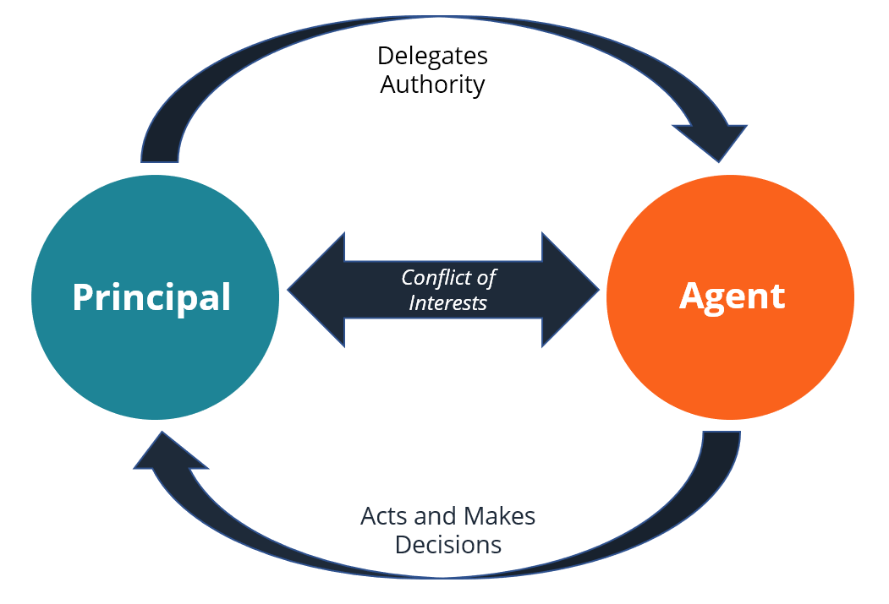

## Table of Contents

## What is the agency problem?

The agency problem is when the people running a company, like managers or executives, don't always do what's best for the people who own the company, like shareholders. This happens because the managers might have their own goals, like wanting a bigger salary or more power, which can be different from the owners' goals, like making more profit.

To deal with the agency problem, companies use different methods. One way is to give managers bonuses or stock options if the company does well. This can make managers want to work harder for the company's success because it will benefit them too. Another way is for the owners to keep a close watch on what the managers are doing, to make sure they are working in the owners' best interest.

## Who are the principal and the agent in the context of the agency problem?

In the agency problem, the principal is the person or group that owns the company, like the shareholders. They are the ones who have put their money into the company and want it to do well so they can make a profit. The principal's main goal is to see the company grow and be successful, because that will increase the value of their investment.

The agent, on the other hand, is the person or group hired by the principal to run the company, like the managers or executives. They are supposed to make decisions and take actions that will help the company succeed. But sometimes, the agent might have their own goals, like wanting a higher salary or more power, which can be different from what the principal wants. This difference in goals can lead to the agency problem, where the agent might not always do what's best for the principal.

## What are some common examples of the agency problem in business?

A common example of the agency problem happens when a company's CEO gets paid a lot of money even if the company is not doing well. The CEO might want a big salary and bonuses, but the shareholders, who own the company, want the company to make more profit. If the CEO focuses on their own pay instead of making the company better, this can hurt the shareholders. They might see their investments lose value because the company is not growing or making money.

Another example is when managers spend company money on fancy offices or expensive trips instead of using it to grow the business. The managers might enjoy these perks, but the shareholders want the money to be used in a way that will make the company more successful. When managers use company money for their own benefit, it can lead to less profit and lower stock prices, which hurts the shareholders.

In some cases, the agency problem can also show up when managers avoid taking risks that could help the company grow. They might want to keep their jobs safe and not do anything that could fail, even if taking a chance could lead to big rewards for the company. This cautious approach might protect the managers, but it can stop the company from growing and making more money, which is what the shareholders want.

## How does the agency problem affect corporate governance?

The agency problem affects corporate governance by creating a challenge for companies to make sure that the people running the company, like managers and executives, are doing what's best for the people who own the company, like shareholders. In corporate governance, rules and practices are set up to help guide how a company is run. But because of the agency problem, these rules need to focus on keeping managers in line with the owners' goals. This means setting up systems to watch over what managers do and making sure they are working hard to make the company successful.

To deal with the agency problem, corporate governance often includes ways to align the interests of managers with those of the shareholders. For example, companies might give managers bonuses or stock options if the company does well. This can motivate managers to work harder for the company's success because it will benefit them too. Also, having a board of directors that represents the shareholders can help keep an eye on what managers are doing. The board can step in if they see managers making decisions that are not in the best interest of the company or its owners.

## What are the main causes of the agency problem?

The main cause of the agency problem is that the people who run the company, like managers and executives, have different goals than the people who own the company, like shareholders. Managers might want a higher salary, more power, or fancy perks, while shareholders just want the company to make more money so their investment grows. Because these goals are different, managers might make choices that benefit themselves but hurt the company and its owners.

Another cause is that it can be hard for shareholders to keep a close watch on what managers are doing. Shareholders are often spread out and don't have the time or information to check on every decision managers make. This means managers might have a lot of freedom to do what they want, even if it's not the best thing for the company. Without strong rules or someone watching over them, managers can make choices that lead to the agency problem.

## What are some basic strategies to mitigate the agency problem?

One way to lessen the agency problem is by making sure managers' goals are the same as the shareholders' goals. Companies can do this by giving managers bonuses or stock options when the company does well. When managers know they will earn more money if the company succeeds, they will work harder to make it happen. This can help make sure managers are doing what's best for the company and its owners.

Another strategy is to have a strong board of directors that keeps an eye on what managers are doing. The board can make sure managers are making choices that help the company grow and make money. If managers are not doing a good job, the board can step in and make changes. This helps keep managers in line and working towards the same goals as the shareholders.

It's also important for shareholders to have a say in how the company is run. They can vote on big decisions and choose the people who sit on the board of directors. When shareholders are involved, it can help make sure managers know they are being watched and need to do what's best for the company. This can help reduce the agency problem by making managers more accountable to the people who own the company.

## How can aligning incentives help in reducing the agency problem?

When a company wants to reduce the agency problem, it can align the incentives of managers with the goals of shareholders. This means giving managers rewards that depend on how well the company does. For example, if managers get bonuses or stock options when the company makes more money, they will work harder to make the company successful. This is because they know they will benefit if the company does well. By making managers' rewards tied to the company's success, they are more likely to make choices that help the company grow and make money, which is what shareholders want.

Aligning incentives also helps because it makes managers feel like they are part of the company's success. When managers know that their hard work can lead to bigger bonuses or more stock options, they will be more motivated to do a good job. This can lead to better decisions and more effort from managers, which can help the company do better overall. When everyone is working towards the same goal, the agency problem can be reduced because managers are less likely to make choices that only benefit themselves and more likely to focus on what's best for the company and its owners.

## What role does transparency play in mitigating the agency problem?

Transparency is really important for fixing the agency problem. When a company is open about what it's doing, it helps shareholders see if managers are making good choices. If shareholders can look at the company's financial reports and see how money is being spent, they can tell if managers are using it to grow the business or just spending it on themselves. This openness makes it harder for managers to do things that only help them and not the company. When managers know they are being watched, they are more likely to do what's best for the company and its owners.

Having clear and honest information also helps build trust between managers and shareholders. When shareholders feel like they can trust the people running the company, they are more likely to support them and feel good about their investment. If managers are open about their decisions and the company's performance, it shows they are working hard to make the company successful. This trust can make shareholders feel more comfortable and less worried about the agency problem, because they believe managers are doing what's best for everyone.

## How can monitoring and performance metrics be used to address the agency problem?

Monitoring and performance metrics are important tools for dealing with the agency problem. By keeping a close watch on what managers are doing, companies can make sure they are making choices that help the company grow and make money. Shareholders can use regular reports and audits to see if managers are spending money wisely and working hard to improve the business. If managers know they are being watched, they are less likely to do things that only help themselves and more likely to focus on what's best for the company and its owners.

Performance metrics also play a big role in solving the agency problem. These are clear goals and measures that show how well the company is doing. For example, if a company sets targets for profit, growth, or customer satisfaction, managers will work to meet these targets because it shows they are doing a good job. When managers' pay or bonuses depend on these metrics, they have a strong reason to make the company successful. This helps align their goals with the shareholders' goals, making it less likely for the agency problem to happen.

## What advanced techniques can be employed to manage risk associated with the agency problem?

One advanced technique to manage the risk of the agency problem is to use risk management systems that track and analyze how managers make decisions. These systems can look at data to find patterns that might show when managers are making choices that are not good for the company. By using these systems, companies can spot problems early and take steps to fix them before they get worse. This can help keep managers focused on what's best for the company and its owners, reducing the chances of the agency problem causing harm.

Another technique is to set up strong internal controls and checks. This means having rules and processes in place that make sure managers follow the company's goals and do not misuse their power. For example, having different people check financial decisions can stop managers from spending money in ways that only help themselves. By making sure there are many eyes on what managers are doing, companies can lower the risk of the agency problem. This helps keep everyone working towards the same goal of making the company successful.

## How do regulatory frameworks influence the mitigation of the agency problem?

Regulatory frameworks help a lot in dealing with the agency problem by making rules that companies have to follow. These rules are there to make sure managers do what's best for the company and its owners, not just themselves. For example, laws might say that companies have to share important information with shareholders, like how much money they are making and how it's being spent. This helps shareholders see if managers are doing a good job or if they are making choices that only help themselves. When managers know they have to follow these rules, they are more likely to do what's right for the company.

Regulatory frameworks also help by setting up rules about how managers should be paid. Some laws say that a big part of a manager's pay should depend on how well the company does. This means managers will work harder to make the company successful because it will help them earn more money. When managers' pay is tied to the company's success, it makes their goals the same as the shareholders' goals. This can help reduce the agency problem because managers will focus on making the company do well, which is what the owners want.

## What are the latest research findings on innovative solutions to the agency problem and risk mitigation?

Recent research has shown that using technology, like AI and big data, can help solve the agency problem. AI can look at a lot of information to find out if managers are making choices that are good for the company or just for themselves. For example, AI can watch how managers spend money and see if it matches the company's goals. If AI finds that managers are not doing what's best for the company, it can warn the board of directors. This helps catch problems early and makes managers more likely to do what's right for the company and its owners.

Another new idea from research is using blockchain to make things more open and fair. Blockchain is a way to keep records that everyone can see and trust. By using blockchain, companies can make sure that all decisions and spending are clear to everyone. This means shareholders can easily check if managers are doing a good job. When everything is out in the open, it's harder for managers to do things that only help themselves. This can help lower the risk of the agency problem because managers know they are being watched and need to do what's best for the company.

## References & Further Reading

[1]: Jensen, M. C., & Meckling, W. H. (1976). ["Theory of the Firm: Managerial Behavior, Agency Costs and Ownership Structure."](https://www.sciencedirect.com/science/article/pii/0304405X7690026X) Journal of Financial Economics, 3(4), 305-360.

[2]: Coffee, J. C. (2005). ["A Theory of Corporate Scandals: Why the U.S. and Europe Differ."](https://papers.ssrn.com/sol3/papers.cfm?abstract_id=694581) Oxford Review of Economic Policy, 21(2), 198-211.

[3]: O’Hara, M. (2015). ["High-Frequency Trading and Its Impact on Markets."](https://www.semanticscholar.org/paper/High-Frequency-Trading-and-Its-Impact-on-Markets-O'Hara/36480639e541378136f4eb27af5222d2d5905372) Annual Review of Financial Economics, 7, 133-152.

[4]: Kirkpatrick, C. D., & Dahlquist, J. R. (2010). ["Technical Analysis: The Complete Resource for Financial Market Technicians."](https://ptgmedia.pearsoncmg.com/images/9780134137049/samplepages/9780134137049.pdf) FT Press.

[5]: Fox, J. (2004). ["The Myth of the Rational Market: A History of Risk, Reward, and Delusion on Wall Street."](https://www.sciencedirect.com/science/article/pii/S1477388015300347) Harper Business.