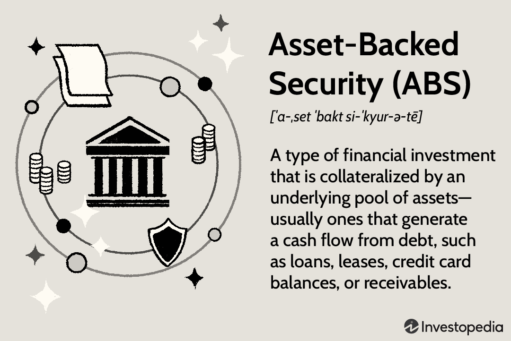

In today's interconnected world, security is a top priority across various domains due to rising threats and the increasing value of digital and physical assets. This article focuses on security mechanisms within security agencies and algorithmic trading to highlight their critical role in safeguarding data and operations. Security mechanisms are diverse, encompassing measures such as encipherment, digital signatures, and access control to ensure the integrity, confidentiality, and availability of information.

In the context of security agencies, these mechanisms extend beyond data protection and are integral to the issuance and management of agency securities. These securities, often backed by government-sponsored entities, provide both stability and reduced risk for investors. Understanding various security mechanisms aids agencies in maintaining trust and reliability.



Algorithmic trading, characterized by the use of sophisticated algorithms to execute trades, significantly benefits from robust security measures. The rapid pace of trades and the intricate nature of these systems require stringent security checks and balances to protect trading strategies and ensure market integrity. The impact of security is not confined to data protection but extends to risk management, highlighting the necessity for comprehensive security strategies.

By understanding these security mechanisms, individuals and institutions can effectively safeguard their data and operations, minimizing the potential for disruptions and loss. This article unfolds the significance of these mechanisms, illustrating their impact on security agencies and algorithmic trading.

## Table of Contents

## Understanding Security Mechanisms

Security mechanisms are integral to safeguarding data against unauthorized access, cyber threats, and potential data breaches. These mechanisms are designed to ensure data integrity, confidentiality, and availability, thereby safeguarding sensitive information across various platforms and systems. Understanding the fundamentals and application of these mechanisms is key to maintaining secure operations and communications.

Encipherment is a foundational security mechanism where plaintext data is transformed into ciphertext using an encryption algorithm and a key. This process ensures data confidentiality, as only authorized parties possessing the correct decryption key can access the original information. Encipherment is widely used in securing communications and data storage.

Access control is another critical mechanism that regulates who can view or use resources in a computing environment. It employs various strategies such as authentication, authorization, and auditing. Authentication verifies the identity of a user or system, often through passwords, biometric scans, or token-based systems. Authorization determines the access rights of an authenticated user, ensuring they can only access data necessary for their function. Finally, auditing involves tracking user activity to identify and respond to unauthorized access attempts.

Notarization involves the verification and recording of a digital transaction by a trusted third party. This mechanism is crucial in digital transactions to ensure data integrity and authenticity. By providing an additional layer of verification, notarization prevents tampering and assures stakeholders of the transaction's validity.

Data integrity mechanisms protect information from being altered by unauthorized users. Techniques such as checksums and hash functions are employed to detect changes in data. If the calculated checksum or hash value of received data differs from the expected value, it indicates tampering or data corruption, prompting further investigation.

Authentication exchange mechanisms, such as challenge-response protocols, ensure that both parties in a communication can verify each other's identity securely. These mechanisms protect against replay attacks and unauthorized access by requiring proof of identity and validity at the start of an interaction.

Bit stuffing is used primarily in data transmission to ensure that the transmitted data remains synchronized. It involves inserting non-informational bits into data streams to prevent the signal sequence from being misinterpreted as a control signal, ensuring data reliability in protocols like High-level Data Link Control (HDLC).

Finally, digital signatures provide a robust method for verifying the authenticity and integrity of digital documents. Using asymmetric cryptography, a digital signature involves generating a hash of the message signed with a private key. The recipient uses the sender's public key to decrypt the hash, verifying the document's source and confirming that it hasn't been altered during transmission.

Each of these mechanisms plays a pivotal role in maintaining the security of operations and communications, ensuring the protection of data in an increasingly digital world. Through their application, organizations can defend against unauthorized access and data breaches, thereby maintaining trust and integrity in their systems.

## Types of Security Agencies

Security agencies utilize a variety of mechanisms to safeguard their operations and clientele. These mechanisms are crucial in ensuring the stability and trustworthiness of financial markets and instruments. One primary avenue through which security agencies engage is through the issuance of agency securities, which are bonds provided by government-sponsored entities (GSEs) and federal agencies. 

These agency securities play a significant role in the market due to their perceived safety and reliability. The bonds issued are often backed by the U.S. government, which adds an extra layer of security for investors. This backing means that, in many cases, the government ensures the repayment of the principal and interest, reducing the risk for bondholders. Consequently, these securities are attractive to investors seeking stable returns with lower risk profiles.

Two prominent examples of agencies that issue these securities are the Federal National Mortgage Association (Fannie Mae) and the Small Business Administration (SBA). Fannie Mae is a GSE that provides [liquidity](/wiki/liquidity-risk-premium) to the mortgage market by purchasing mortgages from lenders and either holding them or reselling them as mortgage-backed securities. This process supports the availability and affordability of mortgage credit for American homeowners.

On the other hand, the Small Business Administration supports economic development by aiding small businesses. While not predominantly a bond-issuing entity, the SBA influences securities by guaranteeing loans, thus indirectly supporting the issuance of securities linked to small business development.

Overall, agency securities are an essential component of financial markets, offering investors a combination of safety and yield. The connection with the U.S. government not only inspires investor confidence but also promotes a stable financial environment by ensuring a trustworthy market for debt investments.

## Algorithmic Trading and Security

Algorithmic trading employs complex algorithms and technological solutions to execute trades at speeds and frequencies beyond human capability. The efficiency and effectiveness of these algorithms present significant advantages in financial markets, particularly through their ability to process vast amounts of data to identify trading opportunities and execute transactions with minimal delay. However, the reliance on automated systems elevates the necessity for comprehensive security measures to protect trading strategies and sensitive data from unauthorized access or data breaches.

Security in [algorithmic trading](/wiki/algorithmic-trading) is of utmost importance to uphold the integrity and reliability of trading operations. Effective security measures include the implementation of robust risk management controls to prevent potential market disruptions that could arise from flawed algorithms or external threats. These controls encompass a range of strategies designed to mitigate risks associated with algorithmic trading activities.

Key risk controls in algorithmic trading start with pre-trade risk checks, which are essential to verify that orders meet compliance and risk management criteria before execution. Such checks may include validating the sufficiency of funds, ensuring compliance with regulatory limits, and assessing the impact on market liquidity and [volatility](/wiki/volatility-trading-strategies). These preemptive measures help in minimizing the likelihood of unintended market consequences.

Post-trade surveillance is also crucial. It involves analyzing executed trades to detect anomalies, like deviations from expected performance benchmarks or patterns indicative of manipulative behaviors. Advanced analytics and monitoring systems can identify such discrepancies, allowing for prompt corrective actions and enhancing market integrity.

System safeguards are another critical component of security in algorithmic trading. These safeguards involve the protection of both hardware and software components of trading systems. For instance, measures like redundant system architectures, regular security audits, encryption protocols, and network monitoring ensure that the infrastructure remains resilient against cyber threats. Additionally, establishing fail-safes such as kill switches can halt trading activities in emergencies, further minimizing risk exposure.

Overall, the implementation of comprehensive security protocols in algorithmic trading is vital. By establishing robust risk management frameworks, traders can protect their operations and maintain the stability and integrity of financial markets.

## Security Best Practices in Algo Trading

Ensuring the security of algorithmic trading systems is paramount for mitigating risks and protecting sensitive trading strategies. Implementing robust security measures is essential for safeguarding algorithms and maintaining the integrity of trading operations.

One of the fundamental best practices is the use of strong passwords. Passwords should be complex, combining upper and lower case letters, numbers, and special characters. For enhanced security, organizations should employ two-[factor](/wiki/factor-investing) authentication (2FA), which adds an additional layer of verification, reducing the risk of unauthorized access.

Tracking protection is another essential measure, helping protect against unauthorized monitoring and tracking of trading activities. This involves implementing browser and network solutions that prevent data from being shared with third parties.

Encryption plays a crucial role in securing trading algorithms and data. Encrypting code ensures that even if unauthorized individuals access the files, they cannot read or modify them. Obfuscation adds another security layer by making source code difficult to understand, which helps protect proprietary trading logic from reverse engineering. A Python snippet for code obfuscation could look like this:

```python
import py_compile
py_compile.compile('trading_algo.py')
```

Frequent system updates are vital for maintaining a secure trading environment. Updates often include patches for vulnerabilities, thus keeping software resilient against newly discovered threats. Kernel hardening, which involves securing and enhancing the operating system kernel, is also critical, as it protects against exploits and unauthorized system-level changes.

API keys, which grant access to trading platforms and services, must be safeguarded with utmost care. Utilizing cloud solutions such as Amazon Web Services Key Management Service (AWS KMS) to store and manage API keys ensures additional security. AWS KMS allows strong encryption methods to protect sensitive information by controlling access to keys.

A commitment to these security best practices not only helps protect trading algorithms and data but also assures market participants of the system's integrity and reliability. Maintaining a proactive security posture is crucial for minimizing risks and sustaining confidence in algorithmic trading operations.

## Regulatory Frameworks and Compliance

In the rapidly evolving domain of algorithmic trading, regulatory frameworks are vital to ensure market integrity, protect investors, and manage systemic risks. Key regulatory bodies such as the Commodity Futures Trading Commission (CFTC), the Securities and Exchange Commission (SEC), and the Office of the Comptroller of the Currency (OCC) establish comprehensive guidelines that traders and trading firms must adhere to in order to operate legally and securely.

Compliance with these regulations is crucial for maintaining the legality and security of trading operations. Adherence to established rules enhances trust among market participants and contributes to the overall stability of financial markets. Regulations typically cover aspects such as registration of trading entities, reporting of transactions, and implementation of rigorous risk management practices.

Traders and firms must register with relevant regulatory bodies, ensuring that they are recognized entities within the trading system. Registration provides a mechanism for oversight and accountability, which is essential for monitoring activities and enforcing compliance. Reporting obligations require traders to disclose transactional data and other pertinent information, facilitating transparency and enabling regulators to monitor for potential abuses or irregularities in the market.

Risk management is another critical component of regulatory frameworks. Traders are required to implement robust risk controls to mitigate potential disruptions. These controls often include pre-trade risk assessments to evaluate the potential impact of trades, real-time monitoring during trading activities, and post-trade analyses to detect any anomalies. Implementing such controls helps prevent market manipulation, fraud, and other malicious activities that could destabilize the market.

Understanding and complying with these regulatory requirements is necessary to avoid penalties and sanctions. Non-compliance can result in financial penalties, increased scrutiny, or in severe cases, suspension from trading activities. By complying with regulatory standards, traders not only avoid these negative consequences but also contribute to fair and efficient market operations.

In conclusion, regulatory frameworks and compliance in algorithmic trading serve as the backbone for ensuring market stability and integrity. Both regulatory authorities and market participants have a shared responsibility to uphold these standards, fostering an environment where trust and security are paramount. Maintaining compliance with CFTC, SEC, and OCC guidelines is not merely a legal obligation but a strategic imperative for sustainable trading practices.

## Conclusion

In the rapidly evolving landscape of financial markets, security mechanisms in agency securities and algorithmic trading remain essential for risk mitigation. By employing these strategies, financial operations gain a layer of reliability and trust which is crucial for maintaining market integrity. As security protocols continually advance, individuals and institutions alike must stay abreast of current practices to ensure ongoing protection of their data and financial activities.

A robust security framework is beneficial not just for protecting sensitive information but also for enhancing overall market stability. Whether through implementing cutting-edge encryption techniques or adhering to comprehensive regulatory frameworks, a strong security posture allows for the safeguarding of assets in a sophisticated and interconnected financial environment. By proactively adopting stringent security measures, both traders and security agencies can contribute to a more secure and trustworthy financial ecosystem.

## References & Further Reading

[1]: Bandyopadhyay, S., Aghaie, A., & Garfinkel, R. (2011). ["A Simulation Study on Algorithmic Trading."](https://www.ese.iitb.ac.in/~santanu/pub.html) Annals of Operations Research, 191(1), 221–242.

[2]: Lopez de Prado, M. (2018). ["Advances in Financial Machine Learning."](https://www.amazon.com/Advances-Financial-Machine-Learning-Marcos/dp/1119482089) Wiley.

[3]: Ferro, F. (2014). ["Managing Information Security Risks: The OCTAVE Approach."](https://archive.org/details/managinginformat0000albe) Addison-Wesley Professional.

[4]: Bhattacharyya, D. K., & Kalita, J. K. (2014). ["Network Anomaly Detection: A Machine Learning Perspective."](https://www.semanticscholar.org/paper/Network-Anomaly-Detection%3A-A-Machine-Learning-Bhattacharyya-Kalita/9adfed630fd4b30669b848179ad1c0a83b667894) CRC Press.

[5]: Hasbrouck, J., & Saar, G. (2013). ["Low-Latency Trading."](https://www.sciencedirect.com/science/article/abs/pii/S1386418113000165) The Review of Financial Studies, 26(9), 2095–2131.

[6]: MacCarthy, K. C. (2018). ["Market Microstructure in Practice."](https://worldscientific.com/worldscibooks/10.1142/10739) Wiley.

[7]: Boneh, D., & Shoup, V. (2020). ["A Graduate Course in Applied Cryptography."](https://crypto.stanford.edu/~dabo/cryptobook/BonehShoup_0_5.pdf) Draft.