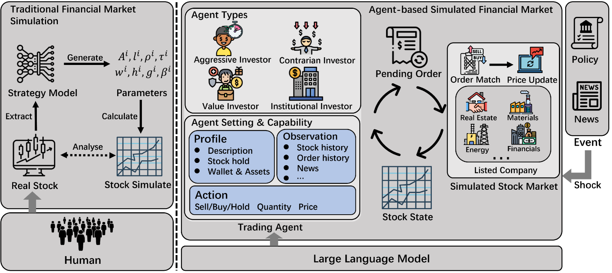

## Table of Contents

## What is an agent-based market simulation?

An agent-based market simulation is a computer model that helps us understand how markets work by simulating the actions of different people or "agents" within the market. These agents can be buyers, sellers, or other participants, and they make decisions based on rules set by the model. The simulation shows how these individual decisions can affect the whole market, like prices and how much is bought and sold.

These simulations are useful because they let us see what might happen in real markets without actually having to do it. For example, we can change the rules or the number of agents to see how the market reacts. This helps economists and business people make better guesses about what might happen in the future and plan accordingly.

## How do agent-based models differ from traditional economic models?

Agent-based models and traditional economic models look at markets in different ways. Traditional models often use math formulas to predict how the whole market will act. They assume everyone in the market thinks and acts the same way, and they focus on things like supply and demand to explain how prices change. These models are good for making big, overall predictions but can miss out on the details of how individual people make choices.

On the other hand, agent-based models zoom in on the individual "[agents](/wiki/agents)" or people in the market. Each agent can have their own rules for making decisions, which can be different from one another. This means the model can show how the choices of many different people can lead to complex results in the market. Agent-based models are great for seeing how small changes or new rules might affect the market, but they can be harder to set up and run because they need a lot of detailed information about each agent.

## What are the basic components of an agent-based market simulation?

The first basic component of an agent-based market simulation is the agents themselves. These are the individuals or entities that participate in the market, like buyers and sellers. Each agent follows a set of rules or behaviors that guide their decisions. For example, a buyer agent might decide to buy a product if the price is below a certain amount, while a seller agent might decide to sell more if the price goes up. The rules can be simple or complex, and they can change over time based on what happens in the simulation.

The second component is the environment, which is the market where the agents interact. This includes things like the rules of the market, the way prices are set, and how agents can communicate with each other. The environment can be set up to mimic a real market, like a stock exchange or a grocery store. It's important because it affects how the agents behave and how the market evolves over time.

The third component is the simulation process itself. This is where the computer runs the model over and over, letting the agents interact and make decisions. The simulation keeps track of what happens, like how prices change and how much is bought and sold. By running the simulation many times, researchers can see patterns and understand how different rules or changes might affect the market.

## Can you explain the role of agents in these simulations?

In agent-based market simulations, agents are the key players that make everything happen. They can be buyers, sellers, or other types of market participants. Each agent has its own set of rules or behaviors that tell it what to do. For example, a buyer agent might decide to buy a product if the price is low enough, while a seller agent might decide to sell more if the price goes up. These rules can be simple or complex, and they can change over time based on what's happening in the simulation. The important thing is that each agent makes decisions on its own, which can lead to all sorts of interesting and unexpected results in the market.

The role of agents is to show how individual choices can affect the whole market. When lots of agents interact with each other, their decisions can cause prices to change, products to be bought and sold, and the market to evolve in ways that might be hard to predict. By watching what the agents do, researchers can learn about how markets work in real life. They can see how small changes or new rules might make a big difference in the market. This helps them understand and predict what might happen in the future, which is really useful for making plans and decisions.

## What types of markets are typically simulated using agent-based models?

Agent-based models are often used to simulate financial markets, like stock markets or currency markets. In these simulations, agents can be traders, investors, or banks, and they make decisions about buying and selling based on rules set by the model. This helps researchers see how things like stock prices or exchange rates might change over time. They can also test how new rules or policies might affect the market, which is really helpful for making better financial plans and decisions.

Another common use is to simulate consumer markets, like grocery stores or online shopping platforms. Here, agents can be shoppers or retailers, and they make choices about what to buy or sell based on things like price, quality, and personal preferences. These simulations can show how changes in prices or new products might affect what people buy. This is useful for businesses trying to figure out what to sell and how to set their prices to make more money.

Agent-based models can also be used to simulate labor markets, where agents are workers and employers. In these simulations, workers might decide to take a job based on the salary and the type of work, while employers might decide to hire based on the skills and experience of the workers. This can help researchers understand how things like wages and unemployment rates might change over time, and how policies like minimum wage laws might affect the job market.

## How is the behavior of agents programmed in agent-based market simulations?

In agent-based market simulations, the behavior of agents is programmed using a set of rules that tell each agent what to do. These rules can be simple, like "buy if the price is low," or more complex, like considering the agent's past experiences and the actions of other agents. Programmers write these rules into the simulation software, and each time the simulation runs, the agents follow these rules to make their decisions. The rules can be different for each type of agent, like buyers and sellers, to reflect how they might act in real life.

The rules can also change over time to make the simulation more realistic. For example, if an agent keeps losing money, the rules might be set up so that the agent starts to be more careful with its decisions. This kind of adaptability helps the simulation show how markets can change and evolve. By setting up the rules carefully, researchers can see how different behaviors and strategies among the agents can lead to different outcomes in the market, like changes in prices or how much is bought and sold.

## What are some common software tools used to create agent-based market simulations?

Some common software tools for creating agent-based market simulations include NetLogo, Repast, and MESA. NetLogo is popular because it's easy to use and has a lot of resources for learning how to make simulations. It's great for people who are new to programming because it uses a simple language to set up the rules for agents. Repast is another tool that's used a lot, especially by people who need more advanced features. It's good for making big, complex simulations with lots of agents and detailed rules. MESA is a newer tool that's becoming popular because it's easy to use and works well with other programming languages like Python.

These tools help researchers set up and run their simulations. They let you create different types of agents, like buyers and sellers, and set up the rules for how they act. You can also change the environment of the market, like the rules for trading or how prices are set. Once the simulation is running, these tools can show you what's happening in the market, like how prices are changing and how much is being bought and sold. This helps researchers understand how markets work and test out new ideas without having to do it in real life.

## What are the advantages of using agent-based simulations for market analysis?

Agent-based simulations are really helpful for understanding markets because they let us see how each person's choices can change the whole market. In these simulations, each person, or "agent," follows their own rules for deciding what to do. This means the simulation can show us how different people might act in a market, like buying more if the price goes down or selling more if the price goes up. By watching what all these agents do, we can learn a lot about how markets work in real life. This is really useful for figuring out what might happen if we change the rules of the market or add new products.

Another big advantage of agent-based simulations is that they let us test new ideas without having to do it in real life. For example, if we want to see what might happen if we change the minimum wage or introduce a new tax, we can set up the simulation to show us how the market might react. This helps businesses and governments make better plans and decisions. It's like having a safe space to try out new things and see what works best without risking real money or causing real problems.

## What challenges are faced when validating agent-based market simulations?

One of the main challenges in validating agent-based market simulations is making sure the simulation matches what happens in real life. Since these simulations are based on rules that tell each agent what to do, it can be hard to know if those rules are a good fit for how real people act. Researchers have to compare the results of the simulation with real market data to see if it's close enough. This can be tricky because markets are always changing, and it's hard to find the right data to compare with.

Another challenge is that agent-based simulations can be very complex. With lots of agents all making their own decisions, it can be hard to understand why the market in the simulation acts the way it does. This makes it tough to know if the simulation is working right or if there's something wrong with the rules. Researchers have to run the simulation many times and change the rules a bit to see how it affects the results. This takes a lot of time and effort, but it's important to make sure the simulation is as accurate as possible.

## How can agent-based market simulations be used to predict market trends?

Agent-based market simulations can help predict market trends by showing how individual choices can affect the whole market. In these simulations, each person or "agent" follows their own rules for deciding what to do. By watching what all these agents do, researchers can see patterns and figure out how the market might change in the future. For example, if a lot of agents start buying more of a product when the price goes down, the simulation can show that the price might keep going down as more people buy it. This helps businesses and governments guess what might happen next and plan accordingly.

Another way agent-based simulations help predict market trends is by testing new ideas without risking real money. If a business wants to know what might happen if they lower the price of a product, they can set up the simulation to show how the market might react. By changing the rules or adding new agents, researchers can see how different situations might play out. This is like having a safe space to try out new things and see what works best. It helps make better guesses about future trends and make smarter decisions.

## What are some real-world applications of agent-based market simulations?

Agent-based market simulations are used in the real world to help businesses understand how their customers might react to changes in prices or new products. For example, a grocery store might use a simulation to see what would happen if they lower the price of milk. They can set up the simulation so that each customer, or "agent," decides whether to buy more milk based on the new price. This helps the store figure out if lowering the price will make them more money or if it will just make them lose money because they have to sell milk for less.

These simulations are also used by governments to test out new policies before they put them into place. For example, if a government wants to raise the minimum wage, they can use a simulation to see how this might affect the job market. They can set up the simulation so that workers decide whether to work more or less based on the new wage, and employers decide whether to hire more or fewer workers. This helps the government understand if raising the minimum wage will help more people get jobs or if it might make it harder for businesses to hire people.

## How can the complexity of agent-based models be managed to ensure computational efficiency?

One way to manage the complexity of agent-based models and make them run faster is by simplifying the rules that the agents follow. If the rules are too detailed or if there are too many different types of agents, the simulation can take a long time to run. By making the rules simpler and having fewer types of agents, the simulation can finish more quickly. For example, instead of having many different kinds of buyers, you could group them into just a few types based on how they make decisions. This makes the simulation easier to run and still gives useful information about how the market might work.

Another way to keep agent-based models efficient is by using special computer programs that are made for running these kinds of simulations. Programs like NetLogo or MESA are designed to handle a lot of agents and rules without slowing down too much. They have built-in ways to make the simulation run faster, like running parts of the simulation at the same time on different parts of the computer. By using these tools, researchers can create detailed and complex simulations that still run quickly enough to be useful for understanding markets.

## References & Further Reading

[1]: Tesfatsion, L., & Judd, K. L. (Eds.). (2006). ["Handbook of Computational Economics: Agent-Based Computational Economics"](https://shop.elsevier.com/books/handbook-of-computational-economics/tesfatsion/978-0-444-51253-6) (Vol. 2). Elsevier.

[2]: Farmer, J. D., & Foley, D. (2009). ["The Economy Needs Agent-Based Modelling"](https://www.nature.com/articles/460685a). Nature, 460(7256), 685-686.

[3]: LeBaron, B., & Winker, P. (2008). ["Introduction to Agent-Based Models for Economic Policy Design"](https://www.degruyter.com/document/doi/10.1515/jbnst-2008-2-302/html). In: Handbook of Research on Complexity (pp. 849-879). Springer.

[4]: Hommes, C. (2006). ["Heterogeneous Agent Models in Economics and Finance"](https://www.researchgate.net/publication/4982557_Heterogeneous_Agent_Models_in_Economics_and_Finance_In_Handbook_of_Computational_Economics_II_Agent-Based_Computational_Economics_edited_by_Leigh_Tesfatsion_and_Ken_Judd_Elsevier_Amsterdam_2006). In: Tesfatsion, L., & Judd, K.L. (Eds.), Handbook of Computational Economics (Vol. 2, pp. 1109-1186). Elsevier.

[5]: Cont, R. (2001). ["Empirical Properties of Asset Returns: Stylized Facts and Statistical Issues"](http://rama.cont.perso.math.cnrs.fr/pdf/empirical.pdf). Quantitative Finance, 1(2), 223-236.

[6]: Macal, C. M., & North, M. J. (2010). ["Tutorial on Agent-Based Modelling and Simulation"](https://link.springer.com/article/10.1057/jos.2010.3). Journal of Simulation, 4(3), 151-162.

[7]: Lo, A. W. (2017). ["Adaptive Markets: Financial Evolution at the Speed of Thought"](https://archive.org/details/adaptivemarketsf0000loan). Princeton University Press. 

[8]: Jansen, S. (2018). ["Machine Learning for Algorithmic Trading"](https://github.com/stefan-jansen/machine-learning-for-trading). Packt Publishing.

[9]: Chan, E. P. (2009). ["Quantitative Trading: How to Build Your Own Algorithmic Trading Business"](https://github.com/egorpe/EPChan-QuantitativeTrading/blob/master/example7_6.m). Wiley.