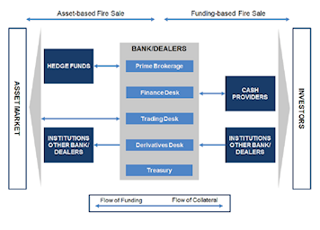

Agent-based modeling (ABM) in finance represents a groundbreaking approach to simulating financial markets and is especially pertinent to algorithmic trading. This methodology constructs computational models to simulate interactions of individual agents, each characterized by unique strategies and behaviors. These agents within financial markets could embody individuals, firms, or automated trading systems that interact by following predefined rules.

The agent-based models provide valuable insights into complex financial phenomena, including market bubbles, crashes, and volatility—events that are often challenging to capture with traditional financial modeling techniques. In contrast to classic models, which might assume a homogeneous agent population or static market conditions, ABM introduces heterogeneity and dynamism. Each agent in the model may adapt their strategies based on their experiences and changing market conditions, leading to emergent phenomena that reflect the unpredictable nature of real-world markets.

Financial markets are inherently complex systems, influenced by multifaceted interactions and external shocks. Agent-based modeling enhances our understanding by capturing these interactions at a micro-level and observing how they aggregate to generate macro-level phenomena. This approach is instrumental in the field of algorithmic trading, where strategies are continuously tested and refined based on evolving market data.

This article explores how agent-based modeling is applied to algorithmic trading, highlighting its significant benefits and the various challenges it faces.

## Table of Contents

## What is Agent-Based Modeling in Finance?

Agent-based modeling (ABM) in finance is a computational approach designed to simulate the interactions between autonomous agents, which can vary from individuals to firms or even automated systems. These agents operate within a specified environment—often a model of a financial market—following set guidelines or strategies. The ABM framework enables researchers and practitioners to explore the behavior of markets, including the dynamics of asset prices, under various conditions.

Unlike traditional financial models that typically rely on aggregate variables or assume homogeneous agent behavior, agent-based models emphasize the heterogeneity and individuality of agents. Each agent may possess unique strategies, objectives, and risk appetites. This diversity leads to complex interactions, often resulting in emergent phenomena that can be observed at the macro level. Such phenomena include market volatility, price bubbles, and crashes—dynamics that are notoriously challenging to predict with conventional models.

In an agent-based model, the emergent market behaviors are outcomes of local interactions between [agents](/wiki/agents) and their adaptation to continuously changing market conditions. For instance, agents might adjust their trading strategies based on price movements or shifts in market sentiment, resulting in feedback loops that can amplify certain market trends. This adaptability allows ABM to capture the intricate dynamics of financial markets more accurately.

A fundamental aspect of ABM in finance is the ability to simulate diverse trader strategies and assess the impact of macroeconomic variables on these strategies. This modeling process supports the examination of how micro-level interactions and decision-making can culminate in sizable macroeconomic impacts, providing insights into systemic risks and potential destabilizing factors within financial systems.

The methodological underpinning of ABM relies on simulating many individual agents each acting according to defined rules. These simulations can reveal patterns or trends that are not apparent when using traditional equilibrium-focused financial models, offering a richer comprehension of market dynamics and the underlying causes of observed financial phenomena. Through scenarios that reflect realistic market environments, ABM aids in scenario testing and the exploration of strategic interventions that might stabilize or optimize market performance.

## Applications of ABM in Algorithmic Trading

Agent-based modeling (ABM) serves as a vital tool in the domain of [algorithmic trading](/wiki/algorithmic-trading), facilitating the development and testing of trading strategies across various market conditions. These models allow for the simulation of complex market environments by representing traders as heterogeneous agents, each characterized by distinct risk tolerances, investment strategies, and reaction times. This heterogeneity is essential for capturing the nuanced interactions that occur in financial markets.

By applying ABM, traders and financial institutions can better understand how their trading strategies interact with market dynamics, potentially leading to significant disruptions such as flash crashes. These events often stem from the interplay of automated trading systems and can be analyzed by observing the emergent behavior from the simulated interactions of multiple agents.

For instance, consider a market simulation where agents follow different trading algorithms. For a specific trading strategy, the agent-based model can simulate scenarios in which several agents react to price movements, each influencing market [liquidity](/wiki/liquidity-risk-premium) and [volatility](/wiki/volatility-trading-strategies). Through iterative simulations, ABM can provide insights into how a trading strategy may impact market stability under varying conditions.

Moreover, ABM facilitates the exploration of "what-if" scenarios, which are crucial for devising robust trading strategies capable of withstanding diverse market situations. By simulating extreme market events or sudden regulatory changes, these models enable practitioners to assess the resilience of their strategies and refine them accordingly. This proactive approach helps mitigate risk and enhance decision-making processes.

The adaptability of ABM also allows for continuous testing and optimization as market conditions evolve. By incorporating real-time market data, these models can simulate up-to-date scenarios that closely mirror the actual market environment. This continuous refinement process aids in maintaining the effectiveness and reliability of algorithmic trading strategies over time.

In summary, agent-based modeling is instrumental in advancing algorithmic trading by offering a framework to simulate and analyze complex market interactions. It provides traders with a deeper understanding of the potential impacts of their strategies, enabling them to develop robust, adaptable, and resilient approaches to navigating the ever-changing financial markets.

## Key Features of Agent-Based Models

Agent-based models (ABM) in finance exhibit several key features that differentiate them from traditional modeling techniques, providing a robust framework for simulating and analyzing the complexities of financial markets. Central to their architecture is the incorporation of stochastic processes, which introduce random variables to model uncertainty in market dynamics. This feature allows for the modeling of unpredictable market elements, capturing the inherent volatility and randomness of financial markets more accurately.

Feedback loops are another integral component of agent-based models. These loops enable the recursive process where the output or result of an event influences future events, allowing the simulation of complex market interactions and dependencies. For instance, the feedback loop mechanism can model how an initial price change might lead to further changes in agent behavior, ultimately affecting market prices in subsequent iterations. These feedback mechanisms are quintessential in capturing the iterative nature of market dynamics.

The adaptive behavior of agents in ABM marks a significant advancement over static modeling approaches. Agents in these models can alter their strategies in response to changing market conditions. This adaptability is often achieved through algorithms that adjust agent behavior based on historical market data and current market signals. For example, agents might switch from a risk-averse strategy to a more aggressive trading approach if the model identifies favorable conditions, thereby providing a dynamic perspective on market processes.

Moreover, agent-based models frequently integrate external factors like news impacts or regulatory changes, enhancing their capability to reflect real-world dynamics. By incorporating such elements, the models account for the broad spectrum of variables that influence market states beyond mere price changes or [volume](/wiki/volume-trading-strategy) data. This integration is crucial for evaluating how sudden external shocks, such as policy announcements or geopolitical events, propagate through financial systems.

Agent-based models proficiently reproduce key stylized facts of financial markets, including fat-tailed distributions, volatility clustering, and non-linear dependencies. Fat-tailed distributions account for the higher likelihood of extreme events than predicted by normal distributions, a common feature in financial returns. Volatility clustering describes the phenomenon where large changes in market prices tend to be followed by further large changes, an effect that agent-based models can simulate by varying agent reactions to market movements over time. Non-linear dependencies capture the complex, non-proportional relationships between market variables, allowing for a more accurate representation of financial system behaviors.

Each of these features collectively ensures that agent-based models remain at the forefront of financial market analysis, providing deep insights into the emergent phenomena resulting from individual agent interactions. Through the synthesis of stochastic modeling, feedback mechanisms, agent adaptability, and external [factor](/wiki/factor-investing) integration, these models offer a comprehensive lens through which the complexities of financial markets can be understood and navigated.

## Challenges and Limitations

Agent-based modeling (ABM) presents significant insights for financial markets; however, it is accompanied by several challenges and limitations that need to be addressed for its optimal application. A primary challenge lies in the calibration and validation of these models. Calibration involves adjusting the parameters of an agent-based model so that its outcomes closely replicate real-world data. This process is often complex due to the multitude of parameters and the stochastic nature of the interactions between agents. Validation, on the other hand, requires rigorously ensuring that the model's predictions align with actual market phenomena. This step is crucial to ascertain the model's predictive reliability but is often complicated by the dynamic and ever-changing nature of financial markets.

The complexity inherent in agent-based models frequently leads to increased computational costs. Unlike traditional financial models, which typically rely on linear equations, ABMs simulate the interactions of numerous heterogeneous agents, each following potentially complex and adaptive behaviors. This necessitates significant computational resources, particularly when simulating large-scale models over long periods or performing extensive sensitivity analyses. Furthermore, the intricacies of these models can pose challenges in interpretation. The emergent phenomena that these models aim to capture often stem from complex, nonlinear interactions, making it difficult to dissect causal relationships or draw straightforward conclusions.

Another significant limitation is the requirement for abundant and comprehensive data. Agent-based models strive to accurately reflect real market dynamics and behaviors, a task that necessitates detailed data on agent interactions and market feedback mechanisms. However, acquiring such data can be challenging due to privacy concerns, proprietary restrictions, or simply the lack of available detailed granularity. The use of high-frequency trading data, for instance, while potentially highly informative, may not always be accessible or complete.

Despite these challenges, the ongoing advancements in computational power and data availability are progressively enhancing the applicability of ABM in finance. The increasing accessibility to big data and improvements in parallel computing and [machine learning](/wiki/machine-learning) algorithms provide new avenues to address some of these limitations. More efficient algorithms and computational techniques can help mitigate the high costs and complexity of simulation, while machine learning can assist in improving model calibration and validation processes. As computational capabilities advance and more comprehensive datasets become accessible, the potential for ABM to provide more detailed and accurate insights into financial markets continues to grow.

## Future Prospects

With continuous improvements in data analytics and computational technologies, the future of agent-based modeling (ABM) in finance looks promising. The integration of machine learning techniques with ABM is expected to significantly enhance the predictive power and accuracy of these models. Machine learning algorithms, particularly those focused on pattern recognition and anomaly detection, can be employed to refine agent behaviors and result in more realistic simulations. By leveraging big data analytics, vast amounts of historical and real-time financial data can be processed to inform and adjust the parameters of agent-based models, making them more reflective of market realities.

The financial industry is likely to see wider adoption of ABM for various purposes including strategy development, risk management, and policy analysis. ABM's capacity to simulate complex interactions among diverse agents in financial markets provides a valuable framework for testing new trading strategies and their potential impacts under different market conditions. This capability is particularly useful for risk management, where understanding the potential for systemic disruptions like market crashes is crucial. Policymakers can also use ABM to simulate the effects of regulatory changes, helping to craft policies that enhance market stability.

As these models evolve, they will likely provide deeper insights into systemic risk, aiding in the design of more resilient financial systems. By simulating a range of scenarios, including rare and extreme events, ABMs can identify vulnerabilities that might not be apparent through traditional modeling approaches. The adoption of ABM in financial institutions will allow for the continuous monitoring of systemic risk, providing early warning signals that can inform strategic decisions and policy interventions.

In summary, the advancements in computational power and data processing capabilities position agent-based modeling as a critical tool for the future of finance. Its potential to integrate with emerging technologies and contribute to a more comprehensive understanding of market dynamics ensures its place in the toolkit of financial analysts and policymakers. The ongoing development of ABM promises to bring significant innovations to strategy development, risk management, and the overall resilience of financial markets.

## Conclusion

Agent-based modeling (ABM) has emerged as a critical tool in the financial industry, offering profound insights into the dynamics of algorithmic trading. Unlike traditional financial models that often oversimplify the complexity of markets, ABM provides a granular approach by simulating the interactions of individual agents with distinct strategies and behaviors. This capability allows for a nuanced understanding of how market conditions evolve and how trading strategies can be optimized for effectiveness.

A significant advantage of ABM lies in its ability to model diverse market scenarios and agent interactions, which can illuminate unforeseen market behaviors and risks. For instance, by facilitating the simulation of extreme market events such as flash crashes or market bubbles, agent-based models help stakeholders devise strategies to mitigate potential disruptions. This adaptability also means that ABM can incorporate real-world factors such as regulatory changes and macroeconomic shifts, enhancing the relevance and robustness of financial analysis.

Despite its considerable benefits, ABM is not without challenges. The complexity of these models often results in high computational costs and requires rigorous calibration to ensure accuracy in reflecting real market dynamics. Nonetheless, the ongoing advancements in computational technologies and data analytics provide promising avenues for overcoming these limitations, enhancing the precision and efficiency of ABM.

As financial technologies continue to evolve, the role of agent-based modeling is set to expand, with implications reaching far beyond strategy development. The integration of ABM with machine learning and big data analytics holds the potential to revolutionize risk management and policy analysis, offering deeper insights into systemic risks and market resilience. Consequently, ABM is poised to play an essential role in shaping the future landscape of financial markets, providing a robust framework for understanding and managing market complexities.

## References & Further Reading

[1]: LeBaron, B. (2001). ["A builder’s guide to agent-based financial markets."](https://www.researchgate.net/publication/227623843_A_builder's_guide_to_agent-based_financial_markets) Quantitative Finance, 1(2), 254-261.

[2]: Farmer, J. D., & Foley, D. (2009). ["The economy needs agent-based modelling."](https://pubmed.ncbi.nlm.nih.gov/19661896/) Nature, 460(7256), 685-686.

[3]: Tesfatsion, L., & Judd, K. L. (2006). ["Handbook of Computational Economics Volume 2: Agent-Based Computational Economics"](https://api.pageplace.de/preview/DT0400.9780080459875_A24385391/preview-9780080459875_A24385391.pdf). North-Holland. 

[4]: Chen, S.-H., & Huang, Y.-C. (2018). ["Agent-based economic models and econometrics"](https://www.researchgate.net/publication/228364246_Agent-based_economic_models_and_econometrics). Annual Review of Economics, 10, 849-889.

[5]: Hommes, C. H. (2006). ["Heterogeneous agent models in economics and finance."](https://www.sciencedirect.com/science/article/pii/S157400210502023X) In T. Hens & K. R. Schenk-Hoppe (Eds.), Handbook of Financial Markets: Dynamics and Evolution, pp. 437-553.