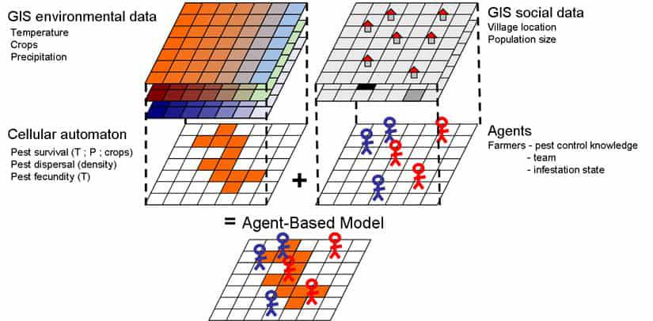

Agent-based modeling (ABM) is an innovative methodology applied across various fields, including finance, where it plays a critical role in algorithmic trading. This modeling technique involves simulating the actions and interactions of autonomous agents that represent individual market participants, such as traders and investors, within a digital environment. The primary objective of ABM in this context is to assess how the market environment affects trader behavior and, conversely, how the actions of traders impact market dynamics.

In algorithmic trading, ABM stands out by offering a sophisticated framework for examining the complexities of financial markets. The capability of agent-based models to mimic human-like decision-making processes allows for a deeper understanding of not only isolated trading actions but also the emergent patterns that arise from numerous interactions among market participants. Through the lenses of these models, one can capture the nuances of financial ecosystems that are often overlooked by traditional analytical methods.



This exploration seeks to uncover how ABMs are utilized to enhance market predictions and trading strategies, offering traders a significant edge. By simulating a wide range of market conditions and participant behaviors, these models are crucial in testing and refining algorithmic strategies before they are deployed in real-world environments. As we examine the technical aspects of ABM, it becomes clear that these models hold the potential to revolutionize strategic decision-making in algorithmic trading.

Understanding agent-based models can provide significant insights into future market conditions. They allow traders to craft more robust and resilient trading systems that can adapt to changing financial landscapes. By harnessing the detailed simulations provided by ABM, traders can anticipate market movements and develop strategies that minimize risk while maximizing potential returns.

## Table of Contents

## What is Agent-based Modeling in Algo Trading?

Agent-based modeling (ABM) is a computational approach that involves simulating the interactions of autonomous agents within a given system. Each agent in these models is designed to act independently, following a set of predefined rules. These rules dictate the agent's behavior, which can change as a result of learning or adaptation over time. The capacity of agents to adapt and learn from their experiences makes ABM particularly suitable for simulating complex systems characterized by dynamic interactions.

In the context of algorithmic trading, agents are tailored to represent individual market participants, such as traders or investors. The primary objective is to mimic the decision-making processes of these entities as they interact with the market environment. Each agent responds to market signals and events in real-time, allowing the model to capture human-like decision behaviors and reactions to various stimuli. This responsiveness enables the simulation of a trading environment where strategies can be evaluated based on realistic market conditions.

The flexibility of agent-based models lies in their ability to incorporate diverse types of behavior and interaction dynamics among [agents](/wiki/agents). For instance, agents can be programmed to follow various trading strategies, assess risk differently, or react uniquely to market movements. This adaptability helps in understanding how individual decisions contribute to collective market phenomena.

ABM's capacity to simulate heterogeneous agents interacting over time with feedback loops makes it an invaluable tool for comprehending the intricacies of financial markets. By simulating these interactions, agent-based models provide insights into complex trading environments, supporting the development of sophisticated strategies that can better anticipate market trends and anomalies. This dynamic approach contrasts with traditional models that rely heavily on historical data alone, as ABM considers both historical interactions and potential future changes, thereby offering a comprehensive framework for analyzing market behavior in [algorithmic trading](/wiki/algorithmic-trading).

## Benefits of Using Agent-based Models in Trading

Agent-based models (ABMs) offer a nuanced approach to predicting potential market movements, providing traders with an improved accuracy over traditional models. One of the primary benefits of ABMs is their ability to capture and interpret the emergent behaviors of markets. This emergent behavior arises from the complex interactions of numerous individual agents, each operating under a set of rules and responding dynamically to changes in the market environment. Such a framework allows for a more comprehensive understanding of how market sentiment evolves, which is essential for the development of strategic trading decisions.

ABMs are distinct from traditional models that rely heavily on historical data; they incorporate the dynamic interactions between agents that drive market changes. Instead of static data points, these models provide a simulation of market dynamics that can adapt and evolve with time. This capability is critical for visualizing how various external factors and agent strategies affect market conditions. Consequently, traders can gain insights not readily available through conventional data analysis.

The ability of ABMs to incorporate both historical and real-time data interactions allows for the development of trading strategies that are not only robust but are also adaptive to changing market conditions. For instance, using an ABM, one can simulate a variety of trading scenarios where agents employ different risk strategies and observe the emergent outcomes. Python, with its libraries such as NumPy and SimPy, can be utilized to create these simulations effectively. An example code snippet for a simple agent-based model might look something like this:

```python
import numpy as np

class Trader:
    def __init__(self, strategy):
        self.strategy = strategy
        self.wealth = 1000

    def act(self, market_condition):
        if market_condition > 0.5:
            self.wealth *= 1 + self.strategy
        else:
            self.wealth *= 1 - self.strategy

# Initialize agents with different strategies
agents = [Trader(strategy=0.1), Trader(strategy=0.2)]

# Simulate market conditions
market_conditions = np.random.rand(100)

# Run simulation
for condition in market_conditions:
    for agent in agents:
        agent.act(condition)
```

In this example, each `Trader` agent acts based on a simplistic rule set that reflects its strategy and adapts as market conditions change. Through such simulations, traders can identify which strategies might yield optimal results under varying market conditions, enhancing decision-making processes.

Overall, ABMs provide a flexible and effective tool for traders aiming to forecast market changes and optimize their trading strategies. By modeling the interaction between agents, these models allow for a deeper understanding of market dynamics and the continuous development of sophisticated trading algorithms.

## Applications of ABM in Algorithmic Trading

Agent-based modeling (ABM) plays a crucial role in algorithmic trading, offering numerous applications that enhance trading strategies and risk management. One of the primary uses of ABM is in risk management, where it is employed to simulate potential losses and benefits across various trading scenarios. By modeling market participants as individual agents, ABM provides nuanced insights into how different market situations might unfold, assisting traders in anticipating and mitigating risks effectively.

In addition, ABM is instrumental in the testing and development of new trading algorithms. By applying these models under simulated market conditions, traders can evaluate the performance of algorithms before deploying them in real market environments. This application ensures that the algorithms are robust and adaptive to changing market dynamics, thereby enhancing their reliability and effectiveness.

ABMs are also pivotal in assessing the market impact of large trades. Large trades can significantly affect market prices and [liquidity](/wiki/liquidity-risk-premium), posing risks of adverse price movements. By simulating these scenarios, ABMs allow traders to understand the potential impact and devise strategies to minimize negative consequences, such as executing trades in smaller blocks or using algorithms designed to reduce market footprint.

Scenario analysis is another key application of agent-based models. Through detailed simulations, ABM allows traders to prepare for rare or unexpected market events, often referred to as "black swan" events. This foresight enables the development of contingency plans, thereby reducing vulnerability to such occurrences.

Lastly, ABM aids in optimizing trading strategies by evaluating their effectiveness across diverse market situations. By simulating a wide range of market conditions, these models can identify which strategies perform best under specific circumstances, allowing traders to fine-tune their approaches and enhance profitability.

Through these applications, agent-based modeling proves to be a versatile and powerful tool in algorithmic trading, providing insights and solutions that traditional models may not offer. Its ability to simulate complex interactions among market participants makes it indispensable for modern traders aiming to navigate today's dynamic financial markets.

## Challenges and Limitations

Despite its advantages, agent-based modeling (ABM) in algorithmic trading presents several challenges and limitations. One significant issue is the complexity and computational cost associated with simulating a large number of agents. Each agent within the model must operate based on defined rules, and when multiple agents are interacting simultaneously, the computational resources required increase exponentially. This necessitates powerful computing hardware and efficient algorithms to manage simulations within a feasible timeframe.

A critical limitation lies in the model's dependence on the initial rules and assumptions that define agent behaviors. The extent to which these rules accurately encapsulate real-world trader behaviors fundamentally impacts the model's reliability. These assumptions may sometimes oversimplify the complexities of human decision-making in trading environments, potentially leading to inaccurate predictions of market dynamics.

Capturing the intricate details of actual market dynamics is another challenge. Financial markets are influenced by a multitude of factors, including economic indicators, geopolitical events, and investor sentiment. Realistically modeling these variables and their interactions within an agent-based framework demands sophisticated techniques and comprehensive data. Any oversights or inaccuracies in modeling these elements can significantly skew the outcomes of the simulations.

However, advancements in computational power and modeling techniques are gradually mitigating these challenges. The continuous development of high-performance computing infrastructure allows the handling of larger and more complex simulations. Meanwhile, integrating adaptive algorithms and [machine learning](/wiki/machine-learning) techniques into ABMs enhances their ability to adjust to new data and improve the fidelity of simulations.

Moreover, optimization methods, such as parallel computing and efficient numerical algorithms, can be employed to reduce computational load. For example, Python libraries like NumPy and Cython provide tools for optimizing the performance of simulations by harnessing lower-level programming efficiencies and parallel processing capabilities.

By addressing these challenges, agent-based models in algorithmic trading can continue to evolve, offering more accurate and insightful analyses of financial markets. The ongoing research and technological improvements are essential for refining these models, thereby enhancing their utility in predicting market movements and informing trading strategies.

## Future of Agent-based Modeling in Algorithmic Trading

As technology advances, the utility of agent-based modeling (ABM) in algorithmic trading is expected to grow significantly. Machine learning and [artificial intelligence](/wiki/ai-artificial-intelligence) (AI) are pivotal in developing more sophisticated and accurate models. These technologies enable the creation of agents with enhanced learning capabilities, allowing them to better adapt to the ever-changing market environments. For instance, [reinforcement learning](/wiki/reinforcement-learning) can be integrated into ABM to improve agents' decision-making processes based on historical experiences and simulations.

These advancements could enhance the predictive capabilities and adaptability of trading algorithms. By incorporating AI, ABMs can identify complex patterns and relationships in data that are not immediately apparent through traditional analysis methods. This improvement in pattern recognition can lead to more accurate predictions of market trends, facilitating the development of robust trading strategies that can adapt to unforeseen market shifts.

With continuous research, ABM could unlock new possibilities for more nuanced risk management and strategy optimization. The ability of agent-based models to simulate a wide range of market conditions allows traders to evaluate the performance of different strategies under various scenarios. This adaptability is particularly useful in assessing risk exposure and constructing strategies that maximize returns while minimizing potential losses.

The future of algorithmic trading could hinge on these models' ability to accurately simulate market conditions and predict movements. As computational power continues to grow and modeling techniques become more advanced, ABMs will likely play an even more integral role in financial markets. The ongoing integration of big data analytics and advanced computational methods will further refine the accuracy and efficiency of these models, making them indispensable in the quest for optimal trading solutions.

In conclusion, the evolution of agent-based modeling fueled by machine learning and AI is poised to transform algorithmic trading. This transformation promises to enhance the precision of market predictions, perfect risk assessment mechanisms, and enable traders to devise superior strategies. As the field continues to evolve, ABM stands at the forefront of innovations that will shape the future of financial trading.

## Conclusion

Agent-based modeling (ABM) marks a significant advancement in algorithmic trading by facilitating the simulation of real-world trading environments and behaviors. Unlike traditional methods that primarily rely on historical data, ABM offers a unique perspective on market dynamics through the detailed interaction of simulated agents, providing insights into emergent market behaviors. The potential benefits of ABM, such as enhanced predictive capabilities and adaptive strategy development, make it an essential tool for traders seeking a competitive advantage.

Despite its challenges, including computational complexity and the necessity of accurate behavioral assumptions, the evolving field of ABM is proving its worth. By implementing and understanding these models, traders can significantly refine their algorithmic trading strategies, yielding improved decision-making processes based on more comprehensive market simulations. As the technology and methodologies advance, particularly with the integration of machine learning and AI, ABM is expected to play a crucial role in the future of financial trading, offering a deeper understanding of market intricacies and more robust risk management frameworks. The continuous evolution of this field ensures its invaluable contribution to shaping modern trading systems and strategies.

## References & Further Reading

[1]: Tesfatsion, L., & Judd, K. L. (2006). ["Handbook of Computational Economics: Agent-Based Computational Economics Vol. 2"](https://api.pageplace.de/preview/DT0400.9780080459875_A24385391/preview-9780080459875_A24385391.pdf) Elsevier.

[2]: LeBaron, B. (2001). ["A Builder’s Guide to Agent-based Financial Markets."](https://www.researchgate.net/profile/Blake-Lebaron/publication/227623843_A_builder's_guide_to_agent-based_financial_markets/links/0c9605299f5774e0cb000000/A-builders-guide-to-agent-based-financial-markets.pdf) Quantitative Finance, 1(2), 254-261.

[3]: Farmer, J. D., & Foley, D. (2009). ["The Economy Needs Agent-based Modelling."](https://www.nature.com/articles/460685a) Nature, 460, 685-686.

[4]: Sornette, D. (2003). ["Why Stock Markets Crash: Critical Events in Complex Financial Systems."](https://archive.org/details/whystockmarketsc00sorn) Princeton University Press.

[5]: Lux, T., & Marchesi, M. (2000). ["Volatility Clustering in Financial Markets: A Micro-simulation of Interacting Agents."](https://www.researchgate.net/profile/Michele-Marchesi-2/publication/45122249_Volatility_Clustering_in_Financial_Markets_A_MicroSimulation_of_Interacting_Agents/links/02e7e517fc645dc94c000000/Volatility-Clustering-in-Financial-Markets-A-MicroSimulation-of-Interacting-Agents.pdf) Physica A: Statistical Mechanics and its Applications, 269(3), 478-528.