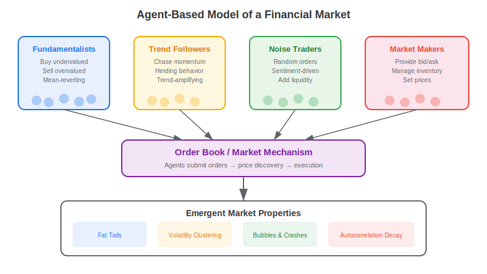
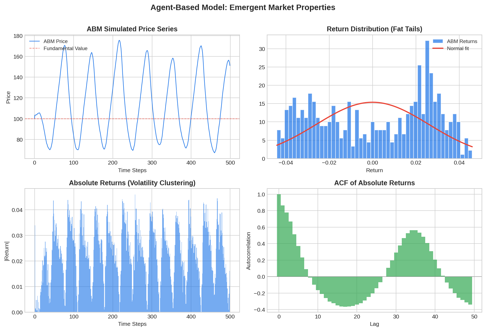

An **agent-based model (ABM)** in finance is a computational simulation where individual market participants — each following simple behavioral rules — interact through a market mechanism to produce emergent price dynamics. Unlike top-down equilibrium models that assume representative agents and efficient markets, ABMs build markets from the bottom up. The key insight: when heterogeneous agents with different strategies (fundamentalists, trend followers, noise traders) interact, the resulting price series naturally exhibits the "stylized facts" observed in real markets — fat-tailed return distributions, volatility clustering, bubbles, and crashes — without these properties being explicitly programmed.

## How Agent-Based Models Work

An ABM consists of three components:

**1. Agents** — individual traders, each with a decision rule. Common types include:

| Agent Type | Strategy | Market Effect |
|-----------|----------|---------------|
| Fundamentalist | Buy when price < fair value, sell when price > fair value | Stabilizing, mean-reverting |
| Chartist / Trend follower | Buy in uptrends, sell in downtrends | Destabilizing, momentum-amplifying |
| Noise trader | Random buy/sell with sentiment bias | Adds liquidity and unpredictability |
| Market maker | Provides bid/ask quotes, manages inventory | Sets prices, absorbs order flow |

**2. Market mechanism** — an order book or price-setting rule that aggregates individual orders into a market-clearing price.

**3. Interaction and adaptation** — agents may switch strategies based on recent performance. When chartists are profitable, more agents become chartists — amplifying trends. When fundamentalists are profitable, the market reverts.

This switching mechanism creates **endogenous regime changes**: the market alternates between calm, mean-reverting periods (fundamentalist-dominated) and volatile, trending periods (chartist-dominated).



## Emergent Stylized Facts

The power of ABMs is that simple agent rules produce complex, realistic market dynamics. The Lux-Marchesi model (1999) and the Santa Fe Artificial Stock Market (1999) were among the first to demonstrate this. Key emergent properties include:

**Fat tails**: Real market returns have heavier tails than a normal distribution — extreme moves occur far more often than Gaussian models predict. In ABMs, fat tails emerge naturally from the clustering of chartist behavior and occasional cascading liquidations.

**Volatility clustering**: Large price moves tend to follow large moves, and small moves follow small moves. This "GARCH-like" behavior emerges in ABMs because chartist profits attract more chartists, amplifying volatility until fundamentalists pull prices back.

**Bubbles and crashes**: When trend followers dominate, prices can deviate far from fundamental value. The subsequent correction, when fundamentalists regain influence, produces a crash-like pattern.

**Absence of return autocorrelation but presence of absolute return autocorrelation**: Returns themselves show little serial correlation (consistent with weak-form efficiency), but their magnitudes are correlated — exactly matching the empirical pattern in real equities.



## Python Implementation: Minimal ABM

The following code implements a simple two-type ABM with fundamentalists and chartists:

```python
import numpy as np

def run_abm(T=1000, n_agents=100, fundamental_value=100.0, seed=42):
    """
    Simple agent-based market model with fundamentalists and chartists.
    Agents switch strategies based on recent profitability.
    """
    np.random.seed(seed)

    price = np.zeros(T)
    price[0] = fundamental_value
    returns = np.zeros(T)

    # Agent state: fraction that are chartists
    frac_chartist = np.zeros(T)
    frac_chartist[0] = 0.3

    for t in range(1, T):
        fc = frac_chartist[t - 1]
        ff = 1.0 - fc

        # Fundamentalist demand: mean-revert toward fair value
        fund_signal = 0.05 * (fundamental_value - price[t - 1])
        fund_demand = ff * fund_signal

        # Chartist demand: follow recent momentum
        lookback = min(t, 10)
        momentum = (price[t - 1] - price[max(0, t - lookback)]) / price[max(0, t - lookback)]
        chart_demand = fc * 1.5 * np.clip(momentum, -0.1, 0.1) * price[t - 1]

        # Noise component
        noise = np.random.normal(0, 0.3)

        # Price update
        price[t] = price[t - 1] + fund_demand + chart_demand + noise
        price[t] = max(price[t], 10)
        returns[t] = (price[t] - price[t - 1]) / price[t - 1]

        # Strategy switching based on recent profitability
        if t > 10:
            recent_ret = returns[t - 10:t]
            trend_profit = np.mean(np.abs(recent_ret))  # Chartists profit from volatility
            fund_profit = -abs(price[t - 1] - fundamental_value) / fundamental_value

            # Logistic switching
            switch_signal = 2.0 * (trend_profit * 10 + fund_profit)
            frac_chartist[t] = 1.0 / (1.0 + np.exp(-switch_signal))
            frac_chartist[t] = np.clip(frac_chartist[t], 0.05, 0.95)
        else:
            frac_chartist[t] = frac_chartist[t - 1]

    return price, returns, frac_chartist

# Run simulation
price, returns, frac_chart = run_abm(T=2000)

# Analyze emergent properties
clean_returns = returns[1:]
print(f"Mean return:     {clean_returns.mean():.6f}")
print(f"Volatility:      {clean_returns.std():.6f}")
print(f"Skewness:        {float(np.mean((clean_returns - clean_returns.mean())**3) / clean_returns.std()**3):.3f}")
kurtosis = float(np.mean((clean_returns - clean_returns.mean())**4) / clean_returns.std()**4)
print(f"Excess kurtosis: {kurtosis - 3:.3f}")  # >0 indicates fat tails
print(f"Final chartist fraction: {frac_chart[-1]:.3f}")
```

## ABMs vs Equation-Based Models

| Dimension | Agent-Based Model | DSGE / Equilibrium Model |
|-----------|------------------|-------------------------|
| Approach | Bottom-up (micro → macro) | Top-down (macro → micro) |
| Agents | Heterogeneous, bounded rationality | Representative, fully rational |
| Equilibrium | Emergent, possibly never reached | Assumed or imposed |
| Dynamics | Can produce crashes, bubbles, regime shifts | Typically log-linear around steady state |
| Calibration | Simulation-based, harder to estimate | Bayesian / MLE estimation |
| Use case | Understanding market microstructure | Policy analysis, forecasting |

## Applications for Algo Traders

**Market microstructure research**: ABMs are the standard tool for studying [order book dynamics](https://paperswithbacktest.com/wiki/high-frequency-trading-ii-limit-order-book), market impact, and optimal execution. The Cont-Stoikov-Talreja model of limit order books is widely used in HFT research.

**Strategy stress testing**: Run your strategy against an ABM-generated market instead of historical data. This lets you test against scenarios (flash crashes, liquidity crises) that may not appear in your backtest window.

**Multi-agent RL environments**: Modern [LLM trading agents](https://paperswithbacktest.com/wiki/llm-trading-agents) and RL-based strategies are increasingly trained in multi-agent environments where other agents adapt to your strategy. ABMs provide the simulation framework for this adversarial training.

**Synthetic data generation**: ABMs can produce unlimited synthetic market data with realistic statistical properties, useful for augmenting training datasets when real data is scarce.

**Regime detection**: The chartist-fundamentalist fraction in an ABM maps directly to real-world regime dynamics. When trend followers dominate, expect momentum strategies to work; when fundamentalists dominate, expect mean reversion. This connects ABMs to practical [trading strategy selection](https://paperswithbacktest.com/wiki/mean-reverting-vs-momentum-strategies).

## Notable ABM Models in Finance

**Santa Fe Artificial Stock Market** (Arthur, Holland, LeBaron, Palmer, Tayler, 1997): One of the first computational ABMs. Showed that when agents use inductive reasoning (adapting rules based on experience), markets can exhibit both efficient and bubble-like behavior depending on learning speed.

**Lux-Marchesi Model** (1999): Demonstrated that fundamentalist-chartist switching produces realistic return distributions with fat tails and volatility clustering. Became the template for most subsequent financial ABMs.

**Cont-Bouchaud Model** (2000): Introduced herding through random communication networks. Agents form clusters that trade together, producing power-law distributed returns.

**ABIDES** (2019, J.P. Morgan): An open-source ABM framework for simulating realistic market microstructure, used to study market impact and order execution strategies.

## Limitations and Risks

ABMs are powerful for generating intuition and testing hypotheses, but they have significant limitations. The parameter space is large and often poorly constrained — many different parameter combinations can produce similar-looking output, making it hard to validate which model is "right." ABMs are better at reproducing qualitative stylized facts than producing precise quantitative forecasts. They also require substantial computational resources for large-scale simulations with many agents and realistic order books.

For traders, the practical advice is to use ABMs as a complement to historical backtesting, not a replacement. They are most valuable for understanding *why* markets behave the way they do and for stress-testing strategies against scenarios beyond historical experience.

## Conclusion

Agent-based models offer a unique bottom-up perspective on financial markets. By simulating heterogeneous agents with simple behavioral rules, ABMs naturally produce the complex dynamics — fat tails, clustering, bubbles — that equilibrium models struggle to explain. For algo traders, ABMs provide tools for microstructure research, strategy stress testing, multi-agent RL training, and deeper understanding of market regimes. As computing power grows and multi-agent AI systems become more sophisticated, the boundary between ABMs and live trading continues to blur.

---

**Explore further on PapersWithBacktest:**
- Browse [backtested trading strategies](https://paperswithbacktest.com/strategies) with Python code and performance metrics
- Access [clean historical market data](https://paperswithbacktest.com/datasets) for equities, crypto, and futures
- Take the [algo trading course](https://paperswithbacktest.com/course) — 60+ video lessons and notebooks
- Related wiki pages: [High-Frequency Trading & Limit Order Book](https://paperswithbacktest.com/wiki/high-frequency-trading-ii-limit-order-book) · [LLM Trading Agents](https://paperswithbacktest.com/wiki/llm-trading-agents) · [Mean Reverting vs Momentum Strategies](https://paperswithbacktest.com/wiki/mean-reverting-vs-momentum-strategies)
