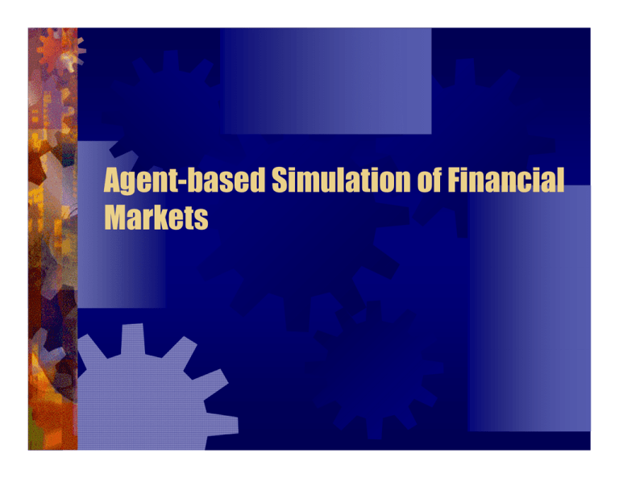

Agent-based simulations have become pivotal in enhancing our understanding of financial markets and formulating effective trading strategies. These simulations recreate market environments by modeling interactions among diverse market participants, each represented by an autonomous agent. This approach provides a robust framework for exploring complex market dynamics, enabling analysts and traders to construct more adaptive and successful trading strategies.

This article examines the transformative impact of agent-based simulations on algorithmic trading. Algorithmic trading, or algo trading, involves using computers to execute trading orders based on predefined strategies, often at speeds and frequencies that no human could achieve. By integrating agent-based models, traders can simulate various market conditions and participant interactions, leading to the development of trading strategies that are more resilient and flexible.

A key technological advancement fueling this transformation is deep reinforcement learning (DRL). DRL combines neural networks with reinforcement learning principles to enable agents to learn optimal strategies from vast amounts of data. Its application in financial markets allows trading systems to adaptively recognize patterns and make decisions in dynamic environments, thereby enhancing efficiency, reducing risk, and potentially maximizing returns.

The main objectives of employing agent-based simulations in finance are to gain insights into market dynamics, test and optimize trading strategies, and improve risk management practices. By simulating numerous scenarios and observing emergent behaviors, trading firms can better anticipate real-world market phenomena and adjust their strategies accordingly.

To facilitate easy navigation, this article is structured as follows: It begins with a fundamental explanation of agent-based simulations and their relevance in financial markets. Next, it discusses the integration of these simulations into algorithmic trading and examines the role of deep reinforcement learning in enhancing trading strategies. The article further explores the benefits of agent-based simulations and their contribution to market understanding. It concludes by addressing the challenges associated with implementing these systems and speculating on future directions for technological advancement in this field. Through this structure, readers will gain a comprehensive perspective on the significant role of agent-based simulations in shaping modern finance and algorithmic trading.

## Table of Contents

## What Are Agent-Based Simulations?

Agent-based simulations are computational models used to simulate the interactions of entities, known as agents, to assess their effects on the overall system. In the context of financial markets, these simulations are vital tools for modeling complex systems where numerous independent agents, such as traders or financial institutions, interact with each other and influence market dynamics. These models aim to replicate the behavior of actual financial markets, providing insights into how individual actions can lead to collective phenomena.

Intelligent [agents](/wiki/agents) in simulations are autonomous units that are endowed with distinct rules, strategies, and decision-making capabilities. In trading, these intelligent agents represent various market participants who react to market signals and execute trades based on predefined algorithms. Their roles vary from basic price takers or makers to sophisticated entities implementing advanced trading strategies. The behavior of these agents is determined by factors such as market conditions, risk preferences, and learning algorithms, enabling them to adapt over time.

Agent-based systems model market participants by defining an environment where these agents can interact. This environment accounts for trading rules, market mechanisms, and external economic factors. The interactions of agents are typically governed by local rules, yet their collective behavior can lead to emergent phenomena that are not directly predictable from the individual interactions. This capability is crucial for understanding market phenomena like [liquidity](/wiki/liquidity-risk-premium) changes or price bubbles.

There is a significant distinction between single-agent and multi-agent simulations. Single-agent simulations focus on individual agent behavior in isolation, usually to optimize a solitary trading strategy without considering interactive effects from other participants. Conversely, multi-agent simulations involve multiple agents interacting within the simulated market environment, allowing for a wider exploration of competitive and cooperative behaviors. Multi-agent models are particularly valuable for capturing the complexity of financial markets, as they can generate outcomes that mirror real-world market dynamics, such as [volatility](/wiki/volatility-trading-strategies) clustering and the formation of bid-ask spreads.

Overall, agent-based simulations offer a rich framework for analyzing the multifaceted nature of financial markets, highlighting the complexities and interdependencies that traditional models might overlook.

## How Agent-Based Simulations Apply to Algo Trading

Agent-based simulations have emerged as a transformative tool in [algorithmic trading](/wiki/algorithmic-trading) (algo trading), providing a novel methodology for analyzing and developing trading strategies. These simulations stand out by their ability to model complex systems, simulating the behaviors and interactions of individual agents, such as traders or market participants, in a financial market environment.

The integration of agent-based models into algo trading has evolved significantly since its inception. Initially, traditional approaches to algo trading relied heavily on statistical and mathematical models to predict market movements and formulate trading rules. However, these models often fell short in capturing the intricate dynamics and adaptive behaviors seen in real-world markets.

Agent-based simulation frameworks have introduced a paradigm shift by allowing traders to mimic market scenarios with a high degree of realism. These simulations create a synthetic market where each agent operates based on predefined rules or learned strategies, reflecting diverse market participant behaviors. For instance, some agents may follow [fundamental analysis](/wiki/fundamental-analysis) principles, while others might employ technical analysis or even [machine learning](/wiki/machine-learning)-driven strategies.

Several case studies exemplify the practical application of agent-based simulations in trading. One notable example is the use of these simulations to test the impacts of new trading regulations or market structures before their implementation. By recreating a market ecosystem with various agents, stakeholders can observe potential outcomes and adjust strategies accordingly. Another example could involve stress-testing trading algorithms against unforeseen market conditions, reducing risks associated with live deployments.

The advantages of employing agent-based simulations in developing trading strategies are manifold. These simulations allow for robust strategy testing under various hypothetical conditions, aiding traders in identifying potential weaknesses or strengths. They help uncover emergent phenomena, such as herd behavior or liquidity crunches, which are often difficult to detect with traditional models alone. Moreover, this approach facilitates the optimization of strategies by allowing real-time adaptation to evolving market conditions.

In conclusion, agent-based simulations provide a comprehensive framework for improving the effectiveness and resilience of algo trading systems. They enable market participants to anticipate and respond to market changes with heightened precision, ultimately enhancing the profitability and sustainability of trading strategies.

## Deep Reinforcement Learning in Financial Markets

Deep [reinforcement learning](/wiki/reinforcement-learning) (DRL) is a subfield of machine learning that combines reinforcement learning principles with [deep learning](/wiki/deep-learning) techniques to create systems capable of making decisions with minimal human intervention. In financial markets, DRL is utilized to develop trading algorithms that adapt to market complexities and uncover profitable trading strategies through continuous learning from the market environment.

The development and implementation of DRL in trading agents involve constructing frameworks where artificial agents interact with a market environment to maximize cumulative rewards over time. These agents are powered by neural networks which approximate the optimal policy decisions given market state inputs. The learning process hinges on reward signals obtained from trading actions. The complexity arises from balancing exploration—testing new actions—and exploitation—capitalizing on known profitable actions, while adapting to dynamic financial environments.

Decision-making in high-frequency trading ([HFT](/wiki/high-frequency-trading-strategies)) environments benefits significantly from reinforcement learning with deep architectures due to their ability to process vast amounts of data and recognize intricate patterns. DRL agents can make split-second trading decisions based on high-dimensional input data, such as price movements, transaction volumes, and historical series, which traditional algorithms might not efficiently handle. This capability is particularly crucial in HFT, where the speed and accuracy of decision-making directly impact profitability.

Platforms like PyMarketSim play a critical role in bridging the gap between theoretical DRL models and real-world application. PyMarketSim provides a simulation environment that facilitates the testing and evaluation of DRL algorithms under various market conditions. By allowing developers to create virtual trading scenarios, it becomes possible to iteratively refine strategies and validate performance in a controlled setting before deploying them in live markets. The flexibility of PyMarketSim supports various market models, enabling comprehensive analysis and robust strategy development.

The synergy between DRL and trading simulations represents a powerful toolset for modern finance, offering enhanced predictive capabilities, strategic adaptability, and opportunities for innovative trading solutions. As technology continues to evolve, DRL is expected to play an increasingly transformative role in shaping the future landscape of financial trading.

## Benefits of Agent-Based Simulations

Agent-based simulations offer numerous advantages over traditional market simulations, particularly in their ability to better model the complexities of financial markets. Unlike traditional models which often rely on equilibrium assumptions and linear approximations, agent-based simulations capture the heterogeneous nature of market participants, allowing for a more realistic representation of market dynamics. These simulations provide valuable insights into liquidity, market depth, and trader behaviors, all critical for understanding real-world financial systems.

One of the key benefits is the enhanced understanding of market dynamics. Traditional models might overlook how different types of traders—ranging from institutional investors to retail participants—influence price formation and volatility. Agent-based models incorporate diverse agent behaviors and decision-making processes, providing a granular view of how supply and demand dynamics evolve over time. For instance, by simulating different strategies, agents can exhibit emergent behavior such as [trend following](/wiki/trend-following) or contrarian patterns, which are crucial for comprehending complex market phenomena.

In terms of liquidity analysis, agent-based simulations offer a nuanced view of how liquidity is supplied and consumed. The interactions between different types of agents—market makers, speculators, and hedgers—can be explicitly modeled, giving insights into liquidity provision and the cost of trading. This is particularly important in high-frequency trading (HFT) environments, where even minor liquidity shortages can lead to significant market disruptions.

From the perspective of risk management and strategy optimization, agent-based simulations serve as a powerful tool. They allow traders to test and refine their trading strategies under various market conditions and stress scenarios without the risk of real capital loss. For example, traders can use these simulations to fine-tune parameters such as stop-loss levels or position sizes, optimizing their strategies to maximize returns while minimizing risk exposure. This is especially beneficial for developing robust algorithmic trading systems that can adapt to different market regimes.

Furthermore, agent-based simulations are instrumental in identifying emergent market behaviors and patterns that may not be apparent through traditional models. The complex interactions between agents can lead to self-organized phenomena, such as bubbles and crashes, providing critical insights into how such events arise and propagate. By uncovering these emergent patterns, market participants can better anticipate potential market shifts and adjust their strategies accordingly.

In summary, agent-based simulations offer a comprehensive framework for analyzing the intricacies of financial markets. They not only provide a deeper understanding of market dynamics and liquidity but also enhance risk management and strategy optimization. By capturing the emergent behaviors and patterns within market ecosystems, these simulations prove to be invaluable for traders seeking to navigate the ever-changing landscape of financial markets.

## Challenges and Future Directions

Agent-based simulations in financial markets, while powerful, face several challenges that impact their development and deployment. One significant challenge is the complexity involved in designing and implementing sophisticated agents that accurately mimic the behavior of real market participants. These agents must be capable of making autonomous decisions based on various market conditions, requiring deep domain knowledge, and often encapsulating complex behavioral models.

Moreover, the computational demands of maintaining high-fidelity simulations are substantial. High-fidelity simulations necessitate robust computational infrastructure given the large-scale nature of financial markets and the need for real-time processing. Ensuring that simulations run efficiently and accurately over time requires scalable computing resources and advanced algorithms that can process massive amounts of data without sacrificing speed or precision.

One technical requirement is the ability to model interactions among numerous agents while maintaining the overall system's stability and integrity. This requires sophisticated algorithms and data structures that can handle concurrency efficiently. For example, using parallel computing techniques and optimized data handling, such as vectorization in Python using libraries like NumPy or leveraging GPU acceleration through frameworks like TensorFlow, can significantly enhance simulation performance.

Looking forward, future trends and technological innovations are poised to revolutionize agent-based market simulations. The integration of [artificial intelligence](/wiki/ai-artificial-intelligence), particularly advances in machine learning and deep learning, is expected to improve the adaptability and intelligence of simulation agents. These technologies can facilitate more realistic and predictive models of market behavior by enabling agents to learn from historical and real-time data.

Furthermore, increasing interest in hybrid models that combine agent-based simulations with other modeling approaches, such as stochastic differential equations or network theory, presents a promising direction for research. These hybrid models have the potential to capture the multifaceted dynamics of financial markets more effectively.

For enhancing agent-based simulation frameworks, several research directions are suggested. One area is the development of modular and extensible simulation environments, which would enable researchers and practitioners to customize and extend models easily. This adaptability can be achieved through open-source platforms and collaborative frameworks that encourage the contribution and integration of new agent models and features.

Another vital research direction involves improving the interpretability and transparency of agent-based models. As these models become increasingly complex, understanding the decision-making processes of agents and their impact on market dynamics is critical for validating models and gaining trust from stakeholders in the financial industry.

In conclusion, while there are notable challenges in the development and deployment of agent-based simulations, technological advancements and ongoing research offer substantial opportunities for innovation. By addressing computational demands, leveraging AI, and pursuing hybrid and modular frameworks, the potential for these simulations to enhance understanding and strategy in financial markets is immense.

## Conclusion

Agent-based simulations have emerged as a pivotal element in the landscape of algorithmic trading, offering detailed insights into market dynamics and trader behaviors. These sophisticated models simulate the interactions of autonomous agents, replicating the complexity and unpredictability of real-world markets. By capturing the nuanced interplay of market participants, agent-based simulations enable the development and testing of innovative trading strategies under diverse conditions.

The transformative role of technology in financial markets cannot be overstated. Agent-based models, coupled with advances in areas like deep reinforcement learning, enhance our understanding of market behavior, enabling traders to optimize strategies and improve risk management. These technologies facilitate high-frequency and algorithmic trading by enhancing decision-making capabilities, and they reveal emergent market behaviors that traditional models might overlook.

Encouraging further exploration and adoption of these sophisticated simulation techniques is critical. As market dynamics evolve, embracing complexity through agent-based models can offer a significant competitive edge. Professionals and researchers should continually seek to refine these models, enhancing their accuracy and scalability. Open questions remaining in this domain include the optimization of computational requirements and the integration of real-time data to enhance the fidelity of simulations. Additionally, there is potential for exploring cross-disciplinary approaches that incorporate insights from fields such as data science and machine learning.

In summary, agent-based simulations stand as a cornerstone of modern algorithmic trading. Their continued development and integration promise to unlock new dimensions of efficiency and insight, shaping the future of financial markets. As these technologies advance, they invite ongoing dialogue and investigation, challenging professionals to innovate continually in pursuit of more sophisticated and effective trading strategies.

## References & Further Reading

[1]: Tesfatsion, L., & Judd, K. L. (Eds.). (2006). ["Handbook of Computational Economics, Volume 2: Agent-Based Computational Economics."](https://api.pageplace.de/preview/DT0400.9780080459875_A24385391/preview-9780080459875_A24385391.pdf) Elsevier.

[2]: LeBaron, B. (2006). ["Agent-based Computational Finance."](https://www.researchgate.net/publication/222831632_Agent-Based_Computational_Finance) Elsevier Journal of Economic Dynamics and Control.

[3]: Hommes, C. H. (2006). ["Heterogeneous Agent Models in Economics and Finance."](https://www.researchgate.net/publication/4982557_Heterogeneous_Agent_Models_in_Economics_and_Finance_In_Handbook_of_Computational_Economics_II_Agent-Based_Computational_Economics_edited_by_Leigh_Tesfatsion_and_Ken_Judd_Elsevier_Amsterdam_2006) Tinbergen Institute Discussion Paper.

[4]: Farmer, J. D., & Foley, D. (2009). ["The Economy Needs Agent-Based Modelling."](https://www.nature.com/articles/460685a) Nature.

[5]: Aldridge, I. (2013). ["High-Frequency Trading: A Practical Guide to Algorithmic Strategies and Trading Systems."](https://www.ahmetbeyefendi.com/wp-content/uploads/2020/07/High-Frequency-Trading-Irene-Aldridge.pdf) Wiley Finance Series.

[6]: Silver, D., et al. (2016). ["Mastering the Game of Go with Deep Neural Networks and Tree Search."](https://www.nature.com/articles/nature16961) Nature.

[7]: Sutton, R. S., & Barto, A. G. (2018). ["Reinforcement Learning: An Introduction."](https://web.stanford.edu/class/psych209/Readings/SuttonBartoIPRLBook2ndEd.pdf) MIT Press. 

[8]: Lopez de Prado, M. (2018). ["Advances in Financial Machine Learning."](https://www.amazon.com/Advances-Financial-Machine-Learning-Marcos/dp/1119482089) Wiley.