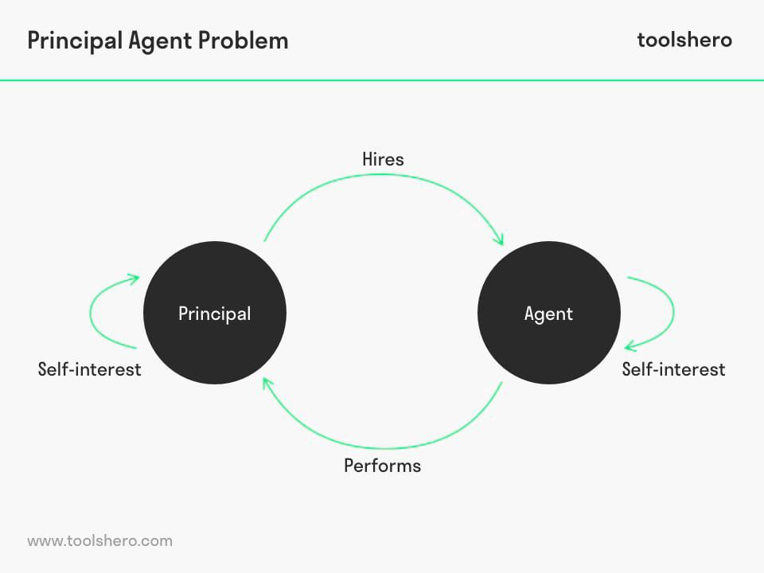

## Table of Contents

## What is the agent problem?

The agent problem, also known as the principal-agent problem, happens when one person or group (the principal) hires another person or group (the agent) to do something for them. The problem comes up because the principal and the agent might want different things. For example, a company's shareholders (principals) want the CEO (agent) to make decisions that will increase the value of their shares. But the CEO might make choices that benefit themselves more, like getting a bigger salary or perks, even if it's not the best for the shareholders.

To deal with the agent problem, people use different ways to make sure the agent does what the principal wants. They might use contracts with clear goals and rewards for meeting them. They might also watch what the agent does more closely or set up rules to limit what the agent can do. Even with these methods, it's hard to make sure the agent always acts in the best interest of the principal because they might find ways around the rules or the principal might not be able to watch everything the agent does.

## How does the agent problem differ from the principal-agent problem?

The agent problem and the principal-agent problem are actually the same thing. Both terms describe a situation where one person or group, called the principal, hires another person or group, called the agent, to do a job for them. The main issue is that the principal and the agent might have different goals. For example, a homeowner (principal) hires a contractor (agent) to fix their house. The homeowner wants the job done well and at a low cost, but the contractor might want to use cheaper materials to save money and finish the job quickly to take on more work.

Because of these different goals, the principal needs to find ways to make sure the agent does what they want. They might use contracts that clearly state what the agent should do and offer rewards for doing it well. They might also keep a close eye on the agent or set rules to limit what the agent can do. But even with these methods, it can be hard to make sure the agent always acts in the best interest of the principal. The agent might find ways to work around the rules or the principal might not be able to watch everything the agent does.

## Can you provide examples of the agent problem in everyday life?

Imagine a parent hiring a babysitter to watch their kids. The parent wants the babysitter to take good care of the children and make sure they are safe and happy. But the babysitter might want to spend more time on their phone or watch TV instead of paying close attention to the kids. The parent might try to solve this by setting clear rules and checking in during the babysitting time, but it's still hard to make sure the babysitter is always doing what the parent wants.

Another example is when someone goes to a car mechanic for repairs. The car owner wants the mechanic to fix the car well and not charge too much money. But the mechanic might suggest extra repairs that aren't really needed, just to make more money. The car owner might try to prevent this by getting a second opinion or asking for a detailed explanation of the repairs, but it can still be tough to know if the mechanic is being honest and doing the best job possible.

## What are the main causes of the agent problem?

The main reason for the agent problem is that the principal and the agent often want different things. The principal hires the agent to do a job, but the agent might have their own goals that don't match what the principal wants. For example, a homeowner might want a contractor to fix their house quickly and cheaply, but the contractor might want to use cheaper materials to save money and finish the job faster to take on more work.

Another cause is that it's hard for the principal to keep a close eye on everything the agent does. The principal might not be able to watch the agent all the time, so they can't be sure the agent is doing the job the way they want. This can lead to the agent doing things that benefit themselves more than the principal. For example, a company's shareholders might not be able to watch the CEO's every move, so the CEO might make decisions that increase their own salary instead of benefiting the shareholders.

## How does the agent problem affect businesses and organizations?

The agent problem can cause big problems for businesses and organizations. It happens when the people in charge, like the owners or shareholders, hire someone else, like a manager or CEO, to run the business for them. But the manager might not always do what's best for the business. They might make choices that help themselves more, like giving themselves a big raise or spending company money on fancy things. This can make the business less successful and can make the owners or shareholders lose money.

To try to fix the agent problem, businesses can use different ways to make sure the managers do what the owners want. They might write clear contracts that say what the manager should do and offer rewards for doing a good job. They might also watch what the manager does more closely or set up rules to stop the manager from doing things that aren't good for the business. But even with these methods, it can be hard to make sure the manager always acts in the best interest of the business. The manager might find ways to get around the rules, or the owners might not be able to watch everything the manager does.

## What are some common strategies to mitigate the agent problem?

One common way to lessen the agent problem is to use clear contracts. These contracts spell out what the agent needs to do and what rewards they will get for doing a good job. For example, a company might give its CEO a bonus if they meet certain goals, like increasing profits or growing the business. This can help make sure the agent's goals are more in line with what the principal wants. Another way is to keep a close eye on what the agent is doing. This might mean regular check-ins or reports to make sure the agent is following the rules and doing what they're supposed to do.

Another strategy is to set up rules that limit what the agent can do. These rules can stop the agent from making choices that only benefit themselves. For example, a company might have a rule that the CEO can't spend more than a certain amount of money without getting permission from the board of directors. This can help keep the agent from doing things that hurt the principal. Even with these strategies, it can still be hard to make sure the agent always does what the principal wants. The agent might find ways around the rules, or the principal might not be able to watch everything the agent does.

## How can incentives be structured to align the interests of agents and principals?

Incentives can be set up to make sure agents want the same things as principals. One way to do this is by using performance-based rewards. For example, a company might give its CEO a bonus if they meet certain goals, like increasing profits or growing the business. This makes the CEO want to do what's best for the company, because doing a good job means they get more money. Another way is to use long-term incentives, like stock options. If the CEO gets stock in the company, they will want the company to do well over time, because that will make their stock worth more money.

It's also important to make sure the incentives are clear and easy to understand. If the agent knows exactly what they need to do to get the rewards, they are more likely to do it. For example, a contract might say that the agent gets a bonus if they finish a project on time and under budget. This gives the agent a clear goal to work towards. But setting up good incentives can be tricky. The principal needs to make sure the incentives really match what they want the agent to do, and that the agent can't find ways to get the rewards without doing a good job.

## What role does transparency play in reducing the agent problem?

Transparency is really important in reducing the agent problem. It means that the principal can see what the agent is doing. When everything is out in the open, it's harder for the agent to do things that only help themselves. For example, if a company shares all its financial information with its shareholders, the shareholders can see if the CEO is spending money in a way that helps the company or just helps the CEO. This makes the CEO think twice before doing something that might not be good for the company.

Transparency also helps build trust between the principal and the agent. When the agent knows that the principal can see what they're doing, they are more likely to do things the right way. For example, if a homeowner can see all the work a contractor is doing on their house, the contractor is less likely to cut corners or use cheap materials. By making sure everything is clear and open, the principal can feel more confident that the agent is working in their best interest.

## How do regulatory frameworks address the agent problem?

Regulatory frameworks help tackle the agent problem by setting rules that everyone has to follow. These rules can stop agents from doing things that only help themselves and hurt the principal. For example, laws might say that company leaders have to share important information with shareholders. This makes it harder for the leaders to hide what they're doing and helps shareholders keep an eye on them. Regulations can also limit what agents can do, like how much money they can spend without permission. This can stop them from making choices that aren't good for the company.

Another way regulatory frameworks address the agent problem is by setting up ways to punish agents who don't follow the rules. If agents know they could get in trouble for doing the wrong thing, they are less likely to do it. For example, if a CEO breaks the rules and spends company money on fancy things, they might have to pay a fine or even go to jail. This makes them think twice before doing something that might not be good for the company. By having clear rules and punishments, regulatory frameworks help make sure agents do what's best for the principal.

## What are the latest research findings on the agent problem?

Recent research on the agent problem has focused on how technology can help solve it. One big finding is that using data and analytics can make it easier for principals to keep an eye on what agents are doing. For example, companies are using software to track how their employees are working and spending money. This helps the bosses see if the workers are doing what they're supposed to do. Another finding is that technology can help set up better incentives. For instance, apps can give instant feedback and rewards to agents, which makes them want to do a good job.

Another area of research looks at how culture and ethics can affect the agent problem. Studies show that when a company has a strong culture of honesty and fairness, agents are more likely to do what's best for the principal. This means that creating a good work environment where everyone feels valued can help reduce the agent problem. Researchers also found that teaching agents about ethics and the importance of doing the right thing can make a big difference. When agents understand why their actions matter, they are less likely to do things that only help themselves.

## How does the agent problem manifest in different sectors such as finance, healthcare, and government?

In the finance sector, the agent problem often shows up when bank managers or financial advisors make choices that might not be best for their clients or shareholders. For example, a bank manager might take big risks with the bank's money to try to make a lot of money quickly. This could help the manager get a big bonus, but it could also lose money for the bank's shareholders. Financial advisors might suggest investments that give them a high commission, even if those investments aren't the best for their clients. To fix this, banks and financial companies use rules and close monitoring to make sure their managers and advisors are doing what's best for everyone.

In healthcare, the agent problem can happen when doctors or hospital administrators make decisions that might not be in the best interest of patients. For example, a doctor might suggest a lot of tests or treatments that aren't really needed, just to make more money. Hospital administrators might focus on cutting costs to save money for the hospital, but this could mean less care for patients. To deal with this, healthcare systems use guidelines and oversight to make sure doctors and administrators are putting patients first. They might also use incentives to reward doctors for providing good care, not just for doing more procedures.

In government, the agent problem can show up when elected officials or public servants make choices that benefit themselves more than the people they serve. For example, a politician might support a project that helps their campaign donors, even if it's not the best use of public money. Public servants might work slowly or not at all, knowing that it's hard for the public to see what they're doing. To address this, governments use laws and transparency rules to make sure officials and public servants are working for the public good. They might also use audits and public reporting to keep an eye on what's happening and make sure everyone is doing their job right.

## What are the future trends and potential solutions to the agent problem?

In the future, technology will play a big role in solving the agent problem. More companies will use data and analytics to watch what their agents are doing. This means bosses can see if workers are doing their job the right way. Technology can also help set up better rewards for agents. For example, apps can give instant feedback and rewards, which makes agents want to do a good job. As technology gets better, it will be easier for principals to make sure agents are working in their best interest.

Another future trend is focusing more on culture and ethics. Companies will work on creating a good work environment where everyone feels valued and honest. When a company has a strong culture of fairness, agents are more likely to do what's best for the principal. Teaching agents about ethics and why their actions matter can also make a big difference. When agents understand the importance of doing the right thing, they are less likely to make choices that only help themselves. By combining technology with a focus on culture and ethics, we can find better solutions to the agent problem.

## What is the Agency Problem and how can it be understood?

The agency problem arises from the inherent differences in the objectives and information available to principals and agents, leading to potential conflicts of interest. In corporate environments, this often manifests when the interests of shareholders (principals) do not align with those of company executives (agents). In algorithmic trading, the scenario becomes more complex. Here, the principals are typically investors who provide capital, while the agents are either human traders or the autonomous algorithms executing trading strategies on their behalf.

The foundation of understanding the agency problem in this context is built upon 'agency theory,' which seeks to address the conflicts through the design of contracts and incentive structures. Agency theory posits that alignment of interests between the principal and agent can be achieved through well-structured contracts that consider various facets, such as performance-based compensation and monitoring mechanisms. This theory becomes particularly significant in algorithmic trading due to the unique role algorithms play as agents. Unlike traditional human agents, algorithms execute transactions at high speed and [volume](/wiki/volume-trading-strategy), making it difficult for principals to monitor performance and alignment with investor interests actively.

Algorithmic trading poses distinct challenges to traditional agency theory. Since algorithms operate autonomously, the direct oversight that principals have over human [agents](/wiki/agents) is diminished. This makes it crucial to construct detailed and robust algorithms where the objectives clearly reflect the financial goals of the investors. Furthermore, the complexity of trading algorithms demands that principals have a comprehensive understanding of how these algorithms function and the market conditions they exploit. This understanding helps devise incentive structures for human agents, such as algorithmic developers or fund managers, to prioritize transparency and effectiveness.

The mathematical modeling of agency problems in [algorithmic trading](/wiki/algorithmic-trading) can involve the use of decision theory and optimization techniques. One common approach is to establish a utility function representing the principal's preferences, which the agent must maximize. For example, if $U(x)$ denotes the utility function of the principal for a trading outcome $x$, then the goal of the agent, as executed by an algorithm, would be to solve:

$$
\text{maximize } U(x)
$$

subject to constraints that represent real-world trading conditions and risk parameters. Such mathematical frameworks help ensure that the agent's actions remain aligned with the principal's financial objectives.

Overall, addressing the agency problem in algorithmic trading requires a comprehensive approach involving the structuring of algorithms, contractual agreements, and incentive plans to mitigate potential conflicts and promote alignment between investor interests and the actions of both human and algorithmic agents.

## References & Further Reading

[1]: Eisenbach, T. M., & Van Tassel, P. J. (2020). ["High-frequency trading and the flash crash: A study of the October 15, 2014, US treasury market."](https://www.sciencedirect.com/science/article/pii/S1567564918303398) Journal of Financial Markets, 47, 100485.

[2]: Lopez de Prado, M. (2018). ["Advances in Financial Machine Learning"](https://books.google.com/books/about/Advances_in_Financial_Machine_Learning.html?id=oU9KDwAAQBAJ). Wiley.

[3]: O'Hara, M. (2015). ["High Frequency Market Microstructure."](https://www.sciencedirect.com/science/article/pii/S0304405X15000045) Annual Review of Financial Economics, 7, 103-120.

[4]: Biais, B., Foucault, T., & Moinas, S. (2015). ["Equilibrium Fast Trading."](https://www.sciencedirect.com/science/article/pii/S0304405X15000288) The Review of Economic Studies, 82(2), 414-455.

[5]: Biais, B., Glosten, L., & Spatt, C. (2005). ["Market Microstructure: A Survey of Microfoundations, Empirical Results, and Policy Implications."](https://www.cis.upenn.edu/~mkearns/finread/bias-spatt-survey.pdf) Journal of Financial Markets, 8(2), 217-264.

[6]: Giglio, S., Kelly, B., & Pruitt, S. (2016). ["Systemic Risk and the Macroeconomy: An Empirical Evaluation."](https://www.sciencedirect.com/science/article/pii/S0304405X16000143) Econometrica, 82(6), 2089-2137. 

[7]: Kirilenko, A., Kyle, A. S., Samadi, M., & Tuzun, T. (2017). ["The Flash Crash: High‐Frequency Trading in an Electronic Market."](https://www.jstor.org/stable/26652722) The Journal of Finance, 72(3), 967-998.