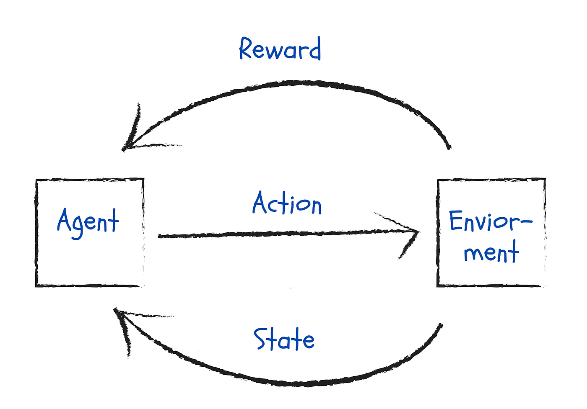

## Table of Contents

## What is an agent in the context of machine learning?

In machine learning, an agent is a program that can learn and make decisions on its own. It interacts with its environment, which could be a game, a robot, or even the internet. The agent observes the environment, makes decisions based on what it sees, and then takes actions. These actions can change the environment, and the agent learns from these changes to improve its future decisions.

A common example of an agent is in reinforcement learning, where the agent learns to achieve a goal through trial and error. For instance, an agent might learn to play a video game by trying different actions and seeing which ones lead to higher scores. Over time, the agent gets better at the game by learning which actions are most effective. This process is guided by a reward system, where the agent receives feedback on how well it is doing, helping it to adjust its strategy.

## How does an agent learn from its environment?

An agent learns from its environment by taking actions and seeing what happens next. It's like a student trying different ways to solve a problem and learning from the results. The agent starts with some basic knowledge or rules, but as it interacts with the environment, it gathers more information. This information helps the agent understand which actions lead to good outcomes and which ones don't. Over time, the agent gets better at making choices that help it achieve its goals.

In reinforcement learning, the agent's learning process is guided by rewards. When the agent does something good, it gets a reward, and when it does something bad, it might get a penalty. For example, if the agent is learning to play a game, it might get a reward for scoring points and a penalty for losing lives. The agent uses these rewards to figure out the best actions to take in different situations. Through many tries and adjustments, the agent improves its performance, much like how a person learns from experience.

## What are the key components of an agent-based system?

The key components of an agent-based system include the agent itself, the environment, and the interaction between them. The agent is like a smart program that can make decisions. It has sensors to observe the environment and effectors to take actions. The environment is the world around the agent, which could be a computer simulation, a real-world setting, or even the internet. The agent and the environment are always talking to each other. The agent sees what's happening in the environment, decides what to do, and then does something that might change the environment.

Another important component is the policy, which is like a set of rules that the agent follows to make decisions. The policy tells the agent what action to take based on what it sees. The agent learns and improves its policy over time by getting feedback from the environment. This feedback often comes in the form of rewards or penalties. For example, if the agent is playing a game, it might get a reward for scoring points and a penalty for losing. The agent uses these rewards to adjust its policy and get better at achieving its goals.

## Can you explain the difference between a reactive and a deliberative agent?

A reactive agent is like a quick thinker that reacts to what's happening right now. It looks at the environment, decides what to do based on what it sees, and then takes an action. It doesn't think about the future or remember the past much. For example, a robot that avoids obstacles by sensing them and moving away immediately is a reactive agent. It's simple and fast but can miss out on planning for better long-term outcomes.

On the other hand, a deliberative agent is more like a careful planner. It thinks about the future and uses what it knows from the past to make decisions. This type of agent has a model of the world and uses it to plan its actions. For instance, a chess-playing program that thinks several moves ahead and chooses the best path to win is a deliberative agent. While it can make smarter choices, it might take longer to act because it spends time planning.

Both types of agents have their strengths and weaknesses. Reactive agents are good for situations where quick responses are needed, but they might not do well in complex scenarios that require planning. Deliberative agents can handle more complicated tasks by thinking ahead, but they might be slower and need more computing power. Choosing between them depends on what the task needs and what resources are available.

## What is reinforcement learning and how does it relate to agents?

Reinforcement learning is a way for a computer program, called an agent, to learn how to do things by trying them out and seeing what works best. Imagine you're learning to ride a bike. You try different ways of balancing and pedaling, and you get better over time by figuring out what keeps you from falling. In reinforcement learning, the agent does the same thing. It takes actions in an environment, like a game or a simulation, and gets feedback in the form of rewards or penalties. If the agent does something good, it gets a reward, and if it does something bad, it might get a penalty. Over many tries, the agent learns which actions lead to the best results and improves its performance.

The connection between reinforcement learning and agents is very close. An agent in reinforcement learning is the learner that interacts with the environment. It uses what it learns to make better decisions. For example, if an agent is learning to play a video game, it tries different moves and sees which ones help it score more points. The agent keeps track of the rewards it gets and adjusts its strategy to get more rewards in the future. This process is guided by a simple rule: maximize the total reward over time. By following this rule, the agent can learn complex tasks, like playing games or even controlling robots, all by itself through trial and error.

## How do multi-agent systems work in machine learning?

Multi-agent systems in machine learning are like groups of smart programs working together or against each other. Each program, called an agent, can make its own decisions based on what it sees and what it wants to achieve. Imagine a soccer game where each player is an agent. They all have their own goals, like scoring or defending, but they also need to work together as a team. In multi-agent systems, agents might cooperate to solve a problem, compete to achieve their own goals, or do a mix of both. They communicate and learn from each other, which can make the whole system smarter and more effective.

In these systems, agents often use reinforcement learning to get better over time. Each agent tries different actions, gets rewards or penalties based on what happens, and then adjusts its strategy. For example, in a game like chess, each player (agent) learns by playing many games, trying different moves, and seeing what works best. The agents might also share what they learn with each other, so the whole group can improve faster. This way, multi-agent systems can solve complex problems that would be hard for just one agent to handle alone.

## What are some common applications of agent-based machine learning?

Agent-based machine learning is used in many areas, like games and robots. In games, agents can learn to play better by trying different moves and seeing what works. For example, a computer program can learn to play chess or video games by playing against itself or other programs. It tries different strategies and gets better over time by learning from its wins and losses. This makes the game more fun and challenging for people who play against the computer.

Another common use is in robotics. Robots can use agent-based learning to do things like move around without bumping into things or pick up objects. The robot tries different ways of moving or grabbing, and it learns what works best. For example, a robot in a warehouse can learn to find and move boxes more efficiently. This helps the robot do its job better and faster, which is useful in places like factories or homes where robots help with tasks.

Agent-based machine learning also helps in traffic control. Imagine a city with many traffic lights and cars. Each traffic light can be an agent that learns to change its timing based on how much traffic there is. The agents work together to make traffic flow smoothly. By trying different timings and seeing what reduces congestion, the traffic lights can learn to manage traffic better. This makes driving in the city easier and helps reduce wait times at intersections.

## What challenges are faced when implementing agent-based systems?

Implementing agent-based systems can be tricky because they need a lot of computer power. Each agent has to make decisions quickly based on what it sees in the environment. This means the computer has to handle a lot of information at once. If there are many agents, like in a big game or a busy city traffic system, the computer might struggle to keep up. Also, agents need to learn from their experiences, which takes time and can slow down the system even more. Making sure all the agents work well together without using too much computer power is a big challenge.

Another challenge is making sure the agents make good decisions. Agents learn by trying different things and getting rewards or penalties. But sometimes, they might learn the wrong lessons or get stuck doing the same thing over and over. This is called getting into a "local optimum," where the agent thinks it's doing well but could do much better if it tried something different. It's hard to design the rewards in a way that guides the agents to the best solutions. Also, in multi-agent systems, agents need to communicate and work together, which can be complicated. If one agent makes a bad decision, it might affect the whole system, making it hard to keep everything running smoothly.

## How can agents be evaluated for their performance in machine learning tasks?

To evaluate how well an agent is doing in a machine learning task, we look at how much reward it gets over time. In reinforcement learning, the agent tries to maximize its total reward. We can measure this by calculating the cumulative reward, which is the sum of all the rewards the agent gets during its task. If the agent is playing a game, we might look at its score or how many levels it completes. The higher the cumulative reward, the better the agent is doing. Sometimes, we also look at how quickly the agent learns to get better rewards. If it improves fast, that's a good sign that the agent is learning well.

Another way to check an agent's performance is by seeing how it handles different situations. We might test the agent in different environments or scenarios to see if it can adapt and still do well. For example, if the agent is a robot, we might change the layout of the room and see if it can still find its way around. We can also compare the agent's performance to other agents or to a set standard. If the agent does better than others or meets the standard, it shows that it's performing well. By using these methods, we can get a good idea of how effective the agent is at its task.

## What advanced techniques can be used to enhance the learning capabilities of agents?

One advanced technique to boost an agent's learning is called deep reinforcement learning. This method combines reinforcement learning with deep neural networks, which are like powerful brain models in computers. The neural network helps the agent understand the environment better by recognizing patterns and making sense of complex data. For example, in a game, the neural network can learn to recognize different objects and predict what will happen next. This makes the agent smarter and able to make better decisions. Deep reinforcement learning has been used to train agents to play games like Go and Atari at a superhuman level, showing how powerful this technique can be.

Another technique is transfer learning, which helps agents use what they've learned in one task to do better in another. Imagine if an agent learned to play one video game really well. With transfer learning, it could use that knowledge to start playing a different game more quickly. The agent doesn't have to start from scratch; it can build on its past experiences. This saves time and makes learning new tasks easier. Transfer learning is useful in many areas, like robotics, where a robot might use what it learned in one environment to work better in a new one. By using these advanced techniques, agents can become more versatile and efficient at learning new skills.

## How do agents adapt to dynamic and uncertain environments?

Agents adapt to dynamic and uncertain environments by constantly learning and adjusting their actions. They use techniques like reinforcement learning to try different actions and see what works best in the current situation. If the environment changes, the agent might get different rewards or penalties, which helps it figure out new strategies. For example, if a robot is navigating a room and furniture is moved around, the robot can learn to find new paths by exploring and getting feedback on its movements. This way, the agent can keep performing well even when things around it change.

Another way agents adapt is by using models of the environment. These models help the agent predict what might happen next and plan its actions accordingly. In a dynamic environment, the agent can update its model based on new observations. For instance, a traffic control system might use a model to predict traffic flow and adjust light timings. If traffic patterns change, the system can learn from the new data and update its model to make better decisions. By using these strategies, agents can handle uncertainty and keep improving their performance in changing conditions.

## What are the future trends and potential developments in agent-based machine learning?

In the future, agent-based machine learning is likely to become even more powerful and widespread. One trend we might see is the use of more advanced neural networks, like those in deep reinforcement learning, to help agents learn even faster and handle more complex tasks. These neural networks can recognize patterns and make sense of data in ways that simple algorithms can't. This could lead to agents that are better at playing games, controlling robots, or even helping with things like traffic management. Another trend might be the use of multi-agent systems in more real-world applications. As agents get better at working together and learning from each other, they could solve bigger problems, like managing energy use in smart cities or coordinating teams of drones for delivery services.

Another potential development is the integration of agent-based systems with other areas of AI, like natural language processing and computer vision. This could lead to agents that not only learn from their environment but also understand and respond to human language and visual cues. For example, an agent could learn to follow spoken instructions to complete a task or recognize objects in a room to navigate better. As these technologies improve, agents might become more helpful in daily life, assisting with tasks in homes, offices, and public spaces. The future of agent-based machine learning looks bright, with many exciting possibilities on the horizon.