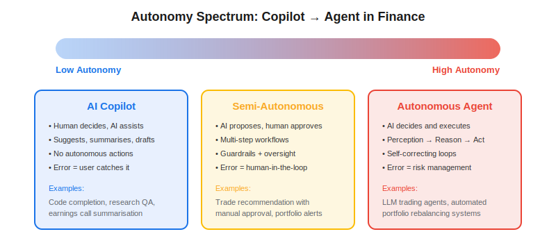
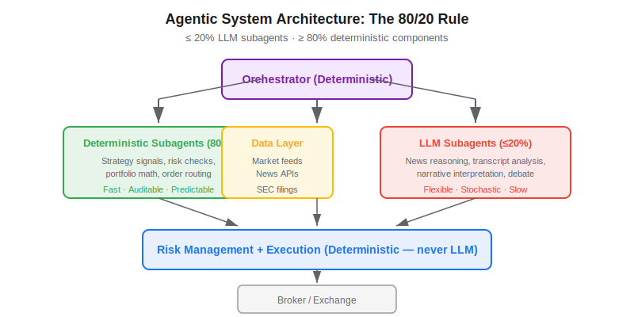

**Agentic AI** refers to artificial intelligence systems that can perceive their environment, reason about it, and take autonomous actions to achieve a goal — without step-by-step human instruction. In finance, the shift from passive LLM chatbots to agentic systems represents a fundamental change in how technology interacts with markets: instead of answering questions, AI now executes multi-step workflows that include researching, analysing, deciding, and trading. Understanding where your use case falls on the copilot-to-agent spectrum is the single most important architectural decision for any quant team adopting AI in 2026.

## Copilot vs Agent: The Autonomy Spectrum

Not every AI application needs full autonomy. Financial AI systems fall along a spectrum from fully human-directed copilots to fully autonomous agents.



**AI Copilot** — The model assists a human who retains all decision-making authority. Examples include code completion for strategy development, natural-language querying of financial databases, and earnings call summarisation. The copilot suggests; the human acts. This is the lowest-risk deployment pattern and the most mature in production finance today.

**Semi-Autonomous System** — The AI executes multi-step workflows but requires human approval at critical junctures. A trade recommendation engine that researches, analyses, and proposes a position — but waits for a portfolio manager to click "approve" — falls here. This pattern preserves human oversight while automating the tedious research steps.

**Autonomous Agent** — The AI perceives, reasons, and acts in a loop with no human in the middle. [LLM trading agents](https://paperswithbacktest.com/wiki/llm-trading-agents) like TradingAgents (Xiao et al., 2024) represent this category: multiple specialised LLM agents debate market conditions, synthesise insights, and output trade orders that route directly to a broker. The perception-reasoning-action loop runs continuously.

## The 80/20 Rule: Why Agentic ≠ "All LLM"

A critical insight — highlighted in Lehalle's 2026 Quant Calendar and validated by production experience at trading firms — is that effective agentic systems are **not** built primarily from LLMs. The architecture should follow an **80/20 rule**: no more than 20% of subagents should be LLM-powered; the remaining 80% should be deterministic, auditable components.

Why? Because:
- **Risk management must be deterministic.** An LLM should never decide position limits. Hard-coded rules, validated formulas, and quantitative checks belong in the deterministic layer.
- **Order routing must be predictable.** Stochastic behaviour in execution code creates unacceptable operational risk.
- **LLMs are slow.** A single LLM inference takes 1–5 seconds. Strategy signals, portfolio math, and risk checks need millisecond-to-second latency.
- **LLMs are best at what rules can't do.** Natural-language reasoning over earnings transcripts, interpreting ambiguous news, synthesising conflicting analyst opinions — these are the tasks where LLMs add genuine value.



The orchestrator — the component that coordinates all subagents — should itself be deterministic. This is where the **Complex Event Processing (CEP)** literature from factory automation becomes relevant: decades of engineering on reliable event-driven orchestration exist but are, as Lehalle notes, "not intensively reused yet" in quantitative finance.

## How Agentic Systems Differ from Classical Algo Trading

| Dimension | Classical Algo Trading | Agentic AI Trading |
|---|---|---|
| Decision logic | Hard-coded IF/THEN rules | Emergent reasoning from LLM + tools |
| Input data | Numeric (price, volume, indicators) | Numeric + unstructured text (news, filings) |
| Adaptability | Requires code change | Modify prompts, add tools, adjust memory |
| Multi-step research | Manual or scripted | Agent autonomously gathers information |
| Explainability | Transparent rules | Natural-language rationale per trade |
| Risk management | Rule-based (deterministic) | Same — this should NOT change |

The key architectural insight is that these approaches are **complementary**. The best agentic systems call classical [systematic trading strategies](https://paperswithbacktest.com/wiki/systematic-trading-strategies) as tools — a momentum signal library, a mean reversion detector, a risk parity optimiser. The LLM layer handles the higher-level reasoning that is difficult to express in fixed rules.

## Python Skeleton: Copilot vs Agent Architecture

```python
# --- COPILOT: Human decides, AI assists ---
def copilot_summarise(transcript: str, llm) -> str:
    """Summarise an earnings call — human reads and decides."""
    prompt = f"Summarise this earnings call for a portfolio manager:\n{transcript}"
    return llm.invoke(prompt).content


# --- AGENT: AI decides within guardrails ---
from dataclasses import dataclass

@dataclass
class TradeDecision:
    ticker: str
    action: str        # "buy", "sell", "hold"
    quantity: int
    confidence: float
    rationale: str

def agent_decide(state: dict, llm, tools: dict) -> TradeDecision:
    """
    Agentic loop: perceive → reason → act.
    Deterministic guardrails wrap the LLM decision.
    """
    # 1. Perceive (deterministic tools)
    prices = tools["get_prices"](state["ticker"])
    rsi = tools["compute_rsi"](prices, window=14)
    news = tools["fetch_news"](state["ticker"])

    # 2. Reason (LLM — the 20%)
    context = f"Ticker: {state['ticker']}\nRSI: {rsi:.1f}\nNews: {news[:500]}"
    prompt = f"""Given this market context, output a JSON trade decision:
    {context}
    Respond with: {{"action": "buy|sell|hold", "confidence": 0-1, "rationale": "..."}}"""
    raw = llm.invoke(prompt).content
    decision = parse_json(raw)

    # 3. Act (deterministic guardrails)
    max_position = state["portfolio_value"] * 0.05  # 5% max per position
    quantity = min(decision.get("quantity", 100), int(max_position / prices[-1]))

    if rsi > 80 and decision["action"] == "buy":
        decision["action"] = "hold"  # Override: don't buy overbought
        decision["rationale"] += " [OVERRIDDEN: RSI > 80]"

    return TradeDecision(
        ticker=state["ticker"],
        action=decision["action"],
        quantity=quantity,
        confidence=decision["confidence"],
        rationale=decision["rationale"],
    )
```

Notice that the agent skeleton wraps the LLM decision in deterministic guardrails: position limits and RSI overrides are hard-coded, not left to the model's judgment.

## When to Use Copilots vs Agents in Finance

**Choose a Copilot when:**
- Regulatory requirements demand human-in-the-loop decisions
- The cost of an error is high and latency is not critical
- You are augmenting an existing human workflow
- Your team is new to LLM integration

**Choose an Agent when:**
- The task involves multi-step research that is tedious for humans
- Speed of information synthesis matters (e.g., reacting to breaking news across hundreds of tickers)
- The decision space is well-bounded with clear guardrails
- You have robust risk management and monitoring infrastructure

**Start with Copilot, graduate to Agent.** Most quant teams find the highest initial ROI in copilot-mode applications — summarising research, generating code, querying databases — before attempting autonomous trading agents.

## Limitations and Risks

**Orchestrator reliability is the new bottleneck.** When an LLM agent fails, it often fails silently — producing a plausible but wrong answer. Monitoring agentic systems requires logging every perception-reasoning-action cycle and flagging anomalies in real time.

**Regulatory uncertainty.** Most financial regulators have not yet issued clear guidance on autonomous AI trading agents. MiFID II and SEC rules assume human accountability for trading decisions.

**The Centaur-Quant model.** Rather than replacing human quants, the most productive model — borrowed from chess, where human-plus-machine teams outperformed either alone — is the "centaur" approach: AI handles data gathering and pattern recognition, humans handle judgment and risk oversight.

## Conclusion

Agentic AI in finance is not about replacing human traders with chatbots. It is about building reliable multi-component systems where LLMs handle the unstructured reasoning that rules cannot capture, while deterministic components handle everything else. The 80/20 rule — at most 20% LLM, at least 80% deterministic — is the guiding architecture principle. Start with copilots, build guardrails, and graduate to agents only when your monitoring and risk infrastructure can handle it.

---

**Explore further on PapersWithBacktest:**
- Browse [backtested trading strategies](https://paperswithbacktest.com/strategies) with Python code and performance metrics
- Access [clean historical market data](https://paperswithbacktest.com/datasets) for equities, crypto, and futures
- Take the [algo trading course](https://paperswithbacktest.com/course) — 60+ video lessons and notebooks
- Related wiki pages: [LLM Trading Agents](https://paperswithbacktest.com/wiki/llm-trading-agents) · [Systematic Trading Strategies](https://paperswithbacktest.com/wiki/systematic-trading-strategies)
