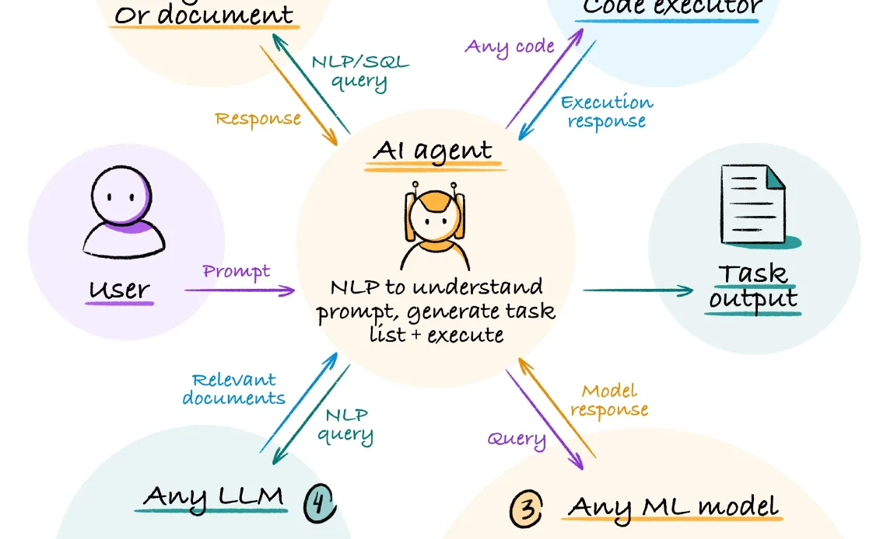

Artificial intelligence (AI) has revolutionized various industries, and its impact on trading is noteworthy. Over the past few decades, the trading landscape has transformed significantly due to AI's integration. Initially, trading was a manually intensive endeavor, requiring human traders to engage in complex analysis and decision-making processes. AI has changed this paradigm, enabling automated systems to process vast amounts of data, execute trades, and even predict market trends with unprecedented speed and accuracy.

One of the significant advancements in AI-driven trading is the emergence of Multi-Agent AI systems. These systems consist of multiple autonomous entities—agents—that interact within a shared environment to achieve specific objectives. In trading, this involves tasks such as data analysis, market prediction, trade execution, and risk management. The unique advantage of Multi-Agent AI lies in its ability to decentralize and parallelize operations, allowing for diverse strategies to be employed simultaneously, enhancing the robustness of trading systems.

Multi-Agent AI enhances algorithmic trading systems by introducing more nuanced and sophisticated decision-making processes. Unlike traditional single-agent systems, which may only follow predefined rules or strategies, Multi-Agent systems can dynamically adapt to changing market conditions by leveraging the diverse capabilities of different agents. Each agent is designed to perform specific functions such as data gathering, modeling, strategy formulation, or execution, allowing the overall system to respond in a more flexible and responsive manner.

The primary objective of this article is to understand agents within an algorithmic trading context. By exploring the roles and interactions of these agents, we can comprehend how Multi-Agent AI reshapes modern trading systems and leads to more efficient and adaptive trading solutions. This introduction sets the stage for a deeper exploration into Multi-Agent AI's components, functionality, and their transformative impact on algorithmic trading.



## Table of Contents

## Understanding Multi-Agent AI

Multi-Agent AI is a sophisticated branch of [artificial intelligence](/wiki/ai-artificial-intelligence) that involves multiple autonomous entities, known as [agents](/wiki/agents), working within a shared environment to achieve specific objectives. Each agent operates based on its own set of rules and decision-making algorithms, yet is capable of interaction with other agents. These interactions allow agents to pursue either their own goals or collaborate towards shared objectives, often leading to more efficient problem-solving and decision-making processes.

At the core of Multi-Agent AI lies the concept that multiple agents can perform better together than a singular, monolithic system. Each agent is typically designed to handle specific tasks or roles. Key components of a Multi-Agent AI system include the agents themselves, communication protocols, and an environment for interaction. Agents are equipped with sensors for perceiving the environment and effectors to perform actions that influence that environment. Communication protocols enable the sharing of information among agents, ensuring that they work harmoniously within the system.

In complex environments, agents interact through structured protocols, where they negotiate, cooperate, or compete, depending on the system design and goals. The outcome of these interactions often leads to emergent behavior, wherein the collective behavior of the agents produces results that are not attainable by individual agents acting alone. This emergent behavior is crucial in environments where dynamic adaptation and robust solutions are required.

The relevance of Multi-Agent AI extends into numerous applications, including [algorithmic trading](/wiki/algorithmic-trading). In this sphere, agents are deployed to execute tasks such as data collection, strategy formulation, risk assessment, and trade execution. Each agent may specialize in a particular function—data acquisition, for instance, while another may focus on executing trades based on predictive models derived from the acquired data. Here, agents interact to optimize trading strategies, enhance decision-making, and adapt to volatile market conditions, showcasing the system's efficiency and robustness in handling complex financial markets.

The application of Multi-Agent AI in algorithmic trading not only increases efficiency and speed but also reduces human error and enhances adaptability. As market conditions fluctuate, these systems adapt through their collective interactions, learning from new data, and refining strategies on the fly. This adaptability is a key advantage in financial sectors, where responsiveness to real-time data and conditions can significantly impact profitability.


## Agents in Algorithmic Trading

Multi-Agent AI is increasingly pivotal in algorithmic trading systems, offering enhanced flexibility and functionality compared to traditional methods. At the heart of this approach is the interaction between various specialized agents, each designed to fulfill distinct roles within the trading ecosystem. Key agents such as Data Acquisition, Research, and Market Learning Agents work in concert to optimize the trading process.

The Data Acquisition Agent is responsible for gathering real-time and historical market data from multiple sources, including stock exchanges, financial news, and social media platforms. This data serves as the foundation for subsequent analysis and decision-making processes. Efficient data acquisition ensures that the trading system operates with the most accurate and timely information, thus enhancing its responsiveness to market changes.

Next, the Research Agent processes the acquired data to identify potential trading opportunities. It employs sophisticated algorithms, including [machine learning](/wiki/machine-learning) models, to analyze patterns, assess risks, and forecast market trends. This agent acts as a bridge between raw data and actionable insights, providing critical input for decision-making.

The Market Learning Agent focuses on adapting to ever-changing market conditions. It continuously updates its models based on new data, learning from past trades and market movements to refine its predictive capabilities. This agent enhances the system's adaptability by improving decision-making algorithms, allowing the trading system to react effectively to market [volatility](/wiki/volatility-trading-strategies).

The synergy between these agents underpins the overall efficiency and adaptability of multi-agent trading systems. By decentralizing tasks among specialized agents, these systems can process large [volume](/wiki/volume-trading-strategy)s of data, make swift decisions, and execute trades with minimal latency. Furthermore, the modular nature of agent-based systems allows for scalability and easy integration of new functions or agents, enhancing their ability to adapt to new market conditions and regulatory requirements.

In summary, the application of Multi-Agent AI in algorithmic trading systems offers significant advantages in efficiency and adaptability. Through the coordinated efforts of Data Acquisition, Research, and Market Learning Agents, these systems can effectively navigate complex and dynamic financial markets, optimizing trading strategies and outcomes.


## Roles and Interactions of Agents in Investment Banking

In the sophisticated environment of algorithmic trading within investment banking, key agents play crucial roles, each with specific responsibilities and interactions that form a cohesive system. Understanding these agents is essential to appreciate how they work collectively to achieve efficient trading outcomes.

1. **Data Acquisition Agent**: This agent's primary role involves collecting vast amounts of market data, including price quotes, trade volumes, and economic indicators. Utilizing advanced techniques such as API calls, web scraping, and integrations with financial data providers, the Data Acquisition Agent ensures a continuous stream of real-time data. This agent operates in tandem with data validation processes to filter out noise and ensure high-quality inputs for downstream analysis.

2. **Research and Analysis Agent**: Tasked with the crucial role of analyzing the acquired data, this agent employs sophisticated quantitative models and machine learning algorithms to identify patterns and generate trading signals. The research agent's operation includes backtesting trading strategies against historical data to evaluate their potential profitability and risk. This interaction between historical datasets and predictive modeling helps refine strategies before their deployment.

3. **Market Learning Agent**: Focused on adaptive learning, this agent continuously refines its understanding of market dynamics using reinforcement learning. The Market Learning Agent adjusts trading strategies based on rewards and penalties received from past trades. The objective is to optimize future trading decisions, improving outcomes by learning from both successes and failures.

4. **Execution Agent**: Responsible for the actual placing of trades, the Execution Agent interfaces directly with financial exchanges. It utilizes techniques such as algorithmic execution strategies, including VWAP (Volume Weighted Average Price) and TWAP (Time Weighted Average Price), to minimize market impact and execution costs. The agent's efficient handling of orders directly impacts the profitability of the trading system.

5. **Compliance and Risk Management Agent**: Ensuring that all trading activities adhere to regulatory standards, this agent monitors trades for compliance breaches and risks. By evaluating each trade's compliance with predefined risk parameters and legal requirements, it acts as a safeguard against potential infractions and financial losses.

### Workflow and Interactions:

The workflow begins with the Data Acquisition Agent collecting and feeding data into the Research and Analysis Agent. This analysis leads to the development of trade signals and strategies, which are then adapted by the Market Learning Agent as it learns over time. Once a trading strategy is approved, the Execution Agent steps in to [carry](/wiki/carry-trading) out the trades, constantly monitored by the Compliance and Risk Management Agent to ensure regulatory adherence and risk mitigation.

The collaboration of these agents allows for a seamless, efficient trading process, where data-driven insights lead to well-informed decisions, rapid execution, and robust risk management. By leveraging distinct yet interconnected responsibilities, investment banks can optimize their algorithmic trading systems to perform effectively in diverse and volatile market conditions.


## Case Study: Multi-Agent Communication

In this case study, we examine a proof-of-concept illustrating the interaction between agents within a trading system using Autogen, a framework for developing AI models. The focus is on the communication flow between two primary agents: the Research Agent and the Investment Agent. This setup exemplifies how Multi-Agent AI enhances the efficiency and adaptability of algorithmic trading systems.

### Communication Flow between Research and Investment Agents

The Research Agent is tasked with conducting in-depth market analysis, gathering data, and generating actionable insights. It operates by continuously scanning vast datasets to identify patterns and potential trading opportunities. Once significant insights are derived, the Research Agent communicates these findings to the Investment Agent.

The Investment Agent, upon receiving these insights, evaluates potential trading strategies. It considers [factor](/wiki/factor-investing)s such as risk, market conditions, and historical performance to decide on executing trades. Throughout this process, the Investment Agent may request additional data or clarity from the Research Agent, establishing a dynamic, iterative communication loop. This interaction fosters rapid decision-making, allowing the trading system to respond swiftly to market changes.

### Simplified Interaction Scenario Code Snippet

The following Python code snippet illustrates a basic interaction between the Research and Investment Agents within this setup:

```python
class Agent:
    def __init__(self, name):
        self.name = name

    def send_message(self, recipient, message):
        print(f"{self.name} to {recipient.name}: {message}")

    def receive_message(self, sender, message):
        print(f"{self.name} received from {sender.name}: {message}")

class ResearchAgent(Agent):
    def analyze_market(self):
        insights = "Market insight: Potential uptrend in technology sector."
        return insights

class InvestmentAgent(Agent):
    def evaluate_insight(self, insight):
        print(f"Evaluating insight: {insight}")
        decision = "Proceed with investment"
        return decision

# Create agent instances
research_agent = ResearchAgent("ResearchAgent")
investment_agent = InvestmentAgent("InvestmentAgent")

# Communication flow
insight = research_agent.analyze_market()
research_agent.send_message(investment_agent, insight)

# Investment Agent evaluates the insight
investment_agent.receive_message(research_agent, insight)
decision = investment_agent.evaluate_insight(insight)
investment_agent.send_message(research_agent, decision)
```

In this scenario, the Research Agent conducts a market analysis and communicates its insights to the Investment Agent. The Investment Agent evaluates the information and decides on the next [course](/wiki/best-algorithmic-trading-courses) of action based on the received insights. This simple interaction highlights the core functionality of Multi-Agent AI, where collaboration and communication between agents lead to informed and strategic trading decisions.


## Advantages of Agentic AI in Trading

Agentic AI is revolutionizing trading by significantly boosting decision-making capabilities through the dynamic interaction of various specialized agents. This enhanced decision-making is pivotal, particularly in today’s fast-paced trading environments where milliseconds can determine the difference between profit and loss. Multi-agent systems facilitate this by allowing numerous agents with distinct roles to communicate and adapt in real time, bringing a level of sophistication and precision unheard of in traditional trading systems.

Increased efficiency and reduced latency are among the primary benefits brought by Agentic AI. By allowing agents to perform specific tasks—such as data acquisition, analysis, or trade execution—simultaneously and independently, the overall process becomes more streamlined. These agents speed up processes by working in parallel and reduce the chance for human error. For example, while one agent focuses on gathering and processing market data, another can formulate strategies based on the latest findings, and yet another can execute trades—all happening nearly instantaneously. This separation of tasks leads to a marked decrease in the latency of executing trades, which is crucial for high-frequency trading.

Risk management also sees immense improvements through the implementation of these AI models. Traditionally, traders relied heavily on static models and human intuition, both of which have limitations when confronted with the rapidly changing dynamics of financial markets. Agentic AI, however, enhances risk management by continuously analyzing an immense volume of data to identify potential risk factors and market anomalies. This ongoing assessment allows agents to predict and respond to market changes more efficiently, thus minimizing exposure to risks.

Moreover, Agentic AI enhances adaptability to volatile market conditions. Market volatility remains one of the greatest challenges for traders, as it can lead to unpredictable price swings that jeopardize trading strategies. AI models embedded within these agents are trained on large datasets and employ machine learning algorithms to recognize patterns or anomalies swiftly. For instance, when volatility strikes, an AI agent might detect early signs of increased risk and adjust trading strategies accordingly, such as by widening stop-loss margins or switching to safer asset allocations.

The adaptability of these agents is further strengthened by their ability to learn from each iteration. Through [reinforcement learning](/wiki/reinforcement-learning), agents can refine their strategies based on previous outcomes. Suppose an agent encounters an unexpected drop in asset prices due to market volatility; through learning algorithms, it can analyze what transpired, understand what variables led to success or failure, and optimize future actions.

In conclusion, Agentic AI provides notable advantages in trading through its ability to enhance decision-making capabilities, increase efficiency, reduce latency, and improve risk management. The adaptability afforded by AI models allows trading systems to not only keep pace with market developments but often stay ahead, making multi-agent systems indispensable for traders facing increasingly complex and volatile market conditions.


## Conclusion and Future Prospects

The integration of Multi-Agent AI into algorithmic trading has significantly transformed the landscape of financial markets. By enabling complex systems to coordinate multiple agents with specific roles and objectives, algorithmic trading systems have become more efficient and adaptable. Multi-Agent AI systems enhance decision-making capabilities, streamline operations, and offer improved risk management by simulating complex behaviors and interactions in real-time. Despite these advancements, the implementation of Multi-Agent AI in trading presents several challenges.

Current limitations include scalability issues, computational complexity, and the need for extensive training data to ensure robust agent interactions. Moreover, the volatility of financial markets requires systems to rapidly adapt, which can complicate the deployment and continuous improvement of AI models. Security remains a significant concern, as the interconnectedness of agent-based systems poses potential vulnerabilities to cyber threats.

To address these limitations, future improvements may focus on hybrid models that blend AI with domain expertise to enhance system resilience and decision accuracy. Research in distributed computing and real-time data processing can alleviate scalability issues, while advances in machine learning algorithms may improve the responsiveness and adaptability of trading agents. Furthermore, innovative AI models that incorporate unsupervised learning and reinforcement learning can continuously refine trading strategies without the exhaustive need for labeled data.

Looking forward, the future scope of AI innovations in trading includes the integration of more advanced AI technologies, such as quantum computing, to process vast amounts of financial data at unprecedented speeds. Additionally, ongoing enhancements in natural language processing might enable better incorporation of unstructured data sources, such as news and social media, providing richer context for trading decisions.

As market demands evolve, the adaptability and sophistication of Multi-Agent AI systems will play a crucial role in shaping the future of financial markets, offering traders a competitive edge while ensuring sustainable and secure market operations.


## References & Further Reading

[1]: Bergstra, J., Bardenet, R., Bengio, Y., & Kégl, B. (2011). ["Algorithms for Hyper-Parameter Optimization."](https://papers.nips.cc/paper_files/paper/2011/hash/86e8f7ab32cfd12577bc2619bc635690-Abstract.html) Advances in Neural Information Processing Systems 24.

[2]: ["Advances in Financial Machine Learning"](https://www.amazon.com/Advances-Financial-Machine-Learning-Marcos/dp/1119482089) by Marcos Lopez de Prado

[3]: ["Evidence-Based Technical Analysis: Applying the Scientific Method and Statistical Inference to Trading Signals"](https://www.wiley.com/en-gb/Evidence+Based+Technical+Analysis:+Applying+the+Scientific+Method+and+Statistical+Inference+to+Trading+Signals-p-9780470008744) by David Aronson

[4]: ["Machine Learning for Algorithmic Trading"](https://www.amazon.com/Machine-Learning-Algorithmic-Trading-intelligence/dp/9918608013) by Stefan Jansen

[5]: ["Quantitative Trading: How to Build Your Own Algorithmic Trading Business"](https://www.amazon.com/Quantitative-Trading-Build-Algorithmic-Business/dp/0470284889) by Ernest P. Chan