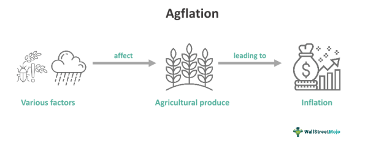

## Table of Contents

## What is agflation?

Agflation is when the prices of food and other farm products go up a lot. It happens because the costs of things farmers need, like seeds, fertilizer, and fuel, get more expensive. When these costs rise, farmers have to charge more for their crops and livestock, which makes food more expensive for everyone.

This can be a big problem because everyone needs to eat. When food prices go up, it can be hard for people, especially those with less money, to afford enough food. Governments and farmers try to find ways to manage these costs, but sometimes it's tough to keep food prices from going up.

## How is agflation different from general inflation?

Agflation is when the prices of food and farm products go up a lot, while general inflation is when the prices of almost everything go up. Agflation focuses just on food and farm stuff, like fruits, vegetables, meat, and grains. General inflation includes all kinds of things, like cars, clothes, and services too.

The reasons for agflation can be different from general inflation. Agflation often happens because the costs of things farmers need, like seeds, fertilizer, and fuel, get more expensive. This makes farmers charge more for their food. General inflation can happen for many reasons, like when there's too much money being spent or when it costs more to make things. So, while agflation is a big part of general inflation, it's about food prices specifically and can be caused by problems in farming.

## What are the primary causes of agflation?

Agflation happens mainly because the costs of things farmers need to grow food go up a lot. This includes things like seeds, fertilizers, and fuel for their machines. When these costs rise, farmers have to charge more for their crops and livestock to make enough money to keep farming. Another big reason is when bad weather or diseases hurt crops, making less food available. When there's less food, the price goes up because everyone still needs to eat.

Also, if a country has to import a lot of food, and the prices of those imports go up, that can cause agflation too. Sometimes, government policies can play a role. For example, if a government decides to pay farmers more to grow certain crops, this can make food prices go up. All these factors together can make food more expensive, leading to agflation.

## Can you explain the mechanism behind agflation?

Agflation happens when the costs of things farmers need, like seeds, fertilizer, and fuel, go up a lot. When these costs rise, farmers have to charge more for their crops and livestock to make enough money to keep farming. This means the price of food goes up for everyone. Bad weather or diseases can also hurt crops, making less food available. When there's less food, the price goes up because everyone still needs to eat.

If a country has to buy a lot of food from other places, and the price of those imports goes up, that can cause agflation too. Sometimes, what the government does can affect food prices. For example, if the government pays farmers more to grow certain crops, this can make food more expensive. All these things together can make food prices rise, which is what we call agflation.

## What role do weather patterns play in agflation?

Weather patterns can really affect agflation. When the weather is bad, like too much rain, droughts, or storms, it can hurt crops. If crops get damaged, there's less food to go around. When there's less food, the price goes up because everyone still needs to eat. So, bad weather can make food more expensive and cause agflation.

Also, weather patterns can change from year to year. Sometimes, a place might have good weather for growing food one year, but bad weather the next. This can make it hard for farmers to plan and can lead to big changes in food prices. If farmers can't grow as much food because of the weather, it can lead to less food on the market and higher prices, which is agflation.

## How does agflation affect food prices globally?

Agflation makes food prices go up all over the world. When the costs of things farmers need, like seeds, fertilizer, and fuel, get more expensive, farmers have to charge more for their food. This makes food prices rise everywhere, not just in one country. If a country has to buy a lot of food from other places, and the price of those imports goes up, that can make food more expensive for everyone in that country too.

Bad weather or diseases can also hurt crops in different parts of the world. When this happens, there's less food to go around, so the price goes up because everyone still needs to eat. This can affect food prices everywhere, especially if many countries depend on the same places for food. So, agflation can make food more expensive for people all over the world, not just in one place.

## What impact does agflation have on different economic classes?

Agflation hits people with less money the hardest. When food prices go up, it's tough for them to buy enough food. They might have to spend a bigger part of their money on food, and that can mean they have less money for other important things like rent, clothes, or medicine. This can make life really hard for them, and sometimes they might not get enough to eat.

People with more money feel agflation too, but it's not as bad for them. They can still afford to buy food, even when prices go up. They might need to spend a bit more, but they usually don't have to worry about not having enough to eat. So, while agflation makes food more expensive for everyone, it's a much bigger problem for people who don't have a lot of money.

## How do government policies influence agflation?

Government policies can have a big effect on agflation. When the government decides to pay farmers more money to grow certain crops, this can make food prices go up. For example, if the government gives farmers money to grow corn instead of other crops, there might be less of other foods like fruits and vegetables. This can make those foods more expensive because there's less of them to go around. Also, if the government puts taxes or limits on things farmers need, like fertilizer or fuel, it can make farming more expensive, and farmers might charge more for their food.

On the other hand, governments can also try to help keep food prices from going up too much. They might give farmers money to help them with the costs of seeds, fertilizer, and fuel. This can make it easier for farmers to keep their prices lower. Governments can also control how much food is imported or exported to make sure there's enough food in the country. By doing these things, governments can try to stop agflation from making food too expensive for people.

## What are some historical examples of agflation?

In the 1970s, the world saw a big example of agflation. This was called the "Great Grain Robbery." The Soviet Union bought a lot of grain from the United States, which made the price of grain go up a lot. At the same time, the costs of things farmers needed, like fertilizer and fuel, were also going up because of the oil crisis. This made food prices rise all over the world, and it was hard for people to afford food.

Another time agflation happened was in the early 2000s. This was because the demand for biofuels, like ethanol, went up a lot. Farmers started growing more corn to make ethanol, which meant there was less corn for food. The price of corn and other foods went up because there was less to go around. Also, the costs of things farmers needed, like fertilizer, were getting more expensive. This made food prices rise and caused problems for many people who couldn't afford to buy enough food.

## How can agflation be measured and tracked?

Agflation can be measured by looking at the prices of food and farm products over time. People use something called the Consumer Price Index (CPI) to see how much food prices are going up. The CPI looks at the cost of different kinds of food, like fruits, vegetables, meat, and grains, and sees how those prices change from month to month or year to year. If the prices of these foods are going up a lot more than other things, that's a sign of agflation.

To track agflation, experts also look at the costs of things farmers need, like seeds, fertilizer, and fuel. If these costs are going up a lot, it can help explain why food prices are rising. They also pay attention to things like bad weather or diseases that can hurt crops and make less food available. By keeping an eye on all these things, people can understand and track agflation better.

## What strategies can be used to mitigate the effects of agflation?

Governments can help lower agflation by giving money to farmers to help them pay for things like seeds, fertilizer, and fuel. This can make it easier for farmers to keep their food prices lower. Governments can also control how much food comes into or goes out of the country. By making sure there's enough food around, they can stop prices from going up too much. Another way is to help farmers use new technology and better ways of farming, which can make more food and keep prices down.

People can also do things to deal with agflation. They can choose to buy food that's in season, which is often cheaper. Eating less meat and more fruits, vegetables, and grains can help too, because these foods usually cost less. Families can also plan their meals better and waste less food. By doing these things, people can save money and not feel the effects of agflation as much.

## What are the long-term economic implications of persistent agflation?

Persistent agflation can cause big problems for the economy over a long time. When food prices keep going up, people have to spend more money on food. This means they have less money to spend on other things like clothes, cars, and going out. Businesses that sell these things might make less money, and this can slow down the whole economy. If people can't afford to buy enough food, they might not be as healthy or able to work well, which can make the economy even worse.

Governments might also have to spend more money to help people who can't afford food. This can lead to bigger government budgets and maybe higher taxes for everyone. If the government can't control agflation, it might make people trust the government less, and this can cause more economic problems. So, agflation that keeps happening can hurt the economy in many ways, making life harder for everyone.

## References & Further Reading

1. **Primary Sources and Studies:**
   - Smith, J., & Anderson, L. (2021). "The Dynamics of Inflation and Food Prices: A Global Perspective." *Journal of Economic Perspectives*, 35(2), 45-68. This study provides an in-depth analysis of how inflation influences food prices across various global markets.
   - Daniels, R., & Nguyen, H. (2022). "Agflation and Economic Stability: Challenges and Strategies." *Agricultural Economics Review*, 58(3), 102-117. This article examines the implications of agflation on economic stability, particularly focusing on agriculture-dependent economies.
   - Thomas, E.C., & Collins, M.J. (2020). "Algorithmic Trading and Economic Indicators: A Comprehensive Review." *Finance Algorithms and Systems*, 12(1), 120-143. This research explores how algorithmic trading systems integrate economic indicators, such as inflation data, to optimize trading strategies.

2. **Further Reading Suggestions:**
   - *Inflation Dynamics and Economic Policy* by Franklin Barns (2023) provides a comprehensive overview of inflationary trends and their implications for economic policy-making.
   - *Algorithmic Trading: Winning Strategies and Their Rationale* by Ernie Chan (2017) offers insights into the strategies behind algorithmic trading and how they evolve in response to economic changes.
   - Online Course: "Introduction to Inflation and Its Economic Impact" available on Coursera. This course provides foundational knowledge on inflation and its broader economic effects, ideal for those new to the topic.
   - White Paper: "The Future of Algorithmic Trading in a Volatile Economy" by TechFinance Labs (2022). A forward-looking perspective on how advances in technology might influence algorithmic trading practices amidst economic uncertainties.

These resources collectively provide a well-rounded understanding of the interplay between inflation, agflation, and [algorithmic trading](/wiki/algorithmic-trading), offering insights into both foundational concepts and emerging trends in these areas.

