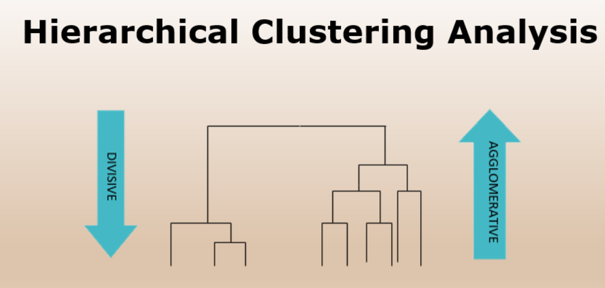

## Table of Contents

## What is Agglomerative Clustering?

Agglomerative Clustering is a type of hierarchical clustering method used in data analysis. It works by starting with each data point as its own cluster and then merging the closest pairs of clusters step by step until all points are in one big cluster. This process creates a tree-like structure called a dendrogram, which shows how the clusters are merged at each step. The key idea is to measure the similarity or distance between clusters and combine the most similar ones.

The distance between clusters can be calculated in different ways, such as using the single linkage (minimum distance between any two points in the clusters), complete linkage (maximum distance between any two points in the clusters), or average linkage (average distance between all pairs of points in the clusters). For example, if we use the single linkage method, the distance between two clusters $$A$$ and $$B$$ is given by $$\text{distance}(A, B) = \min\{\text{distance}(a, b) \mid a \in A, b \in B\}$$. The choice of distance metric can affect the shape of the resulting dendrogram and the final clustering.

To perform Agglomerative Clustering, you can use libraries like scikit-learn in Python. Here is a simple example of how to use it:

```python
from sklearn.cluster import AgglomerativeClustering
import numpy as np

# Generate some sample data
X = np.array([[1, 2], [1, 4], [1, 0], [4, 2], [4, 4], [4, 0]])

# Create an instance of AgglomerativeClustering
clustering = AgglomerativeClustering(n_clusters=2, linkage='ward')

# Fit the model and predict the clusters
labels = clustering.fit_predict(X)

print(labels)
```

This code will group the data points into two clusters based on their similarity. By adjusting the number of clusters and the linkage method, you can explore different ways to group your data.

## How does Agglomerative Clustering differ from other clustering methods?

Agglomerative Clustering is different from other clustering methods because it builds a hierarchy of clusters. It starts with each data point as its own cluster and then merges the closest clusters together step by step until all points are in one big cluster. This process creates a tree-like structure called a dendrogram, which shows how the clusters are merged at each step. Other clustering methods, like K-means, do not create this hierarchy. Instead, K-means tries to divide the data into a fixed number of clusters by minimizing the distance between each point and the center of its cluster.

Another difference is how Agglomerative Clustering measures the distance between clusters. It can use different methods like single linkage, which is the minimum distance between any two points in the clusters, complete linkage, which is the maximum distance, or average linkage, which is the average distance. In contrast, K-means uses the Euclidean distance between points and the center of the cluster. For example, if we use the single linkage method, the distance between two clusters $$A$$ and $$B$$ is given by $$\text{distance}(A, B) = \min\{\text{distance}(a, b) \mid a \in A, b \in B\}$$. This flexibility in measuring distance allows Agglomerative Clustering to handle different shapes of clusters better than K-means, which assumes clusters are spherical and equally sized.

To perform Agglomerative Clustering, you can use libraries like scikit-learn in Python. Here is a simple example of how to use it:

```python
from sklearn.cluster import AgglomerativeClustering
import numpy as np

# Generate some sample data
X = np.array([[1, 2], [1, 4], [1, 0], [4, 2], [4, 4], [4, 0]])

# Create an instance of AgglomerativeClustering
clustering = AgglomerativeClustering(n_clusters=2, linkage='ward')

# Fit the model and predict the clusters
labels = clustering.fit_predict(X)

print(labels)
```

This code will group the data points into two clusters based on their similarity. By adjusting the number of clusters and the linkage method, you can explore different ways to group your data.

## What are the main steps in the Agglomerative Clustering algorithm?

Agglomerative Clustering starts with each data point as its own cluster. Then, it finds the two closest clusters and combines them into a single cluster. This process repeats, always merging the closest pair of clusters, until all points are in one big cluster. The distance between clusters can be measured in different ways, like single linkage, which is the smallest distance between any two points in the clusters, or complete linkage, which is the largest distance. For example, if we use single linkage, the distance between two clusters $$A$$ and $$B$$ is given by $$\text{distance}(A, B) = \min\{\text{distance}(a, b) \mid a \in A, b \in B\}$$.

As the clusters are merged, a tree-like structure called a dendrogram is created. This dendrogram shows how the clusters are combined at each step. You can cut the dendrogram at different levels to get different numbers of clusters. This allows you to see the hierarchy of the clusters and choose the number of clusters that makes the most sense for your data. To perform Agglomerative Clustering, you can use libraries like scikit-learn in Python. Here is a simple example of how to use it:

```python
from sklearn.cluster import AgglomerativeClustering
import numpy as np

# Generate some sample data
X = np.array([[1, 2], [1, 4], [1, 0], [4, 2], [4, 4], [4, 0]])

# Create an instance of AgglomerativeClustering
clustering = AgglomerativeClustering(n_clusters=2, linkage='ward')

# Fit the model and predict the clusters
labels = clustering.fit_predict(X)

print(labels)
```

This code will group the data points into two clusters based on their similarity. By adjusting the number of clusters and the linkage method, you can explore different ways to group your data.

## Can you explain the concept of dendrograms in Agglomerative Clustering?

A dendrogram is a tree-like diagram that shows how clusters are combined in Agglomerative Clustering. Imagine starting with each data point as its own tiny cluster. Then, you keep joining the closest clusters together until you have one big cluster that includes all the data points. Each time you join two clusters, you draw a line in the dendrogram to show that they are now one cluster. The height of these lines tells you how similar the clusters were when they were joined. The closer the line is to the bottom, the more similar the clusters were.

You can use the dendrogram to decide how many clusters you want. If you cut the dendrogram at a certain height, you get a certain number of clusters. For example, if you cut it low, you might get many small clusters. If you cut it high, you might get fewer but larger clusters. This flexibility lets you see the hierarchy of your data and choose the number of clusters that makes the most sense for your needs. To create a dendrogram in Python, you can use libraries like scikit-learn and matplotlib. Here is a simple example of how to use it:

```python
from sklearn.cluster import AgglomerativeClustering
from scipy.cluster.hierarchy import dendrogram, linkage
import numpy as np
import matplotlib.pyplot as plt

# Generate some sample data
X = np.array([[1, 2], [1, 4], [1, 0], [4, 2], [4, 4], [4, 0]])

# Perform the clustering
Z = linkage(X, method='ward')

# Plot the dendrogram
plt.figure(figsize=(10, 5))
dendrogram(Z)
plt.title('Dendrogram')
plt.xlabel('Data Points')
plt.ylabel('Distance')
plt.show()
```

This code will create a dendrogram that shows how the clusters are combined at each step. By looking at the dendrogram, you can see the hierarchy of the clusters and decide where to cut it to get the number of clusters you want.

## What are the common linkage criteria used in Agglomerative Clustering?

In Agglomerative Clustering, linkage criteria are used to decide how to measure the distance between clusters when merging them. The most common linkage criteria are single linkage, complete linkage, and average linkage. Single linkage measures the distance between clusters as the smallest distance between any two points in those clusters. For example, if we have two clusters A and B, the single linkage distance is given by $$\text{distance}(A, B) = \min\{\text{distance}(a, b) \mid a \in A, b \in B\}$$. This method tends to create long, stringy clusters. Complete linkage, on the other hand, measures the distance between clusters as the largest distance between any two points in those clusters. This method tends to create more compact, round clusters.

Average linkage measures the distance between clusters as the average distance between all pairs of points in those clusters. This method tries to balance between single and complete linkage, often resulting in clusters that are neither too stringy nor too compact. Another popular method is Ward's linkage, which minimizes the total within-cluster variance. This method is often used in practice because it tends to create well-balanced clusters. To perform Agglomerative Clustering with different linkage criteria, you can use libraries like scikit-learn in Python. Here is a simple example of how to use it:

```python
from sklearn.cluster import AgglomerativeClustering
import numpy as np

# Generate some sample data
X = np.array([[1, 2], [1, 4], [1, 0], [4, 2], [4, 4], [4, 0]])

# Create an instance of AgglomerativeClustering with different linkage criteria
clustering_single = AgglomerativeClustering(n_clusters=2, linkage='single')
clustering_complete = AgglomerativeClustering(n_clusters=2, linkage='complete')
clustering_average = AgglomerativeClustering(n_clusters=2, linkage='average')
clustering_ward = AgglomerativeClustering(n_clusters=2, linkage='ward')

# Fit the model and predict the clusters
labels_single = clustering_single.fit_predict(X)
labels_complete = clustering_complete.fit_predict(X)
labels_average = clustering_average.fit_predict(X)
labels_ward = clustering_ward.fit_predict(X)

print("Single linkage:", labels_single)
print("Complete linkage:", labels_complete)
print("Average linkage:", labels_average)
print("Ward's linkage:", labels_ward)
```

This code will group the data points into two clusters based on their similarity using different linkage criteria. By adjusting the linkage method, you can explore different ways to group your data.

## How do you determine the optimal number of clusters in Agglomerative Clustering?

To determine the optimal number of clusters in Agglomerative Clustering, you can look at a dendrogram. A dendrogram is like a tree that shows how the clusters are combined. You start at the bottom of the tree where each data point is its own tiny cluster. As you move up, you see the clusters being joined together. The height at which the clusters are joined tells you how similar they were. To find the best number of clusters, you look for a big jump in the height of the lines in the dendrogram. This jump means that the clusters being joined are not as similar as the ones before, so it's a good place to cut the tree and get your clusters.

You can also use other methods like the silhouette score to find the best number of clusters. The silhouette score measures how similar a data point is to its own cluster compared to other clusters. A high silhouette score means the data point fits well in its cluster. You can try different numbers of clusters and calculate the average silhouette score for each. The number of clusters that gives the highest average silhouette score is usually the best choice. Here is a simple example of how to use the silhouette score in Python:

```python
from sklearn.cluster import AgglomerativeClustering
from sklearn.metrics import silhouette_score
import numpy as np

# Generate some sample data
X = np.array([[1, 2], [1, 4], [1, 0], [4, 2], [4, 4], [4, 0]])

# Try different numbers of clusters
for n_clusters in range(2, 6):
    clustering = AgglomerativeClustering(n_clusters=n_clusters, linkage='ward')
    labels = clustering.fit_predict(X)
    silhouette_avg = silhouette_score(X, labels)
    print(f"For n_clusters = {n_clusters}, the average silhouette_score is : {silhouette_avg}")
```

This code will help you find the number of clusters that gives the highest average silhouette score, which can be a good indicator of the optimal number of clusters for your data.

## What are the advantages of using Agglomerative Clustering?

Agglomerative Clustering is great because it shows you how data points are grouped together in a way that's easy to understand. It starts with each point as its own little group and then keeps joining the closest groups together until everything is in one big group. This creates a tree-like picture called a dendrogram, which helps you see the different levels of grouping. You can look at the dendrogram and decide how many groups make the most sense for your data. For example, if you see a big jump in the height of the lines in the dendrogram, that's a good place to cut it and get your groups. This method is flexible and lets you explore your data in a way that other methods like K-means don't.

Another advantage of Agglomerative Clustering is that it can handle different shapes of groups better than some other methods. For instance, K-means assumes that groups are round and the same size, but Agglomerative Clustering can find groups that are long and thin or any other shape. This is because it uses different ways to measure the distance between groups, like single linkage, which is the smallest distance between any two points in the groups, or complete linkage, which is the largest distance. For example, if we use single linkage, the distance between two groups $$A$$ and $$B$$ is given by $$\text{distance}(A, B) = \min\{\text{distance}(a, b) \mid a \in A, b \in B\}$$. This flexibility makes Agglomerative Clustering a powerful tool for understanding the structure of your data.

## What are the limitations or challenges faced when using Agglomerative Clustering?

One of the main challenges with Agglomerative Clustering is that it can be very slow and use a lot of memory, especially when you have a lot of data points. This is because it starts with each point as its own group and then keeps joining the closest groups together until everything is in one big group. As the number of points grows, the number of steps and calculations needed grows a lot too. This can make it hard to use Agglomerative Clustering on big datasets. Also, the way it measures the distance between groups, like single linkage or complete linkage, can affect the results a lot. For example, if we use single linkage, the distance between two groups $$A$$ and $$B$$ is given by $$\text{distance}(A, B) = \min\{\text{distance}(a, b) \mid a \in A, b \in B\}$$. Choosing the wrong distance measure can lead to groups that don't make sense for your data.

Another limitation is that deciding how many groups to use can be tricky. You can look at a dendrogram, which is a tree-like picture that shows how the groups are joined together, to help you decide. But it's not always clear where to cut the dendrogram to get the best number of groups. You might need to use other methods, like the silhouette score, to help you decide. The silhouette score measures how well a point fits in its group compared to other groups. You can try different numbers of groups and see which one gives the highest average silhouette score. Here's a simple example of how to use the silhouette score in Python:

```python
from sklearn.cluster import AgglomerativeClustering
from sklearn.metrics import silhouette_score
import numpy as np

# Generate some sample data
X = np.array([[1, 2], [1, 4], [1, 0], [4, 2], [4, 4], [4, 0]])

# Try different numbers of clusters
for n_clusters in range(2, 6):
    clustering = AgglomerativeClustering(n_clusters=n_clusters, linkage='ward')
    labels = clustering.fit_predict(X)
    silhouette_avg = silhouette_score(X, labels)
    print(f"For n_clusters = {n_clusters}, the average silhouette_score is : {silhouette_avg}")
```

This code helps you find the number of groups that gives the highest average silhouette score, which can be a good indicator of the best number of groups for your data.

## How can Agglomerative Clustering be implemented using popular machine learning libraries like scikit-learn?

Agglomerative Clustering can be easily implemented using scikit-learn, a popular [machine learning](/wiki/machine-learning) library in Python. You start by importing the necessary modules, like `AgglomerativeClustering` from `sklearn.cluster` and `numpy` for handling data. Then, you create your data, which can be a simple array of points. Next, you set up the clustering model by choosing the number of clusters you want and the linkage method, such as 'ward', 'single', 'complete', or 'average'. For example, if you use the single linkage method, the distance between two clusters $$A$$ and $$B$$ is given by $$\text{distance}(A, B) = \min\{\text{distance}(a, b) \mid a \in A, b \in B\}$$. After setting up the model, you fit it to your data and predict the clusters. The model will return labels that tell you which cluster each point belongs to.

Here's a simple example of how to use Agglomerative Clustering with scikit-learn:

```python
from sklearn.cluster import AgglomerativeClustering
import numpy as np

# Generate some sample data
X = np.array([[1, 2], [1, 4], [1, 0], [4, 2], [4, 4], [4, 0]])

# Create an instance of AgglomerativeClustering
clustering = AgglomerativeClustering(n_clusters=2, linkage='ward')

# Fit the model and predict the clusters
labels = clustering.fit_predict(X)

print(labels)
```

This code will group the data points into two clusters based on their similarity. By adjusting the number of clusters and the linkage method, you can explore different ways to group your data.

## What are some real-world applications of Agglomerative Clustering?

Agglomerative Clustering is used in many real-world situations because it's good at finding patterns in data. For example, in biology, scientists use it to group similar genes or proteins together. They start with each gene as its own group and then keep joining the closest groups together until they see a pattern that makes sense. This helps them understand how different genes or proteins work together. In marketing, companies use Agglomerative Clustering to group customers based on what they buy or how they behave. They can start with each customer as their own group and then join the customers who are most similar. This helps them find different types of customers and target them with the right ads or products.

Another use of Agglomerative Clustering is in image processing. It can help group pixels in an image based on their color or brightness. For example, if you want to separate the background from the foreground in a photo, you can use Agglomerative Clustering to group the pixels that are most similar. This can help in tasks like photo editing or object recognition. In social network analysis, Agglomerative Clustering is used to find groups of people who are connected in similar ways. By starting with each person as their own group and then joining the people who are most connected, you can find communities or groups of friends within the network. This helps in understanding how people interact and form relationships.

## How does the choice of distance metric affect the results of Agglomerative Clustering?

The choice of distance metric in Agglomerative Clustering can really change how the groups are formed. When you start clustering, you need to decide how to measure the distance between groups. For example, if you use the single linkage method, the distance between two groups $$A$$ and $$B$$ is given by $$\text{distance}(A, B) = \min\{\text{distance}(a, b) \mid a \in A, b \in B\}$$. This means you're looking at the smallest distance between any two points in the groups. This method can create long, stringy groups because it focuses on the closest points. On the other hand, if you use the complete linkage method, the distance is the largest distance between any two points in the groups. This tends to make more compact, round groups because it looks at the farthest points.

Choosing the right distance metric depends on what kind of groups you want to find in your data. If your data has groups that are stretched out or have different shapes, single linkage might be better because it can find those kinds of groups. But if you want groups that are more tightly packed and round, complete linkage or average linkage, where the distance is the average distance between all pairs of points, might work better. The choice of distance metric can also affect how sensitive the clustering is to outliers. Single linkage can be more affected by outliers because it only looks at the closest points, while complete linkage is less affected because it looks at the farthest points. So, it's important to think about what kind of groups you expect in your data and choose the distance metric that will help you find those groups.

## What advanced techniques can be used to improve the performance of Agglomerative Clustering?

One way to improve the performance of Agglomerative Clustering is to use a technique called "pre-clustering." This means you start by grouping similar points together into smaller groups before you even begin the main clustering process. This can help speed things up because you're working with fewer groups from the start. For example, you might use a quick method like K-means to make these smaller groups, and then use Agglomerative Clustering on these groups. This can be especially helpful when you have a lot of data points, because it can make the clustering process much faster and use less memory.

Another advanced technique is to use a different distance metric that's better suited to your data. The choice of distance metric can really change how the groups are formed. For example, if you use the single linkage method, the distance between two groups $$A$$ and $$B$$ is given by $$\text{distance}(A, B) = \min\{\text{distance}(a, b) \mid a \in A, b \in B\}$$. This method can create long, stringy groups because it focuses on the closest points. But if you use the complete linkage method, the distance is the largest distance between any two points in the groups, which tends to make more compact, round groups. By trying out different distance metrics, you can find the one that works best for your data and gives you the most meaningful groups.