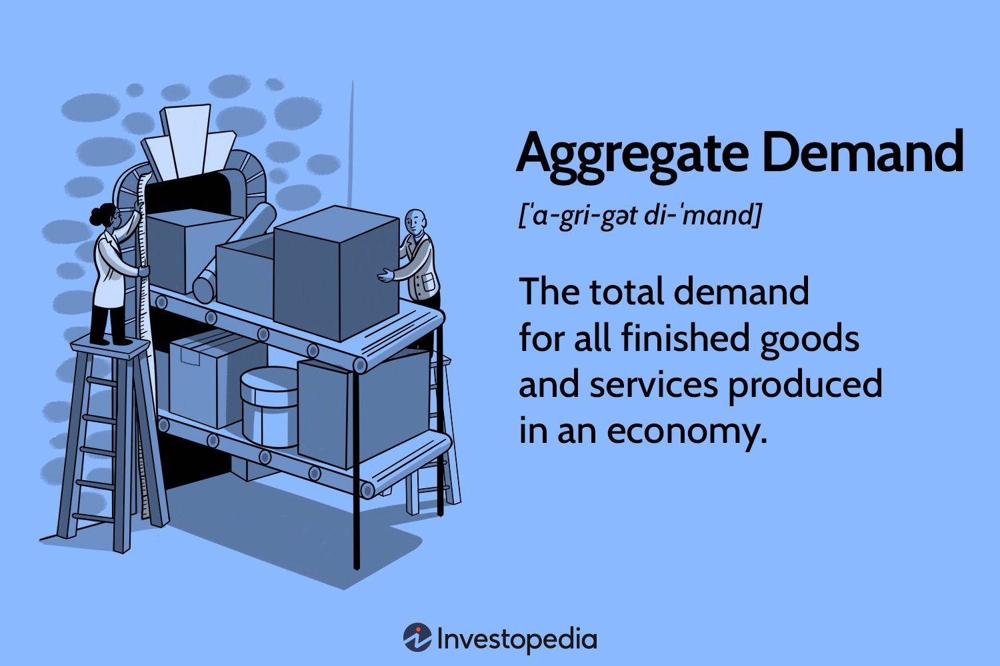

Understanding the forces of aggregate demand is crucial for comprehending how economies function. Aggregate demand represents the total demand for goods and services within an economy at a given time. It is a macroeconomic concept that quantifies the purchasing power across different sectors, including household consumption, business investments, government expenditures, and net exports. This holistic measure is pivotal in assessing overall economic strength and is often used to formulate fiscal and monetary policies.

The concept of aggregate demand encompasses various components that contribute differently to the economic landscape. Changes in aggregate demand can signal shifts in economic activity, influencing employment rates, inflation, and gross domestic product (GDP) growth. These changes are impacted by factors such as consumer confidence, interest rates, and global economic conditions.



This article explores the diverse components of aggregate demand, highlighting the effects each has on economic conditions. Additionally, it addresses the inherent limitations of aggregate demand measures, such as their inability to reflect wealth distribution or service quality. Understanding these limitations is key to accurately interpreting economic indicators and their relevance to policymaking.

Furthermore, the article examines the role of algorithmic trading in leveraging aggregate demand data for economic forecasting. Algorithmic trading, which utilizes advanced computational techniques to interpret economic and financial data, can respond adeptly to fluctuations in aggregate demand, offering insights into future market trends. By utilizing real-time data and sophisticated algorithms, traders and economists gain an edge in predicting and adapting to economic shifts, making aggregate demand a critical variable in strategic decision-making.

## Table of Contents

## Aggregate Demand and Its Economic Components

Aggregate demand is a comprehensive measurement of the total demand for goods and services within an economy. It is computed as the sum of four major components: consumption spending, investment spending, government spending, and net exports. Each of these components represents a different segment of the economic landscape and contributes uniquely to the economy's overall strength.

1. **Consumption Spending**: This is the most significant component of aggregate demand and pertains to the expenditures by households on goods and services. Consumption is heavily influenced by factors such as disposable income, consumer confidence, interest rates, and inflation. As disposable income rises, consumers tend to spend more, thereby increasing aggregate demand.

2. **Investment Spending**: This encompasses business expenditures on capital goods such as machinery, buildings, and technology. Investment spending is crucial for economic growth as it determines the future production capacity. It is sensitive to interest rates; lower interest rates reduce the cost of borrowing, thereby encouraging more investment. Business expectations regarding future economic conditions also play a critical role in shaping investment decisions.

3. **Government Spending**: This involves all government expenditures on goods and services, ranging from infrastructure projects to public services like education and defense. Unlike consumption or investment spending, government spending is often used as a tool to regulate economic activity, especially in times of recession or inflation. Fiscal policies, including taxation and governmental budgets, significantly impact this component of aggregate demand.

4. **Net Exports**: Calculated as the difference between a country’s exports and imports, net exports can be a positive or negative contribution to aggregate demand. Factors influencing net exports include exchange rates, trade policies, and the relative economic conditions of trading partners. A high level of exports relative to imports boosts aggregate demand, whereas a trade deficit might neutralize or weaken it.

Mathematically, aggregate demand ($AD$) can be expressed using the formula:

$$
AD = C + I + G + (X - M)
$$

where:
- $C$ represents consumption spending,
- $I$ stands for investment spending,
- $G$ is government spending,
- $(X - M)$ denotes net exports (exports $X$ minus imports $M$).

Each component is impacted by diverse economic factors such as interest rates, income levels, and government regulations. Understanding these components and their dynamics is essential for grasping how economies function under various scenarios. The interaction among these components determines the aggregate demand curve's shape and shifts, reflecting changes in the economic environment.

## Limitations of Aggregate Demand

Aggregate demand (AD), while a valuable economic measure, has inherent limitations that need consideration. A primary limitation is its failure to account for wealth distribution within an economy. AD aggregates total spending without distinguishing how income and consumption are distributed among different socioeconomic groups. Consequently, two economies with identical aggregate demand levels could differ significantly in terms of economic well-being and social equity.

Moreover, aggregate demand overlooks the quality of goods and services produced. It primarily reflects the total expenditure on goods and services, rather than their intrinsic value or consumer satisfaction. In some cases, increased spending could result from higher quantities of lesser-quality goods, which might not improve consumer satisfaction or quality of life. For instance, an increase in demand for basic consumer goods reflects heightened spending, yet offers limited insight into economic health if these goods fail to enhance consumer welfare.

High aggregate demand also risks misrepresenting economic health if it doesn't translate to genuine improvements in quality of life. An economy characterized by high consumption and investment levels might still struggle with fundamental issues such as poverty, inequality, or environmental degradation. Therefore, reliance solely on aggregate demand as an economic indicator can present a skewed perspective of an economy’s overall health.

In conclusion, while aggregate demand is a pivotal tool for economic analysis, its limitations necessitate complementary measures to gain a comprehensive understanding of economic conditions. Assessing wealth distribution, product quality, and broader social factors are essential to formulating a complete picture of economic well-being.

## Algorithmic Trading and Economic Indicators

Algorithmic trading utilizes advanced computational techniques to analyze vast quantities of data, including indicators of aggregate demand, to guide investment decisions. Aggregate demand, which encompasses total national expenditures on goods and services, serves as a significant economic indicator that informs market predictions and strategies. Algorithmic trading systems, by integrating these data points, can effectively predict changes in economic conditions and capital markets.

One advantage of [algorithmic trading](/wiki/algorithmic-trading) is its ability to process large volumes of data quickly and efficiently. This rapid data processing enables the detection of trends and patterns in aggregate demand and supply, allowing traders to anticipate economic shifts and adjust their strategies accordingly. For instance, a rise in consumer spending may indicate growing aggregate demand, prompting algorithmic models to buy stocks in consumer-driven industries.

The success of algorithmic trading hinges on accurately interpreting economic indicators in real-time. This requires a complex interplay of mathematical models and deep-learning algorithms designed to recognize and react to market signals. Python, a widely-used programming language in financial data analysis, offers numerous libraries such as NumPy and pandas, which aid in the manipulation and analysis of large datasets. Here is a simplified example of how Python might be used to analyze aggregate demand data:

```python
import pandas as pd

# Simulated data of aggregate demand indicators over time
data = {
    'Date': ['2022-01-01', '2022-02-01', '2022-03-01'],
    'Consumer Spending': [200, 220, 210],
    'Investment': [150, 160, 170],
    'Government Spending': [100, 105, 110],
    'Net Exports': [30, 25, 35]
}

# Create a DataFrame
df = pd.DataFrame(data)
df['Date'] = pd.to_datetime(df['Date'])

# Calculate aggregate demand
df['Aggregate Demand'] = df[['Consumer Spending', 'Investment', 'Government Spending', 'Net Exports']].sum(axis=1)

print(df)
```

The example above demonstrates the aggregation of various components like consumer spending and net exports to evaluate changes in aggregate demand. Traders use such evaluations to predict future market movements.

Algorithmic trading systems are exceptionally adept at identifying discrepancies between expectations and actual economic performance, often exploiting these divergences for profit. The efficiency of these systems depends largely on the accuracy of data inputs and the sophistication of analytic algorithms. Additionally, the implementation of [machine learning](/wiki/machine-learning) technologies enhances predictive capabilities by continuously learning from and adapting to new data patterns.

In summary, algorithmic trading capitalizes on aggregate demand data among other indicators to make informed and strategic investment choices. By incorporating real-time economic data, traders can position themselves advantageously in rapidly changing market environments, thereby potentially increasing their profitability.

## The Interaction Between Aggregate Demand and Algorithmic Trading

Algorithmic trading systems are intricately designed to respond efficiently to changes in aggregate demand, leveraging complex algorithms to analyze large data sets quickly. The rise in computational power and enhanced data accessibility have significantly improved the accuracy and speed of these algorithmic trading models. By utilizing advanced machine learning techniques and high-frequency data processing, these systems can detect subtle shifts in market dynamics that relate to aggregate demand fluctuations.

Aggregate demand represents the total demand for all goods and services in an economy, influencing market movements. When aggregate demand increases, it can lead to higher production levels and economic growth, as businesses and industries ramp up to meet the demand. Conversely, a decrease in aggregate demand may signal economic contraction, prompting a cautious approach in investment and trading decisions. Algorithmic trading systems are fine-tuned to detect such variations almost in real-time.

The primary advantage here is the ability of algorithmic trading to execute trades with precision at speeds incomprehensible to human traders. These systems analyze economic data continuously, looking for patterns and signals that indicate changes in aggregate demand. For example, unexpected shifts in consumer spending, government expenditures, or export orders can be quickly processed by algorithms to make immediate trading decisions.

One of the key methodologies employed by algorithmic trading systems is the use of predictive analytics, which aims to forecast future market conditions based on historical data. These predictive models are strengthened by integrating economic indicators that reflect aggregate demand. Techniques such as regression analysis, time-series forecasting, and neural networks are frequently used to enhance the predictive accuracy of these trading systems.

As an example, consider a Python-based algorithm that uses time-series analysis to react to aggregate demand indicators:

```python
import pandas as pd
import numpy as np
from statsmodels.tsa.arima_model import ARIMA

# Load economic indicator data
data = pd.read_csv('economic_indicators.csv')
# Aggregate Demand proxy indicator
aggregate_demand = data['AggregateDemandIndex']

# ARIMA model for prediction
model = ARIMA(aggregate_demand, order=(5,1,0))
model_fit = model.fit(disp=0)

# Forecast future aggregate demand
forecast = model_fit.forecast(steps=5)[0]

print("Future Aggregate Demand Predictions:", forecast)
```

Understanding the intricate relationship between aggregate demand and subsequent market movements affords traders a distinct competitive advantage. Algorithmic trading systems capitalize on this by making informed, data-driven decisions that can adjust and adapt to changing economic conditions. As computational power continues to grow and data becomes more granular and timely, the synergy between aggregate demand analysis and algorithmic trading will likely become even more pronounced, offering heightened capabilities for predicting and exploiting market trends.

## Conclusion

Aggregate demand serves as an essential indicator for evaluating the economic vitality of a nation. It encapsulates the total demand for goods and services within an economy at a specific point in time. While its measurement provides valuable insights into economic conditions, it's crucial to acknowledge its inherent limitations. For instance, aggregate demand fails to address the distribution aspects of wealth and can overlook the qualitative aspects of goods and services. Additionally, it might not accurately reflect genuine improvements in consumer well-being or quality of life, even when demand figures are high.

Algorithmic trading, a sophisticated method of executing trading strategies, employs large datasets, including aggregate demand indicators, to make data-driven investment decisions. Such trading algorithms analyze fluctuations in demand and supply, allowing them to maximize returns based on predicted economic trends. The precision and speed at which algorithmic traders can react to economic signals, including those stemming from aggregate demand, make them instrumental in modern finance.

The intersection of precise aggregate demand analysis and algorithmic trading provides significant advantages in navigating today's complex economic terrains. By interpreting demand metrics effectively, traders and economists can forecast potential market movements more accurately, granting them a competitive edge. As economic landscapes continue to evolve, the synergy between understanding aggregate demand and leveraging algorithmic trading strategies will remain vital for sustaining economic health and maximizing investment outcomes.

## References & Further Reading

[1]: ["The General Theory of Employment, Interest, and Money"](http://keynes-general-theory.com/generaltheory.pdf) by John Maynard Keynes

[2]: Blanchard, O. (1990). ["Why Does Money Affect Output? A Survey."](https://www.nber.org/papers/w2285) The Quarterly Journal of Economics.

[3]: ["Macroeconomics"](https://www.investopedia.com/terms/m/macroeconomics.asp) by N. Gregory Mankiw

[4]: Krugman, P., & Wells, R. (2012). ["Macroeconomics."](https://books.google.com/books/about/Macroeconomics.html?id=_d-lswEACAAJ) Worth Publishers.

[5]: Hull, J. (2016). ["Options, Futures, and Other Derivatives."](https://www.amazon.com/Options-Futures-Other-Derivatives-10th/dp/013447208X) Pearson.