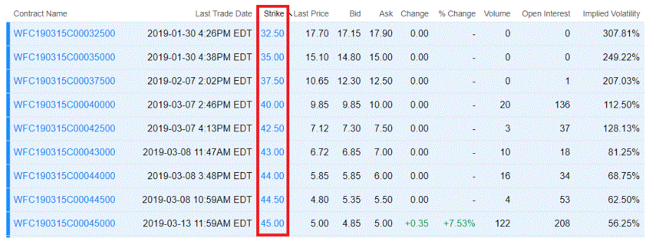

Options trading is a vibrant sector of the financial markets renowned for its complexity and diversity. Unlike traditional stock trading, options trading affords investors the opportunity to capitalize on market fluctuations without the necessity of holding the underlying assets. This flexibility permits traders to manage risk, speculate on price movements, and generate potential income through various strategic maneuvers.

In this comprehensive article, we aim to elucidate key financial terminologies pivotal to options trading. Prominent among these are the aggregate exercise price and algorithmic trading strategies, which are crucial for informed participation in both options and broader derivatives markets. Understanding these concepts provides the foundation for effective decision-making and enhances an investor's ability to develop robust trading strategies.



Grasping the intricacies of these terms is vital as they significantly influence trading actions and outcomes. Terms such as the aggregate exercise price, which refers to the total cost associated with exercising a batch of options, are integral to liquidity planning and portfolio management. Meanwhile, algorithmic trading introduces automation and precision, enabling traders to rapidly respond to market movements.

This article endeavors to equip investors with the knowledge required to comprehend how these financial concepts converge to affect overall trading outcomes. By the conclusion, readers will possess a thorough grounding in these strategic elements, enhancing their ability to navigate the complexities of options trading competently.

## Table of Contents

## Understanding Options Trading

Options trading is a method within financial markets that allows participants to purchase or sell rights to underlying assets through contracts known as options. These contracts provide the holder with the right, but not the obligation, to transact at a predefined price, known as the strike price, within a specific period, up until the expiration date. The flexibility inherent in options trading makes it a compelling alternative for both speculation and hedging in financial markets.

Options are primarily categorized into two types: calls and puts. Call options give the holder the right to buy the underlying asset, whereas put options provide the right to sell. A call option becomes profitable when the price of the underlying asset is expected to be above the strike price at expiration, while a put option is valuable when the asset's price is anticipated to be below the strike price.

Several key terms are crucial in understanding options contracts:

1. **Strike Price**: This is the predetermined price at which the holder of the option can buy (in the case of a call) or sell (in the case of a put) the underlying asset. The strike price plays a pivotal role in the profitability of an option at expiration.

2. **Premium**: This is the price paid by the buyer to the seller to acquire the option. The premium is determined by various factors, including the current price of the underlying asset, time until expiration, volatility, and prevailing interest rates. It represents the seller's income for taking on the risk and the buyer's cost for the potential benefits associated with the option.

3. **Expiration Date**: This is the date on which the option becomes void, meaning the right to exercise the option expires. The expiration date is a critical factor as it influences the time value component of the option premium.

Options trading leverages the inherent [volatility](/wiki/volatility-trading-strategies) in financial markets. For speculative purposes, traders might buy options to profit from short-term movements in asset prices without needing to own the asset itself. This leverage is one of the most attractive features of options trading; a relatively small investment (the premium) can control a large position in the asset, potentially leading to outsized returns if the market moves favorably. 

In terms of hedging, options are employed to manage risk. For instance, a stock investor might purchase put options to protect against a decline in the share price, effectively serving as an insurance policy. Conversely, a producer of a commodity might use call options to secure a favorable selling price for production.

The multifaceted nature of options thus makes them vital tools for investors seeking to enhance returns or protect investments from adverse price movements. The complexities of options trading necessitate a strong grasp of the underlying mechanics and terminologies, which is crucial for successfully navigating these financial instruments.

## Aggregate Exercise Price in Options

The aggregate exercise price represents the total cost required to exercise a collection of options contracts within a particular position. This financial metric is pivotal for traders managing portfolios that include multiple options, as it aids in [liquidity](/wiki/liquidity-risk-premium) planning and informs investment strategies. The calculation of the aggregate exercise price involves a straightforward mathematical formula:

$$
\text{Aggregate Exercise Price} = \text{Number of Options} \times \text{Strike Price} \times \text{Contract Size}
$$

Each component of this formula plays a critical role in determining the total potential financial obligation. The number of options reflects how many contracts the trader holds. The strike price is the predetermined price at which the underlying asset can be bought or sold, as stipulated in the options contract. Lastly, the contract size indicates the number of underlying asset units per options contract, commonly standardized in many markets, such as 100 shares per contract in stock options.

Understanding the aggregate exercise price is essential for ensuring that traders have sufficient capital to cover potential purchases or sales if the options are exercised. This knowledge allows traders to make more informed decisions regarding their readiness to meet the financial obligations that could arise upon exercising the option. Furthermore, it influences liquidity management, as traders must ensure that adequate funds or collateral are available to avoid forced liquidation or suboptimal asset sales under distressed market conditions.

For those managing complex or significant portfolios, strategizing based on the aggregate exercise price can enhance risk management. It allows for more precise planning regarding capital allocation and provides an avenue to integrate this metric into broader investment strategies. By evaluating the total cost of exercising all options, traders can better align their positions with market expectations, risk tolerance, and liquidity needs, ultimately optimizing portfolio performance within the volatile dynamics of options markets.

## Algorithmic Trading in Options Markets

Algorithmic trading, commonly known as algo trading, involves the use of automated and algorithm-based instructions for executing transactions in financial markets, including options trading. This approach has revolutionized trading by increasing speed and precision, aspects nearly impossible to achieve through manual processes. In options trading, algorithms enable traders to effectively exploit market opportunities by handling complex calculations and large volumes of transactions at incredible speeds.

Algorithms are designed to analyze extensive datasets, identifying patterns and trends that are not immediately apparent to human traders. This ability to process and interpret data swiftly allows for high-frequency trading ([HFT](/wiki/high-frequency-trading-strategies)) strategies. HFT involves executing a large number of trades in fractions of a second, which can amplify profit margins by capitalizing on minute price differences. The effectiveness of [algorithmic trading](/wiki/algorithmic-trading) in options markets is evident in its capacity to optimize trading outcomes using statistical models and advanced mathematical formulas.

For example, consider a basic Python algorithm that determines an optimal trading strategy based on moving averages, a commonly used indicator in financial markets:

```python
import numpy as np

def moving_average_strategy(prices, short_window=40, long_window=100):
    signals = np.zeros(len(prices))
    short_mavg = np.convolve(prices, np.ones(short_window)/short_window, mode='valid')
    long_mavg = np.convolve(prices, np.ones(long_window)/long_window, mode='valid')

    valid_range = len(long_mavg)
    signals[(short_window-1):(short_window-1+valid_range)][short_mavg[-valid_range:] > long_mavg] = 1
    signals[(short_window-1):(short_window-1+valid_range)][short_mavg[-valid_range:] < long_mavg] = -1

    return signals
```

In this example, the function `moving_average_strategy` computes short and long-term moving averages on a list of price data, generating buy signals when the short-term moving average surpasses the long-term average and sell signals in the opposite scenario.

Beyond facilitating high-frequency trades, algorithms in options markets play a critical role in risk management. By continuously monitoring market conditions and the trader's position, algorithms can autonomously adjust holdings, thereby managing risks and safeguarding against potential losses. This dynamic adjustment is crucial in the volatile environment of options where rapid price movements can significantly affect the value of options contracts.

The continuous development of [machine learning](/wiki/machine-learning) and [artificial intelligence](/wiki/ai-artificial-intelligence) further enhances the capabilities of algorithmic trading. These advancements allow for more accurate predictions of market behavior, leading to more informed decision-making processes. Consequently, algorithmic trading provides a formidable tool for traders seeking to enhance their efficiency and efficacy in the fast-paced world of options trading.

## Impact of Volatility and Market Conditions

Volatility significantly affects both the pricing of options and the strategies employed by traders. When market volatility is high, options premiums generally increase. This is due to the heightened risk and potential reward associated with unpredictable price movements. The volatility of an underlying asset's price drives the need for potent risk management strategies, impacting the cost of options as traders account for the possibility of extreme price changes.

Market conditions, including interest rates and overall market sentiment, also play crucial roles in pricing options and determining the aggregate exercise price. Interest rates can influence options premiums, as higher rates lead to a higher cost of carrying the underlying asset, potentially increasing call options' premiums and decreasing put options' premiums. For example, the Black-Scholes model, a widely used method for option pricing, includes interest rates as a critical component:

$$
C = S_0 \cdot N(d_1) - X \cdot e^{-rT} \cdot N(d_2)
$$

where:
- $C$ is the call option price,
- $S_0$ is the current price of the underlying asset,
- $X$ is the strike price,
- $r$ is the risk-free interest rate,
- $T$ is the time to expiration,
- $N$ is the cumulative distribution function of the standard normal distribution,
- $d_1$ and $d_2$ are calculated as:

$$
d_1 = \frac{\ln\left(\frac{S_0}{X}\right) + \left(r + \frac{\sigma^2}{2}\right)T}{\sigma\sqrt{T}}
$$

$$
d_2 = d_1 - \sigma\sqrt{T}
$$

Here, $\sigma$ represents volatility, and its role in determining option prices is direct and significant.

Moreover, market sentiment, driven by news, economic indicators, and geopolitical events, can influence traders' perceptions of future price movements, thereby affecting the demand and supply dynamics for options. A bullish sentiment may lead to a rise in options trading demand, pushing up premiums, while bearish sentiment might have the opposite effect.

Traders must continuously evaluate these factors to adjust their options trading strategies, balancing risk exposure with potential returns. This dynamic approach of assessing volatility, interest rates, and market sentiment allows traders to refine their risk management strategies effectively. By doing so, they can better position themselves in the options market, maintaining equilibrium between risk and reward. This ongoing evaluation requires a strong understanding of both quantitative and qualitative market indicators, as well as the adaptability to modify strategies as new information becomes available.

## Conclusion

Navigating the world of options trading necessitates a comprehensive understanding of financial terminologies and market dynamics. Key among these are the aggregate exercise price and algorithmic trading strategies, which are crucial for effective trading and risk management. The aggregate exercise price provides a pivotal measure for ensuring that traders have adequate funds for potential option exercises, thereby influencing liquidity planning and strategic decisions. Algorithmic trading, on the other hand, empowers traders to execute high-frequency, data-driven trades with precision, optimizing opportunities for profit while managing risk through automated systems.

By mastering these concepts, traders can significantly enhance their ability to make informed decisions, which is essential for optimizing trading outcomes. The integration of precise mathematical models and algorithms in options trading allows for the exploitation of market inefficiencies with speed and accuracy unmatched by manual trading.

Continuous learning and adaptation to changing market conditions are vital for sustained success in options trading. As market dynamics evolve, staying informed about new strategies and technological advancements is indispensable. This approach not only helps in mitigating risks but also opens avenues for leveraging opportunities in increasingly complex financial markets. Understanding the interplay between financial terms and market conditions will arm traders with the tools necessary to navigate the volatile terrain of options trading efficiently.

## References & Further Reading

[1]: Black, F., & Scholes, M. (1973). ["The Pricing of Options and Corporate Liabilities."](https://www.cs.princeton.edu/courses/archive/fall09/cos323/papers/black_scholes73.pdf) Journal of Political Economy, 81(3), 637-654.

[2]: ["Options, Futures, and Other Derivatives"](https://www.amazon.com/Options-Futures-Other-Derivatives-9th/dp/0133456315) by John C. Hull

[3]: Aldridge, I. (2009). ["High-Frequency Trading: A Practical Guide to Algorithmic Strategies and Trading Systems."](https://www.ahmetbeyefendi.com/wp-content/uploads/2020/07/High-Frequency-Trading-Irene-Aldridge.pdf) Wiley Finance.

[4]: Hasbrouck, J., & Saar, G. (2013). ["Low-Latency Trading."](https://www.sciencedirect.com/science/article/abs/pii/S1386418113000165) The Review of Financial Studies, 26(9), 2345-2383.

[5]: ["Algorithmic Trading and DMA: An Introduction to Direct Access Trading Strategies"](https://archive.org/details/algorithmictradi0000john) by Barry Johnson

[6]: Carr, P., & Wu, L. (2009). ["Variance Risk Premiums."](https://academic.oup.com/rfs/article-abstract/22/3/1311/1581057) The Review of Financial Studies, 22(3), 1311–1341.