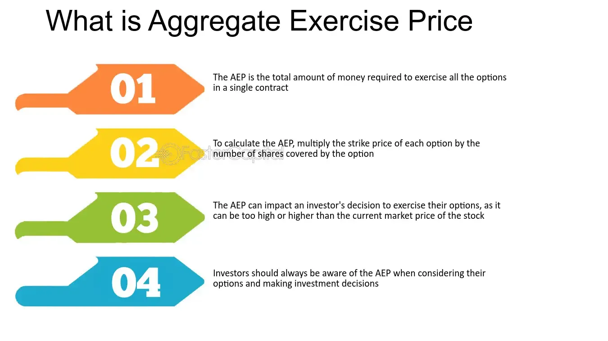

## Table of Contents

## What is the Aggregate Exercise Price?

The Aggregate Exercise Price is the total amount of money you need to pay to buy all the shares that an option gives you the right to buy. When you have an option, it lets you buy a certain number of shares at a set price, called the exercise price. If you want to buy all the shares the option allows, you multiply the number of shares by the exercise price to get the Aggregate Exercise Price.

For example, if you have an option to buy 100 shares at an exercise price of $10 per share, the Aggregate Exercise Price would be $1,000. This is important to know because it helps you understand how much money you need to have ready if you decide to use your option to buy the shares.

## How is the Aggregate Exercise Price calculated?

The Aggregate Exercise Price is figured out by multiplying the number of shares you can buy with your option by the price you have to pay for each share, which is called the exercise price. If you have an option that lets you buy 50 shares and the exercise price is $20 per share, you would multiply 50 by $20. This gives you an Aggregate Exercise Price of $1,000.

Knowing the Aggregate Exercise Price is important because it tells you how much money you need to have if you decide to use your option to buy the shares. It's like knowing the total cost before you go shopping. If you don't have enough money to cover the Aggregate Exercise Price, you won't be able to buy all the shares your option allows you to buy.

## Why is the Aggregate Exercise Price important for option holders?

The Aggregate Exercise Price is important for option holders because it tells them how much money they need to buy all the shares their option allows. If you have an option to buy shares, knowing the total cost helps you plan if you can afford to use the option. It's like knowing the total price of something before you decide to buy it. If the Aggregate Exercise Price is too high, you might decide not to use your option or wait until you have enough money.

Also, knowing the Aggregate Exercise Price helps you make smart choices about when to use your option. If the price of the shares in the market is less than the Aggregate Exercise Price, it might not make sense to use your option because you could buy the shares cheaper without it. But if the market price is higher than the Aggregate Exercise Price, using your option could save you money. This way, the Aggregate Exercise Price guides you in deciding the best time to act on your option.

## Can you explain the difference between the Aggregate Exercise Price and the Strike Price?

The Aggregate Exercise Price and the Strike Price are two important numbers when you have an option to buy shares. The Strike Price, sometimes called the exercise price, is the price you have to pay for each share if you decide to use your option. It's like the price tag on each share. If your option lets you buy 100 shares and the Strike Price is $10 per share, you pay $10 for each one of those shares.

The Aggregate Exercise Price, on the other hand, is the total amount of money you need to buy all the shares your option allows. You find it by multiplying the number of shares by the Strike Price. Using the same example, if you can buy 100 shares at a Strike Price of $10 each, the Aggregate Exercise Price would be $1,000. This number is important because it tells you how much money you need to have ready if you want to use your option to buy all the shares.

## How does the Aggregate Exercise Price affect the decision to exercise an option?

The Aggregate Exercise Price is a big deal when you're thinking about using your option to buy shares. It tells you how much money you need to buy all the shares you're allowed to with your option. If the Aggregate Exercise Price is too high and you don't have that much money, you might decide not to use your option. It's like wanting to buy something but not having enough money in your wallet.

Also, the Aggregate Exercise Price helps you figure out if it's a good time to use your option. If the price of the shares in the market is lower than the Aggregate Exercise Price, it might not make sense to use your option because you could buy the shares cheaper without it. But if the market price is higher than the Aggregate Exercise Price, using your option could save you money. So, knowing the Aggregate Exercise Price helps you decide if and when to use your option to get the best deal.

## What are some common scenarios where the Aggregate Exercise Price comes into play?

When someone gets an option at work, like stock options, the Aggregate Exercise Price is important. If you work at a company and they give you options to buy shares, you need to know the Aggregate Exercise Price to see if you can afford to buy them. For example, if your company gives you an option to buy 100 shares at $10 each, the Aggregate Exercise Price is $1,000. You need to have that much money ready if you want to use your option to buy the shares.

Another common scenario is when people invest in the stock market and buy options. If you're thinking about using an option you bought to buy shares, the Aggregate Exercise Price helps you decide if it's a good idea. If the market price of the shares is higher than the Aggregate Exercise Price, using your option could save you money. But if the market price is lower, it might be better to just buy the shares without using your option. Knowing the Aggregate Exercise Price helps you make smart choices about when to use your option.

## How does the Aggregate Exercise Price impact the financial outcome of exercising options?

When you decide to use your option to buy shares, the Aggregate Exercise Price is the total amount of money you need to pay. This number is important because it affects how much money you'll have left after you buy the shares. If the Aggregate Exercise Price is high, you need more money to buy the shares, which means you might have less money for other things. If you don't have enough money to cover the Aggregate Exercise Price, you won't be able to buy all the shares your option allows, which could mean missing out on potential profits if the share price goes up.

The Aggregate Exercise Price also helps you figure out if using your option will make you money. If the market price of the shares is higher than the Aggregate Exercise Price, you can buy the shares at a lower price and then sell them for a profit. For example, if the Aggregate Exercise Price is $1,000 and the market price is $1,200, you could make $200 by using your option. But if the market price is lower than the Aggregate Exercise Price, using your option might not be a good idea because you could lose money. Knowing the Aggregate Exercise Price helps you decide if exercising your option will be a good financial move.

## What are the tax implications related to the Aggregate Exercise Price?

When you use your option to buy shares, the tax you have to pay can be affected by the Aggregate Exercise Price. If the market price of the shares is higher than the Aggregate Exercise Price when you buy them, you might have to pay taxes on the difference. This is because the difference between what you paid (the Aggregate Exercise Price) and what the shares are worth (the market price) is seen as income by the tax people. So, if you buy shares for $1,000 (the Aggregate Exercise Price) but they're worth $1,200 on the market, you might have to pay taxes on that $200 difference.

The type of option you have can also change how the Aggregate Exercise Price affects your taxes. For example, with non-qualified stock options, you have to pay regular income tax on the difference between the market price and the Aggregate Exercise Price when you use your option. But with incentive stock options, you might not have to pay taxes right away. Instead, you could pay capital gains tax later when you sell the shares, which is usually less than regular income tax. Knowing how the Aggregate Exercise Price works with your type of option can help you plan for taxes and keep more of your money.

## How do changes in stock price influence the Aggregate Exercise Price?

The Aggregate Exercise Price does not change just because the stock price goes up or down. It is a fixed number that you get by multiplying the number of shares you can buy with your option by the price you have to pay for each share, which is the exercise price. So, even if the stock price changes a lot, the Aggregate Exercise Price stays the same because it's based on the exercise price that was set when you got your option.

However, changes in the stock price do affect whether it makes sense for you to use your option. If the stock price is higher than the Aggregate Exercise Price, using your option to buy the shares could save you money because you're buying them at a lower price than what they're worth on the market. But if the stock price is lower than the Aggregate Exercise Price, it might not be a good idea to use your option because you could buy the shares cheaper without it. So, while the Aggregate Exercise Price itself doesn't change, knowing it helps you decide when to use your option based on the current stock price.

## What strategies can be used to manage the Aggregate Exercise Price effectively?

One way to manage the Aggregate Exercise Price effectively is to keep an eye on the stock price. If the stock price is higher than the Aggregate Exercise Price, it might be a good time to use your option because you can buy the shares cheaper than they are worth on the market. But if the stock price is lower than the Aggregate Exercise Price, it's better to wait or not use your option at all because you could buy the shares for less without it. Checking the stock price regularly helps you decide the best time to use your option.

Another strategy is to plan your money carefully. The Aggregate Exercise Price tells you how much money you need to buy all the shares your option allows. If you don't have enough money to cover this amount, you might need to save up or find other ways to get the money before you can use your option. It's also smart to think about how using your option will affect your taxes. If you know you'll have to pay taxes on the difference between the Aggregate Exercise Price and the market price, you can set aside some money for that too. Planning ahead helps you make sure you can afford to use your option when the time is right.

## How does the Aggregate Exercise Price vary across different types of options?

The Aggregate Exercise Price can be different depending on the type of option you have. For stock options given by a company to its employees, like non-qualified stock options or incentive stock options, the Aggregate Exercise Price is calculated by multiplying the number of shares you can buy by the exercise price set when the option was given to you. These options have a fixed exercise price, so the Aggregate Exercise Price stays the same no matter how the stock price changes.

For options that people buy on the stock market, like call options, the Aggregate Exercise Price works the same way. You find it by multiplying the number of shares the option lets you buy by the strike price, which is set when you buy the option. Even though these options can have different strike prices and expiration dates, the Aggregate Exercise Price for each option stays the same until you use it or it expires. Knowing the Aggregate Exercise Price helps you decide if and when to use your option, no matter what type it is.

## What are advanced considerations for the Aggregate Exercise Price in complex option strategies?

When you're dealing with more complex option strategies, like spreads or combinations, the Aggregate Exercise Price can get trickier. In a spread, you might buy one option and sell another at the same time. For example, if you buy a call option with an Aggregate Exercise Price of $1,000 and sell another call option with an Aggregate Exercise Price of $1,200, you need to think about both prices. The difference between these two Aggregate Exercise Prices can affect how much money you might make or lose, depending on the stock price when you use your options.

In other strategies, like combinations where you might be using both call and put options, you need to look at the Aggregate Exercise Price for each option separately. If you have a call option with an Aggregate Exercise Price of $1,000 and a put option with an Aggregate Exercise Price of $900, you have to think about how these numbers work together. Depending on whether the stock price is higher or lower than these prices, using one option might be better than using the other. Knowing the Aggregate Exercise Prices helps you figure out the best way to use your options to make the most money or lose the least.

## What is the Aggregate Exercise Price in Options?

The aggregate exercise price represents the total cost required to exercise a collection of options contracts within a particular position. This financial metric is pivotal for traders managing portfolios that include multiple options, as it aids in [liquidity](/wiki/liquidity-risk-premium) planning and informs investment strategies. The calculation of the aggregate exercise price involves a straightforward mathematical formula:

$$
\text{Aggregate Exercise Price} = \text{Number of Options} \times \text{Strike Price} \times \text{Contract Size}
$$

Each component of this formula plays a critical role in determining the total potential financial obligation. The number of options reflects how many contracts the trader holds. The strike price is the predetermined price at which the underlying asset can be bought or sold, as stipulated in the options contract. Lastly, the contract size indicates the number of underlying asset units per options contract, commonly standardized in many markets, such as 100 shares per contract in stock options.

Understanding the aggregate exercise price is essential for ensuring that traders have sufficient capital to cover potential purchases or sales if the options are exercised. This knowledge allows traders to make more informed decisions regarding their readiness to meet the financial obligations that could arise upon exercising the option. Furthermore, it influences liquidity management, as traders must ensure that adequate funds or collateral are available to avoid forced liquidation or suboptimal asset sales under distressed market conditions.

For those managing complex or significant portfolios, strategizing based on the aggregate exercise price can enhance risk management. It allows for more precise planning regarding capital allocation and provides an avenue to integrate this metric into broader investment strategies. By evaluating the total cost of exercising all options, traders can better align their positions with market expectations, risk tolerance, and liquidity needs, ultimately optimizing portfolio performance within the volatile dynamics of options markets.

## What is the impact of volatility and market conditions?

Volatility significantly affects both the pricing of options and the strategies employed by traders. When market [volatility](/wiki/volatility-trading-strategies) is high, options premiums generally increase. This is due to the heightened risk and potential reward associated with unpredictable price movements. The volatility of an underlying asset's price drives the need for potent risk management strategies, impacting the cost of options as traders account for the possibility of extreme price changes.

Market conditions, including interest rates and overall market sentiment, also play crucial roles in pricing options and determining the aggregate exercise price. Interest rates can influence options premiums, as higher rates lead to a higher cost of carrying the underlying asset, potentially increasing call options' premiums and decreasing put options' premiums. For example, the Black-Scholes model, a widely used method for option pricing, includes interest rates as a critical component:

$$
C = S_0 \cdot N(d_1) - X \cdot e^{-rT} \cdot N(d_2)
$$

where:
- $C$ is the call option price,
- $S_0$ is the current price of the underlying asset,
- $X$ is the strike price,
- $r$ is the risk-free interest rate,
- $T$ is the time to expiration,
- $N$ is the cumulative distribution function of the standard normal distribution,
- $d_1$ and $d_2$ are calculated as:

$$
d_1 = \frac{\ln\left(\frac{S_0}{X}\right) + \left(r + \frac{\sigma^2}{2}\right)T}{\sigma\sqrt{T}}
$$

$$
d_2 = d_1 - \sigma\sqrt{T}
$$

Here, $\sigma$ represents volatility, and its role in determining option prices is direct and significant.

Moreover, market sentiment, driven by news, economic indicators, and geopolitical events, can influence traders' perceptions of future price movements, thereby affecting the demand and supply dynamics for options. A bullish sentiment may lead to a rise in options trading demand, pushing up premiums, while bearish sentiment might have the opposite effect.

Traders must continuously evaluate these factors to adjust their options trading strategies, balancing risk exposure with potential returns. This dynamic approach of assessing volatility, interest rates, and market sentiment allows traders to refine their risk management strategies effectively. By doing so, they can better position themselves in the options market, maintaining equilibrium between risk and reward. This ongoing evaluation requires a strong understanding of both quantitative and qualitative market indicators, as well as the adaptability to modify strategies as new information becomes available.

## References & Further Reading

[1]: Black, F., & Scholes, M. (1973). ["The Pricing of Options and Corporate Liabilities."](https://www.cs.princeton.edu/courses/archive/fall09/cos323/papers/black_scholes73.pdf) Journal of Political Economy, 81(3), 637-654.

[2]: ["Options, Futures, and Other Derivatives"](https://www.amazon.com/Options-Futures-Other-Derivatives-9th/dp/0133456315) by John C. Hull

[3]: Aldridge, I. (2009). ["High-Frequency Trading: A Practical Guide to Algorithmic Strategies and Trading Systems."](https://www.ahmetbeyefendi.com/wp-content/uploads/2020/07/High-Frequency-Trading-Irene-Aldridge.pdf) Wiley Finance.

[4]: Hasbrouck, J., & Saar, G. (2013). ["Low-Latency Trading."](https://www.sciencedirect.com/science/article/abs/pii/S1386418113000165) The Review of Financial Studies, 26(9), 2345-2383.

[5]: ["Algorithmic Trading and DMA: An Introduction to Direct Access Trading Strategies"](https://archive.org/details/algorithmictradi0000john) by Barry Johnson

[6]: Carr, P., & Wu, L. (2009). ["Variance Risk Premiums."](https://academic.oup.com/rfs/article-abstract/22/3/1311/1581057) The Review of Financial Studies, 22(3), 1311–1341.