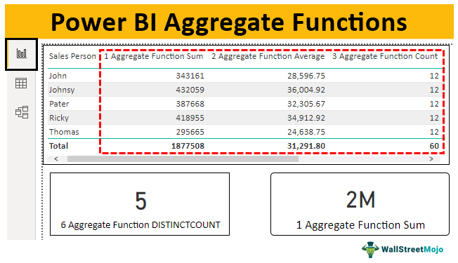

In today's financial markets, the integration of data analysis and technology-driven decision-making processes is pivotal for achieving successful investment outcomes. This trend reflects a burgeoning reliance on computational tools and techniques that enable traders and investors to interpret complex market data efficiently. The evolution of computer science and statistical methods has brought about sophisticated means of analyzing large datasets, thereby improving the accuracy and reliability of investment strategies.

This article will investigate the intersection of computing, data analysis, aggregate functions, and algorithmic trading—a domain where traditional financial skills are augmented by advanced technological capabilities. Through exploring how these components interact, one can better appreciate the intricate design of modern trading strategies. Computing facilitates rapid data processing and algorithm development, transforming raw market data into actionable insights. Data analysis serves as the foundation upon which these trading models are built, helping to extract meaningful patterns and trends.



Aggregate functions, critical in the summarization of extensive financial data, support the creation of descriptive statistics required for strategic economic and market evaluations. These mathematical functions, such as averages, sums, and variances, are integral in condensing data to its most meaningful elements, thus enabling traders to form a cohesive understanding of market dynamics. Algorithmic trading, powered by these analytical tools, automates and optimizes trading decisions by executing developed strategies based on computed insights.

Understanding these interrelated concepts can arm traders and investors with the capacity to make informed, data-backed decisions, fostering a competitive edge in financial markets. Therefore, it is essential to start by considering the foundational aspects of data analysis in trading—a crucial step in mastering the skills necessary for navigating the intricacies of modern financial markets.

## Table of Contents

## Understanding Aggregate Functions

Aggregate functions are essential components in data analysis, serving as tools for synthesizing extensive datasets into valuable summary statistics. These functions include average, count, maximum, minimum, sum, and median. By providing a summarized view of larger data collections, aggregate functions enable analysts to comprehend trends and patterns that inform market behaviors and economic forecasting.

### Common Aggregate Functions

1. **Average (Mean):** 
   This function calculates the central tendency of a dataset. The formula for the average of a dataset $x$ is given by:
$$
   \text{Average} = \frac{1}{n} \sum_{i=1}^{n} x_i

$$

   where $n$ is the number of observations, and $x_i$ represents each observation in the dataset.

2. **Count:**
   Count determines the total number of elements in a dataset. It is fundamental in evaluating the dataset's size or for frequency analysis.

3. **Maximum and Minimum:**
   These functions identify the largest and smallest values in a dataset, respectively. They are crucial for understanding the range and potential outliers within the data.

4. **Sum:**
   Sum provides the total accumulation of all the data points in a set. Its formula is simply:
$$
   \text{Sum} = \sum_{i=1}^{n} x_i

$$

5. **Median:**
   The median indicates the middle value of a dataset. If the dataset is ordered numerically, the median divides the data into two equal halves.

### Application in Finance

In finance, aggregate functions are instrumental in metrics calculation like GDP growth, where average growth rates over different periods offer insights into economic trends. Similarly, market risk assessments utilize these functions to understand underlying data behaviors, such as [volatility](/wiki/volatility-trading-strategies) and value distributions.

By aggregating data, analysts can derive descriptive [statistics](/wiki/bayesian-statistics) vital for economic and market analyses. For instance, evaluating the mean and median can provide a sense of central [momentum](/wiki/momentum) in stock prices, while the maximum and minimum values help assess the market's volatility or identify potential historical extremes.

Moreover, employing aggregate functions facilitates trend identification and projection of future market behaviors. Recognizing how these statistical measures interact can illuminate patterns, suggesting possible directions for market movements or economic indicators.

Understanding the concepts and calculations of aggregate functions equips traders and analysts with the necessary tools to synthesize data effectively, thus enabling informed decision-making rooted in quantitative insights. As trading strategies evolve, the relevance and application of these functions will likely expand, cementing their role in effective data-driven analysis.

## Data Analysis in Algorithmic Trading

Algorithmic trading leverages computational algorithms to execute trades at optimal conditions, largely driven by data analysis. The initial step in this process is Exploratory Data Analysis (EDA), which is crucial for uncovering patterns and optimizing the dataset for further analysis. EDA involves a variety of techniques that help in understanding the dataset’s structure, spotting anomalies, and ensuring data quality—thereby setting a solid foundation for building trading strategies.

Visualizing time series data is one of the key components of EDA in [algorithmic trading](/wiki/algorithmic-trading). This allows traders to observe historical price movements, identify trends, and detect volatility patterns. Tools such as line charts, candlestick charts, and moving averages are commonly used to achieve this. For example, a simple moving average (SMA) calculates the average of a selected range of prices, typically closing prices, by the number of periods in that range. The formula for an SMA is:

$$
\text{SMA}_n = \frac{\sum_{i=1}^{n} P_i}{n}
$$

where $P_i$ represents the price at time $i$, and $n$ is the number of time periods.

Resampling datasets is another important technique that adjusts the frequency of data. This can be useful for analyzing data at different granularities, such as converting daily data into weekly data to smooth out volatility and reveal long-term trends. In Python, the `pandas` library provides functions like `resample()` to easily change the frequency of time series data.

```python
import pandas as pd

# Example of resampling daily stock data to weekly
df = pd.read_csv('stock_data.csv', parse_dates=['Date'], index_col='Date')
weekly_data = df.resample('W').mean()
```

Calculating percentage changes is pivotal in determining the momentum of price movements. This measure helps traders assess the rate of change over a specified time period. The percentage change is calculated as:

$$
\text{Percentage Change} = \frac{(P_{\text{current}} - P_{\text{previous}})}{P_{\text{previous}}} \times 100
$$

These techniques enable traders to construct comprehensive trading strategies that can swiftly respond to market changes. EDA tools, such as Python libraries `pandas`, `numpy`, and `matplotlib`, facilitate the effective assessment and interpretation of datasets, allowing traders to derive actionable insights and refine their trading strategies accordingly.

In summary, through the use of EDA, algorithmic trading harnesses the power of data analysis to craft strategies that adapt to and capitalize on the dynamic conditions of financial markets.

## Incorporating Aggregate Functions in Trading Strategies

Aggregate functions are integral to constructing algorithmic trading strategies by processing financial data into actionable insights. These functions, such as average, minimum, maximum, sum, and count, enable traders to synthesize large volumes of data efficiently, extracting important statistical measures that inform their trading decisions.

Traders often rely on aggregate functions to evaluate asset performance and risk. For instance, calculating the average (mean) price of a stock over a specific period can provide insights into potential entry or [exit](/wiki/exit-strategy) points. This is typically done using a moving average, which smooths out price data to identify trends. A simple moving average (SMA) can be calculated with the formula:

$$
\text{SMA}_n = \frac{P_1 + P_2 + \ldots + P_n}{n}
$$

Where $n$ is the number of periods and $P$ represents the periodic closing prices. A higher average may signal an opportunity to sell, while a lower average could indicate a buying opportunity.

Furthermore, aggregate risk calculations are essential for assessing potential market impacts and adjusting strategies accordingly. For example, calculating the maximum drawdown, a metric that evaluates the peak-to-trough decline before a new peak is achieved, helps traders understand worst-case scenarios. This can inform risk management strategies and help in adjusting stop-loss limits dynamically.

Sophisticated algorithms incorporate these functions for real-time data processing and decision making. For instance, in Python, libraries such as pandas and NumPy offer functions to perform these aggregations efficiently. An example in Python for computing a moving average using pandas would be:

```python
import pandas as pd

# Assume we have a DataFrame 'data' with a column 'price'
data['moving_average'] = data['price'].rolling(window=20).mean()
```

Through these implementations, traders can continuously monitor market conditions and execute trades that are timely and data-driven. Aggregate functions provide the statistical foundation necessary for leveraging financial data, allowing for informed and strategic decision-making within automated trading systems.

## Technical and Fundamental Analysis in Algo Trading

In algorithmic trading, technical and fundamental analyses are crucial for making informed trading decisions. Technical analysis focuses on historical price data to forecast future price movements, where aggregate functions such as moving averages or standard deviations play a vital role. These functions help identify trends, support, and resistance levels in the market. For instance, the moving average (MA) is a widely used technical indicator that smooths out price data by creating a constantly updated average price:

$$
\text{MA}_n = \frac{P_1 + P_2 + \cdots + P_n}{n}
$$

Here, $P$ represents the price at each time point, and $n$ is the period over which the average is calculated.

Python code for calculating a simple moving average might look like this:

```python
import pandas as pd

def moving_average(prices, window):
    return prices.rolling(window=window).mean()

# Example usage
prices = pd.Series([22, 23, 21, 20, 19, 24, 25])
ma = moving_average(prices, window=3)
print(ma)
```

On the other hand, [fundamental analysis](/wiki/fundamental-analysis) evaluates asset values based on financial statements, economic indicators, and aggregate market data. It involves assessing a company’s intrinsic value and macroeconomic factors that could impact its performance. Financial ratios derived from a company's financial statements, such as price-to-earnings (P/E) ratios, are often used in this analysis.

For a comprehensive trading strategy, combining technical and fundamental analyses can lead to more robust decision-making. This integration enables traders to balance short-term price patterns with long-term value assessments, enhancing the potential for optimized investment outcomes.

Data analysis and the use of aggregate functions are foundational to both types of analysis. They provide insights into market dynamics and asset valuation, allowing traders to devise strategies that adjust to varying market conditions. By leveraging these analyses, traders can establish a more balanced approach to algorithmic trading, ultimately leading to better-informed and more effective trading strategies.

## Conclusion

Aggregate functions and data analysis are essential tools in algorithmic trading. These components empower traders to make informed, data-driven decisions amidst ever-changing market environments. By summarizing vast datasets into meaningful statistics, aggregate functions such as averages, sums, and variances enable the extraction of actionable insights that inform trading strategies. For instance, calculating the average price of a security over a specific period can help identify potential entry or exit points, while variance and standard deviation provide metrics for assessing the risk associated with different assets.

As technology progresses, the relationship between data analysis tools and trading strategies will continue to strengthen. Advances in computing power and [machine learning](/wiki/machine-learning) algorithms enhance the precision and efficiency with which data can be processed. This evolution allows traders to implement sophisticated models that can analyze historical data faster and more accurately, adapt to emerging patterns, and ultimately execute trades that maximize returns while minimizing risk.

To maintain a competitive edge, traders must continuously adapt by embracing new analytical methods and technologies. Staying abreast of innovations in data processing techniques and programming languages is crucial. For example, proficiency in Python programming can facilitate the application of aggregate functions and other data analysis tools in a trading strategy. The following Python snippet demonstrates how to calculate a simple moving average (SMA), a common trading signal, using the Pandas library:

```python
import pandas as pd

# Sample time series data for demonstration
data = {'date': ['2023-01-01', '2023-01-02', '2023-01-03'],
        'price': [100, 102, 101]}
df = pd.DataFrame(data)

# Setting the date as the index 
df['date'] = pd.to_datetime(df['date'])
df.set_index('date', inplace=True)

# Calculating the 2-day SMA
df['2-day SMA'] = df['price'].rolling(window=2).mean()

print(df)
```

Understanding the role of aggregate functions and data analysis in algorithmic trading is a fundamental step towards mastering modern financial markets. These concepts not only provide a foundation for effective trading strategies but also open doors to continuous learning and adaptation in a rapidly evolving financial landscape. The ability to harness data effectively is increasingly indispensable, ensuring that traders remain resilient and responsive to market dynamics.

## References & Further Reading

[1]: Bergstra, J., Bardenet, R., Bengio, Y., & Kégl, B. (2011). ["Algorithms for Hyper-Parameter Optimization."](https://dl.acm.org/doi/10.5555/2986459.2986743) Advances in Neural Information Processing Systems 24.

[2]: ["Advances in Financial Machine Learning"](https://www.amazon.com/Advances-Financial-Machine-Learning-Marcos/dp/1119482089) by Marcos Lopez de Prado

[3]: ["Evidence-Based Technical Analysis: Applying the Scientific Method and Statistical Inference to Trading Signals"](https://www.amazon.com/Evidence-Based-Technical-Analysis-Scientific-Statistical/dp/0470008741) by David Aronson

[4]: ["Machine Learning for Algorithmic Trading"](https://github.com/stefan-jansen/machine-learning-for-trading) by Stefan Jansen

[5]: ["Quantitative Trading: How to Build Your Own Algorithmic Trading Business"](https://github.com/LucindaYa/quant-resources/blob/master/Quantitative%20Trading%20How%20to%20Build%20Your%20Own%20Algorithmic%20Trading%20Business.pdf) by Ernest P. Chan