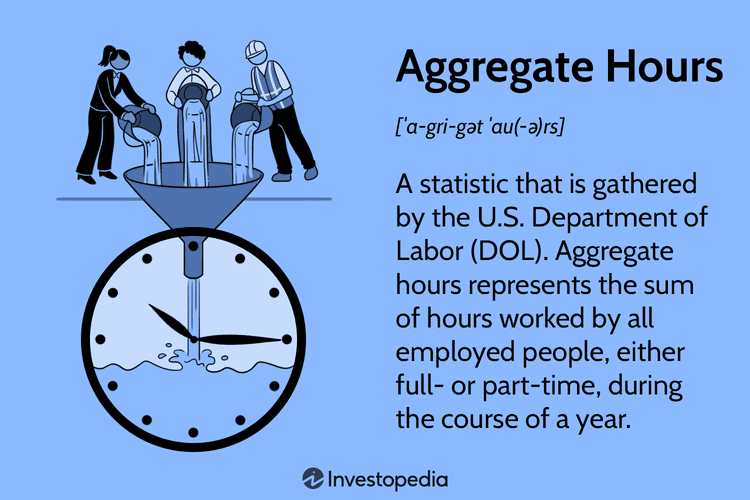

## Table of Contents

## What are Aggregate Hours in the context of U.S. government statistics?

Aggregate Hours in U.S. government statistics refer to the total number of hours worked by all employees in a specific industry or across the entire economy over a certain period, usually a year. This measure helps economists and policymakers understand the overall level of employment and productivity. By looking at Aggregate Hours, they can see if people are working more or less than before, which can indicate changes in the economy.

For example, if Aggregate Hours go up, it might mean that more people are working or that existing workers are putting in more hours. This could signal economic growth. On the other hand, if Aggregate Hours go down, it might suggest that people are losing jobs or working fewer hours, which could be a sign of an economic slowdown. This information is useful for making decisions about policies that affect employment and economic health.

## Why are Aggregate Hours important for economic analysis?

Aggregate Hours are important for economic analysis because they give a clear picture of how much work is being done in the economy. By adding up all the hours worked by everyone, economists can see if the total amount of work is going up or down. This helps them understand if the economy is growing or shrinking. If more hours are being worked, it often means the economy is doing well because more goods and services are being produced. On the other hand, if fewer hours are being worked, it might mean the economy is slowing down.

Another reason Aggregate Hours are useful is that they help economists look at changes in employment and productivity over time. For example, if Aggregate Hours increase but the number of workers stays the same, it could mean that each worker is working longer hours. This can affect things like wages and the overall well-being of workers. By keeping track of Aggregate Hours, policymakers can make better decisions about laws and programs that help support the economy and the people working in it.

## How does the U.S. government collect data on Aggregate Hours?

The U.S. government collects data on Aggregate Hours mainly through surveys. One key survey is the Current Employment Statistics (CES) program, run by the Bureau of Labor Statistics (BLS). The CES survey asks businesses and government agencies about the number of employees they have and the total hours these employees worked during a specific period. This helps the BLS calculate Aggregate Hours for different industries and the whole economy.

Another important source of data is the Current Population Survey (CPS), which is a joint effort between the BLS and the Census Bureau. The CPS surveys households to gather information about the employment status of individuals, including how many hours they worked in the past week. By combining data from both the CES and CPS, the government can get a complete picture of Aggregate Hours. This data is then used to analyze economic trends and make policy decisions.

## Which agencies are responsible for reporting Aggregate Hours statistics?

The main agency responsible for reporting Aggregate Hours statistics is the Bureau of Labor Statistics (BLS). They collect data through the Current Employment Statistics (CES) program. In this program, they ask businesses and government agencies about their employees and the total hours these employees worked. This helps the BLS figure out the total number of hours worked in different industries and the whole economy.

Another agency that helps with Aggregate Hours data is the Census Bureau. They work with the BLS on the Current Population Survey (CPS). This survey asks people in households about their jobs and how many hours they worked in the past week. By combining the information from both the CES and CPS, the government can get a full picture of Aggregate Hours. This information is important for understanding how the economy is doing and making good decisions about policies.

## Can you explain the difference between Aggregate Hours and Average Weekly Hours?

Aggregate Hours and Average Weekly Hours are two different ways to measure how much people are working. Aggregate Hours is the total number of hours worked by everyone in a certain group, like an industry or the whole country, over a certain time, usually a year. It's like adding up all the hours everyone worked together. This helps us see the big picture of how much work is being done in the economy.

Average Weekly Hours, on the other hand, is the average number of hours each person in a group works in a week. To find this, you take the total hours worked by everyone in the group and divide it by the number of people in the group. This tells us how many hours, on average, each worker is working each week. It's useful for understanding how hard people are working and can be different from Aggregate Hours because it focuses on the individual worker rather than the total work done.

## How are Aggregate Hours used to calculate labor productivity?

Aggregate Hours are important for figuring out labor productivity. Labor productivity is how much stuff workers can make in a certain amount of time. To find labor productivity, you take the total amount of goods and services made and divide it by the total number of hours worked, which is the Aggregate Hours. If the total amount of goods and services goes up but the Aggregate Hours stay the same, it means workers are making more stuff in the same amount of time, so productivity is going up.

This measure helps economists and businesses see how well workers are doing. If Aggregate Hours go up but the amount of goods and services doesn't change, it might mean productivity is going down because more hours are needed to make the same amount of stuff. By looking at Aggregate Hours and labor productivity together, people can make better decisions about how to improve the economy and help workers be more efficient.

## What trends have been observed in Aggregate Hours over the past decade?

Over the past decade, Aggregate Hours in the U.S. have shown ups and downs, reflecting changes in the economy. After the financial crisis around 2008, Aggregate Hours were low because many people lost their jobs or had to work fewer hours. But as the economy started to recover, Aggregate Hours began to rise. By the mid-2010s, they were getting close to what they were before the crisis. This shows that more people were working and working more hours, which is a good sign for the economy.

However, in the late 2010s and into the 2020s, things got more complicated. The COVID-19 pandemic in 2020 caused a big drop in Aggregate Hours because many businesses had to close or cut back on hours. But after the first shock, Aggregate Hours started to recover quickly as businesses reopened and people went back to work. By 2022, Aggregate Hours were higher than before the pandemic in some industries, showing a strong bounce back. These trends help us understand how the economy is doing and how it reacts to big events like a financial crisis or a global health crisis.

## How do Aggregate Hours correlate with economic cycles?

Aggregate Hours go up and down with the economy. When the economy is doing well, more people have jobs and work more hours. This means Aggregate Hours go up. Businesses make more stuff and people feel good about their jobs. But when the economy is not doing well, like during a recession, businesses might cut back on workers or hours. This makes Aggregate Hours go down. It's a sign that the economy is slowing down and people are working less.

In the last few years, we saw this pattern clearly. Before the big health crisis in 2020, Aggregate Hours were going up as the economy got better after the 2008 financial crisis. But when the health crisis hit, Aggregate Hours dropped a lot because many people lost their jobs or had to work fewer hours. After the crisis, as things got better, Aggregate Hours started going up again. This shows how Aggregate Hours can tell us a lot about what's happening in the economy and help us understand economic cycles.

## What are the limitations of using Aggregate Hours as an economic indicator?

One big problem with using Aggregate Hours to understand the economy is that it doesn't tell us about the quality of jobs. Just because people are working more hours doesn't mean they are happy or making good money. Some might be working long hours at low-paying jobs, which isn't a good sign for the economy. Also, Aggregate Hours can hide big changes in different parts of the economy. For example, if one industry is doing really well and another is doing badly, the total hours might look okay, but it doesn't show the real story.

Another issue is that Aggregate Hours don't show us how technology is changing work. Machines and computers can make people more productive, but if companies use them to cut down on workers, Aggregate Hours might go down even if the economy is doing well. This makes it hard to use Aggregate Hours to understand how well the economy is doing. It's just one piece of the puzzle, and we need to look at other things too to get the full picture.

## How do seasonal adjustments affect the interpretation of Aggregate Hours data?

Seasonal adjustments help make Aggregate Hours data easier to understand by taking out changes that happen every year at the same time. For example, in the winter, some businesses might slow down because of the holidays, so fewer hours are worked. If we don't adjust for this, it might look like the economy is doing worse in winter than in summer, even if that's not true. By making these adjustments, we can see the real trends in the economy without being confused by things that happen every year.

But seasonal adjustments can also make things a bit tricky. Sometimes, the adjustments might not be perfect, and they can hide important changes that are happening. For example, if a new holiday starts making people work less, the adjustments might not catch this right away. So, while seasonal adjustments help us see the big picture better, we need to be careful and look at other information too to make sure we understand what's really going on with Aggregate Hours.

## What methodologies are used to adjust Aggregate Hours for inflation?

When we talk about adjusting Aggregate Hours for inflation, we're trying to understand how the value of work changes over time as prices go up or down. The main way to do this is by using a price index, like the Consumer Price Index (CPI) or the Producer Price Index (PPI). These indexes show how much prices have changed compared to a base year. To adjust Aggregate Hours for inflation, you take the total hours worked and multiply them by a price index to see what those hours would be worth in today's dollars. This helps us compare the value of work from different years more fairly.

But adjusting for inflation isn't perfect. Sometimes, the price indexes might not cover all the changes in prices that affect workers, like the cost of living in different areas. Also, the way we measure inflation can change, which can make it hard to compare numbers from different times. So, while adjusting Aggregate Hours for inflation helps us get a better idea of how the economy is doing over time, we need to remember that these adjustments are just estimates and might not be totally accurate.

## How can advanced statistical models enhance the analysis of Aggregate Hours data?

Advanced statistical models can make analyzing Aggregate Hours data much better. They can help us see patterns and trends that we might miss if we just look at the numbers. For example, these models can predict how Aggregate Hours might change in the future based on past data. They can also help us understand how different things, like changes in the economy or new laws, might affect Aggregate Hours. By using these models, we can get a clearer picture of what's going on and make smarter decisions about the economy.

These models can also help us deal with tricky parts of the data, like seasonal changes or inflation. They can take out these effects so we can see the real trends more easily. For example, a model might use something called "seasonal decomposition" to separate out the regular ups and downs that happen every year. This way, we can focus on the bigger changes in Aggregate Hours. Plus, these models can handle lots of data at once, so we can look at how Aggregate Hours change in different industries or parts of the country all at the same time.

## References & Further Reading

[1]: ["Advances in Financial Machine Learning"](https://www.amazon.com/Advances-Financial-Machine-Learning-Marcos/dp/1119482089) by Marcos Lopez de Prado

[2]: ["Evidence-Based Technical Analysis: Applying the Scientific Method and Statistical Inference to Trading Signals"](https://www.amazon.com/Evidence-Based-Technical-Analysis-Scientific-Statistical/dp/0470008741) by David Aronson

[3]: ["Machine Learning for Algorithmic Trading"](https://github.com/stefan-jansen/machine-learning-for-trading) by Stefan Jansen

[4]: ["Quantitative Trading: How to Build Your Own Algorithmic Trading Business"](https://www.amazon.com/Quantitative-Trading-Build-Algorithmic-Business/dp/1119800064) by Ernest P. Chan

[5]: Bureau of Labor Statistics, U.S. Department of Labor. ["Overview of BLS Statistics on Employment."](https://www.bls.gov/bls/employment.htm)

[6]: Hasbrouck, J. (2003). ["Intraday Price Formation in U.S. Equity Markets."](https://onlinelibrary.wiley.com/doi/10.1046/j.1540-6261.2003.00609.x) Journal of Finance, 58(6), 2375-2400.