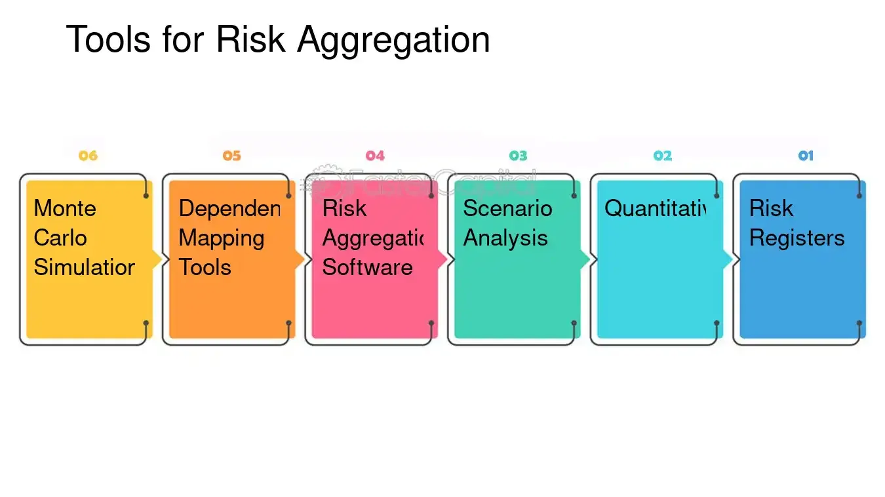

## Table of Contents

## What is aggregate risk?

Aggregate risk is the total amount of risk a person, company, or financial institution faces from all sources at the same time. It's like looking at the big picture of all the possible problems that could happen together, instead of just focusing on one thing. For example, a bank might look at the aggregate risk from all its loans to see how much trouble it could be in if many people couldn't pay back their loans at once.

Understanding aggregate risk is important because it helps people and businesses make better decisions. If a company knows its total risk, it can take steps to reduce it, like spreading out its investments or buying insurance. This way, they can avoid big problems and keep their business safe. By managing aggregate risk, they can protect themselves from unexpected events that could hurt them financially.

## How does aggregate risk differ from individual risk?

Aggregate risk is like looking at all the possible problems that could happen at the same time. It's the total risk from everything added together. For example, if you own a store, aggregate risk would be the risk from not selling enough products, plus the risk of a fire, plus the risk of a big storm hitting your store, all at the same time. It's important because it helps you see the big picture of all the things that could go wrong together.

Individual risk, on the other hand, is just one specific problem you might face. It's like focusing on one piece of the puzzle. For example, if you're worried about a fire in your store, that's an individual risk. You might buy fire insurance to protect against that one risk. But if you only focus on individual risks, you might miss how they can add up and affect you all at once. That's why understanding both individual and aggregate risk is important for making smart decisions.

## What are common sources of aggregate risk?

Common sources of aggregate risk come from many places. For a business, it could be things like not selling enough products, problems with suppliers, or unexpected costs like repairs. For a person, it might include losing a job, getting sick, or having to pay for big repairs on a house or car. These risks can add up and create a big problem if they all happen at the same time.

Another source of aggregate risk is from the economy. If the economy is doing badly, it can affect many parts of life at once. For example, if there's a recession, people might lose their jobs, businesses might sell less, and the value of investments might go down. This can create a lot of stress and financial problems for everyone involved. Understanding these sources of risk can help people and businesses prepare better and protect themselves from big troubles.

## Can you provide examples of aggregate risk in different industries?

In the banking industry, aggregate risk can come from many loans not being paid back at the same time. If a bank lends money to a lot of people or businesses, and the economy gets bad, many of those loans might turn into bad debts. This can cause big problems for the bank because it won't get the money back that it expected. The bank also faces risks from changes in interest rates and from not having enough money to give out new loans. All these risks together make up the bank's aggregate risk.

In the construction industry, aggregate risk can come from delays in getting materials, workers not showing up, and bad weather all happening at the same time. If a construction company is building a big project and it can't get the materials it needs, the project will be delayed. If workers also don't come to work and there's a big storm that stops work, the delays can get even worse. These problems can add up and make it hard for the company to finish the project on time and within budget. That's the company's aggregate risk.

In the healthcare industry, aggregate risk can come from not having enough staff, a sudden increase in patients, and problems with medical equipment all at once. If a hospital doesn't have enough nurses and doctors, and then a lot of people get sick at the same time, it can be hard to take care of everyone. If the medical equipment also breaks down, it makes the situation even worse. These risks together can make it difficult for the hospital to provide good care and can lead to big financial problems. That's the hospital's aggregate risk.

## How is aggregate risk measured?

Measuring aggregate risk involves looking at all the different risks a person or business faces and adding them up to see the total risk. This can be done by using numbers and data to figure out how likely each risk is to happen and how bad it would be if it did happen. For example, a business might look at the chance of not selling enough products, the chance of a fire, and the chance of a big storm, and then add up all those chances to see the total risk it faces.

To make this easier, people often use special tools and methods. One common way is to use something called a risk matrix, which is like a chart that shows how likely each risk is and how bad it would be. Another way is to use computer programs that can do a lot of math quickly and help figure out the total risk. By using these tools, people can get a good idea of their aggregate risk and make better plans to handle it.

## What are the key factors that influence aggregate risk?

Aggregate risk is influenced by many things. One big factor is how much a person or business depends on other people or businesses. For example, if a company relies on one supplier for all its materials, it has a higher risk if that supplier has problems. Another factor is the economy. If the economy is doing badly, it can make many risks worse at the same time. For example, if people lose their jobs, they might not buy as much, which can hurt businesses.

Another key factor is how well a person or business can handle unexpected problems. If they have a lot of money saved up or good insurance, they can handle risks better. Also, how much they know about their risks matters. If they understand their risks well, they can plan better and take steps to reduce them. All these factors together can make aggregate risk higher or lower.

## What strategies can be used to manage or mitigate aggregate risk?

One way to manage aggregate risk is by spreading out your risks. This means not putting all your eggs in one basket. For example, a business can have more than one supplier for its materials, so if one supplier has a problem, the business can still get what it needs from another. People can also spread out their money by investing in different things, like stocks, bonds, and real estate. This way, if one investment does badly, the others might still do well and help balance things out.

Another strategy is to have a plan for when things go wrong. This means having enough money saved up or having good insurance to cover unexpected costs. For example, a business might have an emergency fund to help it keep going if sales drop suddenly. People can also have insurance for things like health, car, and home to help pay for big problems if they happen. By planning ahead, people and businesses can handle risks better and avoid big troubles.

Understanding your risks is also important. This means knowing what could go wrong and how likely it is to happen. By keeping track of risks and watching for changes, people and businesses can take action before small problems turn into big ones. For example, a business might keep an eye on the economy and be ready to change its plans if things start to go badly. By staying informed and being ready to act, people and businesses can manage their aggregate risk better.

## How does diversification affect aggregate risk?

Diversification helps lower aggregate risk by spreading it out. Imagine you have a bunch of different things you're doing, like having different jobs or investing in different companies. If one of those things goes wrong, it won't hurt you as much because you have other things that can still be okay. For example, if you have money in many different stocks and one stock goes down, the others might still go up and help balance things out. This way, the total risk you face is less because you're not relying on just one thing.

By spreading out your risks, you make it less likely that everything will go wrong at the same time. If a business has many suppliers instead of just one, it can still get what it needs even if one supplier has a problem. This helps the business keep running smoothly even when things get tough. Diversification is like having a safety net that catches you if you fall, making your overall risk smaller and easier to handle.

## What role does insurance play in managing aggregate risk?

Insurance is like a safety net that helps people and businesses handle big problems without getting hurt too badly. When you buy insurance, you pay a little bit of money regularly, and in return, the insurance company promises to help you if something bad happens. For example, if your house burns down, home insurance can help you pay for repairs or a new place to live. This way, you don't have to worry about losing everything if a big problem comes up. Insurance helps lower your aggregate risk by covering the costs of unexpected events, so you can focus on other things without being too worried.

Having insurance can also make it easier to plan for the future. When you know that insurance will help you if something goes wrong, you can feel more confident about taking risks and trying new things. For example, a business might be more willing to expand if it knows it has insurance to cover any big problems that might come up. By spreading out the risk between you and the insurance company, insurance helps make your total risk smaller and more manageable. This way, you can keep moving forward without being too scared of what might happen.

## How do regulatory frameworks address aggregate risk?

Regulatory frameworks help manage aggregate risk by setting rules that businesses and financial institutions have to follow. These rules are made by government agencies to make sure that companies don't take too many risks at once. For example, banks have to follow rules about how much money they can lend and how much they need to keep in reserve. This helps prevent them from getting into big trouble if a lot of people can't pay back their loans at the same time. By making sure that businesses spread out their risks and don't take on too much, regulatory frameworks help keep the economy stable and protect people from big problems.

Regulators also keep an eye on the economy to spot any big risks that might be building up. They do this by collecting data and watching how different parts of the economy are doing. If they see that a lot of businesses are taking on too much risk, they might change the rules to make things safer. For example, they might tell banks to hold more money in reserve or to be more careful about who they lend to. By keeping track of aggregate risk and making changes when needed, regulatory frameworks help prevent big problems from happening and keep everyone safer.

## What are the latest models and technologies used in assessing aggregate risk?

The latest models and technologies used to assess aggregate risk are getting really smart and helpful. One big thing people use now is something called machine learning. This is like a computer that can learn from a lot of data and find patterns that people might miss. For example, a bank might use machine learning to look at all its loans and see if there are any signs that a lot of people might not pay back their loans at the same time. This helps the bank understand its total risk better and make smarter decisions.

Another cool technology is called big data analytics. This means using a lot of information from different places to see the big picture of risk. For example, a company might look at data from its sales, the economy, and even social media to see all the risks it faces. By putting all this information together, the company can see how different risks might add up and affect it. This helps them plan better and be ready for any big problems that might come up.

## How does global economic integration impact aggregate risk?

Global economic integration means that countries and businesses around the world are more connected than ever before. This can make aggregate risk bigger because problems in one place can quickly spread to others. For example, if a big company in one country has trouble, it can affect its suppliers and customers in other countries. This can lead to a chain reaction where a lot of people and businesses face problems at the same time. So, when the world is more connected, the total risk that everyone faces can grow because troubles can spread faster and affect more people.

But global economic integration can also help manage aggregate risk in some ways. When countries and businesses work together, they can share information and resources to deal with problems better. For example, if there's a big economic problem in one country, other countries might help by lending money or sharing ideas on how to fix things. This can make it easier to handle big problems and keep them from getting worse. So, while global economic integration can make aggregate risk bigger, it can also help people and businesses work together to manage it better.

## What are effective financial risk management strategies?

Effective financial risk management in algorithmic trading involves implementing strategies that safeguard investments and optimize returns. To establish a robust risk management framework, investors must define clear investment goals and assess their risk tolerance. Investment goals should align with an investor's financial objectives, such as capital preservation, income generation, or capital appreciation. Risk tolerance refers to an investor's ability and willingness to endure portfolio volatility without deviating from their financial trajectory. Both factors are critical in shaping a coherent investment strategy that withstands market fluctuations and systemic changes.

Diversification is a cornerstone strategy in mitigating risk exposure, involving spreading investments across various asset classes, geographies, and sectors to reduce unsystematic risk. The underlying principle of diversification is that the performance of different assets in a portfolio will not be perfectly correlated, thereby reducing volatility and potential losses. Modern portfolio theory advocates for diversification through mean-variance optimization, which involves selecting a mix of assets that maximize expected returns for a given level of risk.

Investment strategies such as stop-loss orders and dynamic position sizing are essential for controlling downside risk. Stop-loss orders are predetermined levels at which a trade is automatically exited to limit losses if the market moves unfavorably. For instance, a trader might set a stop-loss order at 5% below the purchase price of a stock to manage potential losses. Dynamic position sizing, on the other hand, involves adjusting the size of positions based on the risk and return characteristics of each trade. This technique often utilizes the Kelly Criterion, which suggests the optimal size of a series of bets to maximize logarithmic wealth:

$$
f^* = \frac{bp - q}{b}
$$

where $f^*$ is the fraction of the capital to bet, $b$ is the odds received on the wager, $p$ is the probability of winning, and $q$ is the probability of losing ($q = 1 - p$). This formula aids traders in determining the appropriate position size based on their forecasts and market conditions.

Hedging strategies play a pivotal role in reducing the adverse effects of price movements on a portfolio. A hedge typically involves taking an offsetting position in a related security, such as a derivatives contract, to counterbalance potential losses. Common hedging instruments include options, futures, and swap agreements. For instance, an equity portfolio manager might use index options to hedge against market downturns, purchasing put options on a relevant index to protect against declines.

Quantitative risk techniques employ statistical and mathematical models to measure and predict risk, enabling traders to make informed decisions. Techniques such as Value at Risk (VaR) and Conditional Value at Risk (CVaR) quantify potential losses over a specified period for a given confidence interval. VaR models help estimate the maximum expected loss, while CVaR provides an average loss measurement beyond the VaR threshold. These approaches furnish traders with insights into the risk profile of their portfolios, informing risk-adjusted investment decisions.

Overall, effective risk management in algorithmic trading systems integrates strategic planning, robust analytics, and continuous monitoring, empowering traders to navigate financial markets with precision and resilience.

## What are the tools and techniques for real-time risk monitoring?

Value at Risk (VaR) models and stress testing are integral tools in monitoring financial risk, especially within the fast-paced environment of algorithmic trading. VaR provides a quantifiable measure of potential loss in a portfolio over a given time frame, under normal market conditions, at a certain confidence level. Mathematically, VaR is often represented as:

$$
\text{VaR}_{\alpha}(X) = \inf \{ x \in \mathbb{R} : P(X \leq x) \geq \alpha \}
$$

where $\alpha$ is the confidence level, typically set at 95% or 99%. Despite its utility, VaR has limitations; it does not predict extreme losses beyond the specified confidence level. This is where stress testing complements VaR by simulating the effects of unusual market conditions, thereby helping traders understand potential market behavior under extreme scenarios.

Real-time analytics dashboards play a crucial role in tracking portfolio performance, enabling traders to visualize and interpret data swiftly. These dashboards aggregate complex data into comprehensible formats, often utilizing advanced data visualization techniques. They offer insights into market trends, volatility, and potential risk conditions. Implementing a real-time analytics dashboard can be done using open-source platforms such as Kibana or custom software solutions utilizing libraries like Plotly in Python.

```python
import plotly.express as px
import pandas as pd

# Sample data
data = pd.DataFrame({
    "Time": pd.date_range(start='1/1/2023', periods=100, freq='H'),
    "Portfolio Value": 1000000 + (pd.Series(range(100)) * pd.Series(range(100)).apply(lambda x: x**1.5))
})

# Line chart visualization
fig = px.line(data, x='Time', y='Portfolio Value', title='Real-Time Portfolio Performance')
fig.show()
```

Automated alert systems are designed to notify traders of potential risks as they arise, providing timely intervention capabilities. These alerts can be configured to trigger based on pre-determined thresholds or pattern recognition, known as anomaly detection. By employing automated alerts, traders can respond swiftly to mitigate losses or capitalize on market opportunities.

Machine learning enhances risk detection by identifying complex patterns and relationships within large datasets that traditional methods might overlook. Algorithms such as decision trees, neural networks, and ensemble methods like random forests are deployed to detect anomalies and predict market movements with increased accuracy. For instance, a [neural network](/wiki/neural-network) can be trained to predict market volatility using historical price data:

```python
from sklearn.neural_network import MLPRegressor
from sklearn.model_selection import train_test_split
import numpy as np

# Generating synthetic data
X = np.random.rand(1000, 10)   # Features
y = np.random.rand(1000)       # Target

# Split data into training and testing sets
X_train, X_test, y_train, y_test = train_test_split(X, y, test_size=0.2)

# Neural network model
model = MLPRegressor(hidden_layer_sizes=(100,), activation='relu', solver='adam', max_iter=500)
model.fit(X_train, y_train)

# Predict volatility
predictions = model.predict(X_test)
```

The integration of these tools and techniques allows for a dynamic approach to risk management, enabling traders to navigate rapidly changing market conditions with precision. The combination of analytics, automation, and [machine learning](/wiki/machine-learning) forms a robust framework that can significantly enhance the risk detection capabilities of algorithmic trading systems.

## References & Further Reading

[1]: Bergstra, J., Bardenet, R., Bengio, Y., & Kégl, B. (2011). ["Algorithms for Hyper-Parameter Optimization."](https://dl.acm.org/doi/10.5555/2986459.2986743) Advances in Neural Information Processing Systems 24.

[2]: ["Advances in Financial Machine Learning"](https://www.amazon.com/Advances-Financial-Machine-Learning-Marcos/dp/1119482089) by Marcos Lopez de Prado

[3]: ["Evidence-Based Technical Analysis: Applying the Scientific Method and Statistical Inference to Trading Signals"](https://www.amazon.com/Evidence-Based-Technical-Analysis-Scientific-Statistical/dp/0470008741) by David Aronson

[4]: ["Machine Learning for Algorithmic Trading"](https://github.com/stefan-jansen/machine-learning-for-trading) by Stefan Jansen

[5]: ["Quantitative Trading: How to Build Your Own Algorithmic Trading Business"](https://www.amazon.com/Quantitative-Trading-Build-Algorithmic-Business/dp/1119800064) by Ernest P. Chan