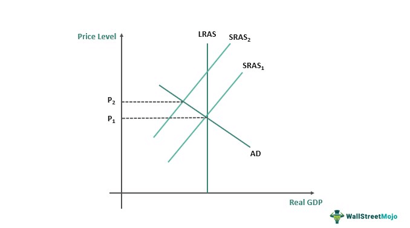

In the ever-evolving world of economics and trading, comprehending key concepts such as aggregate supply, economic theories, and algorithmic trading is essential for navigating modern markets. Aggregate supply, a core element of macroeconomics, reflects the relationship between the price level in an economy and the amount of goods and services produced. This component provides insights into how economies respond to various stimuli, including changes in policy and external economic conditions.

Economic theories offer the frameworks necessary to interpret the dynamics of aggregate supply and its interaction with other economic variables. Theoretical perspectives, ranging from classical to Keynesian economics, offer varying views on the factors influencing aggregate supply and its role within the broader economic system. These theories assist in understanding the complexities of economic behavior and in formulating effective policy measures aimed at promoting economic stability and growth.

In recent years, algorithmic trading has emerged as a transformative force within financial markets. Utilized by traders and institutions to execute orders at speeds and frequencies beyond human capabilities, algorithmic trading affects market dynamics, including liquidity and volatility. The integration of complex algorithms in trading practices necessitates a re-evaluation of regulatory frameworks to mitigate potential systemic risks.

By exploring these interconnected components, this article aims to provide a comprehensive understanding of how aggregate supply, economic theories, and algorithmic trading interact and shape today's economic landscape. The goal is to equip readers with the knowledge necessary for practical application in real-world settings. Let us therefore examine the multifaceted world of aggregate supply, economic theory, and algorithmic trading and consider their significant roles in modern economic systems.

## Table of Contents

## Understanding Aggregate Supply

Aggregate supply (AS) is a fundamental concept in economics that denotes the total output of goods and services that producers are prepared to supply in an economy at a given overall price level. This key economic determinant underscores the crucial relationship between the price level and the real output or quantity of goods and services produced. 

The positive relationship between price level and aggregate supply is traditionally illustrated by the aggregate supply curve, which slopes upwards. This upward slope indicates that as prices rise, producers are generally motivated to increase output to capitalize on potential higher profits. Mathematically, this relationship can be expressed as:

$$
Q_s = f(P, L, T, G)
$$

where $Q_s$ represents the quantity of goods and services supplied, $P$ indicates the price level, $L$ denotes labor force characteristics, $T$ signifies technological innovations, and $G$ stands for government policies.

**Factors Influencing Aggregate Supply:**

1. **Labor Force Characteristics:** The availability and quality of labor significantly affect aggregate supply. An increase in the labor force, a rise in skill levels, or improved labor productivity can enhance the aggregate supply. Changes in demographics and education also play essential roles in shaping labor characteristics.

2. **Technological Innovations:** Advancements in technology can drastically impact aggregate supply. Innovations often lead to more efficient production processes, reducing costs and increasing output. Historical instances, such as the Industrial Revolution and the digital revolution, have shown profound impacts on aggregate supply by transforming production capabilities.

3. **Government Policies:** The role of government policies cannot be overstated in influencing aggregate supply. Policies that affect business operations, the regulatory environment, tax policies, and subsidies can either encourage or hinder production. For example, tax reductions can increase disposable income and investment in business activities, thus boosting aggregate supply.

Understanding aggregate supply is pivotal for policymakers who aim to create conditions conducive to economic growth, stability, and efficiency. Adjustments in fiscal policy, monetary policy, and structural reforms are often predicated on a thorough analysis of aggregate supply factors. A well-informed approach to managing these components can aid in steering the economy towards sustained growth and stability.

## Economic Theories Influencing Aggregate Supply

Economic theory provides a crucial framework for comprehending how aggregate supply operates within the broader economy. Three major theoretical perspectives offer insights into the determinants and implications of aggregate supply: supply-side economics, Keynesian economics, and classical economic theory.

Supply-side economics advocates for policy measures that enhance production capacity and remove obstacles to supply. This school of thought emphasizes the role of private enterprise and market incentives in increasing output. According to supply-side theorists, reducing taxes and regulations can spur investment, foster innovation, and ultimately expand the productive capacity of the economy. By focusing on factors such as labor market flexibility and technological advancement, supply-side policies aim to shift the aggregate supply curve to the right, thereby increasing the total goods and services available in the economy.

In contrast, the Keynesian perspective highlights the influence of demand-side factors on aggregate supply, particularly in the short run. Keynesians argue that aggregate demand fluctuations can impact output levels and, consequently, aggregate supply. During periods of low demand, for instance, businesses may reduce production, leading to lower aggregate supply. Keynesians advocate for government intervention through fiscal and monetary policies to manage demand and stabilize economic output. By addressing demand shortfalls, Keynesian approaches indirectly affect aggregate supply by encouraging businesses to maintain or increase production capacity.

Classical economic theory, on the other hand, posits that in the long run, aggregate supply is determined by productivity and capacity rather than price levels. Classical economists believe that supply is largely driven by factors such as technology, labor force growth, and capital accumulation. They assert that the economy operates near full employment in the long run, wherein price level changes do not significantly alter output. Instead, improvements in productivity and resource allocation are considered key drivers in shifting the long-run aggregate supply curve.

These theories provide a comprehensive foundation for analyzing potential impacts of policy changes on the economy. Policymakers often draw upon elements from each theoretical perspective to devise strategies that target both short-term economic stability and long-term growth. By understanding the interactions between these economic theories and aggregate supply, given policy decisions can be more effectively tailored to navigate diverse economic conditions.

These theoretical perspectives facilitate a nuanced understanding of aggregate supply dynamics, fostering better-informed macroeconomic policy-making.

## Algorithmic Trading and Its Impact on Economics

Algorithmic trading, commonly referred to as 'algo trading', utilizes computer algorithms to execute trades with precision and speed based on predetermined criteria. This method has revolutionized financial markets by significantly increasing the pace and [volume](/wiki/volume-trading-strategy) of trading activities, thereby impacting the dynamics of supply and demand.

The primary advantage of [algorithmic trading](/wiki/algorithmic-trading) is its ability to enhance market [liquidity](/wiki/liquidity-risk-premium). By providing continuous buy and sell orders, algorithms facilitate smoother transactions and tighter bid-ask spreads, leading to a more efficient price discovery process. The rapid execution of trades allows markets to react quickly to new information, incorporating changes into prices faster than human traders could manage.

However, this speed also has the potential to heighten market [volatility](/wiki/volatility-trading-strategies). In scenarios where numerous algorithms trigger trades concurrently, it can result in drastic price swings within short periods, often referred to as 'flash crashes'. These sudden movements raise concerns about market stability, as they can lead to extreme short-term price variances unrelated to underlying economic fundamentals.

Algorithmic trading also necessitates new regulatory considerations. Traditional regulatory frameworks may not be adequate to address the complexities introduced by automated trading systems. Regulators need to assess algorithmic trading's impact on market fairness and transparency, ensuring that it does not inadvertently contribute to systemic risks. Potential regulatory measures include mandating more stringent risk management practices for trading firms and enhancing monitoring systems to detect abnormal trading activities.

For investors and policymakers, understanding the economic implications of algorithmic trading is crucial. Investors can leverage algorithm-driven insights to optimize their portfolios, while policymakers must consider how these technologies reshape market dynamics. The growing prevalence of algorithmic trading calls for adaptive regulations that safeguard financial stability while fostering innovation.

In conclusion, while algorithmic trading offers notable efficiencies and advancements to financial markets, it also presents challenges that necessitate thoughtful regulation and keen awareness of its broader economic impacts.

## The Intersection of Economic Theory and Algo Trading

The intersection of economic theory and algorithmic trading presents both challenges and opportunities in contemporary markets. Algorithmic trading, by leveraging computational power, can apply economic theories to optimize supply chains and improve market efficiencies. This includes the application of game theory for strategic decision-making and optimization models to enhance trading strategies.

Incorporating economic models into trading algorithms allows for precise predictions of market trends. Algorithms can be designed to interpret economic indicators such as interest rates, unemployment [statistics](/wiki/bayesian-statistics), and inflation rates, integrating this data into trading strategies to forecast price movements with greater accuracy. For example, algorithms can utilize [machine learning](/wiki/machine-learning) techniques to recognize patterns in large data sets, thereby refining the models that predict market behavior.

However, the discrepancies between theoretical models and real-world data can lead to systemic risks. Economic models often rely on assumptions that may not hold true in dynamic market conditions, such as rational behavior of [agents](/wiki/agents) or efficient markets. Algorithmic trading systems may react to erroneous signals, leading to unintended market consequences such as flash crashes or liquidity issues. A notable example is the Flash Crash of 2010, where automated trading systems exaggerated rapid price fluctuations.

To mitigate these risks, a comprehensive approach that integrates economic theory with advanced technological trading mechanisms can improve market stability and efficiency. By adopting adaptive algorithms that can modify themselves based on real-time data and feedback, market stability can be enhanced. These algorithms should be tested rigorously in simulated environments to assess their performance in diverse market conditions.

Moreover, regulatory frameworks need to be established to monitor and guide the development and deployment of these trading systems. These should ensure that algorithmic trading does not undermine market integrity and that systemic risks are minimized.

In summary, the fusion of economic theory with algorithmic trading technologies can potentially yield a more stable and efficient market environment, but it requires careful consideration of theoretical assumptions, real-world data discrepancies, and regulatory oversight. The ongoing evolution of this area promises enhancements in trading dynamics and more predictive economic modeling.

## Conclusion

Aggregate supply, economic theory, and algorithmic trading are interconnected elements that shape today's economic landscape. Together, they form a complex mosaic that influences not only how markets operate but also how economic policies are formulated. A thorough understanding of aggregate supply and related economic theories provides foundational insight into the functioning of economies. This understanding facilitates the identification of key factors driving economic output and the development of policies aimed at enhancing production and efficiency.

Algorithmic trading introduces an intricate layer to these economic interactions, playing a pivotal role in influencing market dynamics and policy decisions. By automating the execution of trades, algorithmic trading can significantly alter supply-demand equilibria in financial markets. It enhances market liquidity and accelerates price discovery, yet it can also introduce systemic risks, especially under volatile conditions. This dual nature necessitates vigilant regulatory frameworks to ensure stability.

The synergy between aggregate supply, economic theories, and algorithmic trading underscores the importance of integrated approaches for achieving economic stability and growth. By aligning technological advancements with robust economic principles, policymakers and market participants can better manage risks and leverage opportunities. This alignment is crucial for maintaining economic equilibrium and fostering sustainable growth.

As we move forward, continued research and adaptation in these fields will be crucial for navigating future challenges in global markets. Emerging technologies and evolving economic paradigms will present new avenues for inquiry and innovation. A commitment to integrating insights from aggregate supply models, economic theories, and algorithmic trading strategies will be essential for effectively addressing the complex challenges of tomorrow's economic landscape.

## References & Further Reading

[1]: ["Macroeconomics"](https://www.investopedia.com/terms/m/macroeconomics.asp) by Paul Krugman and Robin Wells

[2]: Mankiw, N. G. (2014). ["Principles of Economics."](https://faculty.cengage.com/titles/9780357038314) Cengage Learning.

[3]: Carlin, B. P., Gelfand, A. E., & Smith, A. F. (1992). ["Hierarchical Bayesian analysis of change point problems."](https://www.jstor.org/stable/2347570) The Annals of Statistics, 20(1), 176-199.

[4]: Allen, F., & Karjalainen, R. (1999). ["Using genetic algorithms to find technical trading rules."](https://www.sciencedirect.com/science/article/pii/S0304405X9800052X) Journal of Financial Economics, 51(2), 245-271.

[5]: Black, F., & Scholes, M. (1973). ["The Pricing of Options and Corporate Liabilities."](https://www.cs.princeton.edu/courses/archive/fall09/cos323/papers/black_scholes73.pdf) Journal of Political Economy, 81(3), 637-654.

[6]: Bodie, Z., Kane, A., & Marcus, A. J. (2020). ["Investments"](https://www.mheducation.com/highered/product/Investments-Bodie.html) (12th ed.). McGraw-Hill Education.

[7]: Chordia, T., Roll, R., & Subrahmanyam, A. (2001). ["Market Liquidity and Trading Activity."](https://www.jstor.org/stable/222572) The Journal of Finance, 56(2), 501-530.

[8]: Fama, E. F. (1970). ["Efficient Capital Markets: A Review of Theory and Empirical Work."](https://www.jstor.org/stable/2325486?read-now=1) Journal of Finance, 25(2), 383-417.

[9]: Hendershott, T., Jones, C. M., & Menkveld, A. J. (2011). ["Does Algorithmic Trading Improve Liquidity?"](https://onlinelibrary.wiley.com/doi/full/10.1111/j.1540-6261.2010.01624.x) The Journal of Finance, 66(1), 1-33.

[10]: Lo, A. W., & MacKinlay, A. C. (1999). ["A Non-Random Walk Down Wall Street."](https://www.jstor.org/stable/j.ctt7tccx) Princeton University Press.