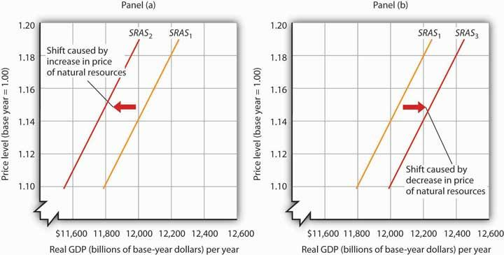

## Table of Contents

## What is aggregate supply?

Aggregate supply is the total amount of goods and services that producers in an economy are willing and able to sell at different price levels during a specific time period. It shows how much output an economy can produce as prices change. When prices are high, producers are often willing to produce more because they can make more profit. On the other hand, when prices are low, producers might not want to produce as much because their profits are smaller.

The aggregate supply curve is a graph that shows this relationship between the overall price level and the total output of an economy. In the short run, the curve can slope upward because costs of production, like wages, might not change immediately with prices. However, in the long run, the curve can be vertical because all costs adjust to the price level, and the economy produces at its full potential, which is determined by factors like technology and the available workforce.

## How is aggregate supply different from aggregate demand?

Aggregate supply and aggregate demand are two important parts of understanding how an economy works. Aggregate supply is all about how much stuff businesses are willing to make and sell at different prices. When prices go up, businesses often want to produce more because they can make more money. But if prices go down, they might make less because they won't earn as much. It's like how a lemonade stand might make more lemonade if they can sell it for a higher price.

On the other hand, aggregate demand is about how much stuff people want to buy at different price levels. It includes what people, businesses, and the government want to spend money on. When prices are low, people usually want to buy more things because they can afford it. But when prices go up, they might buy less because things are too expensive. It's like how more people might buy lemonade if it's cheaper, but fewer people will buy it if the price goes up a lot.

These two forces work together to find a balance in the economy. When aggregate supply and aggregate demand meet, it sets the overall price level and the amount of stuff produced in the economy. If they don't match up right, it can lead to problems like inflation or unemployment.

## What are the main components of aggregate supply?

Aggregate supply is made up of different parts that help decide how much stuff businesses want to make and sell. One big part is the cost of making things, like paying workers or buying materials. If these costs go up, businesses might not want to make as much because it's more expensive for them. Another part is technology. Better technology can help businesses make more stuff without spending more money, so they might want to produce more. The last part is the number of workers available. If there are lots of workers, businesses can make more things, but if there aren't enough workers, they might make less.

These parts all work together to affect how much businesses are willing to produce. For example, if the cost of making things goes down because of new technology, and there are lots of workers ready to work, businesses might want to produce a lot more. But if costs go up and there aren't enough workers, they might not want to produce as much. So, the total amount of goods and services that businesses are willing to sell depends on these different parts working together.

## How does the short-run aggregate supply curve differ from the long-run aggregate supply curve?

The short-run aggregate supply (SRAS) curve shows how much stuff businesses want to make and sell when prices change, but some costs like wages don't change right away. Imagine a factory that makes toys. If the price of toys goes up, the factory might want to make more toys to make more money, even if they have to pay the same amount for workers and materials. So, the SRAS curve slopes upward, meaning businesses produce more when prices are higher because their costs haven't caught up yet.

The long-run aggregate supply (LRAS) curve is different because it shows what happens after all costs, like wages, have time to adjust to the new prices. In the long run, if the price of toys goes up, the workers might ask for more money because they see that the factory is making more profit. Once all costs go up to match the higher prices, the factory won't want to make more toys just because the price went up. The LRAS curve is vertical, meaning the amount of stuff produced depends on things like technology and the number of workers, not just the price.

## What factors can shift the aggregate supply curve?

Changes in things like the cost of making stuff, new technology, and the number of workers can move the aggregate supply curve. If it costs less to make things, like if the price of materials goes down or workers agree to work for less money, businesses might want to produce more. That means the aggregate supply curve would move to the right, showing that businesses are willing to sell more at every price level. On the other hand, if it gets more expensive to make things, like if the price of oil goes up or wages increase, businesses might not want to produce as much. Then the curve would move to the left, showing less stuff being made at every price level.

Technology also plays a big role. If there are new inventions or better ways to make things, businesses can produce more without spending more money. This would push the aggregate supply curve to the right. But if technology gets worse or old machines break down and can't be fixed easily, it might be harder to make stuff, and the curve would move to the left. The number of workers available is another factor. If there are more people ready to work, businesses can make more things, moving the curve to the right. But if there's a shortage of workers, like if a lot of people retire or leave the country, businesses might struggle to produce as much, shifting the curve to the left.

## How do changes in input prices affect aggregate supply?

Changes in input prices, like the cost of materials or wages, can really change how much businesses want to make and sell. If the price of inputs goes down, it's cheaper for businesses to make things. Imagine a bakery that uses flour to make bread. If the price of flour drops, the bakery can make more bread without spending more money. This means they might want to produce more bread and sell it at every price level. So, when input prices go down, the aggregate supply curve moves to the right, showing that businesses are willing to make and sell more stuff.

On the other hand, if input prices go up, it becomes more expensive for businesses to make things. Using the same bakery example, if the price of flour goes up, it costs more to make bread. The bakery might not want to make as much bread because it's not as profitable. This means they'll produce less at every price level. So, when input prices go up, the aggregate supply curve moves to the left, showing that businesses are willing to make and sell less stuff.

## What role do technological advancements play in aggregate supply?

Technological advancements help businesses make more stuff without spending more money. Think of a factory that makes cars. If they get a new machine that can build cars faster and better, they can make more cars in the same amount of time. This means they might want to produce more cars because it's easier and cheaper for them. So, when technology gets better, the aggregate supply curve moves to the right, showing that businesses are willing to make and sell more stuff at every price level.

But if technology gets worse or old machines break down and can't be fixed easily, it might be harder for businesses to make things. Using the same car factory example, if their old machines stop working and they can't get new ones, they won't be able to make as many cars. This means they'll produce less at every price level. So, when technology gets worse, the aggregate supply curve moves to the left, showing that businesses are willing to make and sell less stuff.

## How does government policy influence aggregate supply?

Government policy can change how much stuff businesses want to make and sell. If the government gives businesses tax breaks or subsidies, it can make it cheaper for them to produce things. Imagine a company that makes solar panels. If the government gives them money to help with costs, they might want to make more solar panels because it's easier for them to make a profit. This would move the aggregate supply curve to the right, showing that businesses are willing to make and sell more stuff at every price level. On the other hand, if the government raises taxes or puts new rules on businesses, it can make it more expensive or harder for them to produce things. If the solar panel company has to pay more taxes, they might not want to make as many panels because it's not as profitable. This would move the aggregate supply curve to the left, showing that businesses are willing to make and sell less stuff.

Another way government policy can affect aggregate supply is through spending on things like education and infrastructure. If the government spends more money on schools and roads, it can help businesses by giving them a better-educated workforce and better ways to move their products. This can make it easier for businesses to produce more stuff, moving the aggregate supply curve to the right. But if the government cuts spending in these areas, it might be harder for businesses to find skilled workers or get their products to market, which could move the aggregate supply curve to the left. So, government policies can have a big impact on how much businesses are willing to produce and sell.

## What is the relationship between aggregate supply and economic growth?

Aggregate supply is all about how much stuff businesses want to make and sell. When businesses make more stuff, it can help the whole economy grow. If businesses can make things cheaper or faster because of new technology or lower costs, they might want to produce more. This means more goods and services are available, which can lead to more jobs and more money for people to spend. So, when aggregate supply goes up, it can help the economy grow because there's more stuff being made and sold.

But if it gets harder for businesses to make things, like if costs go up or there's not enough workers, they might not want to produce as much. This can slow down the economy because there's less stuff being made and sold. When aggregate supply goes down, it can lead to fewer jobs and less money for people to spend, which can make the economy grow slower. So, the amount of stuff businesses are willing to make and sell, or aggregate supply, is really important for how fast the economy grows.

## How do economists measure and analyze aggregate supply?

Economists measure and analyze aggregate supply by looking at how much stuff businesses want to make and sell at different price levels. They use something called the aggregate supply curve, which is a graph that shows the relationship between the overall price level and the total amount of goods and services produced in the economy. To draw this curve, economists gather data on things like the cost of making stuff, how much technology businesses have, and how many workers are available. They use this data to figure out how much businesses would produce if prices were high or low.

To analyze changes in aggregate supply, economists look at what can make the curve move. If the cost of making things goes down, or if there's new technology that helps businesses make more stuff, the curve moves to the right, showing that businesses want to produce more at every price level. But if costs go up or technology gets worse, the curve moves to the left, showing that businesses want to produce less. By studying these shifts, economists can understand how changes in the economy affect how much stuff is made and sold, which helps them predict things like economic growth and inflation.

## What are the implications of aggregate supply shocks on the economy?

When something unexpected happens that changes how much stuff businesses want to make and sell, we call it an aggregate supply shock. Imagine a big storm hits and destroys a lot of factories. Suddenly, businesses can't make as much stuff because their machines are broken. This is a negative supply shock, and it makes the aggregate supply curve move to the left. Prices might go up because there's less stuff to buy, and it can lead to inflation. People might also lose their jobs because businesses aren't making as much, which can slow down the economy.

But sometimes, good things can happen too. If a new technology comes out that makes it easier and cheaper for businesses to make things, it's a positive supply shock. The aggregate supply curve moves to the right because businesses want to make more stuff. Prices might go down because there's more stuff to buy, and it can help the economy grow. More people might get jobs because businesses are making more things, which means more money for everyone to spend. So, supply shocks can really shake things up in the economy, for better or worse.

## How can understanding aggregate supply help in predicting inflation and unemployment rates?

Understanding aggregate supply can help economists predict inflation and unemployment rates by showing how much stuff businesses want to make and sell. If something happens that makes it harder for businesses to produce things, like if the cost of materials goes up or a factory gets damaged, the aggregate supply goes down. This means there's less stuff to buy, so prices might go up, which is called inflation. At the same time, businesses might need fewer workers because they're not making as much, so unemployment can go up. By watching what affects aggregate supply, economists can guess if prices will go up and if more people might lose their jobs.

On the other hand, if something good happens that helps businesses make more stuff, like new technology or lower costs, the aggregate supply goes up. This means there's more stuff to buy, so prices might go down, which can help keep inflation in check. Also, businesses might need more workers because they're making more things, so unemployment can go down. By keeping an eye on what's helping or hurting aggregate supply, economists can predict if prices will stay stable and if more people will find jobs. So, understanding how much businesses want to produce is really important for figuring out what might happen with inflation and unemployment.

## What is Understanding Aggregate Supply?

Aggregate supply (AS) is a fundamental concept in economics that denotes the total output of goods and services that producers are prepared to supply in an economy at a given overall price level. This key economic determinant underscores the crucial relationship between the price level and the real output or quantity of goods and services produced. 

The positive relationship between price level and aggregate supply is traditionally illustrated by the aggregate supply curve, which slopes upwards. This upward slope indicates that as prices rise, producers are generally motivated to increase output to capitalize on potential higher profits. Mathematically, this relationship can be expressed as:

$$
Q_s = f(P, L, T, G)
$$

where $Q_s$ represents the quantity of goods and services supplied, $P$ indicates the price level, $L$ denotes labor force characteristics, $T$ signifies technological innovations, and $G$ stands for government policies.

**Factors Influencing Aggregate Supply:**

1. **Labor Force Characteristics:** The availability and quality of labor significantly affect aggregate supply. An increase in the labor force, a rise in skill levels, or improved labor productivity can enhance the aggregate supply. Changes in demographics and education also play essential roles in shaping labor characteristics.

2. **Technological Innovations:** Advancements in technology can drastically impact aggregate supply. Innovations often lead to more efficient production processes, reducing costs and increasing output. Historical instances, such as the Industrial Revolution and the digital revolution, have shown profound impacts on aggregate supply by transforming production capabilities.

3. **Government Policies:** The role of government policies cannot be overstated in influencing aggregate supply. Policies that affect business operations, the regulatory environment, tax policies, and subsidies can either encourage or hinder production. For example, tax reductions can increase disposable income and investment in business activities, thus boosting aggregate supply.

Understanding aggregate supply is pivotal for policymakers who aim to create conditions conducive to economic growth, stability, and efficiency. Adjustments in fiscal policy, monetary policy, and structural reforms are often predicated on a thorough analysis of aggregate supply factors. A well-informed approach to managing these components can aid in steering the economy towards sustained growth and stability.

## References & Further Reading

[1]: ["Macroeconomics"](https://www.investopedia.com/terms/m/macroeconomics.asp) by Paul Krugman and Robin Wells

[2]: Mankiw, N. G. (2014). ["Principles of Economics."](https://faculty.cengage.com/titles/9780357038314) Cengage Learning.

[3]: Carlin, B. P., Gelfand, A. E., & Smith, A. F. (1992). ["Hierarchical Bayesian analysis of change point problems."](https://www.jstor.org/stable/2347570) The Annals of Statistics, 20(1), 176-199.

[4]: Allen, F., & Karjalainen, R. (1999). ["Using genetic algorithms to find technical trading rules."](https://www.sciencedirect.com/science/article/pii/S0304405X9800052X) Journal of Financial Economics, 51(2), 245-271.

[5]: Black, F., & Scholes, M. (1973). ["The Pricing of Options and Corporate Liabilities."](https://www.cs.princeton.edu/courses/archive/fall09/cos323/papers/black_scholes73.pdf) Journal of Political Economy, 81(3), 637-654.

[6]: Bodie, Z., Kane, A., & Marcus, A. J. (2020). ["Investments"](https://www.mheducation.com/highered/product/Investments-Bodie.html) (12th ed.). McGraw-Hill Education.

[7]: Chordia, T., Roll, R., & Subrahmanyam, A. (2001). ["Market Liquidity and Trading Activity."](https://www.jstor.org/stable/222572) The Journal of Finance, 56(2), 501-530.

[8]: Fama, E. F. (1970). ["Efficient Capital Markets: A Review of Theory and Empirical Work."](https://www.jstor.org/stable/2325486?read-now=1) Journal of Finance, 25(2), 383-417.

[9]: Hendershott, T., Jones, C. M., & Menkveld, A. J. (2011). ["Does Algorithmic Trading Improve Liquidity?"](https://onlinelibrary.wiley.com/doi/full/10.1111/j.1540-6261.2010.01624.x) The Journal of Finance, 66(1), 1-33.

[10]: Lo, A. W., & MacKinlay, A. C. (1999). ["A Non-Random Walk Down Wall Street."](https://www.jstor.org/stable/j.ctt7tccx) Princeton University Press.