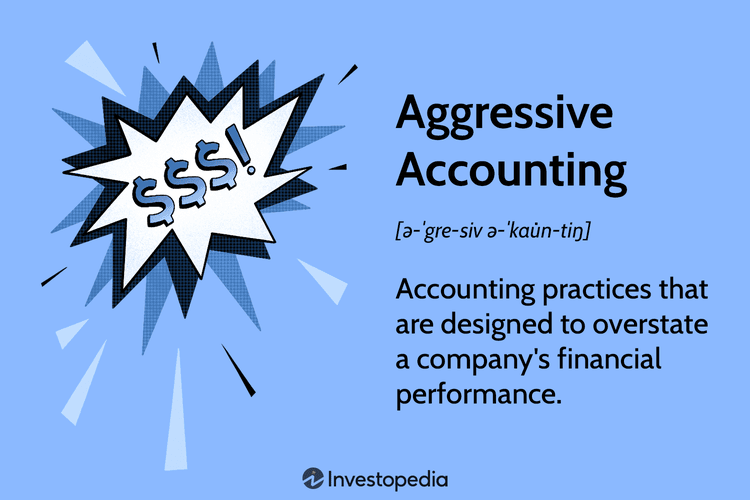

Aggressive accounting practices are developed to portray a company's financial performance more favorably than it actually is. These practices frequently involve the manipulation of financial data to inflate earnings or obscure expenses, thereby presenting an exaggerated image of financial health. While aggressive accounting shares similarities with creative accounting, it often crosses the boundaries of ethical norms, diverging significantly to mislead stakeholders intentionally.

This deceitful financial reporting can significantly affect market perception, creating an illusion of strong performance which may initially attract investors and boost stock prices. However, such practices, when uncovered, can severely damage investor trust and tarnish a company's reputation, possibly resulting in legal consequences. Regulatory bodies and market analysts highly scrutinize these deceptive methods, further raising the potential for penalties and loss of credibility.

This article examines how aggressive accounting interacts with financial reporting norms and its implications for market trust and regulatory compliance. By understanding these practices, stakeholders can better appreciate the risks and safeguard against the potential for financial misrepresentation.

## Table of Contents

## Understanding Aggressive Accounting

Aggressive accounting refers to the use of accounting techniques that adhere to the letter of legal standards but deviate from the intended ethical principles of financial reporting. These practices are often implemented with the aim of overstating a company's financial health and performance.

Common techniques employed in aggressive accounting include overstating revenue, inflating assets, and deferring expenses. Overstating revenue involves recognizing revenue prematurely, sometimes even before a transaction is finalized. For instance, a company might record future sales as current revenue, artificially boosting its present financial results. Inflating assets, another prevalent technique, involves manipulating asset values on the balance sheet, often through overvaluation of inventory or improper capitalization of expenses. Deferring expenses is the practice of postponing the recognition of costs, making current-period profits appear higher.

The primary goal of aggressive accounting is to present a more favorable financial picture than what truly exists. This is typically driven by the pressure to meet market expectations and shareholder demands. Investors, analysts, and other stakeholders often base their decisions on a company’s reported financial performance, incentivizing businesses to portray their financials in the best possible light.

However, despite potential short-term benefits such as boosted stock prices or improved access to financing, aggressive accounting poses significant long-term risks. These practices can undermine investor trust and lead to severe reputational damage if discovered. Once the true financial status is revealed, companies may face legal repercussions and regulatory actions, which can have devastating financial consequences. Thus, while aggressive accounting may provide immediate advantages, it often results in long-term harm to a company's integrity and stability.

## Techniques of Aggressive Accounting

Aggressive accounting techniques represent methods that, while adhering to the technical rules of accounting standards, often violate their intended purpose. One common approach is revenue manipulation by recognizing sales prematurely. This tactic involves recording sales transactions before the earnings process is complete, thereby inflating a company’s financial performance. For instance, a company might record sales as soon as an order is received, not when the product is delivered, creating an artificially enhanced revenue figure for the period.

Another technique includes overstating the value of inventory. Companies may inflate inventory figures on balance sheets to suggest a greater level of assets, thus enhancing perceived profitability. This is often achieved by neglecting to write down obsolete or unsellable inventory, which can artificially improve gross profit margins.

Deferring expenses to future periods is another tool used to make current profits appear higher than they truly are. By postponing the recognition of expenses, such as delaying the recording of advertising or maintenance costs, companies can temporarily boost their net income. This practice, however, can lead to a financial strain as these deferred expenses accumulate and must eventually be recognized.

Adjusting depreciation methods can also be utilized to reduce expenses and improve balance sheets. By employing a slower depreciation method, such as the straight-line method versus an accelerated method, companies can decrease the amount of depreciation expense recorded each year, thus improving short-term profitability metrics and asset valuations.

Channel stuffing is a specific tactic where companies inflate sales numbers by sending excessive products to distribution channels. This technique pushes unsold goods into the market, increasing current period sales while potentially creating problems for future sales periods if distributors return the unsold inventory.

These techniques reflect aggressive accounting strategies that prioritize surface-level financial improvement at the expense of ethical considerations and long-term stability. While tempting for short-term financial performance boosts, they often [carry](/wiki/carry-trading) risks that can lead to future financial misrepresentations and regulatory scrutiny.

## Examples of Aggressive Accounting

Enron became notorious for its use of special purpose entities (SPEs) to mask substantial amounts of debt from its balance sheet, providing a misleading picture of financial health. By exploiting accounting loopholes and insufficient regulatory frameworks, Enron could artificially inflate its profits and hide liabilities. The fallout from Enron's collapse in 2001 triggered widespread financial and reputational damage, impacting not only its employees and investors but also the auditing firm Arthur Andersen, which subsequently lost its accounting license. The scandal underscored the dangers of aggressive accounting practices, prompting increased scrutiny and regulatory reforms.

WorldCom's fraudulent activities centered on capitalizing operating expenses, thereby inflating its profitability on financial statements. By treating routine expenses as capital investments, WorldCom was able to present a distorted view of its financial performance, deceiving investors and analysts. The eventual exposure of these practices led to a historic bankruptcy filing in 2002, resulting in significant financial losses and legal consequences for its executives. This misrepresentation highlighted the risks of aggressive accounting and contributed to the drive for more stringent financial reporting laws.

Krispy Kreme, another illustrative case, engaged in aggressive accounting by prematurely recognizing revenue from equipment sales. This tactic allowed the company to inflate its sales figures and investor confidence. However, when these practices came to light, Krispy Kreme faced a precipitous decline in its stock price and a thorough investigation by regulators. The resulting fallout served as a reminder of how aggressive accounting can tarnish a company's reputation and erode investor trust.

The scandals involving Enron, WorldCom, and Krispy Kreme acted as catalysts for significant legislative changes, notably the Sarbanes-Oxley Act of 2002. This act introduced rigorous regulatory standards to enhance financial transparency and accountability within corporations. Key provisions of the Sarbanes-Oxley Act include increased accountability for company executives, stricter auditing requirements, and reinforced oversight of financial reporting processes.

These examples illustrate the potential ramifications of aggressive accounting, underscoring the importance of ethical standards and transparent financial practices. They remain cautionary tales in the business world, emphasizing the need for vigilance and integrity in financial reporting to safeguard against the allure of short-term gains at the expense of long-term sustainability and trust.

## Impact on Financial Reporting and Market Perception

Aggressive accounting, characterized by techniques that inflate financial performance figures, can initially alter market perception and elevate stock prices. This manipulation often creates a misleadingly positive outlook for the company, attracting investors and temporarily boosting financial metrics. However, once these practices are discovered, they can irreparably harm investor trust and tarnish a company's reputation. 

Regulatory bodies, such as the U.S. Securities and Exchange Commission (SEC), constantly monitor financial reporting for any forms of inaccuracies or deliberate misstatements. These bodies possess the authority to impose significant fines and penalties on companies that engage in deceptive financial practices, further exacerbating the reputational damage caused by the exposure of aggressive accounting.

Moreover, financial analysts, who rely heavily on reported financial data to provide assessments and recommendations, might initially be misled by inflated figures. When company earnings appear stronger than they are, analysts may overvalue the company's stock, leading investors to make decisions based on distorted information. This overvaluation can propagate through the market, causing broader financial implications when the true financial state is eventually revealed.

While aggressive accounting can seemingly provide short-term advantages, such as meeting quarterly financial benchmarks and satisfying shareholder expectations, the long-term consequences tend to outweigh these benefits. The eventual recognition of these practices often results in a sharp decline in stock prices, legal penalties, and a loss of stakeholder confidence. Companies implicated in aggressive accounting can undergo substantial loss in market value and credibility, making the pursuit of immediate gains through these tactics a perilous strategy.

A notable example demonstrating these dynamics is the Enron scandal. This company's aggressive accounting practices initially led to substantial market value and positive investor perception. However, the eventual exposure of its financial misreporting resulted in one of the largest bankruptcies in U.S. history, illustrating the high stakes involved in such unethical financial behavior.

## Navigating the Grey Areas

The delineation between strategic accounting and fraudulent reporting can often be obscure. Companies frequently operate in a competitive environment that encourages them to adopt strategic accounting practices to portray a favorable financial position. However, the danger arises when these strategies verge on manipulation, leading to deceptive financial reporting. 

Regulations, such as the Generally Accepted Accounting Principles (GAAP), play a critical role in maintaining uniformity and transparency in financial reporting. GAAP provides a framework of standards, conventions, and rules to ensure accuracy and consistency, promoting fairness and clarity in financial statements. Adherence to these standards is essential, as deviations can translate into misleading reports that distort a company's financial health.

Ethical considerations are paramount in financial reporting. Companies may be tempted to present overly optimistic reports to satisfy market expectations or inflate stock prices. However, such practices can mislead stakeholders, including investors, analysts, and regulators, who rely on accurate information for decision-making. Ethical reporting builds trust and secures a company's reputation, whereas any lapse can lead to suspicion and erode stakeholder confidence.

The legal implications of crossing the line from strategic to fraudulent accounting are severe. Companies engaging in deceptive practices may incur substantial penalties, face litigation, and suffer a loss of market credibility. Legal frameworks and enforcement bodies are vigilant in penalizing such misconduct to protect the integrity of financial markets. High-profile cases have shown how non-compliance can lead to catastrophic consequences for organizations and their executives.

Companies must strive to achieve a balance between strategic goals and ethical reporting practices. While competitive pressures might incentivize bending the norms, prioritizing transparency and ethical considerations is crucial. Firms should establish robust internal controls and foster a culture of ethical accountability to navigate the complexities of strategic accounting without compromising integrity. This equilibrium not only protects companies from regulatory repercussions but also enhances long-term sustainability and stakeholder trust.

## The Role of Auditors in Identifying Aggressive Accounting

Auditors play an integral role in the financial reporting ecosystem, serving as the gatekeepers who ensure the reliability and accuracy of financial statements. Their primary responsibility is to provide an independent assessment of a company's financial health by rigorously examining financial records and reporting practices. Given their importance, auditors must be particularly vigilant in identifying practices that exceed acceptable accounting standards, including aggressive accounting techniques.

Aggressive accounting often involves subtle manipulations that, while following the letter of legal stipulations, violate the spirit of ethical reporting standards. To identify such practices, auditors employ various audit procedures that focus on areas most susceptible to manipulation. These areas typically include revenue recognition and asset valuation, both of which can significantly influence a company's perceived financial performance.

In revenue recognition, auditors scrutinize the timing and value of recorded sales, ensuring that they comply with guidelines such as the Generally Accepted Accounting Principles (GAAP) or International Financial Reporting Standards (IFRS). For example, premature revenue recognition can artificially inflate profits, misleading stakeholders. Auditors use analytical procedures and substantive testing to detect such discrepancies.

Similarly, asset valuation is another area where aggressive accounting can occur. Auditors review asset valuations to ensure they reflect accurate values rather than inflated figures aimed at presenting a more favorable balance sheet. They employ methods such as revaluation models and impairment testing to assess the veracity of reported asset values.

The auditor's role extends beyond technical evaluations; it also encompasses maintaining investor trust and confidence in the financial markets. Effective auditing not only has the potential to identify aggressive accounting practices before they culminate in financial scandals but also acts as a deterrent against such practices. By ensuring that companies adhere to ethical and transparent reporting, auditors help preserve the integrity of the financial system.

In sum, auditors are indispensable in the fight against aggressive accounting. Their expertise and vigilance are essential in upholding the standards of financial reporting, thus safeguarding the interests of investors and maintaining the overall health of financial markets.

## Ethical Considerations in Financial Reporting

Financial reporting should prioritize transparency and accuracy over manipulation to maintain the integrity of financial markets. Aggressive accounting, which often involves pushing the boundaries of acceptable accounting practices to present a more favorable view of a company's financial performance, can severely compromise a company's ethical standing. 

Such strategies may provide short-term benefits, such as enhanced financial appearance and meeting investor expectations, but they inherently risk misleading stakeholders including investors, creditors, and regulators. This misleading nature can have long-lasting consequences on a company's reputation and its ability to operate effectively in the financial markets. Stakeholders depend on truthful disclosures to make informed decisions regarding investments, lending, and regulatory oversight. Therefore, any breach in ethical reporting not only damages trust but also destabilizes market expectations.

Ethical reporting is crucial for building long-term trust and stability. Companies that engage in truthful and transparent financial reporting practices are more likely to foster confidence among investors and other stakeholders. Trust, once lost, can be difficult to rebuild, often resulting in loss of investor confidence, dwindling market capitalization, and, in some cases, legal repercussions.

Balancing ethics with strategic goals is essential for sustainable financial practices. While companies might feel pressured to meet short-term market expectations, ethical considerations should guide financial reporting to ensure sustainable long-term growth and stability. Companies must balance the desire to maintain competitive advantage with the necessity of providing accurate, transparent financial information. It is this balance that ultimately sustains not only the individual companies but also supports the broader stability and integrity of the financial markets. 

By adhering to ethical reporting guidelines and fostering a corporate culture that values transparency and integrity, companies can position themselves as trustworthy participants in the financial landscape, ensuring corporate success and sustainability.

## Conclusion: The Balance Between Transparency and Strategy

In an era where financial transparency and strategic acumen are pivotal for business success, companies must adeptly balance these two aspects to maintain both competitive advantage and stakeholder trust. Transparent financial reporting serves as the foundation for investor confidence and corporate integrity. It assures stakeholders that the company's disclosures accurately reflect its financial health and operations, fostering long-term stability and growth.

However, strategic discretion in financial management is essential to safeguard competitive advantages. It allows companies the flexibility to manage resources effectively and navigate market complexities. While strategic management can sometimes necessitate withholding proprietary information, it should never compromise the truthfulness of financial statements.

The future of financial reporting is rooted in ethical and accountable practices. An ethical approach prioritizes accuracy and transparency, enabling companies to build enduring relationships with investors, regulators, and the public. As cases of aggressive accounting have demonstrated, while such practices might promise immediate financial benefits, they inherently carry significant risks, including reputational damage, legal sanctions, and loss of market trust.

Thus, fostering transparent reporting is not just a regulatory requirement; it's a strategic imperative that underpins corporate sustainability. Companies that champion ethical reporting practices are likely to inspire confidence, attract investment, and establish themselves as reliable entities in the financial markets. Ultimately, the careful orchestration of transparency and strategic management will determine a company's success and longevity, ensuring that it not only thrives but also contributes positively to the financial ecosystem.

## References & Further Reading

[1]: Schilit, H. M., & Perler, J. (2010). ["Financial Shenanigans: How to Detect Accounting Gimmicks and Fraud in Financial Reports."](https://www.amazon.com/Financial-Shenanigans-Fourth-Accounting-Gimmicks/dp/126011726X) McGraw-Hill Education.

[2]: Rezaee, Z. (2002). ["Financial Statement Fraud: Prevention and Detection."](https://books.google.com/books/about/Financial_Statement_Fraud.html?id=V5CLBgAAQBAJ) Wiley.

[3]: Healy, P. M., & Wahlen, J. M. (1999). ["A Review of the Earnings Management Literature and Its Implications for Standard Setting."](https://publications.aaahq.org/accounting-horizons/article/13/4/365/1634/A-Review-of-the-Earnings-Management-Literature-and) Accounting Horizons, 13(4), 365-383.

[4]: "The Sarbanes-Oxley Act of 2002," U.S. Congress. Available at: [Congress.gov](https://www.congress.gov/bill/107th-congress/house-bill/3763).

[5]: Enron: The Smartest Guys in the Room. (2005). Directed by Alex Gibney. [Documentary Film]. Magnolia Pictures.

[6]: Levitt, A. (1998). ["The Numbers Game,"](https://www.sec.gov/news/speech/speecharchive/1998/spch220.txt) U.S. Securities and Exchange Commission.