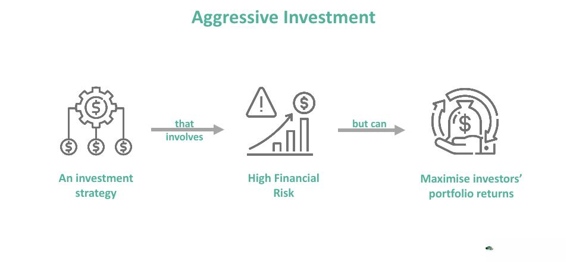

Investment strategies encompass a broad spectrum, addressing a wide range of investor goals and varying levels of risk tolerance. This article explores aggressive investment strategies, examining both the financial risks involved and the integration of algorithmic trading in the pursuit of higher returns.

Aggressive investment strategies primarily focus on capital appreciation, prioritizing the growth of principal over steady income or the preservation of capital. These strategies are typically geared towards investors who exhibit a high tolerance for risk. Such investors are often willing to endure significant volatility in exchange for the potential of substantial returns. Key components of aggressive strategies include heavy investments in high-risk asset classes such as stocks, derivatives, and commodities. These asset classes are known for their potential to yield substantial capital gains but come with the trade-off of increased exposure to market fluctuations.



The advent of algorithmic trading represents a significant shift in how investors can execute aggressive strategies with greater efficiency. Algorithmic trading employs sophisticated computer algorithms to conduct trades at optimal times, often faster and more accurately than human traders. These algorithms analyze extensive datasets and evaluate market conditions rapidly, allowing for prompt decision-making and enhancing the implementation of aggressive investment strategies. As technology continues to evolve, investors are increasingly able to leverage these tools to maximize their strategy's effectiveness.

Fully grasping the financial risks associated with aggressive investments is essential for investors seeking to amplify returns. While the potential for high yields exists, these strategies also come with significant risks, including market volatility and the potential for substantial losses. Understanding these risks and the tools available to manage them effectively is vital for any investor considering an aggressive approach. Informed decision-making and strategic planning are paramount for successfully harnessing the potential of aggressive investment strategies while mitigating associated risks.

## Table of Contents

## Understanding Aggressive Investment Strategies

Aggressive investment strategies emphasize capital appreciation through significant allocation in high-risk assets like stocks and commodities. These strategies are designed to maximize returns by exploiting market opportunities that often come with higher volatility. 

Capital appreciation, rather than income generation or principal safety, is the primary goal. Stocks, particularly those of emerging companies or sectors, provide a potential for exponential growth, albeit with the risk of substantial price swings. Commodities, including precious metals and energy resources, offer a hedge against inflation and currency fluctuations, making them attractive options for aggressive investors.

These investment strategies are considered particularly appropriate for younger investors. A longer investment horizon allows these investors to withstand market downturns, leveraging time to recover from potential losses and capitalize on the upside potential of risky assets. Additionally, younger investors may have smaller portfolios, which can benefit from the high growth rates targeted by aggressive strategies.

However, engaging in aggressive investment requires a considerable risk appetite. Investors face a spectrum of challenges, including market [volatility](/wiki/volatility-trading-strategies), sudden economic shifts, and sector-specific disruptions. The inherent unpredictability of high-risk assets can lead to significant portfolio value fluctuations, potentially resulting in substantial losses. Hence, investors must align their risk tolerance with their asset allocation, carefully considering their financial objectives and the duration over which they aim to achieve these goals.

In summary, aggressive investment strategies are tailored for those willing to embrace risk for the opportunity of higher returns. Such strategies demand an understanding of market dynamics and a readiness to navigate through financial uncertainty.

## Financial Risks of Aggressive Investments

Aggressive investments are associated with significant financial risks that can impact an investor's portfolio. These risks mainly arise from market volatility, economic downturns, and sector-specific challenges, which can substantially influence the performance of high-risk assets such as stocks and commodities.

Market volatility represents one of the most critical risks associated with aggressive investments. It refers to the rapid and significant changes in asset prices, which can lead to substantial gains but also pronounced losses. Volatility is often measured using statistical indicators like the standard deviation or the beta of an investment relative to the market. For instance, a high-beta stock typically has greater volatility than the overall market, indicating larger price swings.

Economic downturns are another pivotal risk element. During economic recessions or periods of financial instability, aggressive investments might suffer disproportionately because these assets are more sensitive to economic conditions. This sensitivity stems from the fact that during downturns, investors often flock to safer, more stable investments, leading to sharp declines in the prices of high-risk securities.

Industry-specific challenges can also pose direct risks to aggressive investments. These challenges may include regulatory changes, technological disruptions, or shifts in consumer preferences that can adversely affect specific sectors. For example, an aggressive investment in a technology company may be exposed to significant risk if there is a sudden regulatory change affecting data privacy laws.

Investors pursuing aggressive investment strategies must account for factors like risk tolerance, investment horizon, and financial objectives. Risk tolerance reflects an individual's emotional and financial ability to withstand losses. For instance, younger investors might have a higher risk tolerance due to a longer time horizon, allowing them to recover from potential market setbacks. The investment horizon is crucial, as a longer timeframe typically allows for better absorption of short-term market volatility.

Effective risk management is essential in managing the financial risks of aggressive investments. Diversification is a key strategy, involving the allocation of investments across various asset classes and sectors to reduce exposure to any single risk source. By diversifying, the impact of a downturn in one asset or sector is mitigated by better performance in others. Regular portfolio rebalancing is equally important; it entails adjusting the asset allocation to maintain the desired risk level. This process helps in taking advantage of market movements and aligning the portfolio with the investor's objectives.

For instance, a generic Python script for regular portfolio rebalancing could be structured as follows:

```python
def rebalance_portfolio(portfolio, target_allocation):
    current_value = sum(portfolio.values())
    for asset, current_allocation in portfolio.items():
        target_value = current_value * target_allocation[asset]
        difference = target_value - current_allocation
        portfolio[asset] += difference
    return portfolio

# Example portfolio and target allocation
portfolio = {'stocks': 50000, 'bonds': 20000, 'commodities': 30000}
target_allocation = {'stocks': 0.6, 'bonds': 0.2, 'commodities': 0.2}

# Rebalance the portfolio
new_portfolio = rebalance_portfolio(portfolio, target_allocation)
print(new_portfolio)
```

In conclusion, understanding and managing financial risks is crucial for investors engaged in aggressive strategies. By considering risk tolerance, utilizing diversification, and committing to regular rebalancing, investors can better navigate the complexities and uncertainties associated with aggressive investments.

## The Role of Algorithmic Trading in Aggressive Investment Strategies

Algorithmic trading employs sophisticated computer algorithms to execute trades with enhanced precision and speed, significantly optimizing aggressive investment strategies. These algorithms are designed to process and analyze extensive market data faster than human traders, facilitating rapid decision-making that can capitalize on fleeting market opportunities. The efficacy of [algorithmic trading](/wiki/algorithmic-trading) in aggressive strategies lies in its ability to utilize automated systems for analyzing variables such as price movements, trading volumes, and market trends, often employing [machine learning](/wiki/machine-learning) techniques to adapt to new data patterns dynamically.

A crucial advantage of algorithmic trading is its capacity to reduce the emotional and psychological biases that often affect human traders, enabling actions based on pre-defined criteria and systematic processes. This objectivity can be particularly beneficial in aggressive investment strategies, where swift responses to volatile market conditions are necessary to leverage potential high returns.

Despite its potential, algorithmic trading is not devoid of risks. One significant concern is system reliability; technical failures or programming errors can lead to substantial financial losses. Furthermore, algorithms may not always adapt swiftly to unforeseen market changes, such as geopolitical events or rapid economic shifts, which lie outside the algorithm’s programmed knowledge. Therefore, incorporating comprehensive testing and robust system monitoring is essential to mitigate these risks.

The scalability of algorithmic trading allows investors to manage multiple investment portfolios simultaneously, providing a competitive edge in rapidly changing markets. However, investors must remain cautious of market [liquidity](/wiki/liquidity-risk-premium) risk, where large trades might result in price impacts that algorithms alone may not manage effectively.

In conclusion, algorithmic trading offers valuable tools for executing aggressive investment strategies, allowing for efficient market engagement and the potential for increased profitability. Nonetheless, investors must employ diligent risk management practices and remain vigilant to the intricacies of market dynamics and potential technological vulnerabilities.

## Considerations for Pursuing Aggressive Investment Strategies

Investors considering aggressive investment strategies must thoroughly assess their financial goals, risk tolerance, and time horizon before committing to such approaches. These strategies often involve significant risks, and as such, a meticulous evaluation helps align investment choices with the investor’s overall financial objectives.

An essential aspect of pursuing aggressive investment strategies is continuous education on market trends and strategies. Understanding the nuances of market dynamics and keeping abreast of economic developments can empower investors to make informed decisions. Staying updated requires engaging with financial news, academic journals, and investment courses that provide insights into current and emerging trends. For instance, learning about new financial instruments, regulatory changes, or technological advancements can substantially influence strategy formulation.

Moreover, utilizing financial advisors is highly recommended for investors aiming to optimize their aggressive strategies. Financial advisors can offer personalized insights and guidance, leveraging their expertise to tailor advice based on an investor's specific risk profile and investment goals. Their role includes assessing an investor's financial health, recommending suitable investment vehicles, and helping to construct a diversified portfolio that mitigates potential downsides while striving for maximum returns.

In the context of managing the complexities of aggressive investment strategies, leveraging algorithmic tools and models may also be beneficial. For example, using Python, investors can craft algorithms to analyze historical market data and predict future trends, enhancing decision-making.

```python
import pandas as pd
import numpy as np
from sklearn.linear_model import LinearRegression

# Sample data: replace with actual data source
data = pd.read_csv('historical_market_data.csv')

# Assuming 'price' is a column in the CSV
X = np.array(data['date'].values).reshape(-1, 1)  # Converting date to a numerical format if necessary
y = data['price'].values

# Linear regression model to understand trends
model = LinearRegression().fit(X, y)

# Predicting future prices
future_dates = np.array(['2024-01-01', '2024-02-01', '2024-03-01']) # Example future dates
future_X = pd.to_datetime(future_dates).astype(int).values.reshape(-1, 1)  # Convert to numerical format
predictions = model.predict(future_X)

print(predictions)
```

In conclusion, before adopting aggressive investment strategies, investors should analyze their financial landscape comprehensively. By engaging in continuous education and consulting with financial advisors, investors can enhance their strategic approach and better manage risks associated with aggressive investments.

## Conclusion

Aggressive investment strategies provide the opportunity for substantial returns but come with considerable financial risks that investors must manage carefully. These strategies often involve investing in volatile markets and high-risk assets such as stocks and commodities, demanding a significant tolerance for potential losses.

The integration of algorithmic trading can significantly support an aggressive investment approach by improving efficiency and decision-making. Algorithms enable the rapid analysis of large datasets and the execution of trades at optimal moments, reducing the likelihood of human error and emotional decision-making. However, while algorithmic trading offers advantages, investors must remain vigilant of related risks, such as technology malfunctions and unpredictable market shifts.

To mitigate these risks, strategic risk management is essential. Techniques like diversification and regular portfolio rebalancing can play critical roles in minimizing exposure to volatile swings and unfavorable market conditions. For instance, an investor might consider having a diverse asset allocation that includes a mix of equities, bonds, and commodities to reduce overall portfolio risk.

A thorough understanding and constant evaluation of one's risk tolerance, financial objectives, and time horizon are central to the successful implementation of aggressive investment strategies. Investors benefit from continuous education on market developments and the use of advanced tools and data analytics to refine their strategies.

Engaging with financial advisors can also be beneficial, providing tailored insights and strategic guidance. Professional advice can help investors navigate complex financial landscapes and ensure that their strategies align with personal objectives and risk profiles.

In summary, while aggressive investment strategies can lead to substantial rewards, they require a balanced approach that incorporates both advanced technological solutions and prudent financial practices. Adopting a well-informed and risk-aware mindset, supported by professional advice, can enable investors to successfully manage the complexities and maximize the potential gains from these strategies.

## References & Further Reading

[1]: Bergstra, J., Bardenet, R., Bengio, Y., & Kégl, B. (2011). ["Algorithms for Hyper-Parameter Optimization."](https://dl.acm.org/doi/10.5555/2986459.2986743) Advances in Neural Information Processing Systems 24.

[2]: ["Advances in Financial Machine Learning"](https://www.amazon.com/Advances-Financial-Machine-Learning-Marcos/dp/1119482089) by Marcos Lopez de Prado

[3]: ["Evidence-Based Technical Analysis: Applying the Scientific Method and Statistical Inference to Trading Signals"](https://www.amazon.com/Evidence-Based-Technical-Analysis-Scientific-Statistical/dp/0470008741) by David Aronson

[4]: ["Machine Learning for Algorithmic Trading"](https://github.com/stefan-jansen/machine-learning-for-trading) by Stefan Jansen

[5]: ["Quantitative Trading: How to Build Your Own Algorithmic Trading Business"](https://www.amazon.com/Quantitative-Trading-Build-Algorithmic-Business/dp/1119800064) by Ernest P. Chan