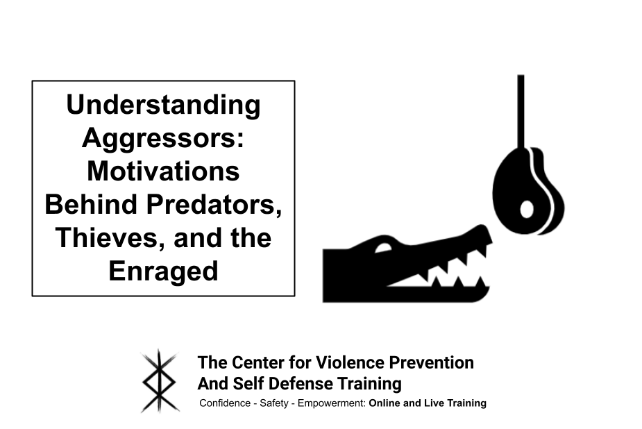

## Table of Contents

## What is the basic definition of an aggressor?

An aggressor is someone who starts a fight or conflict. They are the ones who attack first or use force against others without a good reason. This can happen in different situations, like in wars between countries, or in personal disagreements between people.

In everyday life, an aggressor might be someone who bullies others or starts arguments. They might use physical force, like hitting or pushing, or they might use words to hurt or scare others. Understanding who the aggressor is can help in solving conflicts and keeping peace.

## How is an aggressor identified in different contexts?

In wars or big fights between countries, an aggressor is usually the country that starts the fight by attacking first. They might send their army into another country without being attacked themselves. This can be seen clearly when one country invades another without any good reason. People around the world often watch these actions closely, and international groups like the United Nations might step in to decide who the aggressor is and try to stop the fighting.

In smaller, everyday situations, like at school or in the neighborhood, an aggressor is someone who starts trouble. This could be a person who bullies others, picks fights, or uses mean words to hurt someone. Teachers, parents, or friends might notice this behavior and identify the aggressor. They can then help to stop the bullying and make sure everyone feels safe. It's important to pay attention to who starts the conflict to help solve it and keep peace.

## What are the common characteristics of an aggressor?

An aggressor often shows certain behaviors that make them stand out. They might be quick to get angry and start fights without thinking about the consequences. They could use physical force, like hitting or pushing, or they might use words to hurt or scare others. Aggressors might also try to control others and make them feel small. They often don't care about other people's feelings and might enjoy making others feel bad.

In different situations, an aggressor might act differently, but some common traits stay the same. They might be loud and demanding, always wanting to be in charge. They could also be sneaky, starting trouble in ways that are hard to see at first. Aggressors might not feel sorry for what they do and might even blame others for the problems they cause. Understanding these characteristics can help people recognize and deal with aggressors better.

## What motivates someone to become an aggressor?

People might become aggressors for many reasons. Sometimes, they might feel angry or upset about something in their life, like problems at home or feeling left out. They might think that being mean or starting fights will make them feel better or help them get what they want. Other times, they might have seen other people being aggressive and think it's a good way to act. They might not know how to solve problems without fighting.

Another reason could be that they want to feel powerful or in control. When someone feels weak or scared, they might act aggressively to hide those feelings. They might think that by being the aggressor, they can make others afraid of them and stop people from [picking](/wiki/asset-class-picking) on them. But this often leads to more problems and doesn't really solve anything. Understanding why someone becomes an aggressor can help in finding better ways to help them and stop the cycle of aggression.

## How does the role of an aggressor function within social dynamics?

In social groups, an aggressor can change how people act and feel. When someone starts being mean or starts fights, it can make everyone else feel scared or worried. People might try to stay away from the aggressor or do what they say to keep safe. This can make the group feel tense and unhappy. The aggressor might seem powerful, but really, they can make the whole group weaker because people don't trust each other and are always on edge.

Sometimes, an aggressor can make other people start acting the same way. If being mean or starting fights seems to work, others might copy this behavior to get what they want. This can lead to more problems and fights within the group. But, if the group works together to stand up to the aggressor and find better ways to solve problems, they can become stronger and happier. Understanding the role of an aggressor helps everyone work towards a more peaceful and fair group.

## What are the psychological impacts on an aggressor?

Being an aggressor can have big effects on a person's mind. They might feel stressed and worried a lot because they are always starting fights or being mean. This can make them feel bad about themselves, even if they try to act tough. They might also feel lonely because other people might not want to be around them. This loneliness can make them feel even worse and keep the cycle of being aggressive going.

Over time, being an aggressor can make it hard for them to make friends or trust others. They might always be on guard, thinking that everyone is against them. This can lead to more anger and more fights. It's important for them to learn better ways to deal with their feelings and problems, so they can stop being aggressive and start feeling better about themselves and their life.

## How do legal systems define and handle aggressors?

Legal systems see an aggressor as someone who starts a fight or hurts others on purpose. They look at what the person did and why they did it. If someone hits another person first or uses mean words to scare them, the law might call them an aggressor. The law wants to stop people from hurting others and keep everyone safe. So, they make rules about what is okay and what is not. If someone breaks these rules by being an aggressor, they might have to go to court and could get punished.

When the law finds out who the aggressor is, they decide what to do next. This could mean the aggressor has to pay money, go to jail, or do community service. The goal is to make sure the aggressor knows what they did was wrong and to stop them from doing it again. Sometimes, the law also helps the aggressor learn better ways to act, like going to special classes or talking to a counselor. This way, the legal system tries to help everyone feel safe and get along better.

## What are the societal impacts of aggressor behavior?

When someone acts like an aggressor, it can hurt the whole community. People might feel scared and worried all the time because they don't know when the aggressor will start a fight or be mean. This can make it hard for everyone to trust each other and work together. It can also make people feel sad and lonely because they might not want to be around the aggressor. This can lead to more problems in the community, like more fights and less happiness.

Aggressor behavior can also make it hard for a community to grow and be strong. When people are always dealing with fights and meanness, they might not have time or energy to do good things like helping each other or building new things. This can make the community weaker and slower to solve big problems. But if the community works together to stop the aggressor and help them learn better ways to act, everyone can start to feel safer and happier again.

## How can the behavior of an aggressor be modified or managed?

Changing how an aggressor acts can start with helping them understand their feelings and why they act the way they do. Talking to a counselor or therapist can be really helpful. They can teach the aggressor new ways to deal with anger and stress without hurting others. Sometimes, joining a group where others are learning to change their behavior can also help. The aggressor can learn from others and feel less alone in their struggles. It's important for the aggressor to see that being mean or starting fights doesn't solve problems and can make things worse.

Families and friends can play a big part in helping an aggressor change. They can show love and support, and help the aggressor learn better ways to act. Setting clear rules and showing what happens when those rules are broken can also help. Schools and workplaces can help too, by teaching everyone about respect and how to solve problems without fighting. If everyone works together to support the aggressor and help them change, it can make a big difference. Over time, with patience and help, the aggressor can learn to act in ways that are kinder and more peaceful.

## What are the long-term effects on communities affected by aggressors?

When a community has to deal with an aggressor for a long time, it can change how people live and feel. People might always be on guard, worried about when the next fight will start. This can make it hard for them to trust each other and work together. Over time, this can lead to less happiness and more sadness in the community. People might not want to go out or join in community activities because they're scared. This can make the community feel weak and slow down its growth.

But, if the community works together to help the aggressor change and learn better ways to act, things can get better. It takes time and effort, but with support from families, friends, and community leaders, the aggressor can start to act differently. This can help everyone feel safer and more connected. When the community becomes a place where people feel safe and happy, it can grow stronger and solve big problems together.

## How do different cultures perceive and deal with aggressors?

Different cultures have their own ways of seeing and dealing with aggressors. In some places, people might see being aggressive as a way to show strength or power. They might respect someone who can fight or stand up for themselves. In these cultures, dealing with an aggressor might mean trying to talk to them and help them see that being mean isn't the best way to solve problems. They might also use community leaders or elders to help the aggressor change their ways.

In other cultures, being an aggressor is seen as bad and not something to be proud of. People might work hard to stop aggressive behavior and help the person learn to act better. They might use schools, families, and community groups to teach about respect and solving problems without fighting. In these places, the focus is on making sure everyone feels safe and happy, and they might use laws and rules to make sure aggressors know what they did was wrong and need to change.

Overall, while the ways of dealing with aggressors can be different, the goal is often the same: to help the aggressor change and make the community a better place for everyone. Whether it's through talking, teaching, or using laws, the important thing is to work together to stop the harm and help everyone feel safe.

## What advanced theories exist about the nature of aggression and aggressors?

Some scientists think that aggression might come from how our brains work. They say that certain parts of the brain, like the amygdala, control our feelings of anger and fear. When these parts get too excited, it can make us act aggressively. Other scientists believe that aggression can also come from how we grow up and the things we learn. If someone sees a lot of fighting or meanness when they're young, they might think that's a normal way to act. This idea is called social learning theory, and it says that we learn how to act by watching others.

Another theory is about something called the frustration-aggression hypothesis. This theory says that when people feel frustrated or blocked from getting what they want, they might act aggressively. It's like if you really want something and you can't have it, you might get angry and lash out. Some researchers also talk about the general aggression model, which combines a lot of different ideas. It says that aggression can come from many things, like what's happening around us, what we think and feel, and even our own personality. Understanding these theories can help us find better ways to help people who act aggressively and make our communities safer and happier.

## What are the strategies used by aggressors in algorithmic trading?

Aggressor strategies in [algorithmic trading](/wiki/algorithmic-trading) are characterized by rapid decision-making and execution aimed at exploiting market inefficiencies. These strategies typically employ sophisticated algorithms to predict the most favorable trade timings, capitalizing on fleeting opportunities within the market.

One prevalent aggressor approach involves high-frequency trading ([HFT](/wiki/high-frequency-trading-strategies)), where traders execute a large number of orders at extremely high speeds. HFT strategies are designed to capitalize on small price discrepancies that exist only for fractions of a second. These traders often utilize co-location services, placing their servers physically close to exchange servers to minimize latency and achieve near-instantaneous data transmission. By analyzing minute-by-minute changes in asset prices, high-frequency traders can identify and act upon advantageous conditions more swiftly than traditional market participants.

Arbitrage is another common strategy utilized by aggressors. Arbitrage involves the simultaneous purchase and sale of an asset across different markets to exploit price differentials. For instance, consider an asset priced higher on one exchange than another. An arbitrageur can profit by buying the asset at the lower price and selling it at the higher price simultaneously. Formulaically, this principle can be represented as:

$$
\text{Profit} = (P_{\text{sell}} - P_{\text{buy}}) \cdot Q
$$

where $P_{\text{sell}}$ and $P_{\text{buy}}$ are the sell and buy prices, respectively, and $Q$ is the quantity traded.

Arbitrage opportunities arise in various forms, such as triangular [arbitrage](/wiki/arbitrage) in foreign exchange markets, where discrepancies in currency conversion rates across three currencies are exploited. The sophistication of algorithms used by aggressors allows them to detect and act on these discrepancies faster than human traders.

To illustrate, consider a Python snippet for identifying arbitrage opportunities:

```python
def detect_arbitrage(opportunities):
    for opp in opportunities:
        if opp['buy_price'] < opp['sell_price']:
            profit = (opp['sell_price'] - opp['buy_price']) * opp['quantity']
            if profit > 0:
                print(f"Arbitrage found! Buy at {opp['buy_price']}, sell at {opp['sell_price']}, profit: {profit}")

opportunities = [
    {'buy_price': 100, 'sell_price': 105, 'quantity': 10},
    {'buy_price': 102, 'sell_price': 101, 'quantity': 5},
]

detect_arbitrage(opportunities)
```

Aggressors employ complex models to conduct these transactions efficiently, often leveraging [machine learning](/wiki/machine-learning) techniques to improve predictive accuracy and execution speed. Consequently, they maintain a competitive edge in markets where success hinges on the ability to act on information promptly and effectively.

Overall, aggressors play a pivotal role in the landscape of algorithmic trading, pushing technological and strategic boundaries to optimize their market impact.

## References & Further Reading

[1]: Busseti, E., Osband, I., & Wong, S. (2016). ["Deep Learning for Algorithmic Trading."](https://cs229.stanford.edu/proj2012/BussetiOsbandWong-DeepLearningForTimeSeriesModeling.pdf) Stanford University.

[2]: Cartea, Á., Jaimungal, S., & Penalva, J. (2015). ["Algorithmic and High-Frequency Trading."](https://assets.cambridge.org/97811070/91146/frontmatter/9781107091146_frontmatter.pdf) Cambridge University Press.

[3]: Aldridge, I. (2013). ["High-Frequency Trading: A Practical Guide to Algorithmic Strategies and Trading Systems."](https://www.amazon.com/High-Frequency-Trading-Practical-Algorithmic-Strategies/dp/1118343506) Wiley.

[4]: Hasbrouck, J. (2007). ["Empirical Market Microstructure: The Institutions, Economics, and Econometrics of Securities Trading."](https://archive.org/details/empiricalmarketm0000hasb) Oxford University Press.

[5]: Bouchaud, J.-P., Farmer, J. D., & Lillo, F. (2009). "How Markets Slowly Digest Changes in Supply and Demand." In: Handbook of Financial Markets: Dynamics and Evolution.